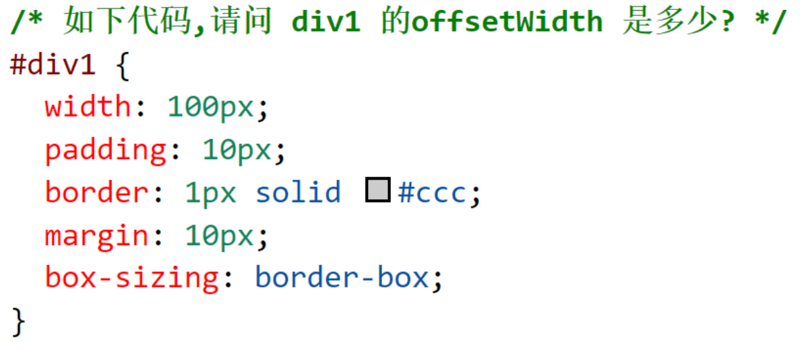

# HTML&CSS

## 1. 先看面试题

- 如何理解HTML语义化?
- 默认情况下,哪些HTML标签是块级元素、哪些是内联元素?
- 盒子模型的宽度如何计算?
- margin 纵向重叠的问题
- margin 负值的问题
- BFC 理解和应用
- float 布局的问题,以及clearfix
- flex 画色子
- absolute 和 relative分别依据什么定位?
- 如何实现一个元素的水平垂直居中
- line-height 的继承问题
- rem是什么?
- 如何实现响应式?
- 关于CSS3动画

## 2. 如何理解 HTML 语义化

**用正确的标签做正确的事情**

先看这个

``` html
<div>标题</div>
  <div>
    <div>一段文字</div>
    <div>
      <div>列表1</div>
      <div>列表2</div>
    </div>
  </div>
```


再看这个

``` html
<h1>标题</h1>
  <div>
    <p>一段文字</p>
    <ul>
      <li>列表1</li>
      <li>列表2</li>
    </ul>
  </div>
```


- 让人更容易读懂(增加代码可读性)
- 让搜索引擎更容易读懂( SEO )


## 3. 块状元素&内联元素?

- display: block/table;有div h1-h6 ul ol li p dl dt dd table等
- display: inline/inline-block;有span img strong i b video audio input button等


## 4. 盒子模型的宽度如何计算?



:::details  点击查看答案

- offsetWidth=(内容宽度+内边距+边框),无外边距

- 因此答案为122px

:::


::: tip 提示

注意:如果让offsetWidth 等于 100px  如何做


:::


## 5. margin纵向重叠问题


::: details 点击查看答案

- 相邻元素的margin-top和margin-bottom会发生重叠
- 空白内容的\<p> \</p>也会重叠
- 答案15px

 :::


## 6. margin负值问题

**对margin的top left right bottom设置负值,有何效果?**


- margin-top 和margin-left负值，元素自身向上、向左移动
- margin-right 负值，右侧元素左移,自身不受影响
- margin-bottom 负值，下方元素上移,自身不受影响


## 7. 什么是BFC?如何应用?

**定义**

- 块格式化上下文（block formatting context）
- 一块独立渲染区域,内部元素的渲染不会影响边界以外的元素

**形成BFC的常见条件**

- overflow 不为 visible
- float 属性不为 none
- position 为 absolute 或 fixed
- display 为 inline-block， table-cell， table-caption， flex， inline-flex


**开启BFC特点作用**

- 开启BFC的元素不会被浮动元素覆盖
- 开启BFC的元素父子外边距不会合并
- 开启BFC的元素可以包含浮动的子元素(解决浮动高度塌陷)


## 8. float布局

float 用于网页布局比较多，使用起来也比较简单

### **误解和误用**

- float 被设计出来的初衷是用于**文字环绕效果**，即一个图片一段文字，图片`float:left`之后，文字会环绕图片。

```html
<div>
    
    一段文字一段文字一段文字一段文字一段文字一段文字一段文字一段文字一段文字
</div>
```

但是，后来大家发现结合`float + div`可以实现之前通过`table`实现的网页布局，因此就被“误用”于网页布局了


### 并排一行

- **设置多个浮动的块级元素会并排一行**


### 破坏性

- **float 的破坏性** —  **被设置了 float 的元素会脱离文档流**，使得父标签无法包容子容器出现了坍塌现象。导致这一现象的最根本原因在于： float 的设计初衷是解决文字环绕图片的问题。大家要记住 float 的这个影响。


### 包裹性

- 普通的 div 如果没有设置宽度，它会撑满整个屏幕，而如果给 div 增加`float:left`之后宽度发生了变化，会由里面的内容——这就是包裹性。

::: tip 提示

此时 div 虽然体现了包裹性，但是它的 display 样式是没有变化的，还是`display: block`。

:::


**手写clearfix**

\- 清除浮动的影响，一般使用的样式如下，统称`clearfix`代码。所有 float 元素的父容器，一般情况下都应该加`clearfix`这个 class。


## 9. **flex布局**

布局的传统解决方案基于盒子模型，依赖 `display` 属性 + `position` 属性 + `float` 属性。

它对于那些特殊布局非常不方便，比如，垂直居中（下文会专门讲解）就不容易实现。在目前主流的移动端页面中，使用 flex 布局能更好地完成需求，因此 flex 布局的知识是必须要掌握的。

**flex 实现一个三点的色子**


## 10. **实现左边定宽，右边自适应布局**

\- 左盒子左浮动，右盒子width=100%  margin-left=左盒子宽度

\- 左盒子左浮动，右盒子右浮动，设置width: calc（100% - 左盒子宽度）

\- 左盒子左浮动，右盒子右浮动，设置width: calc（100% - 左盒子宽度）


## 11. **CSS - 定位**

absolute 和relative分别依据什么定位?

\- relative 依据自身定位

\- absolute 依据最近一层的定位元素( 有relative absolute  fixed这些定位其中一个  )定位


## 12. 如何使一个元素水平垂直居中

### **行内元素**


### **定位元素**


### **弹性盒模型**


## 13.  **line-height如何继承**


**line-height如何继承**

- 写具体数值,如30px,则继承该值(比较好理解)
- 写比例,如2/ 1.5 ,则继承该比例(比较好理解)
- 写百分比,如200% ,则继承计算出来的值(考点)


## 14. 消除图片底部间隙的方法 

- 图片块状化 - 无基线对齐：`img { display: block; }`
- 图片底线对齐：`img { vertical-align: bottom; }`
- 父级设置 `font-size:0;`
- 行高足够小 - 基线位置上移：`.box { line-height: 0; }`


## 15. **单行溢出隐藏**


## 16. **CSS - 响应式**

\- 响应式设计是什么?原理?

\- rem是什么?

\- 响应式布局的常见方案?


### **响应式设计是什么?原理?**

响应式网站设计(Responsive Web design)是一个网站能够兼容多个终端，而不是为每一个终端做一个特定的版本。

基本原理是通过媒体查询检测不同的设备屏幕尺寸做处理。

:::tip 提示

页面头部必须有meta声明的viewport

:::


### **rem是什么?**

\- px  像素(Pixel)。绝对单位。像素 px 是相对于显示器屏幕分辨率而言的

\- em , 相对长度单位,相对于父元素,不常用

\- rem(root em) , 相对长度单位,相对于根元素html的字体大小,常用于响应式布局


### vh、vw是什么?

vw（Viewport Width）、vh(Viewport Height)是基于视图窗口的单位，是css3的一部分，基于视图窗口的单位，除了vw、vh还有vmin、vmax。

- vw:1vw 等于视口宽度的1%
- Vh:1vh 等于视口高度的1%
- vmin: 选取 vw 和 vh 中最小的那个,即在手机竖屏时，1vmin=1vw
- vmax:选取 vw 和 vh 中最大的那个 ,即在手机竖屏时，1vmax=1vh


### **响应式布局的常用方案**

\- media-query ,根据不同的屏幕宽度设置根元素font-size

\- rem ,基于根元素的相对单位


## 17. 使一个元素显示以及隐藏的方式?

### display:none

- 结构上:元素在页面上将彻底消失，元素不占据空间且无法点击
- 继承性:父元素设置了 display:none 子元素无论怎么设置都无法显示
- 性能:会引起浏览器重绘重排，性能消耗较大


### opacity:0

- 结构上:元素在页面上消失，元素占据空间可以点击

-  继承性:父元素设置了opacity:0  子元素无论怎么设置都无法显示

- 性能:重建图层，性能消耗小


### visibility:hidden

- 结构上:元素在页面消失，其占据的空间依旧会保留;无法点击

- 继承性:visibility: hidden 会被子元素继承，但是子元素可以通过 设置 visibility: visible; 来取消隐藏

- 性能:只会导致浏览器重绘,性能消耗相对小

  

**其他方式**

-  元素的border，padding，height和width，margin:0等影响元素盒模型的属性设置成0
- 如果元素内有子元素或内容，还应该设置其overflow:hidden来隐藏其子元素


- 设置元素的position与left，top，bottom，right等，将元素移出至屏幕外
- 设置元素的position与z-index，将z-index设置成尽量小的负数


## 18. CSS3 动画

**CSS3 可以实现动画，代替原来的 Flash 和 JavaScript 方案。**

使用`@keyframes`定义一个动画，名称为`testAnimation`  在元素中通过`animation`属性调用

``` css
@keyframes testAnimation
{
    0%   {background: red; left:0; top:0;}
    25%  {background: yellow; left:200px; top:0;}
    50%  {background: blue; left:200px; top:200px;}
    75%  {background: green; left:0; top:200px;}
    100% {background: red; left:0; top:0;}
}

div {
    width: 100px;
    height: 50px;
    position: absolute;

    animation-name: myfirst;
    animation-duration: 5s;
}
```


### **transition 和 animate 有何区别?**

\- transition：用于做过渡效果，没有帧概念，只有开始和结束状态，由一个状态过渡到另一个状态，比如高度`100px`过渡到`200px`性能开销较小,被动触发,

\- animate：用于做动画，有帧的概念，可以重复触发且有中间状态，性能开销较大,主动触发


## 19. **什么是选择器优先级 , 怎么计算?**

+ **!important>行内样式>id选择器>类选择器>标签选择器>通配符>继承**

权重算法：(0,0,0,0) ——> 第一个0对应的是important的个数，第二个0对应的是id选择器的个数，第三个0对应的类选择器的个数，第四个0对应的是标签选择器的个数，合起来就是当前选择器的权重。

比较：先从第一个0开始比较，如果第一个0大，那么说明这个选择器的权重高，如果第一个相同，比较第二个，依次类推。

(0,1,2,3)   >  (0,1,1,5)