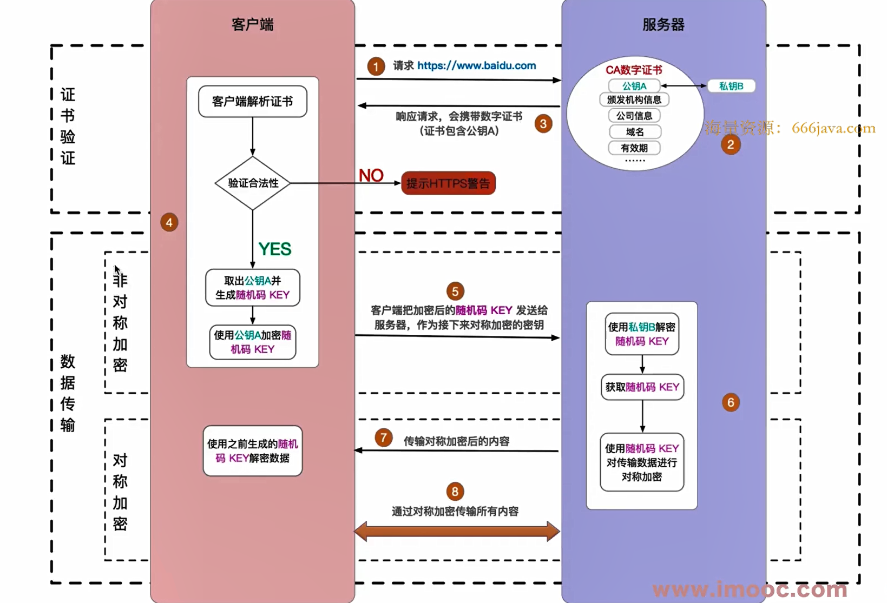

#  http 面试题

前端主要写页面，光有页面系统是不能运行的，还需要数据。数据的增删改查，都要和后端进行交互，即调用后端接口。而这就需要 http 协议。

## 1. 题目

- http 常见的状态码有哪些
- http 常见的 header 有哪些
- 什么是 Restful API
- 请描述 http 缓存机制
- https 如何加密数据 

## 2. http 状态码

注意，无论是状态码规范，还是整个 http 协议规范，都是前后端的一个**约定**，需要大家都来遵守。
所谓约定或者规范，不是强制的，你可以不遵守。
但是如果大家都遵守，你特立独行，就会慢慢的被孤立。就像早期的 IE 浏览器。

所以，无论是这里的 http 协议，还是开发中其他的事情。我们都要尽量去遵守业界的规范，参照业界的标准 —— **当然，前提是你得知道有哪些规范（知识体系的范围）**

### 状态码分类

- 1xx 服务器收到请求
- 2xx 成功
- 3xx 重定向
- 4xx 客户端错误
- 5xx 服务器错误

### 常见状态码

http 协议中的状态码有很多，但只有一些是我们常用的。也是面试常考的。

- 200 成功
- 301 永久重定向（同时返回一个 location ，写明重定向的 url）。例如一个网站的网址永久性的切换了
- 302 临时重定向（同时返回一个 location ，写明重定向的 url）。例如短链跳转
- 304 资源未修改过
- 404 未找到资源
- 403 没有权限，例如需要登录之后才能请求
- 500 服务器内部错误，例如服务器代码异常
- 504 网关超时，例如上游服务器连接失败（服务器不是一台机器，可能会有很多台）

### 仅仅是一个规定

再次强调一下，这些状态码仅仅是一个规定。所以前端后端，都要自觉遵守这个规定。

## 3. http methods

### 常用 methods

之前，常用的方法就是 get 和 post

- get 从服务端获取数据
- post 向服务端提交数据

现在，随着技术更新，以及 Restful API 设计（下文会讲）。有更多的 methods 被应用

- get 获取数据
- post 新建数据
- patch/put 更新数据
- delete 删除数据

### Restful API

Restful API 是前后端接口的一种设计规范，经历了几年的发展，已经被全面应用。前端面试常考。

- 传统 API 设计：把每个 API 当做一个功能
- Restful API 设计：把每个 API 当做一个资源标识

需要用到的手段

- 不使用 url 参数
- 使用 method 表示操作类型

**例如要获取一个列表**

- 传统 API 设计：`/api/list?pageIndex=2` —— 一个功能
- Restful API 设计：`/api/list/2` —— 一个资源

**再例如要操作一个数据**

+ 传统 API 设计（每个 API 都是功能）
  - `/api/create-blog` ，post 请求
  - `/api/udpate-blog?id=101`，post 请求
  - `/api/get-blog?id=101`， get 请求
+ Restful API 设计（每个 API 都是资源）
  - `/api/blog` ，post 请求
  - `/api/blog/101` ，patch 请求
  - `/api/blog/101` ，get 请求

## 4. http-headers

**headers**【请求头、响应头】 有很多，只讲一下最常用的，也是面试常考的。

### request headers

浏览器发送请求时，传递给服务端的信息

- Accept 浏览器可接收的数据类型
- Accept-Encoding 浏览器可接收的压缩算法，如 gzip
- Accept-Language 浏览器可接收的语言，如 zh-CN
- Connection: keep-alive 一次 TCP 连接重复使用
- cookie
- Host
- User-Agent 浏览器信息
- Content-type 发送数据的类型，常见的有 application/json，application/x-www-form-urlencoded，multipart/form-data，text/plain 等

### response headers

- Content-Type 返回的数据类型，对应 Accept
- Content-Length 数据大小
- Content-Encoding 压缩算法，如 gzip ，对应 Accept-Encoding
- Set-Cookie

### 示例

看百度首页，html 请求，js 请求，图片请求等

用 postman ，演示 request headers 里的 Content-type

### 自定义 header

有些接口需要前端调用时，加一个自定义的 header 。
如 axios 中自定义 headers http://www.axios-js.com/docs/#Request-Config

 例如： JWT验证模式 需要在请求头添加**token**

### 其他

关于缓存的 header ，后面会统一讲

Response headers

- Cache-Control
- Etag
- Expires
- Last-Modified

Request headers

- If-Modified-Since
- If-None-Match

面试时，这些和缓存有关的 header 也可以单独说。不要和其他的混在一起，本来就挺乱的。

## 5. http 缓存

### 什么是缓存

缓存，即某些情况下，资源不是每次都去服务端获取，而是第一次获取之后缓存下来。
下次再请求时，直接读取本地缓存，而不再去服务端请求。

### 为什么需要缓存

核心需求，让网页更快的显示出来，即提高性能。

- 计算机执行计算，非常快
- 包括页面渲染，JS 执行等
- 加载资源却非常慢（相比于计算来说），而且受限于网络不可控。

解决好最关键的问题 —— 缓存网络资源

### 哪些资源需要缓存

对于一个网页来说

- html 页面不能缓存
- 业务数据不能缓存（例如一个博客项目，里面的博客信息）
- 静态资源可以缓存，js css 图片等（所有的静态资源累加起来，体积是很大的）

PS：讲 webpack 时讲过 `contentHash` ，就是给静态资源加上一个唯一的 hash 值，便于缓存。

### 缓存策略 —— 强制缓存，客户端缓存

**Cache-Control** (response headers 中) 表示该资源，被再次请求时的缓存情况。

- `max-age:31536000` 单位是 s ，该资源被强制缓存 1 年
- `no-cache` 不使用强制缓存，但不妨碍使用协商缓存（下文会讲）
- `no-store` 禁用一起缓存，每次都从服务器获取最新的资源
- `private` 私有缓存（浏览器级缓存）
- `public` 共享缓存（代理级缓存）

关于 Expires

- http 1.0 ，设置缓存过期时间的
- 由于本地时间和服务器时间可能不一致，会导致问题
- 已被 Cache-Control 的 max-age 代替

### 缓存策略 —— 协商缓存（对比缓存），服务端缓存

当强制缓存失效，请求会被发送到服务端。此时，服务端也不一定每次都要返回资源，如果客户端资源还有效的话。

第一，**Last-Modified**（Response Headers）和 **If-Modified-Since**（Request Headers）

- Last-Modified 服务端返回资源的最后修改时间
- If-Modified-Since 再次请求时带着最后修改时间
- 服务器根据时间判断资源是否被修改（如未被修改则返回 304，失败则返回新资源和新的缓存规则）

第二，**Etag**（Response Headers）和 **If-None-Match**（Request Headers）

- Etag 服务端返回的资源唯一标识（类似人的指纹，唯一，生成规则由服务器端决定，结果就是一个字符串）
- If-None-Match 再次请求时带着这个标识
- 服务端根据资源和这个标识是否 match （成功则返回 304，失败则返回新资源和新的缓存规则）

如果两者一起使用，则**优先使用 Etag** 规则。因为 Last-Modified 只能精确到秒级别。

### 缓存策略 - 综述

画图

### 刷新操作对应不同的缓存策略

三种操作

- 正常操作：地址栏输入 url ，点击链接，前进后退等
- 手动刷新：F5 或者点击刷新按钮
- 强制刷新：ctrl + F5

对应的缓存策略

- 正常操作：强制缓存有效，协商缓存有效
- 手动刷新：强制缓存*失效*，协商缓存有效
- 强制刷新，强制缓存*失效*，协商缓存*失效*

## 6. https

http 是明文传输，传输的所有内容（如登录的用户名和密码），都会被中间的代理商（无论合法还是非法）获取到。

http + TLS/SSL = https ，即加密传输信息。只有客户端和服务端可以解密为明文，中间的过程无法解密。

### 关于信息加密

#### 对称加密

一个密钥，既负责加密，又符合揭秘

- 浏览器访问服务端，服务端生成密钥，并传递给浏览器
- 浏览器和服务端，通过这个密钥来加密、解密信息

但这有一个很严重的问题：密钥也会被劫持

#### 非对称加密

生成一对密钥，一个公钥，一个私钥。

- 公钥加密的信息，只有私钥能解密
- 私钥加密的信息，只有公钥能解密

- 浏览器访问服务端，服务端生成公钥、私钥，并把公钥传递给浏览器
- 浏览器生成一个 key（随机字符串），并用公钥加密，传递给服务端
- 服务端用私钥解密 key 。这样浏览器和服务端，就都得到了 key ，而且 key 还是加密传输的
- 然后，浏览器和服务端使用 key 为密钥，做对称加密传输

思考：如果公钥和 key 被劫持，黑客能解密 key 吗？—— 不能，因为解密 key 要使用私钥，而私钥一只在服务端，没有传输。

#### 证书

公钥劫持了不行，那替换行不行呢？ 
黑客直接劫持请求，替换为自己的公钥（当然他自己有私钥），你的所有请求他劫持到，就都可以解密了。 
这叫做“中间人攻击”

这个问题，不好从技术上规避，那就从标准规范上解决 —— CA 证书。

- 由正规的第三方结构，颁发证书（如去阿里云申请，但要花钱）
- 证书包括：公钥，域名，申请人信息，过期时间等 —— 这些都是绑定的
- 浏览器识别到正规的证书，才使用。否则会交给用户确认。

这样，当黑客使用中间人攻击时，浏览器就会识别到它的证书不合规范，就会提示用户。

所以，尽量使用正规渠道申请的证书，花点钱，保证安全和稳定性。

### https 加密原理

图示

## 7. 问题解答

- http 常见的状态码有哪些

  404找不到资源   200请求成功   304资源重定向    500请求错误     502服务器错误

- http 常见的 header 有哪些

  + request Header:  Content-type   cookie   Host    User-Agent   Accept
  + response Header: Content-Type   Content-Length

- 什么是 Restful API

  + Restful API 是前后端接口的一种设计规范，
  + Restful API 设计：把每个 API 当做一个资源标识
    + 不使用 url 参数
    + 使用 method 表示操作类型

- 请描述 http 缓存机制

  强制缓存（客户端缓存），协商缓存（服务器缓存）

  优先使用强制缓存，如果失效便于启用协商缓存， 可通过刷新清除缓存

  使用缓存主要用于静态资源从而减少服务器压力 提升加载速度

- https 如何加密数据 

  通过证书校验请求关系链、再通过非对称加密将公钥比对换取key、最后使用key加密数据进行对称加密

