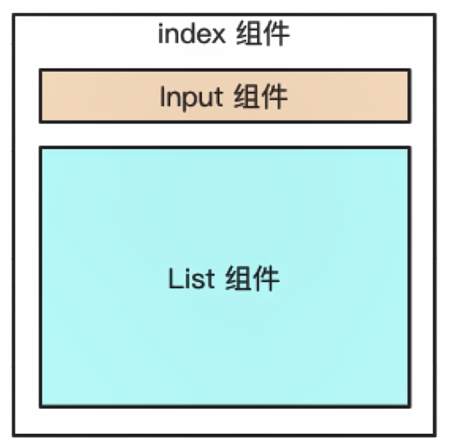

# vue使用

章节主要从以下点进行讲解：

1. 基本使用  2. 组件使用  3. 高级特性  4. vuex使用  5. vue-router使用


**先看几个面试题：**

- v-if 和 v-show 的区别
- 为何 v-for 中要用 `key`
- 描述 vue 组件生命周期（以及有父子组件，两者的生命周期）
- 组件间如何通讯
- 响应式原理
- 组件渲染和更新的过程
- 双向数据绑定 v-model 的原理

这对以上题目

- 先自己思考，要带着思考和疑问来继续学习
- 题目可能会涉及 vue 原理，后面会讲 —— 本来应用和原理是分不开的，但是内容太要分两章
- 这几道题是“开胃菜”，后面还有面试演练“大餐”


**先学Vue2再学Vue3**

+ vue3不是从0做出来，而是从vue2进化来的
+ vue2还会被继续使用，面试会继续考察
+ vue2的语法绝大部分被vue3继承


**vue和react越来越近**

+ vue3 OptionsApi  对应  react class Component
+ vue3 Componstion API 对应 react hooks
+ 不要再纠结哪个好，哪个坏


**课程目标**

+ 基本使用，组件使用  ----  常用，必须会
+ 高级特性  ----- 不常用，但体现深度
+ Vuex和Vue-router 使用


## 1. vue 基本使用

日常使用，必须掌握，面试必考（不一定全考）


### vue-cli 创建项目

安装最新版本 nodejs ，要求版本 >= 8.11
执行 `npm i @vue/cli -g` ，然后查看 `vue --version`

创建项目运行 `vue create xxx`


### 插值 指令

- 插值
- 表达式
- 指令（即 `v-` 开头的。后面的事件、循环、判断等也会用到指令，慢慢讲）
- 指令缩写

代码参考代码


### computed 和 watch

- computed 是有缓存的，data 不变就不会重新计算
- watch
  - 如何深度监听
  - 引用类型无法拿到 oldVal

具体参考代码


### class 和 style

具体参考代码


### 条件渲染

具体参考代码

- v-if 和 v-show 的区别，以及使用场景 —— 频繁切换用 v-show ，否则用 v-if


### 循环渲染

具体参考代码

- 遍历数组，遍历对象
- key
- v-for 和 v-if 不要一起用
  - v-for 会优先于 v-if 执行
  - 因此 v-if 会在每一个 v-for 中都计算一遍
  - v-if 和 v-for 拆开使用


### 事件

具体参考代码
【注意】vue 事件是被注册到当前 DOM 元素的，和 React 不一样

- 传参
- event 参数
- 事件修饰符
- 按键修饰符
- 【注意】用 vue 绑定的事件，组建销毁时会自动被解绑。自己绑定的事件，需要自己销毁。


事件修饰符

```html
<!-- 阻止单击事件继续传播 -->
<a v-on:click.stop="doThis"></a>

<!-- 提交事件不再重载页面 -->
<form v-on:submit.prevent="onSubmit"></form>

<!-- 修饰符可以串联 -->
<a v-on:click.stop.prevent="doThat"></a>

<!-- 只有修饰符 -->
<form v-on:submit.prevent></form>

<!-- 添加事件监听器时使用事件捕获模式 -->
<!-- 即内部元素触发的事件先在此处理，然后才交由内部元素进行处理 -->
<div v-on:click.capture="doThis">...</div>

<!-- 只当在 event.target 是当前元素自身时触发处理函数 -->
<!-- 即事件不是从内部元素触发的 -->
<div v-on:click.self="doThat">...</div>
```

按键修饰符

```html
<!-- 即使 Alt 或 Shift 被一同按下时也会触发 -->
<button @click.ctrl="onClick">A</button>

<!-- 有且只有 Ctrl 被按下的时候才触发 -->
<button @click.ctrl.exact="onCtrlClick">A</button>

<!-- 没有任何系统修饰符被按下的时候才触发 -->
<button @click.exact="onClick">A</button>
```


### 表单

- textarea 要用 v-model

修饰符 lazy number trim


## 2. vue 组件使用

篇章重点内容：

- props 类型和默认值
- $emit 执行父组件的事件
- vue 自带 eventBus 功能


### 父子组件的通信

父子组件中最常用的通讯方式就是Props + $emit的形式了

+ 父组件通过props的形式向子组件传递值
+ 子组件通过$emit发出自定义事件  父组件通过v-on监听自定义事件处理

具体效果参考代码


### 非父子组件的通信

非父子组件最使用的就是自定义事件（**eventbus 发布订阅**）

需要数据的订阅内容（event.$on），提供数据的发布内容(event.$emit)

具体效果参考代码


### 组件的生命周期

**单个组件**


主要划分为三大阶段： 创建阶段   更新阶段   销毁阶段


**父子组件**



创建阶段

- index created
- list created
- list mounted
- index mounted

更新阶段

- index before update
- list before update
- list updated
- index updated

销毁阶段

- index before destroy
- list before destroy
- list destroyed
- index destroyed

简单来看先加载所有的组件   再加载父组件


## 3. vue高级特性

+ 不是每个都很常用，但用到的时候必须要知道
+ 考察候选人对Vue的掌握是否全面，且有深度
+ 考察做过的项目是否有深度和复杂度（至少有用到高级特性）


### 自定义 v-model

代码参考 vue-demo

核心：model 中prop属性定义对应props   event指定自定义事件名


### $nextTick

代码参考 vue-demo

核心: 等待异步渲染完成后执行回调


### slot

代码参考 vue-demo

内容点： 通过插槽实现组件内容的动态化

**作用域插槽**

代码参考 vue-demo

即子组件管理数据，父组件通过插槽的作用域来获取。


**具名插槽**，参考以下代码示例

```html
<!-- NamedSlot 组件 -->
<div class="container">
  <header>
    <slot name="header"></slot>
  </header>
  <main>
    <slot></slot>
  </main>
  <footer>
    <slot name="footer"></slot>
  </footer>
</div>
```

```html
<NamedSlot>
  <template v-slot:header> <!-- 缩写 <template #header> -->
    <h1>将插入 header slot 中</h1>
  </template>

  <p>将插入到 main slot 中，即未命名的 slot</p>

  <template v-slot:footer>
    <p>将插入到 footer slot 中</p>
  </template>
</NamedSlot>
```


### 动态组件

关键代码如下，其中 `TplDemoName` 要有定义

```html
<component v-bind:is="TplDemoName"></component>
```

```js
import TplDemo from '../BaseUse/TplDemo'

export default {
    components: {
        TplDemo
    },
    data() {
        return {
            TplDemoName: 'TplDemo'
        }
    }
}
```


### 异步组件

代码参考 vue-demo


### keep-alive

代码参考 vue-demo

**目的缓存组件、路由   用于复用组件状态有帮助**


### mixin

代码参考 vue-demo

【注意】mixin 不是完美的解决方案，**它的变量作用域不明确** 。
vue3 的 composition API 也是想解决这问题。

React mixins 的缺点
Vue mixins 也同样适用


**核心： 抽离公共代码**


## 4. vuex的使用

+ 面试考点并不多（因为熟悉Vue之后，vuex没用难度）
+ 但基本概念、基本使用和API必须要掌握
+ 可能会考察state的数据结构设计 （后面会讲）

**核心内容:**

- state

- getters

- action

- mutation

**核心API:**

  - dispatch
  - commit
  - mapState
  - mapGetters
  - mapActions
  - mapMutations

vuex 主要是理解概念，API 不难，也就不再代码演示了。

vuex 的操作流程 https://vuex.vuejs.org/zh/ 示意图 https://vuex.vuejs.org/vuex.png


## 5. vue router 使用

+ 面试考点并不多（前提熟悉Vue）
+ 路由模式（hash、H5 history）
+ 路由配置（动态路由、懒加载）


**路由懒加载**

``` js
import Vue from 'vue'
import VueRouter from 'vue-router'

Vue.use(VueRouter)

export default new VueRouter({
    routes: [
        {
            path: '/',
            component: () => import(
                /* webpackChunkName: "navigator" */
                './../components/Navigator'
            )
        },
        {
            path: '/feedback',
            component: () => import(
                /* webpackChunkName: "feedback" */
                './../components/FeedBack'
            )
        }
    ]
})
```


**动态路由**

``` js
const User = {
  // 获取参数如 10 20
  template: '<div>User {{ $route.params.id }}</div>'
}

const router = new VueRouter({
  routes: [
    // 动态路径参数 以冒号开头。能命中 `/user/10` `/user/20` 等格式的路由
    { path: '/user/:id', component: User }
  ]
})
```


**路由模式**

``` js
const router = new VueRouter({
  mode: 'history', // 使用 h5 history 模式
  routes: [...]
})
```


