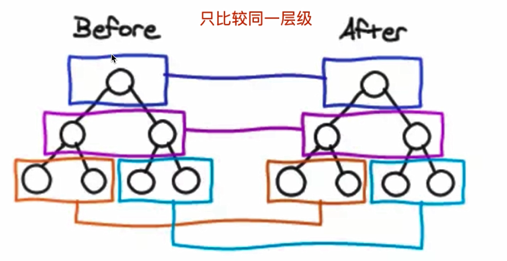
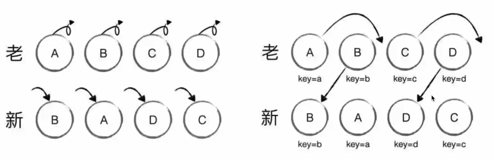

# vue原理

## 前言

+ 面试为何会考察原理？
+ 面试中如何考察？ 以何种方式？
+ Vue原理包括哪些？


**面试为何会考察原理？**

+ 知其然知其所以然  -------- 各行业通用的道理
+ 了解原理才能应用的更好（竞争激烈，择优录取）
+ 大厂造轮子（有钱有资源，业务定制，技术KPI）


**面试如何考察Vue原理**

+ 考察重点，而不是考察细节。掌握好2/8原则
+ 和使用相关联的原理，例如：vdom，模板渲染
+ 整体流程是否全面？热门技术是否有深度？


**Vue原理包含哪些**

+ 组件化
+ 响应式
+ vdom和diff
+ 模板编译
+ 渲染过程
+ 前端路由


## 1. 组件化 MVVM

### 组件化基础

web 开发的历史中，组件化其实很早就有了，在 jsp asp 就有了。

**ejs 组件** 


vue 组件

```html
<template>
  <div id="app">
    
    <HelloWorld msg="Welcome to Your Vue.js App"/>
  </div>
</template>
```

React 组件

```js
function App() {
  return (
    <div className="App">
      <header className="App-header">
        
        <HelloWorld msg="Welcome to Your React App"/>
      </header>
    </div>
  );
}
```

### 数据驱动视图

ejs 组件

【注意】ejs 这种服务端渲染，有一个问题：**不能动态改变，只能根据 props 静态渲染**。
因此需要 vue 和 React

vue —— MVVM 模型

（参考 vue 的 MVVM 模型图）


``` js
<template>
  <div id="app">
    <p @click="changeName">{{name}}</p>
    <ul>
        <li v-for="(item, index) in list" :key="index">
            {{item}}
        </li>
    </ul>
    <button @click="addItem">添加一项</button>
  </div>
</template>

<script>
export default {
  name: 'app',
  data() {
      return {
        name: 'vue',
        list: ['a', 'b', 'c']
      }
  },
  methods: {
    changeName() {
        this.name = '双越'
    },
    addItem() {
        this.list.push(`${Date.now()}`)
    }
  }
}
</script>
```


React —— setState 方式

``` jsx
class List extends React.Component {
    constructor(props) {
        super(props)
        this.state = {
            name: 'React',
            list: ['a', 'b', 'c']
        }
    }
    render() {
        return <div>
            <p onClick={this.changeName.bind(this)}>{this.state.name}</p>
            <ul>{
                this.state.list.map((item, index) => {
                    return <li key={index}>{item}</li>
                })
            }</ul>
            <button onClick={this.addItem.bind(this)}>添加一项</button>
        </div>
    }
    changeName() {
        this.setState({
            name: '双越'
        })
    }
    addItem() {
        this.setState({
            list: this.state.list.concat(`${Date.now()}`) // 使用不可变值
        })
    }
}
```

### vue 和 React 对比

都支持组件化，没有啥区别。（在这一点和 ejs 也没啥区别）

数据驱动视图

- vue 声明式
- React 函数式


## 2. vue2.x响应式

**何为响应式?**     组件data的数据一旦变化，便会触发视图的更新


**核心实现法**:   Object.defineProperty

Object.defineProperty有一些缺点（vue3已经启用Proxy）


### 对比proxy

+ proxy兼容性不好，却无法polyfill 【故vue3只支持ie11以上】

下章节会讲解vue3，这里只提一下


### 基本用法

``` js
// Object.defineProperty 的基本用法
const data = {}
const name = 'zhangsan'
Object.defineProperty(data, "name", {
    get: function () {
        console.log('get')
        return name  
    },
    set: function (newVal) {
        console.log('set')
        name = newVal
    }
});

// 测试
console.log(data.name)  // get zhangsan
data.name = 'lisi'      // set
```


### 演示

监听数据变化，参考 `code-1.js`

演示从0实现数据响应式【本质为监听每个对象属性的改变  在改变时更新视图】

需要实现的功能：

1. 监听对象，监听数组
2. 复杂对象，深度监听
3. 展示几个缺点


### 缺点

- 深度监听，需要递归到底
- 无法监听新增属性/删除属性（Vue.set Vue.delete）
- 无法监听数组，需要特殊处理

3.0 的响应式就解决了这些问题，后面会讲。


## 3.  vdom和diff

### 什么是vdom

vdom是实现vue和react的重要基石，diff算法是vdom最核心、最关键的部分。

vdom是一个热门话题，也是面试中的热门问题


**为什么需要vdom?**

1. DOM操作非常耗费性能
2. jQuery是可以自行控制DOM操作时机非常方便，Vue是基于数据驱动视图去设计的不能有效控制DOM操作。


**vdom的实现思考**

既然DOM操作非常耗费性能，那能不能把操作与计算转移到JS中？因为JS执行速度很快

使用JS模拟DOM结构，每次操作计算最小变更数，操作DOM


### 用JS模拟DOM结构

``` html
<div id="div1" class="container">
    <p>vdom</p>
    <ul style="font-size: 20px">
        <li>a</li>
    </ul>
</div>
```

``` js
{
    tag: 'div',
    props: {
        className: 'container',
        id: 'div1'
    }
    children: [
        {
            tag: 'p',
            children: 'vdom'
        },
        {
            tag: 'ul',
            props: { style: 'font-size: 20px' }
            children: [
                {
                    tag: 'li',
                    children: 'a'
                }
                // ....
            ]
        }
    ]
}
```


### 通过snabbdom学习vdom

snabbdom的优势： 简洁强大的vdom库，易学易用，vue参考实现

github地址: https://github.com/snabbdom/snabbdom

**注意点: vue3重写了vdom代码，优化了性能，但核心理念不变，面试考点也不变。 React的具体实现也一样**


**snabbdom操作由具体代码演示**


**常考点： 使用vnode格式模拟html代码片段**


**vdom总结:**  

1. 用JS模拟的DOM结构(vnode)  
2. 新旧vnode对比，得出最小更新范围，最后更新DOM 
3. 与数据驱动视图模式下，更加有效控制DOM操作


### diff算法

>+ diff算法是vdom中最核心的、最关键的部分
>+ diff算法能在日常使用vue react中体现出来【key】
>+ diff算法是前端热门话题，面试"宠儿"


**diff算法概述**

+ diff即对比,是一个广泛的概念，如：linux diff命令，git diff等
+ 两个js对象也可以做diff  如: https://github.com/cujojs/diff
+ 两棵树做diff，如这里的vdom diff


vdom中的diff算法是如何计算的？

如图所示：  **树更改对比**


**算法1**： 树diff的时间复杂度O(n^3)

+ 第一：遍历tree1  第二：遍历tree2
+ 第三：排序
+ 1000个节点，要计算1亿次，算法不可用！！！


**算法2**： 优化时间复杂度 O(n)

+ 只比较同一层级，不跨级比较
+ tag不相同，则直接删掉重建，不再深度比较
+ tag和key，两者都相同，则认为是相同节点，不再深度比较




### 通过snabbdom学习diff

同级比较图示： 

 


不使用key vs 使用key 图示：



diff总结：

1. 核心更新方法:  patchNode、addVnodes、removeVnodes
2. 核心比较方法：updateChildren（key的重要性）


### vdom与diff总结

+ 细节不重要，内容说个大概即可，updateChildren的过程也不重要，不要深究
+ vdom核心概念很重要： h, vnode, patch, diff, key等
+ vdom存在的价值很重要： 数据驱动视图、控制DOM操作


## 4. 模板编译

考点：

+ 模板是vue开发中最常用的一部分，即与使用相关联的原理
+ 它不是html。有指令，插值，JS表达式，到底是什么？
+ 面试不会直接问，但会通过“组件渲染和更新过程”考察


目标：

+ 前置知识： JS的with语法
+ vue template complier 将模板编译为render函数
+ 执行render函数生成vnode


### with语法

``` js
const obj = {a: 100, b: 200}

console.log(obj.a)
console.log(obj.b)
console.log(obj.c) // undefined

// 使用 with ，能改变 {} 内自由变量的查找方式
// 将 {} 内自由变量，当做 obj 的属性来查找
with(obj) {
    console.log(a)
    console.log(b)
    console.log(c) // 会报错 ！！！
}
```

- 改变 {} 内自由变量，当做 obj 属性来查找
- 如果找不到会报错
- with 要慎用，因为它打破了作用域的规则


### 编译模板

- 原生 html 不识别指令
- html 是静态标记语言，不具备运算能力（不是图灵完备的语言，不能顺序、判断、循环运算）
- 将 html 模板转换为 js 函数（render 函数）
- 执行 render 函数，生成 vnode。重要！！！

**如何转换，参考 vue-template-compiler 示例**


### 使用render函数代替template

如上述所说 我们写的template模板最后还是会编译为render函数被执行，那么我们可以直接通过写render函数直接跳过编译过程  从而提升速度节约代码。（**更灵活**）


``` js
Vue.component('heading', {
  // template: `xxxx`,
  render: function (createElement) {
    return createElement(
      'h' + this.level,
      [
        createElement('a', {
          attrs: {
            name: 'headerId',
            href: '#' + 'headerId'
          }
        }, 'this is a tag')
      ]
    )
  }
})
```


## 5. 渲染过程

考察点：

+ 一个组件渲染到页面，修改data触发更新（**数据驱动视图**）
+ 其背后的原理是什么？ 需要掌握哪些知识点？
+ 考察对流程了解的全面程度


**回顾 3 个要点**

- 响应式 监听数据 get set
- 模板解析 生成 render 函数，执行则返回 vnode
- vdom 根据 vnode 渲染/更新`patch` DOM


### 初次渲染过程

1. 解析模板为 render 函数（**这一步可能在开发环境打包时就已经完成，重要！！！**）
2. 对 data 进行响应式处理，监听 get set
3. 执行 render 函数，生成 vnode
   - 这一步会触发 data getter ，收集依赖，重要！！！
   - 将该数据 “观察”起来
   - 注意，不一定所有的 data 都会被观察，得看模板中是否用到了，如下图。
4. 将 vnode 渲染到页面上

``` vue
<p>{{message}}</p>

<script>
export default {
    data() {
        return {
            message: 'hello', // 会触发 get
            city: '北京' // 不会触发 get ，因为模板没用到，即和视图没关系
        }
    }
}
</script>
```


### 数据更新过程

1. 修改“被观察的”数据，触发 data setter

2. 重新执行 render 函数，生成 newVnode

3. patch(vnode, newVnode)


### 异步渲染

核心:   减少渲染次数，提高性能

具体做法: 

- 汇总 data 变化，一次性渲染
- 尽量减少渲染次数，提高性能


## 6. 前端路由原理

稍微复杂一点的SPA，都需要路由, 而vue-router是vue全家桶的标配之一。所以路由也是面试常考题。


### **网页URL的组成部分**


### **Hash**

**特点**

- 会触发页面跳转，即可后退、前进
- 但不会刷新页面，支持 SPA 必须的特性
- hash 不会被提交到 server 端（因此刷新页面也会命中当前页面，让前端根据 hash 处理路由）


**如何监听hash变化**  `onhashchange`

onhashchange 监听 hash 变化

```js
// 页面初次加载，获取 hash
document.addEventListener('DOMContentLoaded', () => {
    console.log('hash', location.hash)
})
// hash 变化，包括：
// a. JS 修改 url
// b. 手动修改 url 的 hash
// c. 浏览器前进、后退
window.onhashchange = (event) => {
    console.log('old url', event.oldURL)
    console.log('new url', event.newURL)

    console.log('hash', location.hash)
}
```


### History

常用的两个 API

- history.pushState
- window.onpopstate

页面刷新时，**服务端要做处理**。即无论什么 url 访问 server ，都要返回该页面。

需要 server 端配合，可参考 https://router.vuejs.org/zh/guide/essentials/history-mode.html


**如何监听变化**  `popState`  `pushState`


### 如何选择

+ 内部系统或 to B 的管理系统，用 hash 。简单易用，对 url 规范没有要求。
+ to C 的页面，用 history API ，对 url 规范和 SEO 要求较高。—— 但需要服务端配合


## 7.  真题演练

题目从何而来? 

1. 个人觉得是面试重要的
2. 网上收集整理的
3. 热门技术和知识点


### 1. v-if 和 v-show 的区别

v-show通过css display控制显示和隐藏

v-if组件真正的渲染和销毁，而不是显示和隐藏


### 2. 为何 v-for 中要用 `key`

必须用key，且不能是index和random

diff算法中通过tag和key来判断，是否为sameNode

减少渲染次数，提升渲染性能


### 3. 描述 vue 组件生命周期（以及有父子组件，两者的生命周期）

单组件生命周期图示

父子生命周期关系


### 4. 组件间如何通讯

1. 父子： props 和 this.$emit
2. 自定义事件： event.$on 和 event.$emit 和 event.$off
3. vuex
4. attr属性传参
5. provide与inject  注入


### 5. 组件渲染和更新的过程


### 6. 双向数据绑定 v-model 的原理

+ input元素 value = this.name
+ 绑定input事件 this.name = $event.target.value
+ data更新触发render


### 7. 说一下对 MVVM 的理解


### 8. computed 和 method 的区别？

缓存，data不变不会重新计算，提高性能


### 9. 为何组件 data 必须是一个函数？

data不为函数  多个组件便会共用一个data 


### 10. ajax 请求应该放在哪个生命周期？

`mouted`中  原因： JS是单线程的，ajax异步获取数据，放在其他地方没什么用，只会让逻辑更加混乱


### 11. 如何将父组件的所有 props 传递给子组件？

通过`$props`,  组件: `<User v-bind="$props">`   用得少，优先级不高


### 12. 如何自己实现一个 v-model ？


### 13. 多组件有相同的逻辑，如何抽离？

`mixin`  以及mixin的缺点


### 14. 何时需要使用异步组件？

+ 加载大组件
+ 路由异步加载


### 15. 何时需要使用 keep-alive

+ 缓存组件，不需要重复渲染

  如：多个tab来回切换


### 16. 何时需要使用 beforeDestroy ？

+ 解绑自定义事件 event.$off
+ 清除定时器
+ 解绑自定义的DOM事件，如window scroll


### 17. 什么是作用域插槽？为何需要它


简述： 插槽内容需要使用组件内部的值，可以使用作用域插槽


### 18.  vuex 的 action 和 mutation 有何区别？

action中可以处理异步，mutation不可以

mutation做纯函数操作

action可以调用mutation


### 19. vue-router 路由模式有几种？

+ hash 默认
+ h5 History （需要服务端支持） 


### 20. 如何配置 vue-router 异步加载？


### 21. 场景题：用虚拟 DOM 描述一个 html 结构

本质考察对vdom的结构是否了解，是否有探究过vdom  考察熟练度


**vdom结构差不多有重点信息即可**


### 22. vue 如何监听 data 变化？

核心： Object.defineProperty

讲解如何监听对象、数组、如何深度监听、有何缺点


### 23. vue 如何监听数组变化？

Object.defineProperty不能监听数组的变化

需要重写原型【重新定义改原型指向】  重新push、pop方法，实现监听

Proxy可以原生支持监听数组的变化


### 24. 响应式原理

+ 讲解vue怎么监听data变化
+ 讲解组件渲染和更新的流程


### 25. 简述 diff 算法过程

1. patch更新 与 patch对比
2. 对比逻辑  patchVnode ->  addVnodes 与 remvoeVnodes
3. updateChildren (key重要性)

说明大致过程即可： 比较首层【updateChildren（key、children、text）】、首层不一致进行addVnodes 或 remvoeVnodes

首层一致进行比较【递归】


### 26. diff 算法时间复杂度是多少

+ O(n) 最优 【讲解大致算法逻辑】
+ 在O(n * 3)基础上做调整 【讲解大致算法逻辑】 


### 27. vue 为何是异步渲染？

+ 异步渲染（合并data修改），提高渲染性能
+ $nextTick在DOM更新完后，触发回调


### 28. nextTick 有何作用？

+ $nextTick在DOM更新完后，触发回调

一般可用于需要在DOM更新后做操作，例如：获取元素宽高、获取元素数量


### 29. vue-router 如何实现路由变化？

无论hash和history本质都是使用 history.pushState去实现的

也是采用监听pushState以及popState去实现路由监听的


### 30. vue 性能优化

1. 合理使用v-show与v-if
2. 合理使用computed
3. v-for加key，以及避免与v-if同时使用
4. 自定义事件、DOM事件及时销毁
5. 合理使用异步组件
6. 合理使用keep-alive
7. data层级不要太深
8. webpack层面的优化【资源、分包】
9. 前端通用优化方式【图片懒加载】
10. 使用SSR【提高渲染速度、增加SEO】


