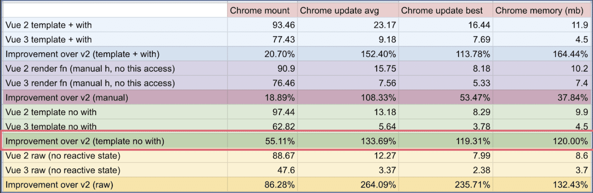
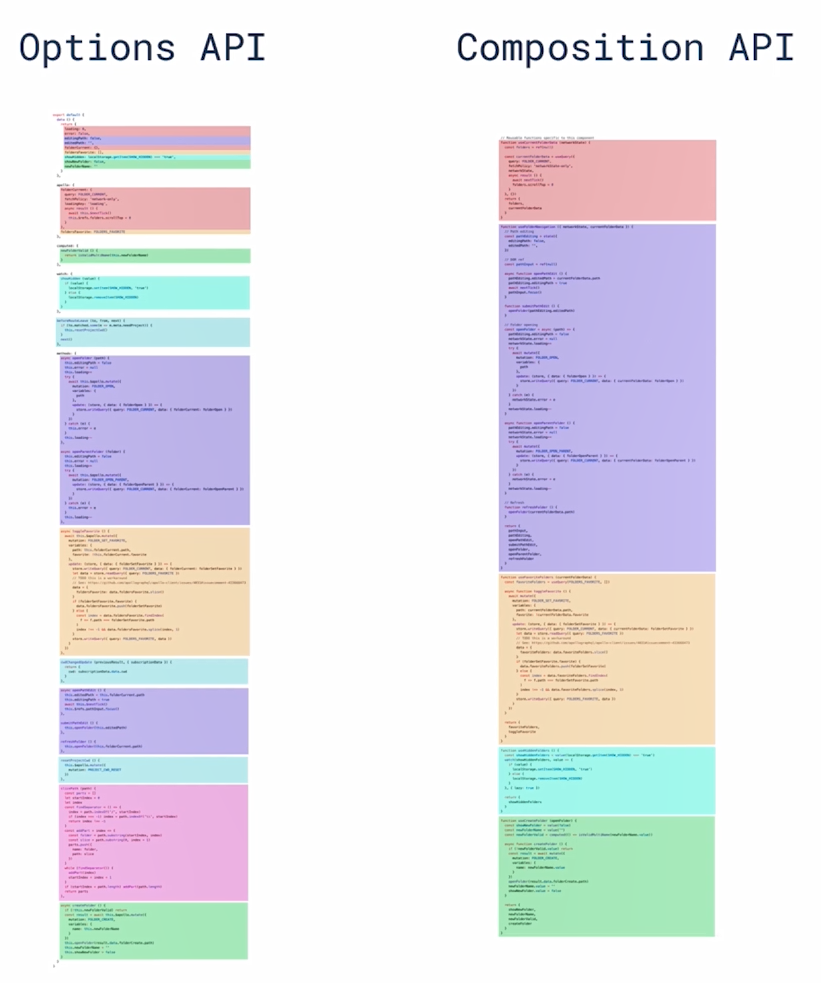
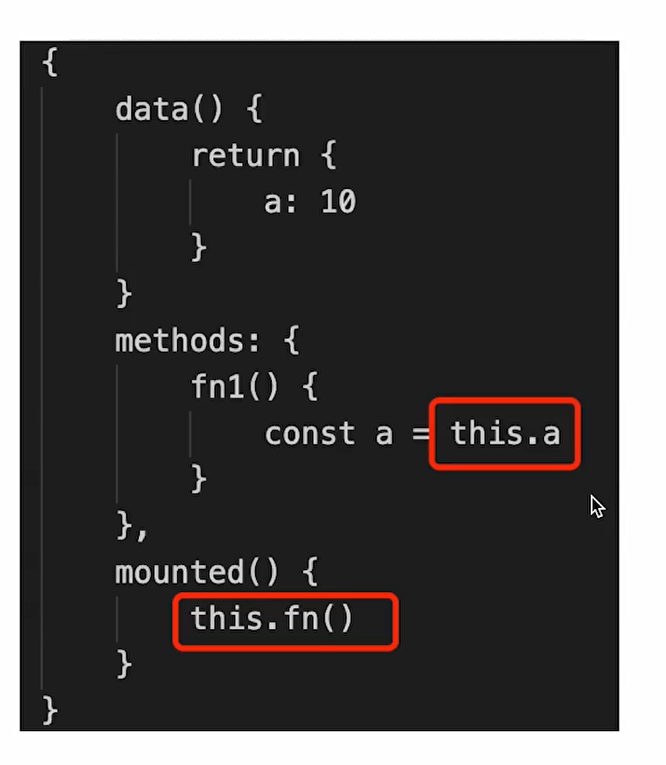
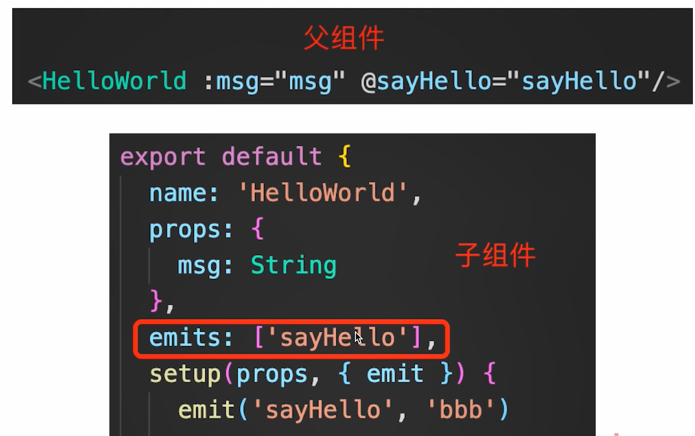

# Vue3

>vue3作为vue2的升级版本  作为新项目开发是或不可少的框架选择。
>
>本章节我们会主要介绍vue3的面试题以及对比vue2的优势，当然也会涉及到vue3的原理内容
>
>章节主要内容:
>
>+ Vue3比vue2有什么优势？
>+ 描述vue3生命周期
>+ 如何看待Composition API 和 Options API
>+ 如何理解ref  toRef  toRefs？
>+ vue3升级了哪些重要功能？
>+ Composition API如何实现逻辑复用?
>+ Vue3如何实现响应式？
>+ watch与watchEffect的区别是什么?
>+ setup中如何获取组件实例?
>+ vue3为何比vue2快？
>+ Vite是什么？
>+ Composition API 和 React Hooks对比


## 1. Vue3比Vue2有什么优势?

+ 性能更好  【**重要内容**】
+ 体积更小 【对比vue2】
+ 更好的TS支持【**源码使用TS开发**】
+ 更好的代码组织 【大项目代码拆分更好了】
+ 更好的逻辑抽离【公共代码更好拆分了】 - `Composition API`
+ 更多新功能【对比vue2加了更多API】  `Fragment` `Teleport` `Suspense`

虽然有很多更具体的数据，但不用可以去记录这些数据，跟我们日常开发也没有太多关系，了解即可。




## 2. Vue3生命周期

生命周期需要单独来看

**Options API 生命周期**

+ `beforeDestroy` 改为 `beforeUnMount`
+ `destroyed` 改为 `unMounted`
+ 其他沿用Vue2生命周期

具体代码看演示:taco:


**Composition API**

新的 Composition API 有了新的生命周期。

具体代码看演示:taco:  


## 3. 如何看待Composition API 和 Options API

问题回答方向：

1. Composition API带来了什么
2. Composition API和 Options API 如何选择
3. 别误解Composition API


### **Composition API带来了什么?**

更好的代码组织，更好的逻辑复用，更好的类型推导

相关文章： https://cn.vuejs.org/guide/extras/composition-api-faq.html

vue2 https://github.com/vuejs/vue-cli/blob/a09407dd5b9f18ace7501ddb603b95e31d6d93c0/packages/@vue/cli-ui/src/components/folder/FolderExplorer.vue#L198-L404

vue3 https://gist.github.com/yyx990803/8854f8f6a97631576c14b63c8acd8f2e



### **关于类型推导：**




- vue2 中的 this 的方式是比较微妙的。（比如 methods 选项下的函数的 this 是指向组件实例的，而不是这个 methods 对象）
- vue2 设计时，是没有考虑 ts 的类型推导的


### **如何选择**

1. 不建议公用，会引起混乱
2. 小型项目，业务逻辑简单，用Options API
3. 中大型项目、逻辑复杂，用Composition API


### **别误解Composition API**

+ Composition API属性高阶技巧，不是基本必会
+ Composition API是为了解决复杂业务逻辑场景设计的
+ Composition API就像Hooks在React中地位


## 4. 如何理解ref  toRef  toRefs？

思路：

1. 是什么
2. 最佳使用方式
3. 进阶，深入理解


网络中对于ref的讨论： https://v3.cn.vuejs.org/api/refs-api.html


### 是什么dd

#### **ref**

>创建响应式对象一般用 reactive

第一，响应式 

- 生成值类型的响应式数据
- 可直接用于模板和 reactive
- 可通过 `.value` 修改值

第二，模板引用 【拿DOM元素、组件实例】

**具体看代码演示**


#### toRef

> 可以用来为源响应式对象上的 property 新创建一个 ref。然后可以将 ref 传递出去，从而保持对其源 property 的响应式连接。

- 针对一个**响应式对象**的 property
- 创建一个 ref 具有响应式
- 保持**引用**关系

【注意】必须是响应式对象，普通对象不具有响应式。


#### toRefs

> 将响应式对象转换为普通对象，其中结果对象的每个 property 都是指向原始对象相应 property 的 ref 。

- 将**响应式对象**转换为普通对象 obj
- obj 的每个属性都是对应的 ref
- 保持**引用**关系

【注意】必须是响应式对象，普通对象不具有响应式。


**使用场景1：**

当从合成函数返回响应式对象时，toRefs 非常有用。

这样消费组件就可以在不丢失响应性的情况下对返回的对象进行分解/扩散：

``` js
function useFeatureX() {
  const state = reactive({
    x: 1,
    y: 2
  })

  // 逻辑运行状态，省略 N 行

  // 返回时转换为ref
  return toRefs(state)
}

export default {
  setup() {
    // 可以在不失去响应性的情况下破坏结构
    const { x, y } = useFeatureX()

    return {
      x,
      y
    }
  }
}
```


### 最佳使用方式

+ 用`reactive`做对象的响应式，用`ref`做值类型的响应式
+ setup中返回 `toRefs(state)`, 或者`toRef(state,'xxx')` 保持数据的响应式
+ 合成函数中返回响应式对象中用 `toRefs`


### 进阶，深入理解

>+ 为何需要`ref`？
>+ 为何需要`.value`？
>+ 为何需要 `toRef`, `toRefs`？


#### 为何需要`ref`？

+ 返回值类型，会丢失响应式
+ 如在：setup, computed, 合成函数，都要可能返回值类型
+ Vue如不定义ref，用户将自造ref，反而混乱

简单来讲：**不设置ref去处理值类型的响应式反而会带来更多的问题**


#### 为什么需要`.value`?

- 因为要保证响应式，需要把值类型封装成一个对象形式，所以用 `.value` 表示这个值
- 模板，reactive 使用时，不需要 `.value`
- 其他情况都需要 `.value`


结合 computed 的内部实现，可如下解释：

``` js
// 伪代码：不具有响应式，即改变值不会触发渲染
function computed(getter) {
  let value
  watchEffect(() => {
    value = getter() // value 是值类型，值拷贝，value 的变化不会传递到下游
  })
  return value
}

// 伪代码：具有响应式
function computed2(getter) {
  const ref = {
    value: null,
  }
  watchEffect(() => {
    ref.value = getter() // ref 是引用类型，指针拷贝，ref 的变化会传递到下游
  })
  return ref
}

// 使用场景
const a = computed(() => 100)

const b = computed2(() => 100)

// 最终a为undefined  b为{value: 100}
// 原因值类型不具备响应式   只能用引用类型
```

上述代码，可以把 `watchEffect` 改为 `setTimeout` 模拟一下


#### 为何需要 `toRef`, `toRefs`？

设计初衷： 不丢失数据响应式的同时，把对象数据 **分解/扩散**

必须存在：因为直接 property 或者 `...state` ，会直接拿到属性的值。如果属性是**值类型**，则会丢失响应式 ！！！（响应式是 Proxy 实现的）

注意事项：不创造响应式，而是**延续**响应式 （所以针对普通对象不行，必须是响应式对象）

::: tip 提示

toRef toRefs 必须针对一个响应式对象，普通对象是无法变成响应式的。
它俩的设计初衷，本来也是针对响应式对象的 https://vue-composition-api-rfc.netlify.app/zh/api.html#toref
即，想要实现响应式，只有两个方法：`ref` `reactive`

:::

简单来讲: 

- `ref`  `reactive`**创造**响应式
- `toRef` 和 `toRefs` **延续**响应式


### 总结

理解和应用要分开总结，这很重要。即便你听不懂原理，也要知道如何使用。

+ ref 值类型响应式   reactive引用类型响应式
+ `toRef`， `toRefs`用于延续响应式【解构后用】
+ `.value`是为了设计响应式而必须存在的


## 5. Vue3升级了哪些重要的功能

我花了业余时间，详细对比了 v2 和 v3 的文档目录，找出了以下比较重要的改动。
只说**重点**改动，足够回复面试题了。要看详细的，需要去查阅文档。

另外，只说使用上的，不说原理上的。

::: waring 注意

（切记，不要像背诵课文似的）

:::

### 可使用 vite 安装

(后面会讲vite)

### createApp

创建方法

``` js
// vue2.x
const app = new Vue({ /* 选项 */ })

// vue3
const app = Vue.createApp({ /* 选项 */ })
```


全局 API

```js
// vue2.x
Vue.use(/* ... */)
Vue.mixin(/* ... */)
Vue.component(/* ... */)
Vue.directive(/* ... */)

// vue3
app.use(/* ... */)
app.mixin(/* ... */)
app.component(/* ... */)
app.directive(/* ... */)
```

### emits

组件中 `emits: ['fnName']` ，否则有警告 `Extraneous non-emits event listeners`




### 生命周期

已讲过


### 多事件处理

``` vue
<!-- 在 methods 里定义 one two 两个函数 -->
<button @click="one($event), two($event)">
  Submit
</button>
```


### Fragment

取消了 v2.x 的“一个组件必须有一个根元素”

```html
<!-- vue2.x 组件模板 -->
<template>
  <div class="blog-post">
    <h3>{{ title }}</h3>
    <div v-html="content"></div>
  </div>
</template>

<!-- vue3 组件模板 -->
<template>
  <h3>{{ title }}</h3>
  <div v-html="content"></div>
</template>
```


### 去掉了 `.sync`

``` vue
<!-- vue 2.x -->
<MyComponent v-bind:title.sync="title" />

<!-- vue 3.x -->
<MyComponent v-model:title="title" />
```

文档

- vue2.x https://v2.cn.vuejs.org/v2/guide/components-custom-events.html#sync-%E4%BF%AE%E9%A5%B0%E7%AC%A6
- vue3 https://cn.vuejs.org/guide/components/v-model.html#v-model-arguments

demo 代码参考 `VModel/index.vue`


### 异步组件

新增 `defineAsyncComponent` 方法。

```js
import { createApp, defineAsyncComponent } from 'vue'

createApp({
  // ...
  components: {
    AsyncComponent: defineAsyncComponent(() =>
      import('./components/AsyncComponent.vue')
    )
  }
})
```

vue2.x 写法如下

```js
new Vue({
  // ...
  components: {
    'my-component': () => import('./my-async-component.vue')
  }
})
```


### vue3 移除了过滤器 filter

``` html
<!-- 以下 filter 在 vue3 中不可用了！！！ -->

<!-- 在双花括号中 -->
{{ message | capitalize }}

<!-- 在 `v-bind` 中 -->
<div v-bind:id="rawId | formatId"></div>
```


### Teleport

``` html
<!-- data 中设置 modalOpen: false -->

<button @click="modalOpen = true">
    Open full screen modal! (With teleport!)
</button>

<teleport to="body">
    <div v-if="modalOpen" class="modal">
        <div>
            telePort 弹窗 (父元素是 body)
            <button @click="modalOpen = false">Close</button>
        </div>
    </div>
</teleport>
```


### Suspense

【注意】Suspense 是一个实验性的 API ，后面可能会改变 —— `v3.0.2`

当内容组件未加载完成时，先显示 loading 的内容。

```html
<Suspense>
    <template>
        <Test1/> <!-- 是一个异步组件 -->
    </template>

    <!-- #fallback 就是一个具名插槽。即：
      Suspense 组件内部，有两个 slot ，
      其中一个具名为 fallback -->
    <template #fallback>
        Loading...
    </template>
</Suspense>
```

demo 代码参考 `SuspenseTest/index.vue`


### Composition API

主要的功能有：

- reactive
- ref 相关
- readonly
- computed
- watch
- watchEffect
- setup
- 各生命周期钩子函数


****

上述仅仅是比较重要改动，足够应对面试题了。
全面的改动，可以查看 v2 升级 v3 的指南 https://v3-migration.vuejs.org/zh/


