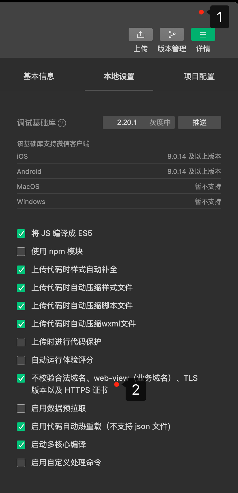

# 微信小程序基础


# 一、 起步

> 学习目标: 
>
> 1. 能够知道如何创建小程序项目
> 2. 能够清楚小程序项目的基本组成结构
> 3. 能够知道小程序页面由几部分组成
> 4. 能够知道小程序中常见的组件如何使用

## 1. 小程序简介


### 1.1 **小程序与普通网页开发的区别**

+ **运行环境不同**

  网页运行在浏览器环境中

  小程序运行在微信环境中

   

+ **API 不同**

  DOM      BOM 
  
  
  
  由于运行环境的不同，所以小程序中，无法调用 DOM 和 BOM 的 API。但是，小程序中可以调用微信	环境提供的各种 API，例如： **地理定位、 扫码、 支付**
  
+ **开发模式不同**

  网页的开发模式：浏览器 + 代码编辑器

  小程序有自己的一套标准开发模式：

  + 申请小程序开发账号
  + 安装小程序开发者工具
  + 创建和配置小程序项目


### 1.2 体验小程序

可使用手机微信(6.7.2 及以上版本)扫码下方小程序码，体验小程序


## 2. 我的第一个小程序

### 2.1 **注册小程序开发帐号**

使用浏览器打开 https://mp.weixin.qq.com/ 网址，点击右上角的“**立即注册**”即可进入到小程序开发账号的注册流程


### 2.2 选择注册账号类型

**必须为小程序！！！**


### 2.3  **填写账号信息**

正常填写


### 2.4 **提示邮箱激活**

进入邮箱激活账号

### 2.5 **点击链接激活账号**

同上

### 2.6 **选择主体类型**

中国大陆   -  个人

### 2.7 主体信息登记

实名认证

### 2.8 **获取小程序的 AppID**

登录之后 ->  开发 -> 开发设置


## 3. 安装开发者工具

### **3.1 了解微信开发者工具**

**微信开发者工具**是官方推荐使用的小程序开发工具，它提供的主要功能如下：

① 快速创建小程序项目

② 代码的查看和编辑

③ 对小程序功能进行调试

④ 小程序的预览和发布


### 3.2 **下载**

推荐下载和安装最新的稳定版（Stable Build）的微信开发者工具，下载页面的链接如下：

https://developers.weixin.qq.com/miniprogram/dev/devtools/stable.html


### 3.3 安装

正常傻瓜式安装


## 4. 小程序代码的组成

### 4.1 项目结构

#### **1. 了解项目的基本组成结构**


① **pages 用来存放所有小程序的页面**

② utils 用来存放工具性质的模块（例如：格式化时间的自定义模块）

③ **app.js 小程序项目的入口文件**

④ **app.json 小程序项目的全局配置文件**

⑤ app.wxss 小程序项目的全局样式文件

⑥ project.config.json 项目的配置文件

⑦ sitemap.json 用来配置小程序及其页面是否允许被微信索引


#### **2. 小程序页面的组成部分**

小程序官方建议把所有小程序的页面，都存放在 pages 目录中，以单独的文件夹存在，如图所示：


其中，每个页面由 4 个基本文件组成，它们分别是：

① .js 文件（页面的脚本文件，存放页面的数据、事件处理函数等）

② .json 文件（当前页面的配置文件，配置窗口的外观、表现等）

③ .wxml 文件（页面的模板结构文件）

④ .wxss 文件（当前页面的样式表文件）


### 4.2 **JSON 配置文件**

#### **1. JSON 配置文件的作用**

**JSON 是一种数据格式**，在实际开发中，JSON 总是以**配置文件**的形式出现。小程序项目中也不例外：通过不同

的 .json 配置文件，可以对小程序项目进行不同级别的配置。


小程序项目中有 4 种 json 配置文件，分别是：

① 项目根目录中的 `app.json` 配置文件

② 项目根目录中的` project.config.json` 配置文件

③ 项目根目录中的` sitemap.json `配置文件

④ 每个页面文件夹中的` .json `配置文件


#### **2. app.json 文件**

app.json 是当前小程序的**全局配置**，包括了小程序的所有页面路径、窗口外观、界面表现、底部 tab 等。

Demo 项目里边的 app.json 配置内容如下：


简单了解下这 4 个配置项的作用：

① **pages**：用来记录当前小程序所有页面的路径

② **window**：全局定义小程序所有页面的背景色、文字颜色等

③ **style**：全局定义小程序组件所使用的样式版本

④ sitemapLocation：用来指明 sitemap.json 的位置


#### 3.  **project.config.json 文件**

project.config.json 是项目配置文件，用来记录我们**对小程序开发工具所做的个性化配置**，例如：

+ **setting** 中保存了编译相关的配置

+ **projectname** 中保存的是项目名称

+ **appid** 中保存的是小程序的账号 ID


#### 4. **sitemap.json 文件**

微信现已开放**小程序内搜索**，效果类似于 PC 网页的 SEO。sitemap.json 文件用来**配置小程序页面**是否允许微信索引。

当开发者允许微信索引时，微信会通过爬虫的形式，为小程序的页面内容建立索引。当用户的搜索关键字和页面的索引匹配成功的时候，小程序的页面将可能展示在搜索结果中。


注意：sitemap 的索引提示是默认开启的，如需要关闭 sitemap 的索引提示，可在小程序项目配置文件

**project.config.json** 的 **setting** 中配置字段 **checkSiteMap** 为 **false**


#### **5. 页面的 .json 配置文件**

小程序中的每一个页面，可以使用 `.json` 文件来对本页面的窗口外观进行配置，**页面中的配置项会覆盖**

**app.json 的 window 中相同的配置项**。例如：


#### 6. **新建小程序页面**

只需要在 **app.json** -> **pages** 中新增页面的存放路径，小程序开发者工具即可帮我们自动创建对应的页面文件，

如图所示：


#### **7. 修改项目首页**

只需要调整 app.json -> pages 数组中页面路径的前后顺序，即可修改项目的首页。小程序会把排在第一位的页

面，当作项目首页进行渲染


### 4.3 **WXML 模板**

#### **1. 什么是 WXML**

WXML（WeiXin Markup Language）是小程序框架设计的一套标签语言，用来构建小程序页面的结构，其作用类似于网页开发中的 HTML。


#### **2. WXML 和 HTML 的区别**

① 标签名称不同

+ HTML （div, span, img, a） 
+ WXML（view, text, image, navigator）

② 属性节点不同

+  `<a href="#">超链接</a>`

+  `<navigator url="/pages/home/home"></navigator>`

③ 提供了类似于 Vue 中的模板语法

+ 数据绑定
+ 列表渲染
+ 条件渲染


### 4.4 **WXSS 样式**

#### **1. 什么是 WXSS**

WXSS (WeiXin Style Sheets)是一套样式语言，用于描述 WXML 的组件样式，类似于网页开发中的 CSS


#### **2. WXSS 和 CSS 的区别**

① 新增了 rpx 尺寸单位

+ CSS 中需要手动进行像素单位换算，例如 rem
+ WXSS 在底层支持新的尺寸单位 rpx，在不同大小的屏幕上小程序会自动进行换算

② 提供了全局的样式和局部样式

+ 项目根目录中的 app.wxss 会作用于所有小程序页面
+ 局部页面的 .wxss 样式仅对当前页面生效

③ WXSS 仅支持部分 CSS 选择器

+ .class 和 #id
+ element
+ 并集选择器、后代选择器
+ ::after 和 ::before 等伪类选择器


### 4.5 **JS 逻辑交互**

#### **1. 小程序中的 .js 文件**

一个项目仅仅提供界面展示是不够的，在小程序中，我们通过 .js 文件来处理用户的操作。例如：响应用户的

点击、获取用户的位置等等。


#### **2. 小程序中 .js 文件的分类**

小程序中的 JS 文件分为三大类，分别是：

① app.js

+ 是整个小程序项目的入口文件，通过调用 App() 函数来启动整个小程序

② 页面的 .js 文件

+ 是页面的入口文件，通过调用 Page() 函数来创建并运行页面

③ 普通的 .js 文件

+ 是普通的功能模块文件，用来封装公共的函数或属性供页面使用

## 5. 全局配置

### 5.1 **全局配置文件及常用的配置项**

小程序根目录下的 `app.json` 文件是小程序的全局配置文件。常用的配置项如下：

① pages

+ 记录当前小程序所有页面的存放路径

② **window**

+ 全局设置小程序窗口的外观

③ **tabBar**

+ 设置小程序底部的 tabBar 效果

④ style

+ 是否启用新版的组件样式


#### window

##### **1. 小程序窗口的组成部分**


##### 2. **了解 window 节点常用的配置项**

**window**

用于设置小程序的状态栏、导航条、标题、窗口背景色。

| 属性                         | 类型     | 默认值  | 描述                                                         | 最低版本                                               |
| :--------------------------- | :------- | :------ | :----------------------------------------------------------- | :----------------------------------------------------- |
| navigationBarBackgroundColor | HexColor | #000000 | 导航栏背景颜色，如 `#000000`                                 |                                                        |
| navigationBarTextStyle       | string   | white   | 导航栏标题颜色，仅支持 `black` / `white`                     |                                                        |
| navigationBarTitleText       | string   |         | 导航栏标题文字内容                                           |                                                        |
| navigationStyle              | string   | default | 导航栏样式，仅支持以下值： `default` 默认样式 `custom` 自定义导航栏，只保留右上角胶囊按钮。参见注 2。 | iOS/Android 微信客户端 6.6.0，Windows 微信客户端不支持 |
| backgroundColor              | HexColor | #ffffff | 窗口的背景色                                                 |                                                        |
| backgroundTextStyle          | string   | dark    | 下拉 loading 的样式，仅支持 `dark` / `light`                 |                                                        |
| backgroundColorTop           | string   | #ffffff | 顶部窗口的背景色，仅 iOS 支持                                | 微信客户端 6.5.16                                      |
| backgroundColorBottom        | string   | #ffffff | 底部窗口的背景色，仅 iOS 支持                                | 微信客户端 6.5.16                                      |
| enablePullDownRefresh        | boolean  | false   | 是否开启全局的下拉刷新。 详见 [Page.onPullDownRefresh](https://developers.weixin.qq.com/miniprogram/dev/reference/api/Page.html#onpulldownrefresh) |                                                        |
| onReachBottomDistance        | number   | 50      | 页面上拉触底事件触发时距页面底部距离，单位为 px。 详见 [Page.onReachBottom](https://developers.weixin.qq.com/miniprogram/dev/reference/api/Page.html#onreachbottom) |                                                        |

##### **3. 设置导航栏的**标题

设置步骤：`app.json -> window -> navigationBarTitleText`

需求：把导航栏上的标题，从默认的 “WeChat”修改为“众智Web前端”


##### 4. **设置导航栏的**背景色

设置步骤：`app.json -> window -> navigationBarBackgroundColor`

需求：把导航栏标题的背景色，从默认的 **#fff** 修改为 **#2b4b6b** 


##### 5. **设置导航栏的**标题颜色

设置步骤：`app.json -> window -> navigationBarTextStyle`

需求：把导航栏上的标题颜色，从默认的 **black** 修改为 **white** 


##### 6. **全局开启**下拉刷新功能

概念：**下拉刷新**是移动端的专有名词，指的是通过手指在屏幕上的下拉滑动操作，从而重新加载页面数据的行为。

设置步骤：`app.json -> window -> 把 enablePullDownRefresh 的值设置为 true`

注意：在 app.json 中启用下拉刷新功能，会作用于每个小程序页面！


##### 7.  **设置下拉刷新时**窗口的背景色

当全局开启下拉刷新功能之后，默认的窗口背景为白色。如果自定义下拉刷新窗口背景色，设置步骤为: 

`app.json -> window -> 为 backgroundColor 指定16进制的颜色值 #efefef。`


##### 8. **设置下拉刷新时** **loading 的样式**

当全局开启下拉刷新功能之后，默认窗口的 loading 样式为白色，如果要更改 loading 样式的效果，设置步

骤为 `app.json -> window -> 为 backgroundTextStyle 指定 dark 值`。


注意： backgroundTextStyle 的可选值只有 light 和 dark


##### 9. **设置上拉触底的距离**

概念：上拉触底是**移动端**的专有名词，通过手指在屏幕上的上拉滑动操作，从而加载更多数据的行为。

设置步骤：` app.json -> window -> 为 onReachBottomDistance `设置新的数值


注意：**默认距离为50px**，如果没有特殊需求，建议使用默认值即可。


#### tabbar

##### 1. **什么是 tabBar**

tabBar 是移动端应用常见的页面效果，**用于实现多页面的快速切换**。

小程序中通常将其分为：

+ 底部 tabBar
+ 顶部 tabBar


注意：

+ tabBar中只能配置**最少 2 个、最多 5 个** tab 页签
+ 当渲染顶部 **tabBar** 时，不显示 **icon**，只显示文本


##### 2. **tabBar 的 6 个组成部分**


① **backgroundColor：tabBar** 的背景色

② **selectedIconPath**：选中时的图片路径

③ **borderStyle：tabBar** 上边框的颜色

④ **iconPath**：未选中时的图片路径

⑤ **selectedColor：tab** 上的文字选中时的颜色

⑥ **color：tab** 上文字的默认（未选中）颜色


##### 3. **tabBar 节点的配置项**

如果小程序是一个多 tab 应用（客户端窗口的底部或顶部有 tab 栏可以切换页面），可以通过 tabBar 配置项指定 tab 栏的表现，以及 tab 切换时显示的对应页面。

| 属性            | 类型      | 必填   | 默认值 | 描述                                                         | 最低版本 |
| :-------------- | :-------- | :----- | :----- | :----------------------------------------------------------- | :------- |
| color           | HexColor  | 是     |        | tab 上的文字默认颜色，仅支持十六进制颜色                     |          |
| selectedColor   | HexColor  | 是     |        | tab 上的文字选中时的颜色，仅支持十六进制颜色                 |          |
| backgroundColor | HexColor  | 是     |        | tab 的背景色，仅支持十六进制颜色                             |          |
| borderStyle     | string    | 否     | black  | tabbar 上边框的颜色， 仅支持 `black` / `white`               |          |
| **list**        | **Array** | **是** |        | **tab 的列表，详见 `list` 属性说明，最少 2 个、最多 5 个 tab** |          |
| position        | string    | 否     | bottom | tabBar 的位置，仅支持 `bottom` / `top`                       |          |


##### **4. 每个 tab 项的配置选项**

list 接受一个数组，**只能配置最少 2 个、最多 5 个 tab**。tab 按数组的顺序排序，每个项都是一个对象，其属性值如下

| 属性             | 类型   | 必填 | 说明                                                         |
| :--------------- | :----- | :--- | :----------------------------------------------------------- |
| pagePath         | string | 是   | 页面路径，必须在 pages 中先定义                              |
| text             | string | 是   | tab 上按钮文字                                               |
| iconPath         | string | 否   | 图片路径，icon 大小限制为 40kb，建议尺寸为 81px * 81px，不支持网络图片。 **当 `position` 为 `top` 时，不显示 icon。** |
| selectedIconPath | string | 否   | 选中时的图片路径，icon 大小限制为 40kb，建议尺寸为 81px * 81px，不支持网络图片。 **当 `position` 为 `top` 时，不显示 icon。** |


##### 5. 案例 **配置 tabBar**

根据资料中提供的小图标、在小程序中配置的tabBar 效果


## 6. 页面配置

### **1. 页面配置文件的作用**

小程序中，每个页面都有自己的 .json 配置文件，用来对当前页面的窗口外观、页面效果等进行配置


### **2.** **页面配置和全局配置的关系**

小程序中，app.json 中的 window 节点，可以全局配置小程序中每个页面的窗口表现。

如果某些小程序页面想要拥有特殊的窗口表现，此时，“**页面级别的 .json 配置文件**”就可以实现这种需求。


注意：当页面配置与全局配置冲突时，根据就近原则，最终的效果以**页面配置**为准。


### **3. 页面配置中常用的配置项**

| 属性                         | 类型     | 默认值  | 描述                                                         | 最低版本                                               |
| :--------------------------- | :------- | :------ | :----------------------------------------------------------- | :----------------------------------------------------- |
| navigationBarBackgroundColor | HexColor | #000000 | 导航栏背景颜色，如 `#000000`                                 |                                                        |
| navigationBarTextStyle       | string   | white   | 导航栏标题颜色，仅支持 `black` / `white`                     |                                                        |
| navigationBarTitleText       | string   |         | 导航栏标题文字内容                                           |                                                        |
| navigationStyle              | string   | default | 导航栏样式，仅支持以下值： `default` 默认样式 `custom` 自定义导航栏，只保留右上角胶囊按钮。参见注 1。 | iOS/Android 微信客户端 7.0.0，Windows 微信客户端不支持 |
| backgroundColor              | HexColor | #ffffff | 窗口的背景色                                                 |                                                        |
| backgroundTextStyle          | string   | dark    | 下拉 loading 的样式，仅支持 `dark` / `light`                 |                                                        |
| backgroundColorTop           | string   | #ffffff | 顶部窗口的背景色，仅 iOS 支持                                | 微信客户端 6.5.16                                      |
| backgroundColorBottom        | string   | #ffffff | 底部窗口的背景色，仅 iOS 支持                                | 微信客户端 6.5.16                                      |
| enablePullDownRefresh        | boolean  | false   | 是否开启当前页面下拉刷新。 详见 [Page.onPullDownRefresh](https://developers.weixin.qq.com/miniprogram/dev/reference/api/Page.html#onpulldownrefresh) |                                                        |
| onReachBottomDistance        | number   | 50      | 页面上拉触底事件触发时距页面底部距离，单位为px。 详见 [Page.onReachBottom](https://developers.weixin.qq.com/miniprogram/dev/reference/api/Page.html#onreachbottom) |                                                        |
| disableScroll                | boolean  | false   | 设置为 `true` 则页面整体不能上下滚动。 只在页面配置中有效，无法在 `app.json` 中设置 |                                                        |


## 7. 小程序的宿主环境

### 7.1 **宿主环境简介**

#### **1. 什么是宿主环境**

宿主环境（host environment）指的是程序运行所**必须的依赖环境**。

例如：Android 系统和 iOS 系统是两个不同的宿主环境。安卓版的微信 App 是不能在 iOS 环境下运行的，所以，Android 是安卓软件的宿主环境，脱离了宿主环境的软件是没有任何意义的！


#### **2. 小程序的宿主环境**

**手机微信**是小程序的宿主环境

小程序借助宿主环境提供的能力，可以完成许多普通网页无法完成的功能，例如：

微信扫码、微信支付、微信登录、地理定位、etc…


#### 3. **小程序宿主环境包含的内容**

① 通信模型

② 运行机制

③ 组件

④ API


### 7.2 **通信模型**

#### **1. 通信的主体**

小程序中通信的主体是渲染层和逻辑层，其中：

① WXML 模板和 WXSS 样式工作在渲染层

② JS 脚本工作在逻辑层


#### **2. 小程序的通信模型**

小程序中的通信模型分为两部分：

① 渲染层和逻辑层之间的通信

+ 由微信客户端进行转发

② 逻辑层和第三方服务器之间的通信

+ 由微信客户端进行转发


### 7.3 **运行机制**

#### 1. **小程序启动的过程**

① 把小程序的代码包下载到本地

② 解析 app.json 全局配置文件

③ 执行 app.js 小程序入口文件，调用 App() 创建小程序实例

④ 渲染小程序首页

⑤ 小程序启动完成


#### 2. **页面渲染的过程**

① 加载解析页面的 .json 配置文件

② 加载页面的 .wxml 模板和 .wxss 样式

③ 执行页面的 .js 文件，调用 Page() 创建页面实例

④ 页面渲染完成


## 8. 组件

### 8.1 小程序中组件的分类

小程序中的组件也是由宿主环境提供的，开发者可以基于组件快速搭建出漂亮的页面结构。

官方把小程序的组件分为了 9 大类，分别是：

**① 视图容器**

**② 基础内容**

**③ 表单组件**

**④ 导航组件**

⑤ 媒体组件

⑥ map 地图组件

⑦ canvas 画布组件

⑧ 开放能力

⑨ 无障碍访问 


### **8.2** **常用的视图容器类组件**

① view

+ 普通视图区域
+ 类似于 HTML 中的 div，是一个块级元素
+ 常用来实现页面的布局效果

② scroll-view

+ 可滚动的视图区域
+ 常用来实现滚动列表效果

③ swiper 和 swiper-item

+ 轮播图容器组件 和 轮播图 item 组件


#### **1. view 组件的基本使用**

实现 flex **横向布局效果**


#### **2. scroll-view 组件的基本使用**

实现**纵向滚动效果**


#### **3. swiper 和 swiper-item 组件的基本使用**

实现基本轮播图效果


#### 4. **swiper 组件的常用属性**

| **属性**               | **类型** | **默认值**        | **说明**             |
| ---------------------- | -------- | ----------------- | -------------------- |
| indicator-dots         | boolean  | false             | 是否显示面板指示点   |
| indicator-color        | color    | rgba(0, 0, 0, .3) | 指示点颜色           |
| indicator-active-color | color    | #000000           | 当前选中的指示点颜色 |
| autoplay               | boolean  | false             | 是否自动切换         |
| interval               | number   | 5000              | 自动切换时间间隔     |
| circular               | boolean  | false             | 是否采用衔接滑动     |


### **8.3.** **常用的基础内容组件**

① text

+ 文本组件
+ 类似于 HTML 中的 span 标签，是一个行内元素

② rich-text

+ 富文本组件
+ 支持把 HTML 字符串渲染为 WXML 结构


#### **1. text 组件的基本使用**

通过 text 组件的 selectable 属性，实现长按选中文本内容的效果


#### **2. rich-text 组件的基本使用**

通过 rich-text 组件的 nodes 属性节点，把 HTML 字符串渲染为对应的 UI 结构


### **8.4 其它常用组件**

① button

+ 按钮组件
+ 功能比 HTML 中的 button 按钮丰富
+ 通过 open-type 属性可以调用微信提供的各种功能（客服、转发、获取用户授权、获取用户信息等）

② image

+ 图片组件
+ image 组件默认宽度约 300px、高度约 240px

③ navigator（后面课程会专门讲解）

+ 页面导航组件
+ 类似于 HTML 中的 a 链接


## 9. API

### **9.1 小程序 API 概述**

小程序中的 API 是由宿主环境提供的，通过这些丰富的小程序 API，开发者可以方便的调用微信提供的能力

例如：获取用户信息、本地存储、支付功能等


### **9.2 小程序 API 的 3 大分类**

小程序官方把 API 分为了如下 3 大类：

① 事件监听 API

+ 特点：以 on 开头，用来监听某些事件的触发
+ 举例：wx.onWindowResize(function callback) 监听窗口尺寸变化的事件

② 同步 API

+ 特点1：以 Sync 结尾的 API 都是同步 API
+ 特点2：同步 API 的执行结果，可以通过函数返回值直接获取，如果执行出错会抛出异常
+ 举例：wx.setStorageSync('key', 'value') 向本地存储中写入内容

③ 异步 API

+ 特点：类似于 jQuery 中的 $.ajax(options) 函数，需要通过 success、fail、complete 接收调用的结果
+ 举例：wx.request() 发起网络数据请求，通过 success 回调函数接收数据


# 二、 **模板与配置**

> 目标： 
>
> 1. 能够使用 WXML 模板语法渲染页面结构
> 2. 能够使用 WXSS 样式美化页面结构
> 3. 能够使用 app.json 对小程序进行全局性配置
> 4. 能够使用 page.json 对小程序页面进行个性化配置
> 5. 能够知道如何发起网络数据请求

## 1. WXML 模板语法

### 1.1 **数据绑定**

#### **1. 数据绑定的基本原则**

① 在 data 中定义数据

② 在 WXML 中使用数据


#### **2. 在 data 中定义页面的数据**

在页面对应的` .js `文件中，把数据定义到 data 对象中即可：

``` js
Page({
    data: {
        info: 'init data',
        msgList: [ { msg: 'hello'}, { msg: 'world'} ]
    }
})
```


#### **3. Mustache 语法的格式**

把data中的数据绑定到页面中渲染，使用 **Mustache 语法**（双大括号）将变量包起来即可。语法格式为：

``` html
<view>{{ 要绑定的数据名称 }}</view>
```


#### **4. Mustache 语法的应用场景**

Mustache 语法的主要应用场景如下：

+ 绑定内容
+ 绑定属性
+ 运算（三元运算、算术运算等）


#### **5. 动态绑定内容**

**js**

``` js
Page({
    data: {
        info: 'init data'
    }
})
```

**wxml**

``` html
<view>{{ info }}</view>
```


#### 6.  **动态绑定属性**

**js**

``` js
Page({
    data: {
        imgSrc: 'http://back.zeng.pub/a.png'
    }
})
```

**wxml**

``` html
<image src="{{imgSrc}}"></image>
```


#### 7.  **三元运算**

**js**

``` js
Page({
    data: {
        randomNum: Math.random() * 10 // 生成10以内的随机数
    }
})
```

**wxml**

``` html
<view>{{ randomNum >= 5 ? '随机数字大于等于5' : '随机数字小于5' }}</view>
```


#### 8.  **算数运算**

**js**

``` js
Page({
    data: {
        randomNum: Math.random().toFixed(2) // 生成2位小数的随机数
    }
})
```

**wxml**

``` html
<view>生成100以内的随机数： {{random * 100}}</view>
```


### 1.2 事件绑定

#### **1. 什么是事件**

事件是渲染层到逻辑层的通讯方式。通过事件可以将用户在渲染层产生的行为，反馈到逻辑层进行业务的处理。


#### 2. **事件绑定的语法格式**

##### 普通事件绑定

事件绑定的写法类似于组件的属性，如：

```html
<view bindtap="handleTap">
    Click here!
</view>
```

如果用户点击这个 view ，则页面的 `handleTap` 会被调用。

事件绑定函数可以是一个数据绑定，如：

```html
<view bindtap="{{ handlerName }}">
    Click here!
</view>
```

此时，页面的 `this.data.handlerName` 必须是一个字符串，指定事件处理函数名；如果它是个空字符串，则这个绑定会失效（可以利用这个特性来暂时禁用一些事件）。

自基础库版本 [1.5.0](https://developers.weixin.qq.com/miniprogram/dev/framework/compatibility.html) 起，在大多数组件和自定义组件中， `bind` 后可以紧跟一个冒号，其含义不变，如 `bind:tap` 。基础库版本 [2.8.1](https://developers.weixin.qq.com/miniprogram/dev/framework/compatibility.html) 起，在所有组件中开始提供这个支持。

##### 绑定并阻止事件冒泡

除 `bind` 外，也可以用 `catch` 来绑定事件。与 `bind` 不同， `catch` 会阻止事件向上冒泡。

例如在下边这个例子中，点击 inner view 会先后调用`handleTap3`和`handleTap2`(因为 tap 事件会冒泡到 middle view，而 middle view 阻止了 tap 事件冒泡，不再向父节点传递)，点击 middle view 会触发`handleTap2`，点击 outer view 会触发`handleTap1`。

```html
<view id="outer" bindtap="handleTap1">
  outer view
  <view id="middle" catchtap="handleTap2">
    middle view
    <view id="inner" bindtap="handleTap3">
      inner view
    </view>
  </view>
</view>
```


#### 3. **小程序中常用的事件**

| 类型               | 触发条件                                                     |
| :----------------- | :----------------------------------------------------------- |
| touchstart         | 手指触摸动作开始                                             |
| touchmove          | 手指触摸后移动                                               |
| touchcancel        | 手指触摸动作被打断，如来电提醒，弹窗                         |
| touchend           | 手指触摸动作结束                                             |
| tap                | 手指触摸后马上离开                                           |
| longpress          | 手指触摸后，超过350ms再离开，如果指定了事件回调函数并触发了这个事件，tap事件将不被触发 |
| longtap            | 手指触摸后，超过350ms再离开（推荐使用longpress事件代替）     |
| transitionend      | 会在 WXSS transition 或 wx.createAnimation 动画结束后触发    |
| animationstart     | 会在一个 WXSS animation 动画开始时触发                       |
| animationiteration | 会在一个 WXSS animation 一次迭代结束时触发                   |
| animationend       | 会在一个 WXSS animation 动画完成时触发                       |

​	

#### **4. 事件对象的属性列表**

| 属性           | 类型    | 说明                                         |
| :------------- | :------ | :------------------------------------------- |
| type           | String  | 事件类型                                     |
| timeStamp      | Integer | 页面打开到触发事件所经过的毫秒数             |
| target         | Object  | 触发事件的组件的一些属性值集合               |
| currentTarget  | Object  | 当前组件的一些属性值集合                     |
| detail         | Object  | 额外的信息                                   |
| touches        | Array   | 触摸事件，当前停留在屏幕中的触摸点信息的数组 |
| changedTouches | Array   | 触摸事件，当前变化的触摸点信息的数组         |

**这里需要注意的是target和currentTarget的区别，currentTarget为当前事件所绑定的组件，而target则是触发该事件的源头组件。**


#### **5. target 和 currentTarget 的区别**

target 是触发该事件的源头组件，而 currentTarget 则是当前事件所绑定的组件。

``` html
<view>
	<button type="primary">
        按钮
    </button>
</view>
```


点击内部的按钮时，点击事件以冒泡的方式向外扩散，也会触发外层 view 的 tap 事件处理函数。

此时，对于外层的 view 来说：

+ e.target 指向的是触发事件的源头组件，因此，e.target 是内部的按钮组件
+ e.currentTarget 指向的是当前正在触发事件的那个组件，因此，e.currentTarget 是当前的 view 组件


#### **6. 在事件处理函数中为 data 中的数据赋值**

通过调用 `this.setData(dataObject) `方法，可以给页面 data 中的数据重新赋值，示例如下：

``` js
// 页面的 .js 文件
Page({
    data: {
        count: 0
    },
    // 修改 count的值
    changeCount () {
        this.setData({
            count: this.data.count + 1
        })
    }
})
```


#### **7. 事件传参**

小程序中的事件传参比较特殊，不能在绑定事件的同时为事件处理函数传递参数。例如，下面的代码将不能正常工作：

``` html
<button type="primary" bindtap="btnHandler(123)">
    事件传参
</button>
```

因为小程序会把 bindtap 的属性值，统一当作事件名称来处理，相当于要调用一个名称为 btnHandler(123) 的事件处理函数。


可以为组件提供 `data-* `自定义属性传参，其中` * `代表的是参数的名字，示例代码如下：

``` html
<button type="primary" bindtap="btnHandler" data-info="{{2}}">
    事件传参
</button>
```

最终： 

+ info会被解析为参数的名字
+ 数值2会被解析为参数的值


在事件处理函数中，通过` event.target.dataset.参数名` 即可获取到具体参数的值，示例代码如下：

``` js
btnHandler (event) {
	// dataset 是一个对象 包含了所有 data-* 传递过来的值
    console.log(event.target.dataset)
    // 通过 dataset 可以访问到具体参数的值
    console.log(event.target.dataset.info)
}
```


#### **8.** **bindinput 的语法格式**

在小程序中，通过 input 事件来响应文本框的输入事件，语法格式如下：

① 通过 bindinput，可以为文本框绑定输入事件：

``` html
<input bindinput="inputHandler"></input>
```

② 在页面的 .js 文件中定义事件处理函数：

``` js
inputHandler(e) {
    // e.detail.value 是变化过后 文本框最新的值
    console.log(e.detail.value)
}
```


#### **9. 实现文本框和 data 之间的数据同步**

实现步骤：

① 定义数据

``` js
Page({
    data: {
        msg: '你好'
    }
})
```


② 渲染结构

``` html
<input value="{{msg}}" bindinput="iptHandler"></input>
```


③ 美化样式

``` css
input {
    border: 1px soild #eee;
    padding: 5px;
    margin: 5px;
    border-radius: 3px;
}
```


④ 绑定 input 事件处理函数

``` js
iptHandler(e) {
    this.setData({
        // 通过 e.detail.value 获取文本框的值
        msg: e.detail.value
    })
}
```


#### 10. 简易双向绑定

双向绑定语法：

在 WXML 中，普通的属性的绑定是单向的。例如：

``` html
<input value="{{value}}" />
```


如果使用 `this.setData({ value: 'leaf' })` 来更新 `value` ，`this.data.value` 和输入框的中显示的值都会被更新为 `leaf` ；但如果用户修改了输入框里的值，却不会同时改变 `this.data.value` 。


如果需要在用户输入的同时改变 `this.data.value` ，需要借助简易双向绑定机制。此时，可以在对应项目之前加入 `model:` 前缀：

``` html
<input model:value="{{value}}" />
```


这样，如果输入框的值被改变了， `this.data.value` 也会同时改变。同时， WXML 中所有绑定了 `value` 的位置也会被一同更新， [数据监听器](https://developers.weixin.qq.com/miniprogram/dev/framework/custom-component/observer.html) 也会被正常触发。


### 1.3 条件循环

#### 1.  wx:if

在小程序中，使用` wx:if="{{condition}}"` 来判断是否需要渲染该代码块：

``` html
<view wx:if="{{condition}}"> True </view>
```

也可以用`wx:elif `和` wx:else `来添加 else 判断：

``` html
<view wx:if="{{type === 1}}">男</view>
<view wx:elif="{{type === 2}}">女</view>
<view wx:else>保密</view>

```


#### 2. **结合 `<block> `使用 wx:if**

如果要**一次性控制多个组件的展示与隐藏**，可以使用一个` <block></block>` 标签将多个组件包装起来，并在

`<block>` 标签上使用` wx:if `控制属性，示例如下：

``` html
<block wx:if="{{true}}">
    <view> view1 </view>
    <view> view2 </view>
</block>
```

注意： `<block> `并不是一个组件，它只是一个包裹性质的容器，不会在页面中做任何渲染。


#### 3. **hidden**

在小程序中，直接使用 `hidden="{{ condition }}" `也能控制元素的显示与隐藏：

``` html
<view hidden="{{ condition }}"> 条件为true隐藏， 条件为false显示</view>
```


#### **4. wx:if 与 hidden 的对比**

① 运行方式不同

+ wx:if 以**动态创建和移除元素**的方式，控制元素的展示与隐藏
+ hidden 以**切换样式**的方式（display: none/block;），控制元素的显示与隐藏

② 使用建议

+ **频繁切换**时，建议使用 hidden
+ **控制条件复杂**时，建议使用` wx:if `搭配 `wx:elif`、`wx:else `进行展示与隐藏的切换


### 1.4 列表渲染

#### **1. wx:for**

通过 wx:for 可以根据指定的数组，循环渲染重复的组件结构，语法示例如下：

``` html
<view wx:for="{{array}}">索引是： {{index}} 当前项是: {{item}}</view>
```

默认情况下，当前循环项的索引用 **index** 表示；当前循环项用 **item** 表示。


#### 2. 手动指定索引和当前项的变量名

+ 使用 `wx:for-index` 可以指定当前循环项的索引的变量名
+ 使用 `wx:for-item` 可以指定当前项的变量名

``` html
<view wx:for="{{array}}" wx:for-index="idx" wx:for-item="itemName">
    索引是： {{idx}}  当前项是: {{itemName}}
</view>
```


#### **3. wx:key 的使用**

类似于 Vue 列表渲染中的 **:key**，小程序在实现列表渲染时，也建议为渲染出来的列表项指定唯一的 key 值，从而提高渲染的效率，示例代码如下：

``` js
data: {
    userList: [
        {id: 1, name: '小红'},
        {id: 2, name: '小黑'},
        {id: 3, name: '小白'},
    ]
}

// wxml结构
<view wx:for="{{userList}}" wx:key="id">{{item.name}}</view>
```


## 2. WXSS  模板样式

### 2.1 **什么是 WXSS**

WXSS (WeiXin Style Sheets)是一套样式语言，用于美化 WXML 的组件样式，类似于网页开发中的 CSS。


### 2.2 **WXSS 和 CSS 的关系**

WXSS 具有 CSS 大部分特性，同时，WXSS 还对 CSS 进行了扩充以及修改，以适应微信小程序的开发。与 CSS 相比，WXSS 扩展的特性有：

+ **rpx** 尺寸单位
+ **@import** 样式导入


### 2.3 **rpx**单位

#### 1. **什么是 rpx 尺寸单位**

**rpx**（responsive pixel）是微信小程序独有的，用来解决屏适配的尺寸单位。


#### **2. rpx 的实现原理**

rpx 的实现原理非常简单：鉴于不同设备屏幕的大小不同，为了实现屏幕的自动适配，rpx 把所有设备的屏幕，在宽度上等分为 **750 份**（即：当前屏幕的总宽度为 **750rpx**）。

+ 在较小的设备上，1rpx 所代表的宽度较小
+ 在较大的设备上，1rpx 所代表的宽度较大

小程序在不同设备上运行的时候，会自动把 rpx 的样式单位换算成对应的像素单位来渲染，从而实现屏幕适配


#### **3. rpx 与 px 之间的单位换算**

在 iPhone6 上，屏幕宽度为375px，共有 750 个物理像素，等分为 750rpx。则：

**750rpx = 375px = 750 物理像素**

**1rpx = 0.5px = 1物理像素**


官方建议：开发微信小程序时，设计师可以用 **iPhone6** 作为视觉稿的标准。

开发举例：在 iPhone6 上如果要绘制**宽100px，高20px**的盒子，换算成rpx单位，宽高分别为 **200rpx 和 40rpx**


### 2.4 **样式导入**

#### **1. 什么是样式导入**

使用 WXSS 提供的 `@import` 语法，可以导入外联的样式表


#### **2. @import 的语法格式**

`@import` 后跟需要导入的外联样式表的相对路径，用 ; 表示语句结束。示例如下：

**common.wxss**

``` css
.small-p {
    padding: 5px;
}
```

``` css
@import 'common.wxss';
.middle-p {
	padding: 15px;
}

```


### 2.5 全局样式和局部样式

#### 1. **全局样式**

定义在` app.wxss` 中的样式为全局样式，作用于每一个页面。


#### **2. 局部样式**

在页面的` .wxss` 文件中定义的样式为**局部样式**，只作用于当前页面。

注意：

① 当局部样式和全局样式冲突时，根据就近原则，局部样式会覆盖全局样式

② 当局部样式的权重大于或等于全局样式的权重时，才会覆盖全局的样式


## 3. 网络数据请求

### **3.1 小程序中网络数据请求的限制**

出于**安全性**方面的考虑，小程序官方对数据接口的请求做出了如下

两个限制：

① 只能请求 HTTPS 类型的接口

② 必须将接口的域名添加到信任列表中



### **3.2 配置 request 合法域名**

需求描述：假设在自己的微信小程序中，希望请求  https://zeng.pub/  域名下的接口

配置步骤：`登录微信小程序管理后台 -> 开发 -> 开发设置 -> 服务器域名 -> 修改 request 合法域名`

注意事项：

① 域名只支持 https 协议

② 域名不能使用 IP 地址或 localhost

③ 域名必须经过 ICP 备案

④ 服务器域名一个月内最多可申请 5 次修改


### **3.3 发起 GET 请求**

调用微信小程序提供的` wx.request()` 方法，可以发起 GET 数据请求，示例代码如下：

``` js
wx.request({
    url: 'http://www.baidu.com', // 请求地址 必须是https协议
    method: 'get', // 请求方式
    data: { // 请求参数
        name: 'zs',
        age: 22
    },
    success: res => { // 请求成功之后的回调
        console.log(res)
    }
})
```


### **3.4 发起 POST 请求**

调用微信小程序提供的 wx.request() 方法，可以发起 POST 数据请求，示例代码如下：

``` js
wx.request({
    url: 'http://www.baidu.com', // 请求地址 必须是https协议
    method: 'post', // 请求方式
    data: { // 请求参数
        name: 'zs',
        age: 22
    },
    success: res => { // 请求成功之后的回调
        console.log(res)
    }
})
```


### **3.5 在页面刚加载时请求数据**

在很多情况下，我们需要在页面刚加载的时候，自动请求一些初始化的数据。

此时需要在页面的 onLoad 事件中调用获取数据的函数，示例代码如下：

``` js
/**
* 生命周期函数 -- 监听页面加载
*/
onLoad() {
    if (wx.getUserProfile) {
      this.setData({
        canIUseGetUserProfile: true
      })
    }
},
```


### 3.6  **跳过 request 合法域名校验**

如果后端程序员仅仅提供了 **http** 协议的接口、暂时没有提供 **https** 协议的接口。

此时为了不耽误开发的进度，我们可以在微信开发者工具中，临时开启「开发环境不校验请求域名、TLS 版本及 HTTPS 证书」选项，跳过 request 合法域名的校验。


注意：

跳过 request 合法域名校验的选项，仅限在**开发与调试阶段**使用！


### 3.7 **关于**跨域和 **Ajax** **的说明**

跨域问题**只存在于**基于浏览器的 Web 开发中。由于**小程序的宿主环境**不是浏览器，而是微信客户端，所以小程序中**不存在跨域的问题**。

**Ajax** 技术的核心是依赖于浏览器中的 **XMLHttpRequest** 这个对象，

由于小程序的宿主环境是微信客户端，所以小程序中不能叫做“发起 Ajax 请求”，而是叫做“**发起网络数据请求**”。


## 4. 案例： 本地生活案例

### 4.1 **首页效果以及实现步骤**


① 新建项目并梳理项目结构

② 配置导航栏效果

③ 配置 tabBar 效果

④ 实现轮播图效果

⑤ 实现九宫格效果

⑥ 实现图片布局


### **4.2 接口地址**

① 获取轮播图数据列表的接口

+ 【GET】https://www.escook.cn/slides

② 获取九宫格数据列表的接口

+ 【GET】https://www.escook.cn/categories


# 三、 **视图与逻辑**

> 学习目标:
>
> 1. 能够知道如何实现页面之间的导航跳转
> 2. 能够知道如何实现下拉刷新效果
> 3. 能够知道如何实现上拉加载更多效果
> 4. 能够知道小程序中常用的生命周期函数

## 1. 页面导航

### 1.1 **什么是页面导航**

页面导航指的是**页面之间的相互跳转**。例如，浏览器中实现页面导航的方式有如下两种：

① `<a>` 链接

②  location.href


### 1.2 **小程序中实现页面导航的两种方式**

① 声明式导航

+ 在页面上声明一个 `<navigator>` 导航组件
+ 通过点击 `<navigator> `组件实现页面跳转

② 编程式导航

+ 调用小程序的导航 API，实现页面的跳转


### 1.3 **声明式导航**

#### **1. 导航到 tabBar 页面**

tabBar 页面指的是被配置为 tabBar 的页面

在使用 `<navigator>` 组件跳转到指定的 tabBar 页面时，需要指定 url 属性和 open-type 属性，其中：

+  url 表示要跳转的页面的地址，必须以 / 开头
+ open-type 表示跳转的方式，必须为 switchTab

``` html
<navigator url="/pages/message/message" open-type="switchTab" >导航到消息页面</navigator>
```


## **2. 导航到非 tabBar 页面**

非 tabBar 页面指的是没有被配置为 tabBar 的页面

在使用 `<navigator>` 组件跳转到普通的非 tabBar 页面时，则需要指定 url 属性和 open-type 属性，其中：

+ url 表示要跳转的页面的地址，必须以 / 开头
+ open-type 表示跳转的方式，必须为 navigate

``` html
<navigator url="/pages/info/info" open-type="navigate" >导航到消息页面</navigator>
```


**注意：为了简便，在导航到非 tabBar 页面时，open-type="navigate" 属性可以省略。**


## **3. 后退导航**

如果要后退到上一页面或多级页面，则需要指定 open-type 属性和 delta 属性，其中：

+ open-type 的值必须是 navigateBack，表示要进行后退导航
+ delta 的值必须是数字，表示要后退的层级

``` html
<navigator delta="1" open-type="navigateBack" >返回上一页</navigator>
```


**注意：为了简便，如果只是后退到上一页面，则可以省略 delta 属性，因为其默认值就是 1。**


## 4. 编程式导航

### 4.1 导航到 tabBar 页面

调用` wx.switchTab(Object object) `方法，可以跳转到 tabBar 页面。其中 Object `参数对象`的属性列表如下：

| 属性     | 类型     | 默认值 | 必填 | 说明                                                         |
| :------- | :------- | :----- | :--- | :----------------------------------------------------------- |
| url      | string   |        | 是   | 需要跳转的 tabBar 页面的路径 (代码包路径)（需在 app.json 的 [tabBar](https://developers.weixin.qq.com/miniprogram/dev/reference/configuration/app.html#tabbar) 字段定义的页面），路径后不能带参数。 |
| success  | function |        | 否   | 接口调用成功的回调函数                                       |
| fail     | function |        | 否   | 接口调用失败的回调函数                                       |
| complete | function |        | 否   | 接口调用结束的回调函数（调用成功、失败都会执行）             |

``` js
// app.json
{
  "tabBar": {
    "list": [{
      "pagePath": "index",
      "text": "首页"
    },{
      "pagePath": "other",
      "text": "其他"
    }]
  }
}

wx.switchTab({
  url: '/index'
})
```


### **4.2 导航到非 tabBar 页面**

调用 `wx.navigateTo(Object object)` 方法，可以跳转到非 `tabBar` 的页面。其中 Object 参数对象的属性列表

| 属性     | 类型     | 默认值 | 必填 | 说明                                                         |
| :------- | :------- | :----- | :--- | :----------------------------------------------------------- |
| url      | string   |        | 是   | 需要跳转的应用内非 tabBar 的页面的路径 (代码包路径), 路径后可以带参数。参数与路径之间使用 `?` 分隔，参数键与参数值用 `=` 相连，不同参数用 `&` 分隔；如 'path?key=value&key2=value2' |
| events   | Object   |        | 否   | 页面间通信接口，用于监听被打开页面发送到当前页面的数据。基础库 2.7.3 开始支持。 |
| success  | function |        | 否   | 接口调用成功的回调函数                                       |
| fail     | function |        | 否   | 接口调用失败的回调函数                                       |
| complete | function |        | 否   | 接口调用结束的回调函数（调用成功、失败都会执行）             |

示例代码

```js
wx.navigateTo({
  url: 'test?id=1',
  events: {
    // 为指定事件添加一个监听器，获取被打开页面传送到当前页面的数据
    acceptDataFromOpenedPage: function(data) {
      console.log(data)
    },
    someEvent: function(data) {
      console.log(data)
    }
    ...
  },
  success: function(res) {
    // 通过eventChannel向被打开页面传送数据
    res.eventChannel.emit('acceptDataFromOpenerPage', { data: 'test' })
  }
})

//test.js
Page({
  onLoad: function(option){
    console.log(option.query)
    const eventChannel = this.getOpenerEventChannel()
    eventChannel.emit('acceptDataFromOpenedPage', {data: 'test'});
    eventChannel.emit('someEvent', {data: 'test'});
    // 监听acceptDataFromOpenerPage事件，获取上一页面通过eventChannel传送到当前页面的数据
    eventChannel.on('acceptDataFromOpenerPage', function(data) {
      console.log(data)
    })
  }
})
```


### **4.3 后退导航**

调用` wx.navigateBack(Object object) `方法，可以返回上一页面或多级页面。

其中 Object 参数对象可选的属性列表如下：

| 属性     | 类型     | 默认值 | 必填 | 说明                                                    |
| :------- | :------- | :----- | :--- | :------------------------------------------------------ |
| delta    | number   | 1      | 否   | 返回的页面数，如果 delta 大于现有页面数，则返回到首页。 |
| success  | function |        | 否   | 接口调用成功的回调函数                                  |
| fail     | function |        | 否   | 接口调用失败的回调函数                                  |
| complete | function |        | 否   | 接口调用结束的回调函数（调用成功、失败都会执行）        |


示例代码：

```javascript
// 注意：调用 navigateTo 跳转时，调用该方法的页面会被加入堆栈，而 redirectTo 方法则不会。见下方示例代码

// 此处是A页面
wx.navigateTo({
  url: 'B?id=1'
})

// 此处是B页面
wx.navigateTo({
  url: 'C?id=1'
})

// 在C页面内 navigateBack，将返回A页面
wx.navigateBack({
  delta: 2
})
```


## 5.  **导航传参**

### **5.1 声明式导航传参**

navigator 组件的 url 属性用来指定将要跳转到的页面的路径。同时，路径的后面还可以携带参数：

+ 参数与路径之间使用 ? 分隔
+ 参数键与参数值用 = 相连
+ 不同参数用 & 分隔

``` html
<navigator url="/pages/info/info?name=zs&age=18" open-type="navigate" >跳转到Info</navigator>
```


### **5.2 编程式导航传参**

调用` wx.navigateTo(Object object)` 方法跳转页面时，也可以携带参数，代码示例如下：

``` js
<button bindtap="gotoInfo2">跳转info页面</button>

gotoInfo2 () {
	wx.navigateTo({
		url: '/pages/info/info?name=zs&age=18'
	})
}
```


### **5.3 在 onLoad 中接收导航参数**

通过声明式导航传参或编程式导航传参所携带的参数，可以直接在 onLoad 事件中直接获取到，示例代码如下：

``` js
onLoad (options) {
    // options就是导航传递过来的参数
    console.log(options)
}
```


## 6. 页面事件

### 6.1 **下拉刷新事件**

#### **1. 什么是下拉刷新**

**下拉刷新**是移动端的专有名词，指的是通过手指在屏幕上的下拉滑动操作，从而**重新加载页面数据**的行为。


#### **2. 启用下拉刷新**

启用下拉刷新有两种方式：

① 全局开启下拉刷新

+ 在 app.json 的 window 节点中，将 enablePullDownRefresh 设置为 true

② 局部开启下拉刷新

+ 在页面的 .json 配置文件中，将 enablePullDownRefresh 设置为 true

在实际开发中，推荐使用第 2 种方式，**为需要的页面单独开启下拉刷新的效果。**


#### **3. 配置下拉刷新窗口的样式**

在全局或页面的` .json` 配置文件中，通过 **backgroundColor** 和 **backgroundTextStyle** 来配置下拉刷新窗口的样式，其中：

+ **backgroundColor** 用来配置下拉刷新窗口的背景颜色，仅支持16 进制的颜色值
+ **backgroundTextStyle** 用来配置下拉刷新 loading 的样式，仅支持 dark 和 light


#### **4. 监听页面的下拉刷新事件**

在页面的` .js `文件中，通过 **onPullDownRefresh**() 函数即可监听当前页面的下拉刷新事件。

例如，在页面的 wxml 中有如下的 UI 结构，点击按钮可以让 count 值自增 +1：

``` html
<view>count值为： {{count}}</view>
<button bindtap="countAdd">
    + 1
</button>
```

``` js
countAdd () {
    this.setData({
        count: this.data.count + 1
    })
}
```


在触发页面的下拉刷新事件的时候，如果要把 count 的值重置为 0，示例代码如下：

``` js
onPullDownRefresh () {
    this.setData({
        count: 0
    })
}
```


#### **5. 停止下拉刷新的效果**

当处理完下拉刷新后，下拉刷新的 loading 效果会一直显示，不会主动消失，所以需要手动隐藏下拉刷新的loading 效果。此时，调用 wx.stopPullDownRefresh() 可以停止当前页面的下拉刷新。

``` js
onPullDownRefresh () {
    this.setData({
        count: 0
    })
    // 当数据加载完成后 关闭下拉刷新
    wx.stopPullDownRefresh()
}
```


### 6.2 上拉触底（上拉加载）

#### **1. 什么是上拉触底**

上拉触底是移动端的专有名词，通过手指在屏幕上的上拉滑动操作，从而**加载更多数据**的行为。


#### **2. 监听页面的上拉触底事件**

在页面的 `.js `文件中，通过 `onReachBottom() `函数即可监听当前页面的上拉触底事件。示例代码如下：

``` js
onReachBottom () {
    console.log('触发了上拉触底的事件')
}
```


#### **3. 配置上拉触底距离**

上拉触底距离指的是`触发上拉触底事件时，滚动条距离页面底部的距离。`

可以在全局或页面的` .json` 配置文件中，通过 `onReachBottomDistance `属性来配置上拉触底的距离。

小程序默认的触底距离是 50px，在实际开发中，可以根据自己的需求修改这个默认值。


#### 4. **上拉触底案例**


**案例的实现步骤**

① 定义获取随机颜色的方法

② 在页面加载时获取初始数据

③ 渲染 UI 结构并美化页面效果

④ 在上拉触底时调用获取随机颜色的方法

⑤ 添加 loading 提示效果

⑥ 对上拉触底进行节流处理

接口地址： http://www.escook.cn/api/color


## 7. 生命周期

### **7.1 什么是生命周期**

**生命周期**（Life Cycle）是指一个对象从**创建** -> **运行** -> **销毁**的整个阶段，**强调的是一个时间段**。例如：

+ 张三出生，表示这个人生命周期的开始
+ 张三离世，表示这个人生命周期的结束
+ 中间张三的一生，就是张三的生命周期


我们可以把每个小程序运行的过程，也概括为生命周期

+ 小程序的启动，表示生命周期的开始
+ 小程序的关闭，表示生命周期的结束
+ 中间小程序运行的过程，就是小程序的生命周期


### **7.2 生命周期的分类**

在小程序中，生命周期分为两类，分别是：

① 应用生命周期

+ 特指小程序从启动 -> 运行 -> 销毁的过程

② 页面生命周期

+ 特指小程序中，每个页面的加载 -> 渲染 -> 销毁的过程

其中，页面的生命周期范围较小，应用程序的生命周期范围较大，如图所示：


### **7.3 什么是生命周期函数**

**生命周期函数**：是由小程序框架提供的内置函数，会伴随着生命周期，自动按次序执行。


**生命周期函数的作用**：允许程序员在特定的时间点，执行某些特定的操作。例如，页面刚加载的时候，可以在onLoad 生命周期函数中初始化页面的数据。


注意：**生命周期**强调的是时间段，生命周期函数强调的是时间点


### **7.4 生命周期函数的分类**

小程序中的生命周期函数分为两类，分别是：

① 应用的生命周期函数

+ 特指小程序从启动 -> 运行 -> 销毁期间依次调用的那些函数

② 页面的生命周期函数

+ 特指小程序中，每个页面从加载 -> 渲染 -> 销毁期间依次调用的那些函数


### **7.5 应用的生命周期函数**

小程序的应用生命周期函数需要在 `app.js `中进行声明，示例代码如下：

```` js
App({
    // 小程序初始化完毕  只会触发一次  （可以做一些初始化工作）
    onLaunch (options) { },
    // 小程序启动，或从后台进入前台显示触发
    onShow(options) { },
    // 小程序从前台进入后台触发
    onHide() { }
})
````


### **7.6 页面的生命周期函数**

小程序的**页面生命周期函数**需要在页面的` .js `文件中进行声明，示例代码如下：

``` js
Page({
    onLoad() { },  // 监听页面加载  只会触发一次
    onShow() { },  // 监听页面显示
    onReady() { }, // 监听页面初次渲染完成，一个页面只调用1次
    onHide() { },  // 监听页面隐藏
    onUnload() { } // 监听页面卸载 一个页面只调用1次
})
```


## 8. WXS脚本

### 8.1 案例 - 本地生活 （列表页面）


+ 页面导航并传参
+ 上拉触底时加载下一页数据
+ 下拉刷新列表数据


### 8.2 **列表页面的 API 接口**

以分页的形式，加载指定分类下商铺列表的数据：

① 接口地址

+ https://www.escook.cn/categories/:cate_id/shops
+ URL 地址中的 :cate_id 是动态参数，表示分类的 Id

② 请求方式

+ GET 请求

③ 请求参数

+ `_page `表示请求第几页的数据
+ `_limit `表示每页请求几条数据


