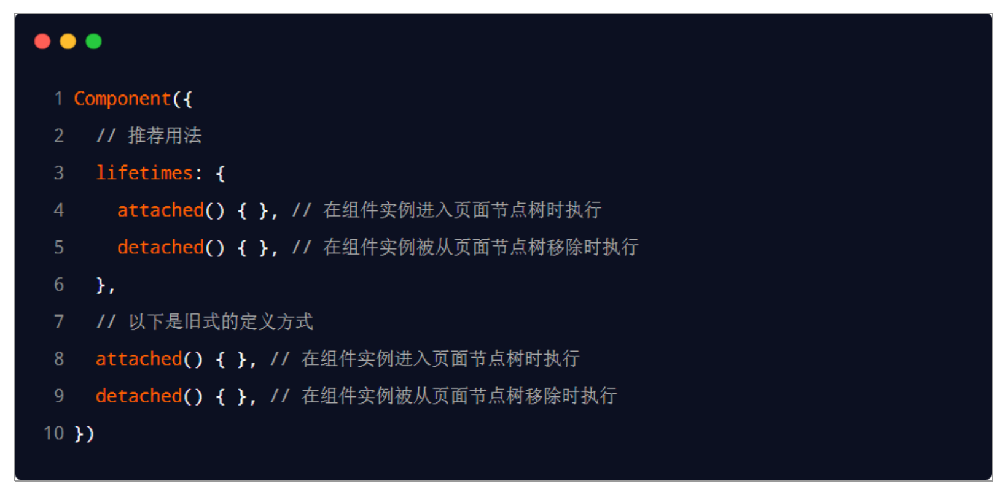
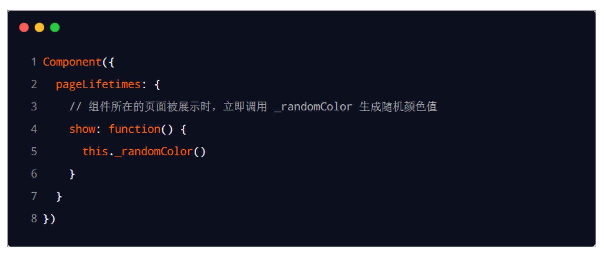
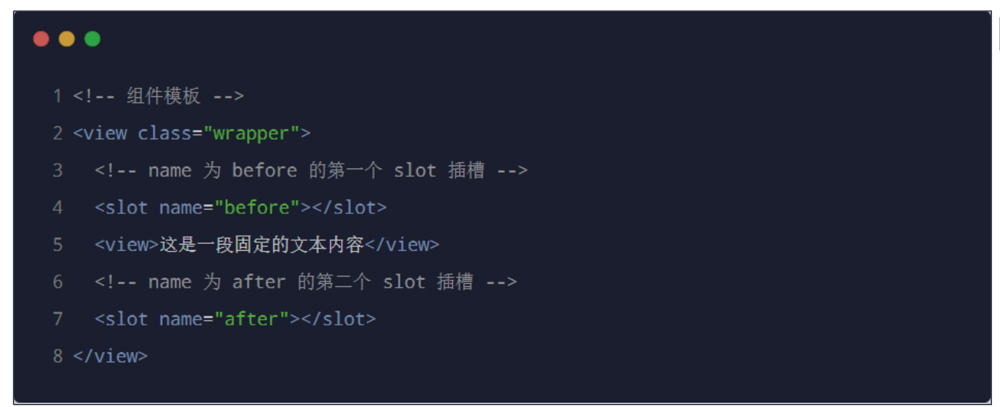
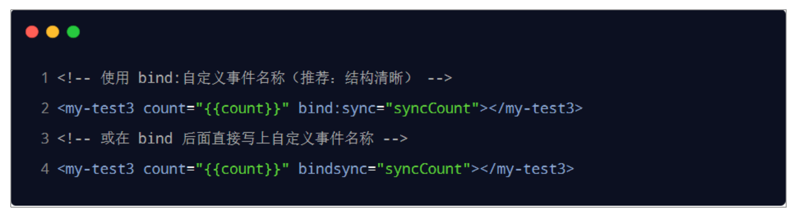

# 小程序进阶

## 1. 前言
> 学习目标: 
>
> 1. 能够知道如何自定义小程序组件
> 2. 能够知道小程序组件中 behaviors 的作用
> 3. 能够知道如何安装和配置 vant-weapp 组件库
> 4. 能够知道如何使用 MobX 实现全局数据共享
> 5. 能够知道如何对小程序的 API 进行 Promise 化

## 2. 自定义组件

### 2.1 **组件的创建与引用**

#### 1. 创建组件

① 在项目的根目录中，鼠标右键，创建 components -> test 文件夹

② 在新建的 components -> test 文件夹上，鼠标右键，点击“新建 Component” 

③ 键入组件的名称之后回车，会自动生成组件对应的 4 个文件，后缀名分别为 .js，.json， .wxml 和 .wxss


注意：为了保证目录结构的清晰，建议把不同的组件，存放到单独目录中，


#### 2. 引用组件

组件的引用方式分为“局部引用”和“全局引用”，顾名思义：

+ 局部引用：组件只能在当前被引用的页面内使用
+ 全局引用：组件可以在每个小程序页面中使用


#### **3. 局部引用组件**

在页面的 `.json` 配置文件中引用组件的方式，叫做“局部引用”。示例代码如下


#### 4. **全局引用组件**

在 `app.json` 全局配置文件中引用组件的方式，叫做“全局引用”。


#### 5. **全局引用 VS 局部引用**

根据组件的使用频率和范围，来选择合适的引用方式：

+ 如果某组件在多个页面中经常被用到，建议进行“全局引用”
+ 如果某组件只在特定的页面中被用到，建议进行“局部引用”


#### 6. **组件和页面的区别**

从表面来看，组件和页面都是由` .js`、`.json`、`.wxml` 和` .wxss` 这四个文件组成的。但是，组件和页面的` .js `与`.json `文件有明显的不同：

+ 组件的 `.json `文件中需要声明 "component": true 属性
+ 组件的` .js `文件中调用的是 Component() 函数
+ 组件的事件处理函数需要定义到 methods 节点中


### 2.2 **样式**

#### 1. **组件样式隔离**

默认情况下，自定义组件的样式只对当前组件生效，不会影响到组件之外的UI 结构，如图所示： 

<!--  -->

+ 组件 A 的样式不会影响组件 C 的样式
+ 组件 A 的样式不会影响小程序页面的样式
+ 小程序页面的样式不会影响组件 A 和 C 的样式

好处：

① 防止外界的样式影响组件内部的样式

② 防止组件的样式破坏外界的样式


#### 2. **组件样式隔离的注意点**

+ app.wxss 中的全局样式对组件无效
+ 只有 class 选择器会有样式隔离效果，id 选择器、属性选择器、标签选择器不受样式隔离的影响


建议：在组件和引用组件的页面中建议使用 class 选择器，**不要使用** id、属性、标签选择器！


#### 3. **修改组件的样式隔离选项**

默认情况下，自定义组件的样式隔离特性能够防止组件内外样式互相干扰的问题。但有时，我们希望在外界能够控制组件内部的样式，此时，可以通过 `styleIsolation` 修改组件的样式隔离选项，用法如下：


#### 4.  **styleIsolation 的可选值**

+ `isolated` 表示启用样式隔离，在自定义组件内外，使用 class 指定的样式将不会相互影响（一般情况下的默认值）
+ `apply-shared` 表示页面 wxss 样式将影响到自定义组件，但自定义组件 wxss 中指定的样式不会影响页面；
+ `shared` 表示页面 wxss 样式将影响到自定义组件，自定义组件 wxss 中指定的样式也会影响页面和其他设置了 `apply-shared` 或 `shared` 的自定义组件。


### 2.3 **数据、方法和属性**

#### 1. data数据

在小程序组件中，用于组件模板渲染的私有数据，需要定义到 `data` 节点中


#### 2. **methods 方法**

在小程序组件中，事件处理函数和自定义方法需要定义到 methods 节点中，示例代码如下：


#### **3. properties 属性**

在小程序组件中，properties 是组件的对外属性，用来接收外界传递到组件中的数据，示例代码如下：


#### 4. **data 和 properties 的区别**

在小程序的组件中，properties 属性和 data 数据的用法相同，它们都是可读可写的，只不过:

+ data 更倾向于存储组件的私有数据
+ properties 更倾向于存储外界传递到组件中的数据


#### **5. 使用 setData 修改 properties 的值**

由于 data 数据和 properties 属性在本质上没有任何区别，因此 properties 属性的值也可以用于页面渲染，或使用 setData 为 properties 中的属性重新赋值，示例代码如下：


### 2.4 **数据监听器**

#### 1. **什么是数据监听器**

数据监听器用于监听和响应任何属性和数据字段的变化，从而执行特定的操作。它的作用类似于 vue 中的

watch 侦听器。在小程序组件中，数据监听器的基本语法格式如下：


#### **2. 数据监听器的基本用法**

组件的 UI 结构如下：


组件的 JS 文件代码如下：


#### 3. **监听对象属性的变化**

数据监听器支持监听对象中单个或多个属性的变化，示例语法如下：


#### 4. 案例

<!--  -->


### 2.5 纯数据字段

#### 1. **什么是纯数据字段**

概念：纯数据字段指的是那些不用于界面渲染的 data 字段。


应用场景：例如有些情况下，某些 data 中的字段既不会展示在界面上，也不会传递给其他组件，仅仅在当前组件内部使用。带有这种特性的 data 字段适合被设置为纯数据字段。


好处：纯数据字段有助于提升页面更新的性能。


#### 2. **使用规则**

在 **Component** 构造器的 options 节点中，指定 **pureDataPattern** 为一个正则表达式，字段名符合这个正则表达式的字段将成为纯数据字段，示例代码如下：


#### 3. **使用纯数据字段改造数据监听器案例**


### 2.6 **组件的生命周期**

#### 1. **组件全部的生命周期函数**

组件的生命周期，指的是组件自身的一些函数，这些函数在特殊的时间点或遇到一些特殊的框架事件时被自动触发。

可用的全部生命周期如下表所示。

| 生命周期 | 参数           | 描述                                     | 最低版本                                                     |
| :------- | :------------- | :--------------------------------------- | :----------------------------------------------------------- |
| created  | 无             | 在组件实例刚刚被创建时执行               | [1.6.3](https://developers.weixin.qq.com/miniprogram/dev/framework/compatibility.html) |
| attached | 无             | 在组件实例进入页面节点树时执行           | [1.6.3](https://developers.weixin.qq.com/miniprogram/dev/framework/compatibility.html) |
| ready    | 无             | 在组件在视图层布局完成后执行             | [1.6.3](https://developers.weixin.qq.com/miniprogram/dev/framework/compatibility.html) |
| moved    | 无             | 在组件实例被移动到节点树另一个位置时执行 | [1.6.3](https://developers.weixin.qq.com/miniprogram/dev/framework/compatibility.html) |
| detached | 无             | 在组件实例被从页面节点树移除时执行       | [1.6.3](https://developers.weixin.qq.com/miniprogram/dev/framework/compatibility.html) |
| error    | `Object Error` | 每当组件方法抛出错误时执行               | [2.4.1](https://developers.weixin.qq.com/miniprogram/dev/framework/compatibility.html) |


#### 2. **组件主要的生命周期函数**

其中，最重要的生命周期是 `created` `attached` `detached` ，包含一个组件实例生命流程的最主要时间点。

+ 组件实例刚刚被创建好时， `created` 生命周期被触发。此时，组件数据 `this.data` 就是在 `Component` 构造器中定义的数据 `data` 。 **此时还不能调用 `setData` 。** 通常情况下，这个生命周期只应该用于给组件 `this` 添加一些自定义属性字段。
+ 在组件完全初始化完毕、进入页面节点树后， `attached` 生命周期被触发。此时， `this.data` 已被初始化为组件的当前值。这个生命周期很有用，绝大多数初始化工作可以在这个时机进行。
+ 在组件离开页面节点树后， `detached` 生命周期被触发。退出一个页面时，如果组件还在页面节点树中，则 `detached` 会被触发。


#### 3. **lifetimes** **节点**

在小程序组件中，生命周期函数可以直接定义在 Component 构造器的第一级参数中，可以在 lifetimes 字段内进行声明（这是推荐的方式，其优先级最高）。




### 2.7 **组件所在页面的生命周期**

#### 1. **什么是组件所在页面的生命周期**

有时，自定义组件的行为依赖于页面状态的变化，此时就需要用到组件所在页面的生命周期

例如：每当触发页面的 show 生命周期函数的时候，我们希望能够重新生成一个随机的 RGB 颜色值。

在自定义组件中，组件所在页面的生命周期函数有如下 3 个，分别是：

| 生命周期 | 参数          | 描述                         | 最低版本                                                     |
| :------- | :------------ | :--------------------------- | :----------------------------------------------------------- |
| show     | 无            | 组件所在的页面被展示时执行   | [2.2.3](https://developers.weixin.qq.com/miniprogram/dev/framework/compatibility.html) |
| hide     | 无            | 组件所在的页面被隐藏时执行   | [2.2.3](https://developers.weixin.qq.com/miniprogram/dev/framework/compatibility.html) |
| resize   | `Object Size` | 组件所在的页面尺寸变化时执行 | [2.4.0](https://developers.weixin.qq.com/miniprogram/dev/framework/compatibility.html) |


#### 2. **pageLifetimes** **节点**

组件所在页面的生命周期函数，需要定义在 pageLifetimes 节点中，示例代码如下：

**代码示例：**

```js
Component({
  pageLifetimes: {
    show: function() {
      // 页面被展示
    },
    hide: function() {
      // 页面被隐藏
    },
    resize: function(size) {
      // 页面尺寸变化
    }
  }
})
```

#### 

#### 3. **生成随机的 RGB 颜色值**




### 2.8 插槽

#### 1. **什么是插槽**

在自定义组件的 wxml 结构中，可以提供一个 `<slot>` 节点（插槽），用于承载组件使用者提供的 wxml 结构。


#### 2. **单个**插槽

在小程序中，默认每个自定义组件中只允许使用一个 `<slot>` 进行占位，这种个数上的限制叫做单个插槽。


#### 3. **启用**多个插槽

在小程序的自定义组件中，需要使用多 `<slot> `插槽时，可以在组件的 .js 文件中，通过如下方式进行启用。

示例代码如下：


#### 4. **定义多个插槽**

可以在组件的` .wxml `中使用多个` <slot> `标签，以不同的 name 来区分不同的插槽。示例代码如下：




#### 5. **使用**多个插槽

在使用带有多个插槽的自定义组件时，需要用 slot 属性来将节点插入到不同的 `<slot>` 中。示例代码如下：


### 2.9 **父子组件之间的通信**

#### 1. **父子组件之间通信的 3 种方式**

① 属性绑定

+ 用于父组件向子组件的指定属性设置数据，仅能设置 JSON 兼容的数据

② 事件绑定

+ 用于子组件向父组件传递数据，可以传递任意数据

③ 获取组件实例

+ 父组件还可以通过 this.selectComponent() 获取子组件实例对象
+ 这样就可以直接访问子组件的任意数据和方法


#### 2. **属性绑定**

属性绑定用于实现父向子传值，而且只能传递普通类型的数据，无法将方法传递给子组件。

父组件的示例代码:


子组件在 properties 节点中声明对应的属性并使用。示例代码如下


#### 3. **事件绑定**

事件绑定用于实现**子向父**传值，可以传递任何类型的数据。使用步骤如下：

① 在父组件的 js 中，定义一个函数，这个函数即将通过自定义事件的形式，传递给子组件


② 在父组件的 wxml 中，通过自定义事件的形式，将步骤 1 中定义的函数引用，传递给子组件



③ 在子组件的 js 中，通过调用` this.triggerEvent('自定义事件名称', { /* 参数对象 */ })` ，将数据发送到父组件


④ 在父组件的 js 中，通过 e.detail 获取到子组件传递过来的数据


#### 4. 获取组件实例

可在父组件里调用 `this.selectComponent("id或class选择器") `，获取子组件的实例对象，从而直接访问子组

件的任意数据和方法。调用时需要传入一个选择器，例如 `this.selectComponent(".my-component")。`


#### 5. 通过组件获取父组件实例

可在子组件里调用 `this.selectOwnerComponent() `，获取父组件的实例对象，从而直接访问父组

件的任意数据和方法。

``` js
this.selectOwnerComponent().setData({ testShow: false })
```


### 2.10 **behaviors**

#### 1. **什么是 behaviors**

behaviors 是小程序中，用于实现组件间代码共享的特性，类似于 Vue.js 中的 “mixins”。


#### 2.  **behaviors 的工作方式**

每个 behavior 可以包含一组属性、数据、生命周期函数和方法。组件引用它时，它的属性、数据和方法会被合并到组件中。

每个组件可以引用多个 behavior，behavior 也可以引用其它 behavior。


#### 3. **创建 behavior**

调用 `Behavior(Object object) `方法即可创建一个共享的 behavior 实例对象，供所有的组件使用：


#### 4. **导入并使用 behavior**

在组件中，使用 require() 方法导入需要的 behavior，挂载后即可访问 behavior 中的数据或方法，示例代码如下：


#### 5.  **behavior 中所有可用的节点**

| 定义段     | 类型         | 是否必填 | 描述                  | 最低版本 |
| :--------- | :----------- | :------- | :-------------------- | :------- |
| properties | Object Map   | 否       | 同组件的属性          |          |
| data       | Object       | 否       | 同组件的数据          |          |
| methods    | Object       | 否       | 同自定义组件的方法    |          |
| behaviors  | String Array | 否       | 引入其它的 `behavior` |          |
| created    | Function     | 否       | 生命周期函数          |          |
| attached   | Function     | 否       | 生命周期函数          |          |
| ready      | Function     | 否       | 生命周期函数          |          |
| moved      | Function     | 否       | 生命周期函数          |          |
| detached   | Function     | 否       | 生命周期函数          |          |


#### 6. **同名字段的覆盖和组合规则**

组件和它引用的 behavior 中可以包含同名的字段，此时可以参考如下 3 种同名时的处理规则：

① 同名的数据字段 (data)

- 若同名的数据字段都是对象类型，会进行对象合并；
- 其余情况会进行数据覆盖，覆盖规则为：组件 > `父 behavior` > `子 behavior` 、 `靠后的 behavior` > `靠前的 behavior`。（优先级高的覆盖优先级低的，最大的为优先级最高）

② 同名的属性 (properties) 或方法 (methods) 

1. 若组件本身有这个属性或方法，则组件的属性或方法会覆盖 `behavior` 中的同名属性或方法；
2. 若组件本身无这个属性或方法，则在组件的 `behaviors` 字段中定义靠后的 `behavior` 的属性或方法会覆盖靠前的同名属性或方法；
3. 在 2 的基础上，若存在嵌套引用 `behavior` 的情况，则规则为：`父 behavior` 覆盖 `子 behavior` 中的同名属性或方法。

③ 同名的生命周期函数

- 对于不同的生命周期函数之间，遵循组件生命周期函数的执行顺序；
- 对于同种生命周期函数，遵循如下规则：
  - `behavior` 优先于组件执行；
  - `子 behavior` 优先于 `父 behavior` 执行；
  - `靠前的 behavior` 优先于 `靠后的 behavior` 执行；
- 如果同一个 `behavior` 被一个组件多次引用，它定义的生命周期函数只会被执行一次。


关于详细的覆盖和组合规则，大家可以参考微信小程序官方文档给出的说明：

https://developers.weixin.qq.com/miniprogram/dev/framework/custom-component/behaviors.html


## 3. 使用npm包

### 3.1 **小程序对 npm 的支持与限制**

目前，小程序中已经支持使用 npm 安装第三方包，从而来提高小程序的开发效率。但是，在小程序中使用

npm 包有如下 3 个限制：

① 不支持依赖于 Node.js 内置库的包

② 不支持依赖于浏览器内置对象的包

③ 不支持依赖于 C++ 插件的包


总结：虽然 npm 上的包有千千万，但是能供小程序使用的包却“为数不多”。


### 3.2 **Vant Weapp**

#### 1. **什么是 Vant Weapp**

Vant Weapp 是有赞前端团队开源的一套小程序 UI 组件库，助力开发者快速搭建小程序应用。它所使用的是MIT 开源许可协议，对商业使用比较友好。


官网： https://vant-contrib.gitee.io/vant-weapp/#/home


#### 2. 安装Vant组件库

在小程序项目中，安装 Vant 组件库主要分为如下 3 步：

1. 通过 npm 安装（建议指定版本为@1.3.3）
2. 构建 npm 包 
3. 修改app.json

具体步骤： https://vant-contrib.gitee.io/vant-weapp/#/quickstart


#### 3. 使用Vant组件

安装完 Vant 组件库之后，可以在 `app.json` 的 `usingComponents `节点中引入需要的组件，即可在 `wxml` 中直接使用组件。示例代码如下：

``` json
// app.json
"usingComponents": {
  "van-button": "@vant/weapp/button/index"
}
```

``` html
<!-- wxml -->
<van-button type="primary">按钮</van-button>
```


#### 4. **定制全局主题样式**

Vant Weapp 使用 CSS 变量来实现定制主题。 关于 CSS 变量的基本用法，请参考 MDN 文档：

https://developer.mozilla.org/zh-CN/docs/Web/CSS/Using_CSS_custom_properties

在 app.wxss 中，写入 CSS 变量，即可对全局生效：


所有可用的颜色变量，请参考 Vant 官方提供的配置文件：

https://github.com/youzan/vant-weapp/blob/dev/packages/common/style/var.less


### 3.3 **API Promise化**

#### 1. **基于回调函数的异步 API 的缺点**

默认情况下，小程序官方提供的异步 API 都是基于回调函数实现的，例如，网络请求的 API 需要按照如下的方式调用：


缺点：容易造成回调地狱的问题，代码的可读性、维护性差！


#### 2. **什么是 API Promise 化**

**API Promise化**，指的是通过额外的配置，将官方提供的、基于回调函数的异步 API，升级改造为基于Promise 的异步 API，从而提高代码的可读性、维护性，避免回调地狱的问题。


#### 3. **实现 API Promise 化**

在小程序中，实现 API Promise 化主要依赖于` miniprogram-api-promise `这个第三方的 npm 包。

它的安装和使用步骤如下：

+ 安装

```bash
npm install --save miniprogram-api-promise
```

+ 配置

``` js
import { promisifyAll } from 'miniprogram-api-promise';

const wxp = {}
// promisify all wx's api
promisifyAll(wx, wxp)
```

+ 使用

``` js
wxp.getSystemInfo().then(console.log)
wxp.showModal().then(wxp.openSetting())
```


## 4. 全局数据共享

### 4.1 介绍

#### 1. **什么是全局数据共享**

全局数据共享（又叫做：状态管理）是为了解决组件之间数据共享的问题。

开发中常用的全局数据共享方案有：`Vuex、Redux、MobX `等。


#### 2. **小程序中的全局数据共享方案**

在小程序中，可使用 `mobx-miniprogram` 配合 `mobx-miniprogram-bindings` 实现全局数据共享。其中:

+ `mobx-miniprogram` 用来创建 Store 实例对象
+ `mobx-miniprogram-bindings `用来把 Store 中的共享数据或方法，绑定到组件或页面中使用

<!--  -->

### 4.2 MobX

#### 1. **安装 MobX 相关的包**

在项目中运行如下的命令，安装 MobX 相关的包：

``` bash
npm install --save mobx-miniprogram mobx-miniprogram-bindings
```

注意：MobX 相关的包安装完毕之后，记得删除 `miniprogram_npm` 目录后，重新构建 npm。


#### 2. **创建 MobX 的 Store 实例**

**store.js**

``` js
// store.js
import { observable, action } from "mobx-miniprogram";

export const store = observable({
  // 数据字段
  numA: 1,
  numB: 2,

  // 计算属性
  get sum() {
    return this.numA + this.numB;
  },

  // actions
  update: action(function () {
    const sum = this.sum;
    this.numA = this.numB;
    this.numB = sum;
  }),
});
```


#### 3. **将 Store 中的成员绑定到页面**中

``` js
import { createStoreBindings } from "mobx-miniprogram-bindings";
import { store } from "./store";

Page({
  data: {
    someData: "...",
  },
  onLoad() {
    this.storeBindings = createStoreBindings(this, {
      store,
      fields: ["numA", "numB", "sum"],
      actions: ["update"],
    });
  },
  onUnload() {
    this.storeBindings.destroyStoreBindings();
  },
  myMethod() {
    this.data.sum; // 来自于 MobX store 的字段
  },
});
```


#### 4. **在页面上使用 Store 中的成员**

``` html
<!-- 页面的 wxml结构 -->
<view>{{numA}}  + {{numB}} = {{sum}}</view>
<van-button type="primary" bindtap="btnHander1" data-step="{{1}}">numA + 1</van-button>
<van-button type="primary" bindtap="btnHander1" data-setp="{{-1}}">numA - 1</van-button>

// 处理函数
btnHander1 (e) {
	this.updateNum1(e.target.dataset.step)
}
```


#### 5. 将 Store 中的成员绑定到组件中

``` js
import { storeBindingsBehavior } from "mobx-miniprogram-bindings";
import { store } from "./store";

Component({
  behaviors: [storeBindingsBehavior],
  data: {
    someData: "...",
  },
  storeBindings: {
    store,
    fields: {
      numA: () => store.numA,
      numB: (store) => store.numB,
      sum: "sum",
    },
    actions: {
      buttonTap: "update",
    },
  },
  methods: {
    myMethod() {
      this.data.sum; // 来自于 MobX store 的字段
    },
  },
});
```


#### 6.  **在组件中使用 Store 中的成员**

``` html
<!-- 页面的 wxml结构 -->
<view>{{numA}}  + {{numB}} = {{sum}}</view>
<van-button type="primary" bindtap="btnHander1" data-step="{{1}}">numA + 1</van-button>
<van-button type="primary" bindtap="btnHander1" data-setp="{{-1}}">numA - 1</van-button>

// 处理函数
btnHander1 (e) {
	this.updateNum1(e.target.dataset.step)
}
```


## 5. 分包

### 5.1 基本概念

#### 1. **什么是分包**

分包指的是把一个完整的小程序项目，按照需求划分为不同的子包，在构建时打包成不同的分包，用户在使用时按需进行加载。


#### 2. **分包的好处**

对小程序进行分包的好处主要有以下两点：

+ 可以优化小程序首次启动的下载时间
+ 在多团队共同开发时可以更好的解耦协作


#### 3. **分包前项目的构成**

分包前，小程序项目中**所有的页面**和**资源**都被打包到了一起，导致整个项目体积过大，影响小程序首次启动的下载时间。


#### 4. **分包后项目的构成**

分包后，小程序项目由 1 个主包 + 多个分包组成：

+ 主包：一般只包含项目的启动页面或 TabBar 页面、以及所有分包都需要用到的一些公共资源
+ 分包：只包含和当前分包有关的页面和私有资源


#### 5. **分包的加载规则**

① 在小程序启动时，默认会下载主包并启动主包内页面

+ tabBar 页面需要放到主包中

② 当用户进入分包内某个页面时，客户端会把对应分包下载下来，下载完成后再进行展示

+ 非 tabBar 页面可以按照功能的不同，划分为不同的分包之后，进行按需下载


#### 6. **分包的体积限制**

目前，小程序分包的大小有以下两个限制：

+ 整个小程序所有分包大小不超过 16M（主包 + 所有分包）
+ 单个分包/主包大小不能超过 2M


### 5.2 **使用分包**

#### 1. **配置方法**


#### 2. **打包原则**

① 小程序会按 subpackages 的配置进行分包，subpackages 之外的目录将被打包到主包中

② 主包也可以有自己的 pages（即最外层的 pages 字段）

③ tabBar 页面必须在主包内

④ 分包之间不能互相嵌套


#### 3. **引用原则**

① 主包无法引用分包内的私有资源

② 分包之间不能相互引用私有资源

③ 分包可以引用主包内的公共资源


### 5.3 **独立分包**

#### 1. **什么是独立分包**

独立分包本质上也是分包，只不过它比较特殊，可以独立于主包和其他分包而单独运行。


#### 2. **独立分包和普通分包的区别**

最主要的区别：是否依赖于主包才能运行

+ 普通分包必须依赖于主包才能运行
+ 独立分包可以在不下载主包的情况下，独立运行


#### 3. **独立分包的应用场景**

开发者可以按需，将某些具有一定功能独立性的页面配置到独立分包中。原因如下：

+ 当小程序从普通的分包页面启动时，需要首先下载主包
+ 而独立分包不依赖主包即可运行，可以很大程度上提升分包页面的启动速度

**注意：一个小程序中可以有多个独立分包。**


#### 4. **独立分包的配置方法**


#### 5. **引用原则**

独立分包和普通分包以及主包之间，是相互隔绝的，不能相互引用彼此的资源！例如：

① 主包无法引用独立分包内的私有资源

② 独立分包之间，不能相互引用私有资源

③ 独立分包和普通分包之间，不能相互引用私有资源

**④ 特别注意：**独立分包中不能引用主包内的公共资源


### 5.4 **分包预下载**

#### 1. **什么是分包预下载**

分包预下载指的是：在进入小程序的某个页面时，**由框架自动预下载可能需要的分包**，从而提升进入后续分包页面时的启动速度。


#### 2.  **配置分包的预下载**

预下载分包的行为，会在进入指定的页面时触发。在 `app.json` 中，使用 preloadRule 节点定义分包的预下载规则，示例代码如下：


#### 3. **分包预下载的限制**

同一个分包中的页面享有共同的预下载大小限额 2M，例如：


## 6. 案例： 自定义tabBar

### 6.1 **案例效果**

在此案例中，用到的主要知识点如下：

+ 自定义组件

+ Vant 组件库
+ MobX 数据共享

+ 组件样式隔离

+ 组件数据监听器

+ 组件的 behaviors

+ Vant 样式覆盖


### 6.2 **实现步骤**

自定义 tabBar 分为 3 大步骤，分别是：

① 配置信息

② 添加 tabBar 代码文件

③ 编写 tabBar 代码

详细步骤，可以参考小程序官方给出的文档：

https://developers.weixin.qq.com/miniprogram/dev/framework/ability/custom-tabbar.html

