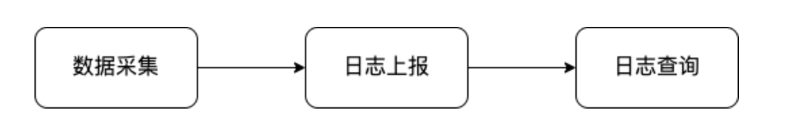
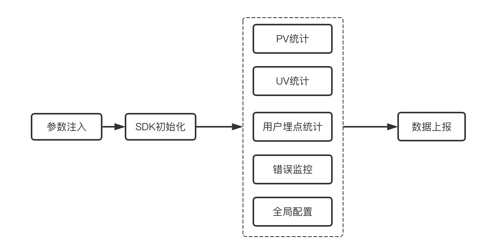
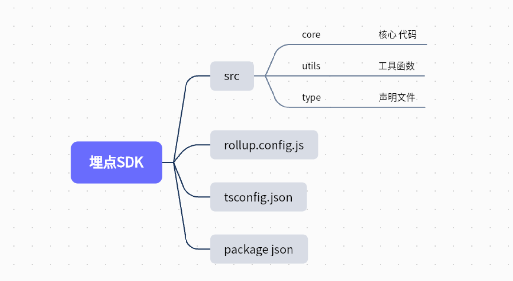
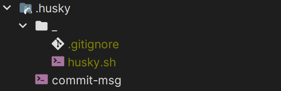
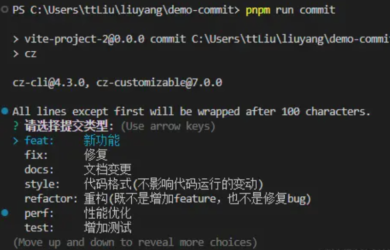
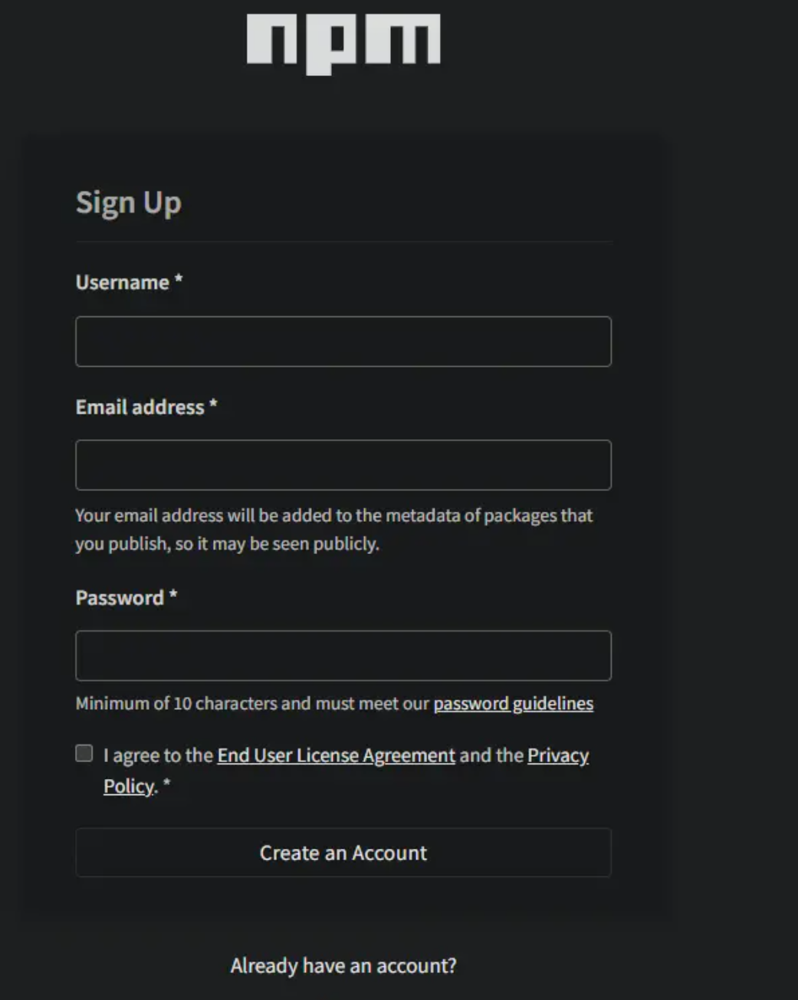
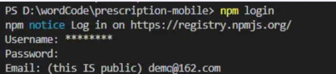

# 前端监控

> 课程介绍:  
>
> ​	 本次课程主要介绍前端如何在项目中实现错误监控、日志埋点、PV/UV统计以及 从0实现前端监控SDK并发布至NPM
>
> ​	项目将使用TS + Rollup作为核心构建，并严格遵循commit规范进行项目管理
>
> 作者： mouzhacu


## 一、背景

**思考一下，我们的项目代码在上线之后是不是就不用管了呢？**

并不是，作为前端开发工程师，我们是直接跟用户打交道的，一个应用的用户留存率跟这个应用的稳定性有很大的关系，因为监控能让我们快速的发现并解决问题，所以一个系统的监控体系越完善这个系统就越稳定。

所以不光**后端要对接口做监控**，前端的监控也显得很重要。


对于我们来说，学习如何做前端的监控一方面可以拓宽我们的知识面，另一方面可以在面试的时候加分，让面试官觉得我们不只是在公司整天的写业务代码，也有技术上的产出，不至于面试的时候问到这方面的问题完全摸不着头脑。


### 怎么做？

+ 接入现成的
  + sentry https://docs.sentry.io/    免费、国外
  + fundebug https://www.fundebug.com/   收费、国内
+ 自己封装


### 需要监控什么？

+ 错误统计

  首先，我们的代码发布到线上总是会发生奇奇怪怪的错误，错误原因也五花八门，可能是浏览器兼容问题，可能是代码里面没做兜底，也可能是后端接口挂掉了等等错误，可能随便一个错误都会影响用户的使用，所以对线上进行错误监控显的尤为重要，能够让我们第一时间去响应报错并解决。

+ 行为日志埋点

  对于一些常见的电商app，比如淘宝，都有一套自己的用户行为分析的系统，分析用户浏览时间比较长的页面有哪些，常点击的按钮有哪些等等行为，通过分析用户的这些行为去制定不同的策略引导你购物，这些都可以通过前端埋点去实现对用户行为的监控。

+ PV/UV统计

  我们上线那么多的前端页面，肯定特别想知道我们的用户对哪个页面的访问次数比较多，也想知道每天有多少的用户访问我们的系统，这就需要用到PV,UV的统计


所以我们系统的设计就主要围绕上面着三点进行设计，主要流程如下：



**数据采集**: 数据采集做的就是采集我们系统的监控数据，包括PV,UV和用户行为及前端报错的数据。

**日志上报**: 上报做的就是将第一步采集到的数据发送到服务端。

**日志查询**: 这一步就是在后台查询我们采集并上报的数据，方便对系统进行分析。


本次课程就是主要对前两部分的实现


### 功能拆分




## 二、 构建项目

本次项目技术架构使用 ts + rollup

> 使用ts主要是在编译过程中发现问题，减少生产代码的错误
>
> 使用rollup 应为 rollup打包干净，而webpack非常臃肿，可读性差，所以rollup非常适合开发SDK和一些框架，webpack 适合开发一些项目


### 目录结构设计



1. 创建项目 命名为 `monitor-sdk`

2. 创建对应目录以及项目文件

   ``` js
   npm init -y  创建package.json
   tsc init  创建tsconfig.json
   ```


### 安装开发依赖

``` bash
npm install rollup -D
npm install rollup-plugin-dts -D
npm install rollup-plugin-typescript2 -D
npm install typescript -D
```

**rollup-plugin-dts 生成dts文件**

**rollup-plugin-typescript2 打包ts文件**


### 配置`rollup.config.js`

``` js
const path = require('path')
const dts = require('rollup-plugin-dts').default
const ts = require('rollup-plugin-typescript2')

const resolve = (url) => path.resolve(__dirname, url)

module.exports = [
  // 打包TS
  {
    input: './src/core/index.ts',
    output: [
      // ES   import / export
      { file: resolve('build/index.esm.js'), format: 'esm' },
      // umd  browser
      { file: resolve('build/index.js'), format: 'umd', name: 'monitorSdk' },
      // cjs  require / export
      { file: resolve('build/index.cjs.js'), format: 'cjs' },
    ],
    // 配置监听处理
    watch: {
      exclude: 'node_modules/**',
    },
    plugins: [ts()],
  },
  // 生成DTS描述文件
  {
    input: './src/core/index.ts',
    output: [{ file: resolve('build/index.d.ts'), format: 'es' }],
    plugins: [dts()],
  },
]
```


### 配置`package.json`

配置一些打包脚本以及基础信息修改

``` json
{
  "author": "mouzhacu <mouzhacu@163.com> (https://github.com/zzz412)",
  "name": "z-monitor-sdk",
  "version": "1.0.0",
  "description": "前端监控SDK 适用于各类场景支持: vue、react",
  // 项目主入口
  "main": "build/index.js",
  // 项目esm入口
  "module": "build/index.esm.js",
  "scripts": {
    "serve": "rollup -c -w",
    "build": "rollup -c",
  },
  // 关键词
  "keywords": [
    "react",
    "vue",
    "typescript",
    "monitor",
    "tracker"
  ],
  "license": "ISC",
}
```


## 三、 错误监控

>前端是直接和用户打交道的，前端页面报错是很影响用户体验一件事，即使在测试充分后上线也会因为用户的操作行为以及操作的环境出现各种各样的错误，所以，不光是后端需要加报警监控，前端的错误监控也很重要。

### 初始化

初始化其实很简单，就是获取用户传过来的参数，然后调用我们的初始化函数就可以了，在初始化函数中，我们可以注入一些监听事件来实现数据统计的功能。

**src/core/index.ts**

``` ts
//  初始化配置  【加载配置、载入配置】
function init(options: Options) {
    // 需要的配置: appid系统ID userId用户ID deary合并延迟时间
    new Tracker(options)
}
```

**src/types/core.ts**

``` ts
/**
 * 配置类型
 * @appId 系统ID
 * @userId 用户ID
 * @delay 合并间隔时长
 * @requestUrl 接口地址
 * @historyTracker history上报
 * @hashTracker hash上报
 * @domTracker 携带Tracker-key 点击事件上报
 * @historyTracker sdkVersion sdk版本
 * @jsError js 和 promise 报错异常上报
 * @sdkVersion SDK版本
 * @historyTracker extra 透传字段
 */
export interface DefaultOptions {
  appId: string
  userId: string
  requestUrl: string | undefined
  delay: number
  historyTracker: boolean
  hashTracker: boolean
  domTracker: boolean
  jsError: boolean
  skdVersion: string | number
  extra: Record<string, any> | undefined
}

export interface Options extends Partial<DefaultOptions> {
  appId: string
  userId: string
  requestUrl: string
}

// * 版本枚举
export enum TrackerConfig {
  version = '1.0.0',
}
```

**src/core/Tracker.ts**

``` ts
export default class Tracker {
  public data: Options
  private version: string | undefined

  public constructor(options: Options) {
    // 将默认配置与传入配置合并
    this.data = Object.assign(this.defaultOptions(), options)
    this.installInnerTrack()
  }

  // * 默认配置
  private defaultOptions(): DefaultOptions {
    this.version = TrackerConfig.version
    return <DefaultOptions>{
      delay: 0,
      skdVersion: this.version,
      historyTracker: false,
      hashTracker: false,
      domTracker: false,
      jsError: false,
    }
  }

  // * 加载配置
  private installInnerTrack() {
	// ---------- 后期需要加载的配置都在这里进行 --------
    // 开启错误监控
    if (this.data.jsError) {
      errorTrackerReport()
    }
  }
}
```


### 错误类型

分析前端可能出现的错误类型

1. 语法错误

   语法错误一般在可发阶段就可以发现，比如常见的单词拼写错误，中英文符号错误等。注意：语法错误是无法被`try catch`捕获的，因为在开发阶段就能发现，所以一般不会发布到线上环境。

   ``` ts
   try {
     let name = 'zzz; // 少一个单引号
     console.log(name);
   } catch (error) {
     console.log('----捕获到了语法错误-----');
   }
   ```

   

2. 同步错误

   同步错误指的是在js同步执行过程中的错误，比如变量未定义，是可以被try catch给捕获到的

   ``` ts
   try {
     const name = 'zzz';
     console.log(nam);
   } catch (error) {
     console.log('------同步错误-------')
   }
   ```

   

3. 异步错误

   异步错误指的是在setTimeout等函数中发生的错误，是无法被try catch捕获到的

   ``` ts
   try {
     setTimeout(() => {
       undefined.map();
     }, 0);
   } catch (error) {
     console.log('-----异步错误-----')
   }
   ```

   异步错误的话我们可以用`error`事件来进行处理，这个方法比try catch要强大很多

   

4. promise错误

   在 `promise` 中使用 `catch` 可以捕获到异步的错误，但是如果没有写 `catch` 去捕获错误的话 

   `window.onerror` 也捕获不到的，所以写 `promise` 的时候最好要写上 `catch` ，或者可以在全局加上 

   `unhandledrejection` 的监听，用来监听没有被捕获的promise错误。

   ``` ts
   window.addEventListener("unhandledrejection", function(error){
     console.log('捕获到异常：', error);
   }, true);
   ```

   

5. 资源加载错误

   资源加载错误指的是比如一些资源文件获取失败，可能是服务器挂掉了等原因造成的，出现这种情况就比较严重了，所以需要能够及时的处理，网路错误一般用 `window.addEventListener` 来捕获。

   ``` js
   window.addEventListener('error', (error) => {
     console.log(error);
   }, true);
   ```


>所以SDK错误监控的实现，就是围绕这几种错误实现的。 
>
>`try-catch` 用来在可预见情况下监控特定的错误，
>
>`window.onerror` 主要是来捕获预料之外的错误，比如异步错误。但是 `window.onerror` 也并不是万能的，它可以捕获语法，同步，异步的错误，但是对于promise错误以及网络错误还是无能为力，所以还需要 
>
>`unhandledrejection` 监听来捕获promise错误，
>
>最后，再加上 `error` 监听捕获资源加载的错误就能将各种类型的错误全覆盖了。


### 代码实现

+ 全局错误捕获

**src/core/errorTracker.ts**

``` ts
export interface ResourceElement extends HTMLElement {
  src: string
  href: string
}

/**
 * 全局错误捕获【自动捕获并上报】
 */
export function errorTrackerReport() {
  // * 资源错误
  function resourceErrorTracker(e: ErrorEvent) {
    let target = e.target as ResourceElement
    const log = <ErrorReport>{
      message: `加载 ${target.tagName} 资源错误`,
      file: target.src || target.href,
      errorType: 'resourceError',
    }
    console.log('资源错误上报数据', log)
    // lazyReport('error', log)
  }

  // ----  js error --- 同步错误、资源错误
  window.addEventListener(
    'error',
    (e) => {
      // 判断是否为资源错误
      const target = e.target
      const isElementTarget =
        target instanceof HTMLScriptElement ||
        target instanceof HTMLLinkElement ||
        target instanceof HTMLImageElement
      if (isElementTarget) return resourceErrorTracker(e)

      const log = <ErrorReport>{
        errorType: 'jsError',
        message: e.message,
        file: e.filename,
        col: e.colno,
        row: e.lineno,
        error: e.error,
      }
      console.log('JS错误上报数据', log)
      // lazyReport('error', log)
    },
    true
  )

  // ---- Promise Error ---- 异步错误Promise
  window.addEventListener('unhandledrejection', (e) => {
    const log = <ErrorReport>{
      errorType: 'promiseError',
      error: e as unknown,
      message: e.reason,
    }
    console.log('Promise错误上报数据', log)
    // lazyReport('error', log)
  })
}
```

**src/types/core.ts**

``` ts
// * 错误上报数据格式
export interface DefaultErrorReport {
  message: string
  file: string
  row: string | number
  col: string | number
  error: string
  errorType: string
}

export interface ErrorReport extends Partial<DefaultErrorReport> {
  errorType: string
  message: string
  fill: string
}
```

+ 手动捕获错误

``` ts
export function errorCatcher(error: string, msg: string) {
  const log = <ErrorReport>{
    message: msg,
    error,
    errorType: 'catchError',
  }
  // console.log('手动捕获错误上报数据', log)
  lazyReport('error', log)
}
```


## 四、用户埋点统计

>埋点是监控用户在我们应用上的一些动作表现.
>
>是不是经常感觉有些应用推荐的内容都是自己感兴趣的，这就是埋点这个“内鬼”在搞怪，比如你在淘宝上的某类型的鞋子的页面浏览了几分钟，那么就会有一个“张三在2022-7-16 15:30 搜索了某款运动鞋并浏览了十分钟”的记录的上报，后台就可以根据这些上报的数据去分析用户的行为，并且制定之后推送或者产品的迭代优化等，对于产品后续的发展起着重要作用。
>
>**埋点又分为手动埋点和无痕埋点。**

### 手动埋点

手动埋点就是手动的在代码里面添加相关的埋点代码，比如用户点击某个按钮，就在这个按钮的点击事件中加入相关的埋点代码，或者提交了一个表单，就在这个提交事件中加入埋点代码。

``` jsx
// 方式1
<button
  onClick={() => {
    // 业务代码
  	tracker('click', '用户去支付');
    // tracker('visit', '访问新页面');
    // tracker('submit', '提交表单');
  }}
>手动埋点</button>
```

``` jsx
// 方式2
<button 
	data-target="支付按钮"
	onClick={() => {
    // 业务代码
  }}
>手动上报</button>
```

+ 优点：可控性强，可以自定义上报具体的数据。
+ 缺点：对业务代码侵入性强，如果有很多地方需要埋点就得一个一个手动的去添加埋点代码。


### 无痕埋点

无痕埋点是为了解决手动埋点的缺点，实现一种不用侵入业务代码就能在应用中添加埋点监控的埋点方式。

``` jsx
<button onClick={() => {
  // 业务代码
}}>自动埋点</button>
```

- 优点：不用侵入务代码就能实现全局的埋点。
- 缺点：只能上报基本的行为交互信息，无法上报自定义的数据；上报次数多，服务器性能压力大。


### 代码实现

`src/core/actionTracker.ts`

+ **手动埋点**

``` ts
/**
 * 手动上报【手动埋点】
 */
export function actionCatcher(actionType: string, data: unknown) {
  const log = {
    actionType,
    data,
  }
  console.log('手动埋点上报---', log)
  // lazyReport('action', log)
}
```

+ **无痕埋点**

``` ts
/**
 * 自动上报【无痕埋点】
 */
export function autoTrackerReport() {
  // 自动上报【只埋点用户点击行为】
  document.body.addEventListener(
    'click',
    function (e) {
      const clickDOM = e.target as HTMLElement

      // 获取标签上的data-target属性的值
      let target = clickDOM.getAttribute('data-target')

      // 获取标签上data-no属性的值
      let no = clickDOM.getAttribute('data-no')

      // 避免重复上报
      if (no !== null) return

      if (target) {
        // 取出target的值作为上报内容
        const log = { actionType: 'click', data: target }
        console.log('自动埋点上报内容(data值)---', log)
        // lazyReport('action', log)
      } else {
        // 使用通用值作为上报内容
        const path = getPathTo(clickDOM)
        const log = { actionType: 'click', data: path }
        console.log('自动埋点上报内容(默认值)---', log)
        //lazyReport('action', log)
      }
    },
    false
  )
}
```

**src/utils/utils.ts** 

``` ts
/**
 * 获取元素的dom路径
 * @param {*} element
 * @returns
 */
export function getPathTo(element: HTMLElement): string | undefined {
  if (element.id !== '') return '//*[@id="' + element.id + '"]'
  if (element === document.body) return element.tagName
  let ix = 0
  let siblings = element.parentElement!.children
  for (let i = 0; i < siblings.length; i++) {
    let sibling = siblings[i]
    if (sibling === element)
      return (
        getPathTo(element.parentElement as HTMLElement) + '/' + element.tagName + '[' + (ix + 1) + ']'
      )
    if (sibling?.nodeType === 1 && sibling.tagName === element.tagName) ix++
  }
}

//*[@id="root"]/DIV[1]/DIV[2]/BUTTON[1]
```


## 五、PV/UV统计

> PV即页面浏览量，用来表示该页面的访问数量     UV统计的是一天内访问该网站的用户数

在SPA应用之前只需要监听 `onload` 事件即可统计页面的PV，在SPA应用中，页面路由的切换完全由前端实现，主

流的react和vue框架都有自己的路由管理库，而单页路由又区分为 `hash` 路由和 `history` 路由，两种路由的原理

又不一样，所以统计起来会有点复杂。我们这里将分别针对两种路由来实现不同的采集数据的方式。

### history路由

history路由依赖全局对象 `history` 实现的

- history.back(); // 返回上一页，和浏览器回退功能一样
- history.forward(); // 前进一页，和浏览器前进功能一样
- history.go(); // 跳转到历史记录中的某一页, eg: history.go(-1); history.go(1)
- history.pushState(); // 添加新的历史记录
- history.replaceState(); // 修改当前的记录项

history路由的实现主要依赖的就是 `pushState` 和 `replaceState` 来实现的，但是这两种方法不能被 `popstate` 监听到，所以需要对这两种方法进行重写来实现数据的采集。


### hash路由

url上hash的改变会出发 `hashchange` 的监听，所以我们只需要在全局加上一个监听函数，在监听函数中实现采集

并上报就可以了。但是在react和vue中，对于hash路由的跳转并不是通过 `hashchange` 的监听实现的，而是通过 

`pushState` 实现，所以，还需要加上对 `pushState` 的监听才可以。


### 代码实现

`src/core/pageTracker.ts`

+ 重写pushState方法和replaceState方法

**utils.ts**

``` ts
/**
 * 重写pushState方法和replaceState方法
 */
export  function createHistoryEvent<T extends keyof History>(type: T) {
  const origin = window.history[type]
  return function (this: any) {
    const res = origin.apply(this, arguments)
    const e = new Event(type)
    window.dispatchEvent(e)
    return res
  }
}
```


+ 添加 **History** 路由监听

``` ts
/**
 * history路由监听 【路由原pushState replaceState 部分浏览器监听不到】
 */
export function historyPageTrackerReport() {
    // 1. 替换pushState replaceState
    window.history.pushState = createHistoryEvent('pushState')
    window.history.replaceState = createHistoryEvent('replaceState')

    // 2. 监听事件 页面跳转、页面替换、页面前进后退、页面加载、页面卸载
    const eventList = ['pushState', 'replaceState', 'popstate', 'load', 'unload']

    pageTrackerReport(eventList)
}
```


+ **页面监听器函数**

``` ts
function pageTrackerReport(eventList: string[]) {
    // 记录初始记录
    let beforePage = '' // 上一个页面
    let beforeTime = Date.now() // 进入页面时间

    // 计算页面停留时间
    function getStayTime() {
        const currentTime = Date.now()
        const stayTime = currentTime - beforeTime
        beforeTime = currentTime
        return stayTime
    }

    function listener() {
        const stayTime = getStayTime() // 停留时间
        const currentPage = window.location.href // 当前页面路径
        
        // 上报数据
        console.log({page: beforePage, stayTime})
        // lazyReport('visit', {page: beforePage, stayTime})
        beforePage = currentPage
    }

    captureEvents(eventList, listener)
}
```


+ **连续绑定事件**

``` ts
/**
 * 连续绑定事件
 */
export function captureEvents(eventList: string[], handler: () => void) {
  eventList.forEach(event => {
    window.addEventListener(event, () => {
      handler && handler()
    })
  })
}
```


+ **hash路由监听**

``` ts
/**
 * hash路由监听
 */
export function hashPageTrackerReport() {
    // 【vue、react的routerHash模式还是触发pushState】
    window.history.pushState = createHistoryEvent('pushState')

    // 1. 监听事件 pushState、hash变化、页面加载、页面卸载、前进后退
    const eventList = ['pushState', 'hashchange', 'load', 'popstate', 'unload' ]
    pageTrackerReport(eventList)
}
```


+ **加载配置函数** `Tracker.ts`

``` ts
// * 加载配置
  private installInnerTrack() {
    // 1. 开启history模式
    if (this.data.hashTracker) {
      hashPageTrackerReport()
    }
    // 2. 开启hash模式
    if (this.data.historyTracker) {
      historyPageTrackerReport()
    }
    // 3. 开启无痕埋点
    if (this.data.domTracker) {
      autoTrackerReport()
    }
    // 4. 开启错误监控
    if (this.data.jsError) {
      errorTrackerReport()
    }
  }
```


### UV统计

uv统计比较简单，就只需要在SDK初始化的时候上报一条消息就可以了

``` ts
//  初始化配置
function init(options: Options) {
    // 需要的配置: appid系统ID userId用户ID deary合并延迟时间
    new Tracker(options)

    // ------UV统计------  页面初始化时就发送UV
    console.log({message: '加载应用'})
    // lazyReport('user', {message: '加载应用'})
}

```


## 六、数据上报

> 数据上报即将收集的数据通过网络请求  发送给服务器端由服务器端进行保存与分析统计

### 上报方式

1. xhr接口请求

   采用接口请求的方式是最简单的，就跟请求其他业务接口一样，只不过上传的是埋点的数据。但是在通常的

   情况下，一般在公司里面处理埋点的服务器和处理业务逻辑的处理器不是同一台，所以还需要手动解决跨域

   的问题，另一方面，如果在上报的过程中刷新或者重新打开新页面，可能会造成埋点数据的缺失，所以传统

   的xhr接口请求的方式并不能很好的适应埋点的需求。

   

2. img标签

   img标签的方式是通过将埋点数据伪装成图片URL的请求方式，这样就避免了跨域的问题，但是因为浏览器对

   url的长度会有限制，所以通过这种方式上报不适合大数据量上报的场景，而且也会存在刷新或者打开页面的

   时候上报的数据丢失的情况。

   

3. sendBeacon

   鉴于以上两种方式的缺点，sendBeacon应运而生了，sendBeacon可以说是为埋点量身定做的，这种方式不会有跨域的限制。

   也不会存在因为刷新页面等情况造成数据丢失的情况，唯一的缺点就是在某些浏览器上存在兼容性的问题，所以在日常的开发场景中，通常采用sendBeacon上报和img标签上报结合的方式


### 代码实现

`src/core/report.ts`

``` ts
/**
 * 上报API
 */
export function report(data: string[]) {
  const url = window._monitor_request_url
  // 上报方式:  1. ajax请求【跨域、增加请求量】  2. navigator请求【即使页面关闭了也会发送】 3. img【不会跨域、请求量少】
  // ---- navigator ---
  if (navigator.sendBeacon) {
    // 支持navigator的浏览器 【只能发送字符串格式】
    navigator.sendBeacon(url, JSON.stringify(data))
  } else {
    // 不支持navigator的浏览器
    const oImage = new Image()
    oImage.src = `${url}?logs=${data}`
  }
  // 后期加了合并
  // clearCache()
}
```

`src/core/Traker.ts`  注入请求路径

``` ts
// * 加载配置
  private installInnerTrack() {
    const { requestUrl, userId, appId, delay } = this.data
    // -----系统ID-----
    if (appId) {
      window['_monitor_app_id_'] = appId
    }
    // --- userId --
    if (userId) {
      window['_monitor_user_id_'] = userId
    }
    // --- 合并上报的间隔 --
    if (delay) {
      window['_monitor_delay_'] = delay
    }
    // -----服务端地址------
    if (requestUrl) {
      window['_monitor_request_url'] = requestUrl
    }
    // 1. 开启history模式
    if (this.data.hashTracker) {
      hashPageTrackerReport()
    }
    // 2. 开启hash模式
    if (this.data.historyTracker) {
      historyPageTrackerReport()
    }
    // 3. 开启无痕埋点
    if (this.data.domTracker) {
      autoTrackerReport()
    }
    // 4. 开启错误监控
    if (this.data.jsError) {
      errorTrackerReport()
    }
  }
```

`src/types/index.d.ts` 扩展Window属性

``` d.ts
interface Window {
  _monitor_app_id_: string
  _monitor_delay_: number
  _monitor_user_id_: string
  _monitor_request_url: string
}
```


### 合并上报

对于无痕埋点来说，一次点击就进行一次上报对服务器来说压力有点大，所以最好是能进行一个合并上报。

``` ts
// cache.ts
// 合并上报 cache法
const cache: string[] = []

export function getCache() {
  return cache
}

export function addCache(data: string) {
  cache.push(data)
}

export function clearCache() {
  cache.length = 0
}


/**
 * 合并上报【懒加载上报请求-处理多个上报并合并】
 * @param {string} type
 * @param {object} params
 */
let timer: NodeJS.Timeout

export function lazyReport(type: RqType, params: object) {
  const appId = window['_monitor_app_id_']
  const userId = window['_monitor_user_id_']
  const delay = window['_monitor_delay_']
  const logParams: ReportType = {
    appId,
    userId,
    type,
    data: params, // 上报的数据
    currentTime: new Date().getTime(), // 时间戳
    currentPage: window.location.href, // 当前页面
    ua: navigator.userAgent, // ua信息
  }
  const logParamsString = JSON.stringify(logParams)
  // -- 添加到缓存组中
  addCache(logParamsString)
  const data = getCache()
  if (delay === 0) {
    // 不做延迟上报【不合并】
    report(data)
  }

  if (data.length > 10) {
    // 超过10个就不合并了
    report(data)
    clearTimeout(timer)
    return
  }

  clearTimeout(timer)
  // 延迟上报
  timer = setTimeout(() => {
    report(data)
  }, delay)
}
```

`src/types/core.ts`

``` ts
// * report上报数据格式
export type RqType = 'error' | 'action' | 'visit' | 'user'

export interface ReportType {
  appId: string // 项目AppID
  userId: string // 用户uuID
  type: RqType // 上报类型
  data: object, // 上报数据
  currentTime: number // 时间戳
  currentPage: string // 当前页面
  ua: string // ua信息
}
```


**加载配置时添加意外上报 ** `src/core/index.ts`

``` ts
//  初始化配置
function init(options: Options) {
    // 需要的配置: appid系统ID userId用户ID deary合并延迟时间
    new Tracker(options)

    // ------UV统计------  页面初始化时就发送UV
    lazyReport('user', {message: '加载应用'})

    // ----- 防止卸载时还有剩余的埋点数据没发送 ----
    window.addEventListener('unload', () => {
        const data = getCache()
        if (data.length > 0) report(data)
    })
}
```


## 七、commit规范

commit message 应该清晰明了  说明本次提交的目的，但是很多人在提交git信息的时候，为了图方便，大多都会简单的写一下，开发一时爽，维护火葬场。 清晰且统一的提交风格，有利于团队的协作和后期的维护。

> 主要就是安装配置   跟喊1. 2 . 3 一样


### 配置husky检查commit提交

对于代码提交规范，我们通过使用`husky`来监测`git hooks`钩子

里要用到的git hooks钩子: `commit-msg` ：检测提交信息(可以用来检查commitmsg是否符合规范，不符合规范将不可被提交)


> gitHooks是什么?  Git Hooks 是 git 在执行特定的重要动作发生时触发自定义脚本。包括客户端和服务端钩子
>
> 客户端hooks有哪些? 
>
> 1. pre-commit - >  `git commit`执行前    【钩子在键入提交信息前运行  一般用于**检测代码风格是否一致**】
> 2. prepare-commit-msg  ->   `git merge`执行前  【**结合模板来使用，动态插入信息**】
> 3. commit-msg  ->   `git commit` 执行前 **核对提交信息是否遵循指定的模板**
> 4. post-commit  ->  `git commit`执行后  **通知之类的事情**


#### **安装 commitlint cli 以及 conventional插件 以及husky**

```bash
# 安装 commitlint cli 以及 conventional插件
npm install --save-dev @commitlint/config-conventional @commitlint/cli

# 安装 Husky
npm install husky --save-dev
```


#### 配置commitlint.config.js

新建`commitlint.config.js`文件，并添加下面的内容：

```js
/**
 * 约定git提交规范
 * types:[空格]message
 * e.g. feat: 这是一个新的feature
 */

const types = [
  'feat', // 新功能 feature
  'fix', // 修复 bug
  'docs', // 文档注释
  'style', // 代码格式(不影响代码运行的变动)
  'refactor', // 重构(既不增加新功能，也不是修复bug)
  'perf', // 性能优化
  'test', // 增加测试
  'chore', // 构建过程或辅助工具的变动
  'revert', // 回退
  'build' // 打包
]

const commitTypeRules = [
  2, 'always', types
]

module.exports = { 
  extends: ['@commitlint/config-conventional'],
  rules: {
    "type-enum": commitTypeRules
  }
};
```


#### **激活husky, 添加commit-msg**

使用下面的指令，在提交commit前，检查提交信息。

```bash
# 激活husky钩子 这一步会创建.husky文件
npx husky install

# 添加husky的commit-msg钩子，在提交前对提交信息进行检查
npx husky add .husky/commit-msg 'npx --no-install commitlint --edit "$1"'
```

.husky目录如图




#### 安装 `commit`规范提交信息

``` bash
git add .
git commit -m "chore: 添加提交信息规范"
```

Commit Message 参数

> git 的 Commit Message 包含三部分：Header，Body 和 Footer。 其中 Header 是必需的，在绝大部分的项目开发中，我们的git提交信息只包含该部分。 Header 也包含三个部分：`type、scope、subject`，其中 type 和 subject 是必需项。 `type` 代表提交信息的类型，上面配置文件里就主要规范了该类型。 `subject` 代表提交信息的说明描述内容。


#### **总结**

husky在`git commit`的时候去调用命令`npx --no-install commitlint --edit $1`,通过commitlint来验证commit信息是否符合`commitlint.config.js`文件中的规范,如果不符合规范那么不允许`commit`


### 用 commitizen 规范化提交代码

我们每次都需要手动输入commit信息很麻烦，并且容易造成不规范，我们可以使用commitizen来规范化提交代码


#### 安装`commitizen` 

`npm install commitizen --save-dev`

一键提交工具

#### 安装`cz-customizable`

`npm install cz-customizable --save-dev`

自定义一键提交配置


#### 添加脚本

```json
"scripts": {
  "commit": "cz"
},
"config": {
    "commitizen": {
      "path": "./node_modules/cz-customizable"
    }
},
```


#### 添加`.cz-config.js`文件

```js
module.exports = {
  // 可选类型
  types: [
    { value: 'feat', name: 'feat:     新功能' },
    { value: 'fix', name: 'fix:      修复' },
    { value: 'docs', name: 'docs:     文档变更' },
    { value: 'style', name: 'style:    代码格式(不影响代码运行的变动)' },
    { value: 'refactor', name: 'refactor: 重构(既不是增加feature，也不是修复bug)'},
    { value: 'perf', name: 'perf:     性能优化' },
    { value: 'test', name: 'test:     增加测试' },
    { value: 'chore', name: 'chore:    构建过程或辅助工具的变动' },
    { value: 'revert', name: 'revert:   回退' },
    { value: 'build', name: 'build:    打包' }
  ],
  // 消息步骤
  messages: {
    type: '请选择提交类型:',
    customScope: '请输入修改范围(可选):',
    subject: '请简要描述提交(必填):',
    body: '请输入详细描述(可选):',
    footer: '请输入要关闭的issue(可选):',
    confirmCommit: '确认使用以上信息提交？(y/n/e/h)'
  },
  // 跳过问题
  skipQuestions: ['body', 'footer'],
  // subject文字长度默认是72
  subjectLimit: 72
}
```


#### 测试一下

```bash
git add .
npm run commit
```



一步一步就ok了


## 八、上传至NPM


`学习`了很久的前端，突然发觉没有一个属于自己的`npm`包，是多么不`完美`的一件事；


### 注册npm账号

进入[`npm`](https://link.juejin.cn/?target=https%3A%2F%2Fwww.npmjs.com%2F)官网首页后需要 注册(有账号的可以直接登录, 直接到本地登录)



>+ 账号需要邮箱验证，要准备一个邮箱号
>
>- 账号创建后，需要登录的，
>- 每次登录还要给邮箱发一个一次性验证码，感觉好**麻烦**


### 配置package.json

**`name`**：项目名称

```json
"name": "directory-doc"
```

**`version`**： 项目版本号

```json
"version": "1.0.0"
```

**`name` + `version` 能共同构成一个完全唯一的项目标识符，所以它两是最重要的两个字段**

**`description`**： 项目描述，会展示在npm官网

```json
"description": "Build the project file directory",
```

**`repository`**：项目的仓库地址以及版本控制信息

```json
"repository": {
    "type": "git",
    "url": "https://github.com/ForeverJuvenile/directory.git"
}
```

**`keywords`**：项目技术关键词，例如[`directory-doc`](https://link.juejin.cn?target=https%3A%2F%2Fwww.npmjs.com%2Fpackage%2Fdirectory-doc)关键词(好的关键词可以增加曝光率)

```json
"keywords":  [
  "node",     
  "directory",    
  "javascript",
  "doc",
  "markdown"
]
```

**`homepage`**: 项目主页的链接：一般是github项目地址，或者项目官网

```json
"homepage": "https://github.com/ForeverJuvenile/directory.git"
```

**`author`**: 项目作者（一般项目作者姓名 + 邮箱 + gihub首页）

```json
"author": "Forever Chen <loveforever10.05.sir@gmail.com>(https://github.com/Fore
```

**`files`**: npm包作为依赖安装时要包括的文件（`files`字段优先级最大，不会被`npmignore`和`.gitignore`覆盖）

```json
"files": [
  "src"
],
```

以下文件固定包含，无法配置

- package.json
- README.md
- CHANGES / CHANGELOG / HISTORY
- LICENCE / LICENSE

以下文件总是被忽略的，与配置无关

- .git
- .DS_Store
- node_modules
- .npmrc
- npm-debug.log
- package-lock.json

**`type`**: 产生用于定义`package.json`文件和该文件所在目录根目录中`.js`文件和无拓展名文件的处理方式。值为`'moduel'`则当作es模块处理；值为`'commonjs'`则被当作commonJs模块处理

```json
"type": "module"
```

**`main`**: 指定了加载的入口文件（默认是：index.js)

```json
"main": "src/index.js"
```

**`license`**: 项目开源许可证。项目的版权拥有人可以使用开源许可证来限制源码的使用、复制、修改和再发布等行为。常见的开源许可证有 `BSD`、`MIT`、`Apache` 等; 可参考：

[如何选择开源许可证？ - 阮一峰的网络日志 (ruanyifeng.com)](https://link.juejin.cn/?target=https%3A%2F%2Fwww.ruanyifeng.com%2Fblog%2F2011%2F05%2Fhow_to_choose_free_software_licenses.html))

```json
"license": "MIT"
```


### 添加许可证

在项目根目录新建 `LICENSE` 文件

- 内容可以直接copy以上内容，修改`Copyright (c)`后的日期和名称即可

```LICENSE
MIT License

Copyright (c) 2023 MOU ZHA CU

Permission is hereby granted, free of charge, to any person obtaining a copy
of this software and associated documentation files (the "Software"), to deal
in the Software without restriction, including without limitation the rights
to use, copy, modify, merge, publish, distribute, sublicense, and/or sell
copies of the Software, and to permit persons to whom the Software is
furnished to do so, subject to the following conditions:

The above copyright notice and this permission notice shall be included in all
copies or substantial portions of the Software.

THE SOFTWARE IS PROVIDED "AS IS", WITHOUT WARRANTY OF ANY KIND, EXPRESS OR
IMPLIED, INCLUDING BUT NOT LIMITED TO THE WARRANTIES OF MERCHANTABILITY,
FITNESS FOR A PARTICULAR PURPOSE AND NONINFRINGEMENT. IN NO EVENT SHALL THE
AUTHORS OR COPYRIGHT HOLDERS BE LIABLE FOR ANY CLAIM, DAMAGES OR OTHER
LIABILITY, WHETHER IN AN ACTION OF CONTRACT, TORT OR OTHERWISE, ARISING FROM,
OUT OF OR IN CONNECTION WITH THE SOFTWARE OR THE USE OR OTHER DEALINGS IN THE
SOFTWARE.
```


### 本地登录NPM（为发布做准备）

- 执行 npm login 登录 `npm`

```shell
   npm login
```

依次输入账号&密码&邮箱就好了；



注意点:  **NPM源必须是官方源地址  【可使用nrm切换源地址】**

`npm get registry 查看源地址`


### 上传远程NPM包

  执行`npm publish`

**重点注意**：如果本地是淘宝镜像，要切换到`npm`官方货源上；淘宝镜像只是提供下载，如果要`npm login` 、`npm publish` 登录发布自己的作品，必须切换到官方的货源，毕竟你是要发布到npm 上，而不是淘宝上的；


**发布的时候403 有可能是名字重复注意一下**  