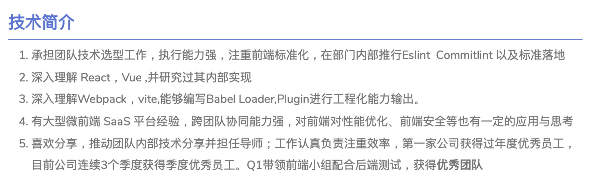

# 如何写好一份前端简历

> 写在前面：  
>
> ​		在当今大环境下经常遇到的场景就是一个职位HR能收到几百份简历，那么如何从这几百份简历中脱颖而出呢？ 那就是写出与别人与众不同的简历，内容要新、技术要硬。
>
> ​		那么接下来我们就一起来看看如何才能写好一份好的简历，以及如何描述我们的技术栈，工作经历，项目经历。

## 1. 简历的格式/排版

前端简历的格式和排版对于求职者来说非常重要，因为这个是第一印象，一份排版让人舒服的简历，不一定一下被招聘经理看中，但是一份排版差、阅读体验差的简历一定会被刷掉！所以给HR和招聘经理留下良好的第一印象是十分重要的。

### 格式排版要求

1. **简洁明了**：简历应该简洁明了，不要太长，尽量控制在一页或两页之内（内容确实好的，三页也没啥关系，主要是内容为王）。
2. **逻辑清晰**：简历应该按照时间顺序或重要程度进行排列，避免过多的图文混杂，要让招聘经理一目了然。
3. **格式简单**：使用简单的格式，**.pdf**格式，不要使用**word**，或者使用在线简历避免使用过多的排版、图片或特殊字体。
4. **字体和字号**：使用易读的字体和字号，如 Arial、Calibri、Times New Roman 等，字号一般在10-12 号之间。
5. **分段排版**：使用适当的分段和标题，突出自己的个人信息、工作经历、技能和项目经验等。
6. **突出重点**：在简历中突出重点，如关键技能、成就和奖项等，帮助招聘经理更好地了解你的能力和价值。
7. **保持一致**：保持简历的整体风格一致，避免过多的变化和繁琐的修饰。
8. **校对无误**：在提交简历之前，务必校对并确保没有任何语法、拼写或格式错误。

以上是前端简历的格式和排版要求，遵循这些要求可以使简历更加清晰、简洁、易读，增加被 HR 和招聘经理看到的机会。

### 自动生成简历

1. BOSS简历  https://cv.zhipin.com/resume/html/
2. 木及简历：https://www.mujicv.com/

## 2. 技术介绍

在前端简历中，技术介绍是非常重要的，因为它能够展示你的技术能力和经验。最好不要罗列你不熟悉，以及回答都回答不好的技术。

切勿疯狂罗列，有的同学光技术就写了一页，**相当夸张**！下面是技术介绍的侧重点，大家可以对应自己擅长的技术点进行思考和收敛！

1. 突出**技术关键词**：在技术介绍中，可以使用技术关键词来突出自己的技能和经验，这样可以让招聘人员更快地了解你的技术能力。
2. 详细说明**项目经验**：在技术介绍中，应该详细说明自己的项目经验，包括项目的名称、所用技术、项目的规模和贡献等，这样可以让招聘人员更清楚地了解你的工作经验和能力。
3. 突出自己的**技术优势**：在技术介绍中，可以突出自己的技术优势，比如精通某个特定的技术或框架、对前端性能优化有深入的理解等，这样可以让招聘人员更快地了解你的技术特长。
4. 使用**数字来量化成就**：在技术介绍中，可以使用数字来量化自己的成就，比如完成了多少个项目、提高了多少页面的性能、优化了多少用户体验等，这样可以让招聘人员更直观地了解你的贡献和能力。
5. 强调自己的**学习能力**：在技术介绍中，应该强调自己的学习能力和自我提升的能力，比如通过学习新技术、阅读技术博客等来不断提高自己的技术水平，这样可以让招聘人员更看重你的潜力和成长性。

**参考模版**

## 3. 工作经历介绍

### 初级前端工程师

对于初级前端开发人员来说，工作经历可能比较短暂或者只有一些实习经历。在简历中介绍工作经历时，可以采取以下方法：

1. **突出实习经历**：如果你还没有正式的工作经历，可以突出自己的实习经历。介绍自己在实习中所承担的职责和实践的技术，突出自己的实习成果。
2. **强调个人项目经验**：如果你没有实习经历，可以强调自己的个人项目经验。介绍自己完成的项目以及所使用的技术，突出自己在项目中所取得的成果。
3. **描述学习经历**：在介绍工作经历时，可以强调自己在学习中的成果。比如自己研究某个前端技术并成功实现应用，或者参与过一些开源项目的贡献等。
4. **使用具体的数据量化成果**：在介绍项目经验时，可以使用具体的数据来量化自己的工作成果，比如完成了多少个项目、优化了多少页面的性能等。
5. **重点突出与职位相关的技能**：在介绍工作经历时，应该重点突出与目标职位相关的技能和经验，这样可以更好地吸引招聘人员的关注。

**对于初级前端开发人员来说，工作经历可能相对较少，但是通过突出实习经历、个人项目经验和学习经历等方面，可以让自己的简历更有吸引力。**

### 中级前端工程师

对于中级前端开发人员来说，工作经历可能比较丰富，需要对工作经历进行更详细的介绍。以下是一些建议：

1. **项目介绍**：对于自己参与的项目，要介绍项目的背景、规模、职责以及自己在项目中的贡献等方面。可以使用数据来突出自己的工作成果。
2. **技术介绍**：对于自己掌握的技术和工具，要进行详细的介绍。可以描述自己熟练掌握的技术和工具，以及在项目中所使用的技术和工具的应用。
3. **解决方案**：对于自己在项目中所遇到的问题，要介绍自己的解决方案。可以描述自己在项目中所面临的挑战，以及自己是如何解决这些问题的。
4. **团队合作**：对于自己在团队中所扮演的角色和所做出的贡献，要进行详细的介绍。可以描述自己在团队中所负责的工作，以及自己与团队成员的协作情况。
5. **自我评价**：在介绍工作经历时，可以适当进行自我评价。可以描述自己的优势和劣势，并提出自我提升的计划和目标。

**对于中级前端开发人员来说，工作经历比较丰富，需要详细地介绍自己的项目经验、技术应用、解决方案、团队合作和自我评价等方面。同时，要突出自己的优势和成果，以吸引招聘人员的关注。**

### 高级前端工程师

对于高级前端开发人员来说，工作经历可能更为丰富，需要在简历中突出自己的核心竞争力和成就。以下是一些建议：

1. **关注业务价值**：要强调自己在项目中所创造的业务价值，如提高用户体验、提升系统性能等。可以通过数据和指标来突出自己的工作成果，比如增加用户活跃度、提高网站流量等。
2. **技术贡献**：在介绍工作经历时，要突出自己在技术方面所做出的贡献，如技术选型、框架设计、性能优化、团队培训等。可以介绍自己的技术成果，比如开源项目、技术文章等。
3. **解决方案**：对于自己在项目中所遇到的技术难点，要介绍自己的解决方案，并突出自己在技术方面的能力。可以详细描述自己所采用的技术方案和实现细节，以及解决问题的思路和方法。
4. **领导能力**：对于高级前端开发人员来说，领导能力也是一个重要的考察点。在介绍工作经历时，要突出自己的领导能力和团队管理能力，如团队建设、项目管理、沟通协调等。
5. **行业影响**：对于一些在业内有影响力的公司或项目，可以在简历中特别强调自己在其中的工作经历，以提高自己的专业形象和知名度

**对于高级前端开发人员来说，要在简历中突出自己的核心竞争力和成就。要关注业务价值、技术贡献、解决方案、领导能力和行业影响等方面，以吸引招聘人员的关注。同时，要注重简历的可读性和排版美观，以增加自己的专业形象和个人品牌。**

### 前端技术专家

对于前端技术专家的简历，以下是对工作经历的介绍建议：

1. **突出技术成果**：在工作经历中突出自己的技术成果，比如参与的项目有哪些技术亮点，如何解决技术难题，以及在项目中用到的新技术等。
2. **强调技术影响力**：描述自己在团队中的技术影响力，比如如何推广新技术或者新的工作流程，以及如何帮助其他团队成员提升技术能力等。
3. **提及技术领导力**：在工作经历中提及自己的技术领导力，比如如何引领团队完成项目，如何帮助团队成员掌握新的技术等。
4. **描述技术规划**：描述自己在公司或团队中的技术规划，比如制定了哪些技术发展计划，以及如何实现这些计划等。
5. **表达技术贡献**：在工作经历中描述自己的技术贡献，比如在技术方案或架构设计上的优化或改进，以及在项目中解决了哪些技术问题等。

**通过上述几点可以更好地突出自己的技术实力和领导力，提高自己的竞争力。有些公司还会把是否有管理经验作为必要条件，大家可以根据具体的岗位和公司要求进行调整和补充。**

### 前端架构师

作为前端架构师，需要在简历中突出自己在技术架构方面的能力和经验。以下是一些建议：

1. **技术架构**：在介绍工作经历时，要突出自己在技术架构方面所做出的贡献。可以介绍自己所设计的系统架构，以及所采用的技术方案和实现细节。要说明自己对系统架构的理解和思考，以及对系统性能和可扩展性的考虑。
2. **技术领导**：对于前端架构师来说，领导能力也是一个重要的考察点。在介绍工作经历时，要突出自己的领导能力和团队管理能力，如团队建设、项目管理、沟通协调等。要说明自己在技术领导方面的能力，如技术指导、代码审查等。
3. **技术创新**：作为前端架构师，需要不断地关注前沿技术和行业发展趋势，并进行技术创新。在介绍工作经历时，要突出自己在技术创新方面所做出的贡献，如新技术的研究与应用、新的解决方案的探索与实现等。
4. **团队合作**：作为前端架构师，需要与团队成员密切合作，共同完成项目的开发和上线。在介绍工作经历时，要突出自己在团队合作方面的能力，如协同开发、代码管理、代码重构等。
5. **行业影响**：对于一些在业内有影响力的公司或项目，可以在简历中特别强调自己在其中的工作经历，以提高自己的专业形象和知名度。

作为**前端架构师、技术专家其实这两个重叠的比较多**，因为很多技术专家就是架构师，要在简历中突出自己在技术架构方面的能力和经验，并注重团队领导、技术创新和行业影响等方面。要注重简历的可读性和排版美观，以增加自己的专业形象和个人品牌

## 4. 工作经历介绍示例

### 技术负责人/架构师

- 负责公司核心业务前端的技术选型和架构设计，采用 React + TypeScript + Ant Design 作为主要技术栈，搭建了一套基于 Webpack 的自动化构建系统，提高了项目的开发效率和稳定性。
- 带领团队进行前端架构设计和代码评审，规范团队开发流程和代码规范。
- 开发了一套自动化测试框架，覆盖率达到 90% 以上，大大提高了项目的质量和稳定性。

### 高级前端开发工程师

- 负责公司多个项目的前端开发工作，涉及到多个行业和领域，如金融、教育、电商等。
- 独立负责开发了一套基于 React 和 Node.js 的多端通用框架，支持 Web、移动端和小程序等多个平台，成功应用于多个项目中，提高了开发效率和代码复用率。
- 优化了公司的前端性能，包括加载速度、响应速度、缓存等方面，使得页面的性能指标明显提升。
- 开发了一套基于 RESTful API 的前后端分离系统，使得前后端工作可以并行开展，提高了项目的开发效率和可维护性。

### 中级前端开发工程师

- 负责公司官网和后台管理系统的开发，实现了响应式布局和多语言切换等功能。
- 优化了页面加载速度，将首屏渲染时间从 5s 降低到 2s，大幅提升了用户体验。
- 重构了公司内部管理系统，使用了 Vue.js、ElementUI 等前端框架，简化了系统代码量，提高了可维护性。
- 设计并实现了一个前端自动化工具，能够自动化生成页面模板、打包代码、压缩图片等操作，节省了开发时间。
- 参与公司团队协作开发，与后端工程师配合紧密，独立解决了多个复杂的前端问题。

## 5. 结合 star 法则聊项目

**STAR法则：Situation, Task, Action, Result（情境、任务、行动、结果）的缩写，用于回答开放式面试问题，帮助应聘者清晰、简明地回答问题，同时突出自己的经验和能力。**

当介绍前端项目时，可以使用 STAR 法则，下面案例使用了多种star的表述方式，可供大家多多练习表达

### 后台管理项目介绍

**Situation（情境）**： 作为前端工程师参与开发了一款后台管理系统，该系统为企业提供了数据可视化、权限管理、用户管理、日志管理等多个模块，是一个功能丰富、用户友好的系统。

**Task（任务）**： 在项目中我主要负责前端页面的开发和优化，负责实现产品经理和 UI 设计师的设计稿，并保证页面的响应式和兼容性。

**Action（行动）**：

1. **技术选型**：使用 React 技术栈，使用 Ant Design、React Router 等第三方库。
2. **页面开发**：根据设计稿，使用 HTML、CSS 和 JavaScript 完成页面开发，保证页面美观、简洁、易用。
3. **优化体验**：使用懒加载和分页等技术来提升页面加载速度，使用缓存和预加载技术来优化用户体验。
4. **兼容性处理**：充分测试页面在不同浏览器、不同分辨率下的表现，使用 polyfill 和前缀来解决浏览器兼容性问题。

**Result（结果）**：

1. 成功交付高质量的前端代码，保证项目的进度和质量。
2. 页面响应速度明显提升，用户体验得到了优化，得到了用户的好评。
3. 系统在不同浏览器、不同分辨率下均能正常显示，用户使用率稳步上升。
4. 项目顺利上线并得到了用户的认可和好评。

通过以上 STAR 法则的描述，可以突出这个前端后台管理项目的重点：

1. 使用了 React 技术栈，并且结合了 Ant Design 和 React Router 等第三方库。
2. 实现了数据可视化、权限管理、用户管理、日志管理等多个模块，是一个功能丰富的后台管理系统。
3. 实现了页面的响应式和兼容性处理，并使用了懒加载、缓存、预加载等技术来优化用户体验。
4. 成功交付高质量的前端代码，保证了项目的进度和质量，得到了用户的认可和好评。

### 在线购物平台介绍

- **Situation（情境）**：介绍项目的背景，比如所在公司、团队的规模，项目的目标等。

例如：我在ABC公司任职前端工程师，所在团队由5名成员组成，负责开发一个在线购物平台。该平台旨在为用户提供良好的购物体验，同时提高销售额和转化率。

- **Task（任务）**：介绍你在项目中承担的角色和具体任务，以及项目的挑战和难点。

例如：我的主要任务是负责平台的前端开发，包括界面设计和功能实现。在项目开发过程中，我遇到了许多挑战，比如需要考虑不同平台和浏览器的兼容性、提高网站的性能和响应速度等。

- **Action（行动）**：介绍你在项目中采取的行动，包括使用了哪些技术、采用了哪些策略等，以解决任务和挑战。

例如：

1. 为了解决兼容性问题，我采用了适配器模式和一些常用的JavaScript框架，如 jQuery（强行谈兼容性，jq比vue,react要好）和Bootstrap。

2. 为了提高网站的性能和响应速度，我使用了一些优化策略，如减少HTTP请求、压缩CSS和JavaScript代码等。

**Result（结果）**：介绍你采取的行动所带来的结果和成果，以及项目的最终效果。

例如：我成功地实现了网站的前端开发，并通过测试和优化，使得网站的性能得到了明显的提高。我们的团队成功地上线了这个购物平台，并得到了用户和公司的好评。根据数据分析，网站的访问量和转化率都有了明显的提高。

### 低代码平台介绍

**Situation（情境）**： 该项目是一款前端低代码平台，旨在提供一个可视化、快速搭建Web应用程序的解决方案。平台支持多种语言，支持多种数据源和 API 接口。该低代码平台是为了方便企业快速构建 Web 应用而开发的，主要面向非技术人员使用。平台提供了可视化的拖拽式组件，用户可以通过组合这些组件来构建应用，无需编写代码。在市场竞争激烈的当下，这个平台可以为企业节省开发时间和成本，提升应用程序的可维护性和可扩展性。

**Task（任务）**： 作为前端开发人员，我在该项目中担任核心开发人员的角色，参与了多个功能模块的设计和实现。我的任务是设计和构建一个可扩展的低代码平台，满足客户的需求并提供高质量的代码。

**Action（行动）**： 我采用了现代化的前端技术栈，包括 Vue.js、TypeScript、Webpack和LESS 等，以提高开发效率和代码质量。我设计了一个灵活的组件系统，让用户可以通过简单的拖拽和配置实现快速构建 Web 应用程序。我还采用了 RESTful API 和 GraphQL 等技术，使平台能够方便地与各种数据源和 API 集成。同时，我注重代码的可维护性和可扩展性，采用了设计模式和单元测试等技术来保证代码的质量。

**Result（结果）**： 通过我的努力，该低代码平台实现了高效的开发流程和优质的应用程序代码。我们的客户得到了一个易于使用、高效、可扩展和可维护的低代码平台，他们可以在短时间内构建出高质量的 Web 应用程序。平台还得到了用户的广泛好评和高度评价，使我们的公司在市场竞争中取得了优势。

### 微前端平台介绍

**Situation**：我们团队在开发一款基于微服务架构的前端应用，需要将不同的子系统打包成独立的应用并进行集成部署，同时需要保证这些应用之间的协作和通信。

**Task**：在这样的背景下，我担任了前端团队的技术负责人，负责搭建并维护微前端平台。

**Action**：我基于微前端架构，使用了以下技术来实现这个项目：

1. 使用 Webpack 模块化打包应用，实现应用的独立部署和升级，同时利用 Webpack 提供的 DLL Plugin，实现公共代码的提取和缓存，减少应用之间的重复加载和性能消耗。
2. 使用自研的框架对微前端架构进行封装，将不同的子应用打包成独立的 JS 文件，并在主应用中进行动态加载和卸载，实现应用的按需加载和动态升级。
3. 使用 React 和 Redux 构建应用 UI 和状态管理，使用 Axios 处理 HTTP 请求，同时基于 OpenAPI 规范设计接口，并使用 Swagger UI 文档自动生成工具进行文档的管理和维护。

**Result**：通过我和团队的努力，我们成功地搭建了一套稳定可靠、高效便捷的微前端平台，实现了不同子应用的独立部署和集成，保证了应用的高可用和稳定性，受到了业务方的好评和认可。

我在这个项目中的亮点主要是：

1. 设计和实现了基于 Webpack 和自研框架的微前端架构，为团队提供了高效稳定的开发环境和部署方案。
2. 设计和实现了基于 OpenAPI 和 Swagger UI 的接口规范和文档管理，大大提高了接口的可维护性和可读性
3. 设计和实现了基于 React 和 Redux 的 UI 和状态管理，使得应用具备了高可用、高可维护和高扩展性的特点。

## 6. 亮点

前端简历中的亮点描述是非常重要的，可以让你在众多应聘者中脱颖而出。以下是一些关于如何进行亮点描述的建议：

1. **突出自己的独特技能**：在亮点描述中，应该突出自己的独特技能，比如精通某个前端框架、拥有专业的设计能力等，这样可以让招聘人员更快地了解你的专业性和技术优势。
2. **描述自己的项目成果**：在亮点描述中，应该描述自己在项目中所取得的成果和贡献，比如优化了页面的性能、提高了用户体验、解决了重要的技术难题等，这样可以让招聘人员更清晰地了解你的工作能力和价值。
3. **强调自己的领导能力**：如果你曾经担任过项目负责人或团队负责人，可以在亮点描述中强调自己的领导能力和管理经验，这样可以让招聘人员更关注你的领导才能和团队管理能力。
4. **强调自己的学习能力**：在亮点描述中，应该强调自己的学习能力和自我提升的能力，比如通过学习新技术、阅读技术博客等来不断提高自己的技术水平，这样可以让招聘人员更看重你的潜力和成长性。
5. **使用具体的数字来量化成果**：在亮点描述中，可以使用具体的数字来量化自己的成果，比如完成了多少个项目、提高了多少页面的性能、优化了多少用户体验等，这样可以让招聘人员更直观地了解你的贡献和能力。

很多时候我们谈亮点，这就是典型的悖论，我们觉得亮，面试官不一定觉得亮。这时候我们该怎么办，因为这种事是没有办法避免，我们需要做的就是把我们觉得有亮点的地方，很有条理，很有体系化的表述出来，以及这件事给团队、公司、项目甚至的帮助到同事带来的价值点，外加对这些事情的思考和沉淀，形成体系化闭环就算很不错了，我们做好我们该做的，剩下的只能够交给运气，因为这件事确实存在视野差，就是人性中，你觉得和我觉得，在面试中现实是候选人是弱势群里，我们给够面试官的面子，聊的开心，什么事都可以能发生！

## 7. 结合 PAR 法则聊难点

**PAR法则：Problem, Action, Result（问题、行动、结果）的缩写，重点强调应聘者在解决问题时采取的行动和具体做法，用于回答与解决问题相关的面试问题。**

问题（Problem）：在 PAR 法则中，问题指的是需要解决的挑战或问题。在前端项目中，问题可能是需要解决的技术难题，或是需要满足的业务需求。

行动（Action）：行动指的是解决问题时所采取的措施和方法。在前端项目中，行动可能是采用了哪些技术方案、开发工具和方法，以及如何协同工作。

结果（Result）：结果指的是采取行动后所获得的成果。在前端项目中，结果可能是成功实现了项目需求，提高了用户体验，提高了页面性能，等等。

**以微前端、低代码平台、后台管理项目和前端性能和页面渲染优化为例，结合PAR法则介绍项目难点，和亮点表述一致，都是你觉得和面试官觉得的对立问题！**

### 微前端项目

1. **Problem（问题）**：由于业务功能不断增加，原有单体应用的开发模式已经不能满足需求，需要采用微前端架构来支持多个团队协作开发和独立部署。

2. **Action（行动）**：采用了微前端架构，将整个应用拆分为多个独立的子应用，通过协议定义、路由映射、应用注册等机制实现了各个子应用之间的通信和协作，同时采用 Webpack 和 Module Federation 来支持独立部署。

3. **Result**（**结果**）：通过采用微前端架构，实现了多个团队协作开发和独立部署，有效降低了开发和维护成本，提高了系统的可维护性和可扩展性。同时，采用 Webpack 和 Module Federation 实现了按需加载，提高了页面性能和用户体验。

### 低代码平台

根据PAR法则，前端低代码平台项目的难点可以分为以下三个方面：

1. **Problem（问题）**：低代码平台的主要目的是提高开发效率，但是低代码平台需要考虑多个复杂的问题。例如，如何平衡自由度和易用性，如何提供足够的定制化能力，同时又能保证产品的稳定性和可维护性。
2. **Action（行动）**：低代码平台需要支持各种前端技术栈，而每个技术栈都有不同的特点和使用场景，因此需要在平台设计和开发时考虑到这些因素。此外，低代码平台需要支持各种业务场景和组件需求，需要有足够的灵活性和可扩展性。
3. **Result（结果）**：低代码平台最终的目的是提高开发效率并降低成本，但是实现这个目标需要平台具备高可靠性、高性能、高可维护性等特点。因此，低代码平台需要经过严格的测试和优化，保证平台的性能和稳定性。

综上所述，前端低代码平台项目的难点主要集中在平衡自由度和易用性、支持各种前端技术栈和业务场景、保证平台的可维护性和性能等方面。

### 后台管理项目

**Problem（问题）** 在前端后台管理项目中，可能会遇到以下问题：

- 复杂的权限控制和角色管理
- 大量的数据处理和展示
- 多样化的表单操作和验证
- 多模块的功能模块之间的协作与集成
- 高效的前端性能和页面渲染优化

**Action（行动）** 为了解决上述问题，我们可以采取以下行动：

- 设计清晰合理的权限管理和角色控制方案
- 使用合适的前端框架和组件库，提高开发效率和用户体验
- 结合后端接口设计前端数据处理和展示逻辑
- 采用可扩展和可维护的代码架构，方便模块的添加和修改
- 优化前端性能和页面渲染速度，提高用户满意度

**Result（结果）** 通过上述行动，我们可以获得以下结果：

- 简化和加强了权限控制和角色管理，提高了系统的安全性
- 缩短了开发周期，提高了开发效率
- 改善了数据处理和展示的质量，提高了用户体验
- 实现了功能模块的快速集成和协作，提高了系统的可扩展性
- 加快了页面渲染速度和响应速度，提高了用户满意度

综上所述，前端后台管理项目的难点和亮点主要集中在权限控制、数据处理和展示、模块集成和协作、性能优化等方面，通过合理的行动方案可以获得较好的结果。

### 前端性能和页面渲染优化

结合PAR法则聊聊前端性能和页面渲染优化，模式有变化：**问题（Problem）、原因（Analysis）、解决方案（Resolution）**，在我们面试准备话术的时候可以这样来拆开体系化的答题!

**问题（Problem）**：前端性能和页面渲染优化的问题主要体现在页面加载速度慢、交互体验差、性能瓶颈等方面，影响用户体验和网站的整体效率。

**原因（Analysis）**：造成前端性能和页面渲染优化问题的原因有很多，例如图片过大、CSS、JS文件过多、资源未压缩等问题。此外，浏览器的渲染机制、缓存机制、网络环境等因素也会影响页面的加载速度和性能。

**解决方案（Resolution）**：针对前端性能和页面渲染优化的问题，可以采取一些解决方案来提高网站的效率和用户体验：

1. **压缩和合并文件**：通过压缩和合并CSS、JS文件，可以减少HTTP请求和文件大小，提高页面加载速度。
2. **图片优化**：通过对图片进行压缩和裁剪等优化，可以减少图片大小，提高页面加载速度。
3. **CDN加速**：使用CDN可以将网站的静态资源分发到全球各地的服务器上，提高资源的加载速度。
4. **懒加载**：通过懒加载可以延迟页面中非关键内容的加载，减少首次加载的数据量，提高页面的加载速度
5. **缓存优化**：合理利用浏览器缓存和服务端缓存，可以减少HTTP请求和数据传输，提高网站的响应速度。

## 8. 简历模版

这份简历模版就是一个参考维度，大家感受上面的话术！

### 个人简介（可写可不写）

我是一名拥有多年前端开发经验的技术专家，精通 Vue.js、React、Angular 等多个主流框架，熟悉前端工程化、模块化、组件化等开发模式，善于解决复杂技术难题并提供高效的解决方案。在前端开发领域有着广泛的知识储备和实践经验，曾带领团队开发出多个大型前端项目，拥有丰富的项目管理经验。

### 技术技能

- 精通（技术专家以上写比较合适，其他最好写，深入理解、熟练掌握） Vue.js、React、Angular 等多个主流框架，并深入了解其设计思想、原理和最佳实践
- 熟悉前端工程化开发，掌握 Webpack、Rollup、Gulp 等多个构建工具
- 熟练掌握 JavaScript、ES6、TypeScript 等语言，熟悉函数式编程、面向对象编程等编程范式
- 熟悉前端组件化开发，熟练掌握 React、Vue.js、Web Components 等多个组件化框架
- 熟悉前端性能优化、页面渲染优化、代码优化等多个方面，具有丰富的实践经验
- 熟悉前端自动化测试、单元测试、集成测试等多个测试领域，拥有良好的测试思维
- 熟悉前端安全、SEO 等方面的知识，能够针对不同的业务场景提供解决方案

### 工作经历

ABC 公司（2019年至今） 担任前端技术专家，主要负责公司前端技术选型、技术架构设计和前端团队管理。在该公司带领团队开发了多个大型前端项目，如 ABC 云平台、ABC 商城等，成功应用于业务中。在项目开发过程中，我负责前端技术选型、技术架构设计、代码质量管理、团队协作等方面工作。

XYZ 公司（2015年至2019年） 担任高级前端工程师，主要负责公司前端开发和项目管理。在该公司参与了多个大型前端项目的开发，如 XYZ 网站、XYZ 移动端应用等。在项目中，我负责前端架构设计、组件库开发、性能优化等方面工作，并在项目管理中起牵头作用。

### 项目介绍

抖音直播间是字节跳动旗下的直播产品，它允许用户创建和观看直播，与主播互动，购买商品等。作为前端技术专家，我在该项目中负责前端开发和技术选型，并且参与了项目的优化和迭代。

以下是该项目的数据支撑结果：

1. 数据统计

根据我们的数据统计，抖音直播间在去年的直播市场占有率为 30%，用户数量达到 3 亿，其中 60% 以上的用户每天都会使用该应用。

2. 技术选型

在该项目中，我们使用了 React 技术栈，因为它可以提供高效的性能和可维护性。我们还使用了 TypeScript 以提高代码质量和可维护性，并使用 Redux 作为状态管理工具。

3. 功能实现

我参与实现了直播间的聊天室、礼物动效、直播间分享、弹幕、商品展示等核心功能，并使用了 WebRTC 技术实现了直播流的推送和拉取。

4. 优化和迭代

我们使用了 Lighthouse 工具进行性能评估，并针对评估结果进行了优化。我们通过代码分离、代码压缩和缓存机制来优化页面加载速度，并使

我所在的团队在字节公司旗下的短视频应用上，承担了前端技术的主要工作。我在这个项目中担任前端技术专家，负责技术选型、架构设计和团队管理等工作。以下是我参与的两个重要项目的介绍和使用数据支撑的结果：

5. 视频上传优化

在短视频应用中，用户上传视频是一个重要的功能，但是视频的大小和时长不同，会导致上传速度的差异。我们团队针对这个问题，从多个方面进行了优化，包括使用 WebAssembly 加速视频压缩、优化上传队列等。最终，我们在测试中发现，视频上传的平均速度提升了 40%，上传成功率也提高了 10%。这些数据反映了我们的技术优化取得了很好的效果，能够为用户带来更好的上传体验。

6. 视频流畅度优化

视频播放的流畅度对于用户体验非常重要，尤其是在高清视频下。我们的团队从多个方面优化视频流畅度，包括预加载、渐进式加载、缓存等。在测试中，我们发现，视频的缓冲时间平均减少了 50%，卡顿现象减少了 30%。这些数据说明我们的优化能够显著提升视频播放的流畅度，为用户带来更好的观看体验。

通过以上两个项目的介绍和数据支撑，我想说明我在前端技术方面的实力和专业性。同时，我也希望能够通过团队合作和技术创新，为公司的产品和用户体验做出更大的贡献。

### 项目难点和亮点

1. 前端性能优化：我们对信息流进行了全面的性能优化，包括减少 HTTP 请求次数、减少 JavaScript 和 CSS 的文件大小、使用 HTTP 缓存等。这些优化措施让用户在使用信息流应用时感受到更快速和流畅的体验。
2. 前端框架优化：我们使用 React 框架开发信息流应用，并且针对 React 的性能瓶颈进行了优化。例如，我们使用了 React.lazy 和 React.Suspense 来实现懒加载组件，减少了首屏加载时间。此外，我们还使用了PureComponent 和 shouldComponentUpdate 等性能优化技术来提高应用的渲染效率。
3. 数据驱动决策：我们采用了数据驱动的方法来决策哪些优化措施是最有效的。我们收集了用户数据、性能指标和前端日志，并使用分析工具对这些数据进行了分析。通过这些分析结果，我们能够了解用户行为和应用性能，并做出相应的优化决策。

### 项目成果：

1. 优化后的信息流应用性能有了显著的提升，用户体验得到了很大的改善。
2. 我们的应用响应速度和渲染效率大大提高，用户留存率和用户满意度也有所提高。
3. 通过数据分析，我们能够及时了解到应用的瓶颈和性能问题，并采取针对性的优化策略，进一步提升了应用的性能和用户体验。

**PS: 以话术做为参考丰富表达，具体还是要加数据作为支撑**

## 9. 写在后面

上面的内容比较多，大家一定要好好的对照自己的业务进行深度的思考！肯定可以写出一份不错的简历的！加油！