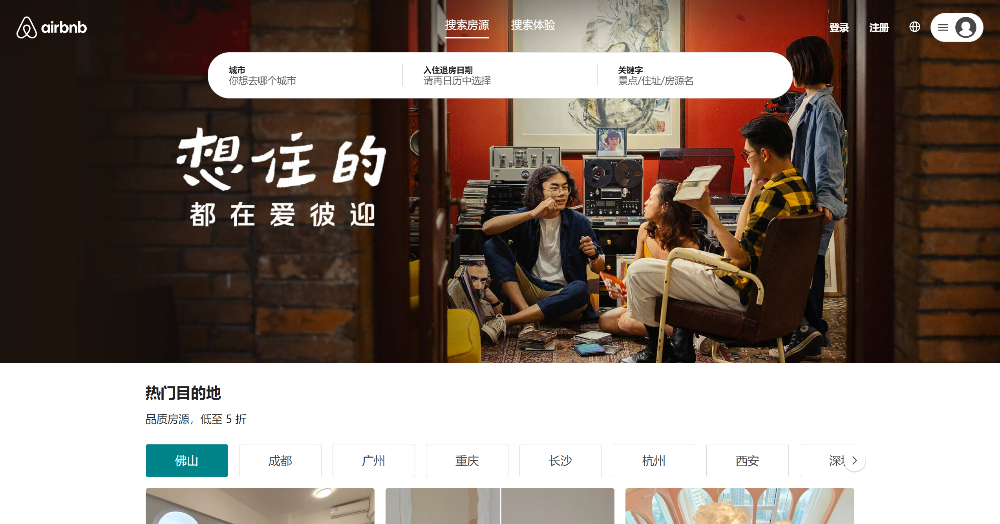
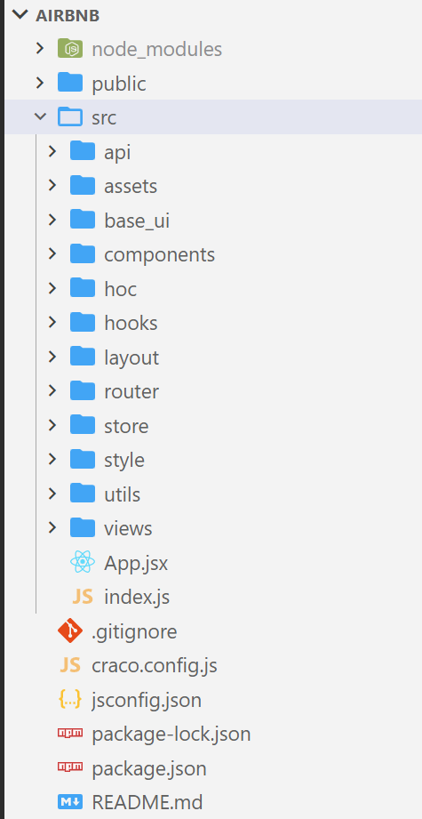

# 1- 项目初始化搭建

## 一、项目介绍



爱彼迎项目:   

​	此项目采用React18 + Redux + react-router-dom6 进行开发   

   技术点：

1. `头部动画编写`
2. `Layout布局法`
3. `CSS主题的统一`
4. 各类核心组件封装如: `滚动组件` `指示器组件`  `图片浏览器组件` 
5. 业务组件的拆分如:  `头部组件` `房源组件`
6. 自定义Hooks封装， Hoc函数封装


## 二、项目要求

1. 构建方式:  使用  cra 构建
2. 组件要求:  组件 100% hooks写法、 默认都用memo做渲染优化
3. 通信模式:  父子  props  非父子  redux
4. CSS要求:  styled-components库   实现   css-in-js
5. 项目配置:  carco配置项目


## 三、初始化项目结构



根据代码功能区域  构建文件夹  

例: 页面 ->  views   路由配置 -> router  redux配置 -> store  资源 -> assets 


**配置carco文件 ** 

1. 安装: npm i @craco/craco -D

2. 配置启动命令 `package.json`

   ``` json
   "scripts": {
       "start": "craco start",
       "build": "craco build",
       "test": "craco test",
       "eject": "react-scripts eject"
   }
   ```

3. 配置文件 carco.config.js  

   ``` js
   const path = require('path')
   
   const resolve = pathname =>  path.resolve(__dirname, pathname)
   
   module.exports = {
     devServer: {
       port: 3005
     },
     // webpack配置
     webpack: {
       // 路径别名
       alias: {
         '@': resolve('src'),
         '@c': resolve('src/components'),
         '@u': resolve('src/utils')
       }
     }
   }
   ```


**配置jsconfig.json**  实现路径相关提示

``` json
{
  "compilerOptions": {
    "target": "es5",
    "module": "esnext",
    "baseUrl": "./",
    "moduleResolution": "node",
    "paths": {
      "@/*": ["src/*"],
      "@c/*": ["src/components/*"],
      "@u/*": ["src/utils/*"]
    },
    "jsx": "preserve",
    "lib": [
      "esnext",
      "dom",
      "dom.iterable",
      "scripthost"
    ]
  }
}
```


## 四、封装Axios

1. **Utils/index.js** 实现对axios的封装  **【需要额外安装axios】**

``` js
import axios from 'axios';

class Request {
  constructor(config = {}) {
    this.instance = axios.create(config)

    // 请求拦截
    this.instance.interceptors.request.use(req => {
      return req
    }, err => err)

    // 响应处理
    this.instance.interceptors.response.use(res => {
      return res.data
    }, err => err)

  }

  request(config) {
    return this.instance.request(config)
  }

  get(config) {
    return this.request({ ...config, method: 'GET' })
  }

  post(config) {
    return this.request({ ...config, method: 'POST' })
  }
}

export default Request
```


2. **api/index.js** 实例化请求

``` js
import Request from "@/utils/request"; 
import { BASE_URL, TIMEOUT } from "./config";

const request = new Request({ baseURL: BASE_URL, timeout: TIMEOUT })
 
export default request

export * from './modules/home'
```

`api/config.js`

``` js
export const BASE_URL = 'http://codercba.com:1888/airbnb/api'

export const TIMEOUT = 20000
```


3. `modules/home.js`  请求非模块编写

``` js
import request from '..';

// 获取高性价比房
export const getHomeGoodPriceData = () => request.get({ url: '/home/goodprice' })

```


## 五、样式初始化

1. `style/reset.css ` 【css重置方案】

   ``` scss
   /* Reset style sheet */
   html,
   body,
   div,
   span,
   applet,
   object,
   iframe,
   h1,
   h2,
   h3,
   h4,
   h5,
   h6,
   p,
   blockquote,
   pre,
   a,
   abbr,
   acronym,
   address,
   big,
   cite,
   code,
   del,
   dfn,
   em,
   img,
   ins,
   kbd,
   q,
   s,
   samp,
   small,
   strike,
   strong,
   sub,
   sup,
   tt,
   var,
   b,
   u,
   i,
   center,
   dl,
   dt,
   dd,
   ol,
   ul,
   li,
   fieldset,
   form,
   label,
   legend,
   table,
   caption,
   tbody,
   tfoot,
   thead,
   tr,
   th,
   td,
   article,
   aside,
   canvas,
   details,
   embed,
   figure,
   figcaption,
   footer,
   header,
   hgroup,
   menu,
   nav,
   output,
   ruby,
   section,
   summary,
   time,
   mark,
   audio,
   video {
   	padding: 0;
   	margin: 0;
   	font: inherit;
   	font-size: 100%;
   	vertical-align: baseline;
   	border: 0;
   }
   
   /* HTML5 display-role reset for older browsers */
   article,
   aside,
   details,
   figcaption,
   figure,
   footer,
   header,
   hgroup,
   menu,
   nav,
   section {
   	display: block;
   }
   body {
   	padding: 0;
   	margin: 0;
   }
   ol,
   ul {
   	list-style: none;
   }
   blockquote,
   q {
   	quotes: none;
   }
   blockquote::before,
   blockquote::after,
   q::before,
   q::after {
   	content: "";
   	content: none;
   }
   table {
   	border-spacing: 0;
   	border-collapse: collapse;
   }
   html,
   body,
   #root {
   	width: 100%;
   	height: 100%;
   }
   ```

2. ` style/variables.scss `  公共变量   **【需要额外安装 sass】**

   ```scss
   // 定义需要使用的变量
   :root {
     --p-color: #ff385c;
     --p-color2: #00848A;
     --text-color: #484848;
     --text-color2: #222;
   }
   ```

3. `style/common.scss` 公共样式

   ``` scss
   @import url('./reset.scss');
   @import url('./variables.scss');
   
   body {
     font-size: 14px;
     font-family: "Circular", "PingFang-SC", "Hiragino Sans GB", "微软雅黑", "Microsoft YaHei", "Heiti SC";
     color: #484848;
     line-height: 1.15;
   }
   
   /* 常用 flex */
   .flx-center {
   	display: flex;
   	align-items: center;
   	justify-content: center;
   }
   .flx-justify-between {
   	display: flex;
   	align-items: center;
   	justify-content: space-between;
   }
   .flx-align-center {
   	display: flex;
   	align-items: center;
   }
   
   /* 清除浮动 */
   .clearfix::after {
   	display: block;
   	height: 0;
   	overflow: hidden;
   	clear: both;
   	content: "";
   }
   
   /* 文字单行省略号 */
   .sle {
   	overflow: hidden;
   	text-overflow: ellipsis;
   	white-space: nowrap;
   }
   
   /* 文字多行省略号 */
   .mle {
   	display: -webkit-box;
   	overflow: hidden;
   	-webkit-box-orient: vertical;
   	-webkit-line-clamp: 2;
   }
   
   /* 文字多了自动换行 */
   .break-word {
   	word-break: break-all;
   	word-wrap: break-word;
   }
   
   /* 经典动画 */
   .fade-enter {
   	opacity: 0;
   	transform: translateX(-30px);
   }
   .fade-enter-active,
   .fade-exit-active {
   	opacity: 1;
   	transition: all 0.2s ease-out;
   	transform: translateX(0);
   }
   .fade-exit {
   	opacity: 0;
   	transform: translateX(30px);
   }
   
   /* 滚动条 */
   ::-webkit-scrollbar {
   	width: 8px;
   	height: 8px;
   	background-color: #ffffff;
   }
   ::-webkit-scrollbar-thumb {
   	background-color: #dddee0;
   	border-radius: 20px;
   	box-shadow: inset 0 0 0 #ffffff;
   }
   
   /* card 卡片样式 */
   .card {
   	box-sizing: border-box;
   	padding: 20px;
   	overflow-x: hidden;
   	border: 1px solid #e4e7ed;
   	border-radius: 4px;
   }
   
   /* content-box */
   .content-box {
   	display: flex;
   	flex-direction: column;
   	width: 100%;
   	height: 100%;
   	.text {
   		margin: 30px 0;
   		font-size: 23px;
   		font-weight: 700;
   		text-align: center;
   		a {
   			text-decoration: underline !important;
   		}
   	}
   }
   ```

4. `index.js`导入 `common.js`实现样式全局化


## 六、初始化store仓库

> 项目使用@reduxjs/toolkit 工具包 
>
> 下载:  npm i @reduxjs/toolkit  react-redux

1. store 配置redux仓库  `store/index.js`

   ``` js
   import { configureStore } from '@reduxjs/toolkit'
   import homeReducer from './modules/home'
   
   // 配置store仓库
   const store = configureStore({
     reducer: {
       home: homeReducer,
     },
   })
   
   export default store
   
   ```

2. 创建reduce切片  `home `     `store/modules/home.js`

   ``` js
   // 首页模块Reducer
   import { createSlice } from '@reduxjs/toolkit'
   
   // 创建切片【模块】
   const homeSlice = createSlice({
     name: 'home',
     initialState: { count: 10 },
     reducer: {
         addCount() {}
     }
   })
   
   // 导出action
   export const { addCount } = homeSlice.actions
   
   // 导出reducer
   export default homeSlice.reducer
   
   ```

3. context注入store  `index.js`

   ``` jsx
   import { Provider } from 'react-redux'
   import store from './store'
   
   root.render(
     // 通过context注入store
     <Provider store={store}>
        <App />
     </Provider>
   )
   ```

