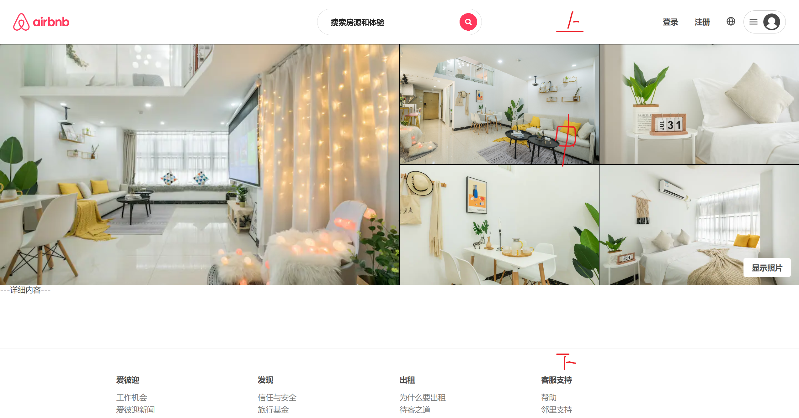
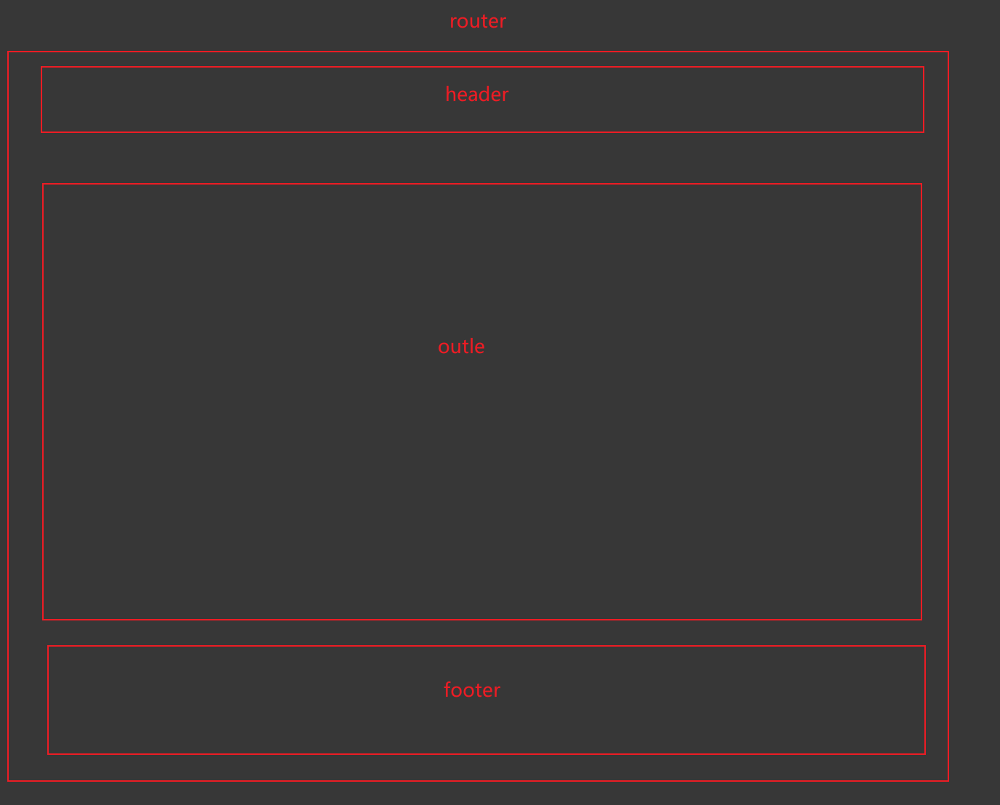
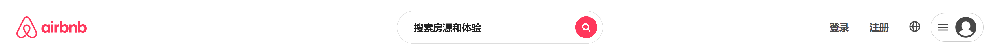

# 2- Layout布局

## 一、布局分析

首先分析页面布局



页面整体可分为  上  中  下   三个区域 

主要页面有:   主页  房源页  详情页

其中不同页面 只有**中部内容变化**  其次**头部有变化**        

页面布局示意如下:




## 二、 路由划分

如表格所示:    

| 地址    | 页面   |
| ------- | ------ |
| /       | 主页   |
| /entire | 房源页 |
| /detail | 详情页 |


## 三、配置路由信息

1. `router/index`新建配置

   ``` js
   import { createBrowserRouter } from 'react-router-dom'
   import React from 'react'
   import Layout from '@/layout'
   
   // 路由配置
   const router = createBrowserRouter([
     // lazy方法 要求组件命名为Component
     {
       path: '/',
       element: <Layout />,
       children: [
         { index: true, Component: React.lazy(() => import('@/views/home')) },
         { path: '/entire', Component: React.lazy(() => import('@/views/entire')) },
         { path: '/detail', Component: React.lazy(() => import('@/views/detail')) },
       ],
     },
   ])
   
   export default router
   ```

2. `App.jsx`加载配置

   ``` js
   import React, { memo } from 'react'
   import { RouterProvider } from 'react-router-dom';
   import router from './router';
   
   const App = memo(() => {
     return <RouterProvider router={router} />
   })
   
   export default App
   ```


## 四、Layout结构

Layout页作为整个项目的公共结构页共分为： 上  中  下

其中:  中部使用 outlet组件作为嵌套路由跳转

1. 下载`style-components`作为`css-in-js`方案

2. 新建`layout/index.jsx`  `layout/style.js`

3. 实现基础布局

   ``` jsx
   const Layout = memo(() => {
   
     return (
       <LayoutWrapper>
         <AppHeader />
         <Suspense fallback={<Spin size="large" className='layout-spin'/>}>
           <Outlet></Outlet>
         </Suspense>
         <AppFooter />
       </LayoutWrapper>
     )
   })
   
   Layout.displayName = 'Layout'
   
   export default Layout
   ```


## 五、Layout头部

> 原头部内容较复杂   需要拆分编写      初期实现最基础头部   后续章节再继续完善



如图所示:  头部可分  左  中   右布局

难点:  **中部内容的居中**    实现方案:   左右flex: 1   中部不设置宽度     

**由于左右为1   自然中部被挤到中间**

头部结构:

``` jsx
const AppHeader = memo(() => {
	return (
      <AppHeaderWrapper className="fixed">
          <div className="content">
              <div className="top">
                <HeaderLeft />
                <HeaderCenter />
                <HeaderRight />
              </div>
          </div>
        </div>
      </AppHeaderWrapper>
 	)
})

export default AppHeader
```

头部样式:

``` js
export const AppHeaderWrapper = styled.div`
  &.fixed {
    position: fixed;
    top: 0;
    left: 0;
    right: 0;
    z-index: 99;
  }

  .content {
    position: relative;
    z-index: 19;
    background-color: #FFF;
    border-bottom: 1px solid #eee;
    box-sizing: border-box;
    .top {
      display: flex;
      height: 80px;
      align-items: center;
    }
  }
`
```


### 5.1 头部左侧

1. 在layout目录下新建`AppHeader`组件   并在其下构建`HeaderLeft` `HeaderCenter` `HeaderRight`

2. 基础布局    

   ``` jsx
   const HeaderLeft = memo(() => {
     const navigate = useNavigate()
     
     function logoClickHandler() {
       navigate('/')
     }
   
     return (
       <LeftWrapper>
         <div className='logo' onClick={logoClickHandler}>
           <IconLogo />
         </div>      
       </LeftWrapper>
     )
   })
   ```

   **IconLogo为项目资源图标   需要在assets导入**

3. 样式UI

   ``` js
   export const LeftWrapper = styled.div`
     flex: 1;
     display: flex;
     align-items: center;
     color: var(--p-color);
     .logo {
       margin-left: 24px;
       cursor: pointer;
     }
   `
   ```

### 5.2 头部右侧

**右侧难点:**  登录状态框

**实现方案:**  点击显示   点击其他内容隐藏(需要改为事件捕获)

1. 基础结构

   ``` jsx
   const HeaderRight = memo(() => {
     return (
       <RightWrapper>
         <div className="btns">
           <span className='btn'>登录</span>
           <span className='btn'>注册</span>
           <span className='btn'><IconGlobal /></span>
         </div>
         <div className='profile' onClick={showPanel}>
           <IconMenu />
           <IconAvatar />
           { show && panelElement }
         </div>
       </RightWrapper>
     )
   })
   
   export default HeaderRight
   ```

2. 样式UI

   **阴影部分使用场景多  --- 封装为函数 **   `style/theme/index.js`    **index.js需要注入**

   ``` js
   const theme = {
     mixins: {
       boxShadow: `
         transition: box-shadow 200ms ease;
         &:hover {
           box-shadow: 0 2px 4px rgba(0,0,0,.18);
         }
       `
     }
   }
   
   export default theme
   ```

   

   ``` js
   export const RightWrapper = styled.div`
     flex: 1;
     display: flex;
     justify-content: flex-end;
     align-items: center;
     font-weight: 600;
   
     .btns {
       display: flex;
       align-items: center;
       color: var(--text-color);
       .btn {
         height: 18px;
         line-height: 18px;
         padding: 12px 15px;
         border-radius: 22px;
         cursor: pointer;
         &:hover {
           background-color: '#F5f5f5';
         }
       }
     }
     .profile {
       position: relative;
       display: flex;
       align-items: center;
       justify-content: space-evenly;
       width: 77px;
       height: 42px;
       margin-right: 24px;
       box-sizing: border-box;
       border: 1px solid #ccc;
       border-radius: 25px;
       background-color: #FFF;
       cursor: pointer;
       ${props => props.theme.mixins.boxShadow}
   
       .panel {
         position: absolute;
         top: 54px;
         right: 0;
         width: 240px;
         background-color: #FFF;
         border-radius: 10px;
         box-shadow: 0 0 6px rgba(0,0,0,.2);
         color: #666;
   
         .top, .bottom {
           padding: 10px 0;
   
           .item {
             height: 40px;
             line-height: 40px;
             padding: 0 16px;
             &.login {
               color: var(--text-color2);
             }
             &:hover {
               background-color: #f5f5f5;
             }
           }
         }
         
         .top {
           border-bottom: 1px solid #ddd;
         }
       }
     }
   `
   ```

   

3. 右侧逻辑实现

   ``` js
   const [show, setShow] = useState(false)
   
   // 绑定全局
   useEffect(() => {
   function hidePanel() {
     setShow(false)
   }
   window.addEventListener('click', hidePanel, true)
   return () => {
     window.removeEventListener('click', hidePanel, true)
   }
   }, [])
   
   // 面板元素
   const panelElement = (
   <div className="panel">
     <div className="top">
       <div className="item login">注册</div>
       <div className="item">登录</div>
     </div>
     <div className="bottom">
       <div className="item">出租房源</div>
       <div className="item">开展体验</div>
       <div className="item">帮助</div>
     </div>
   </div>
   )
   
   function showPanel() {
   	setShow(true)
   }
   ```


### 5.3 头部中间

1. 基础结构

   ``` jsx
   const HeaderCenter = memo((props) => {
   
     return (
       <CenterWrapper>
           <div className="search-bar">
             <div className="text">搜索房源和体验</div>
             <div className="icon"><IconSearchBar /></div>
           </div>
       </CenterWrapper>
     )
   })
   
   
   export default HeaderCenter
   ```

2. UI样式

   ``` js
   export const CenterWrapper = styled.div`
     display: flex;
     justify-content: center;
     height: 48px;
     .search-bar {
       display: flex;
       justify-content: space-between;
       align-items: center;
       width: 300px;
       height: 48px;
       box-sizing: border-box;
       padding: 0 8px;
       border: 1px solid #ddd;
       border-radius: 24px;
       cursor: pointer;
       ${(props) => props.theme.mixins.boxShadow}
   
       .text {
         padding: 0 16px;
         color: var(--text-color2);
         font-weight: 600;
       }
       .icon {
         display: flex;
         align-items: center;
         justify-content: center;
         width: 32px;
         height: 32px;
         border-radius: 50%;
         color: #fff;
         background-color: var(--p-color);
       }
     }
   `
   
   ```

   

## 六、 Layout底部

底部内容数据:

``` json
[
  {
    "name": "爱彼迎",
    "list": ["工作机会", "爱彼迎新闻", "政策", "无障碍设施"]
  },
  {
    "name": "发现",
    "list": ["信任与安全", "旅行基金", "商务差旅", "爱彼迎杂志", "Airbnb.org"]
  },
  {
    "name": "出租",
    "list": ["为什么要出租", "待客之道", "房东义务", "开展体验", "资源中心"]
  },
  {
    "name": "客服支持",
    "list": ["帮助", "邻里支持"]
  }
]
```

HTML结构

``` jsx
import React, { memo } from 'react'
import footerData from '@/assets/data/footer.json';
import { FooterWrapper } from './style'

const AppFooter = memo(() => {
  return (
    <FooterWrapper>
      <div className="wrapper">
        <div className="service">
          {
            footerData.map(item => {
              return (
                <div className="item" key={item.name}>
                  <div className="name">{item.name}</div>
                  <div className="list">
                    {
                      item.list.map(item2 => {
                        return <div className="item2" key={item2}>{item2}</div>
                      })
                    }
                  </div>
                </div>
              )
            })
          }
        </div>
        <div className='statement'>© 2023 Airbnb, Inc. All rights reserved.条款 · 隐私政策 · 网站地图 · 全国旅游投诉渠道 12301</div>
      </div>
    </FooterWrapper>
  )
})

export default AppFooter
```

UI样式

``` js
import styled from "styled-components";

export const FooterWrapper = styled.div`
  margin-top: 100px;
  border-top: 1px solid #ebebeb;
  .wrapper {
    width: 1080px;
    margin: 0 auto;
    box-sizing: border-box;
    padding: 48px 24px;
  }

  .service {
    display: flex;
    .item {
      flex: 1;
      .name {
        margin-bottom: 16px;
        font-weight: 700;
      }
      .list .item2 {
        margin-top: 6px;
        color: #767676;
        cursor: pointer;
        &:hover {
          text-decoration: underline;
        }
      }
    }
  }
  .statement {
    margin-top: 30px;
    border-top: 1px solid #ebebeb;
    padding: 20px;
    color: #767676;
    text-align: center;
  }
`
```

