# 3- 首页

## 一、布局分析

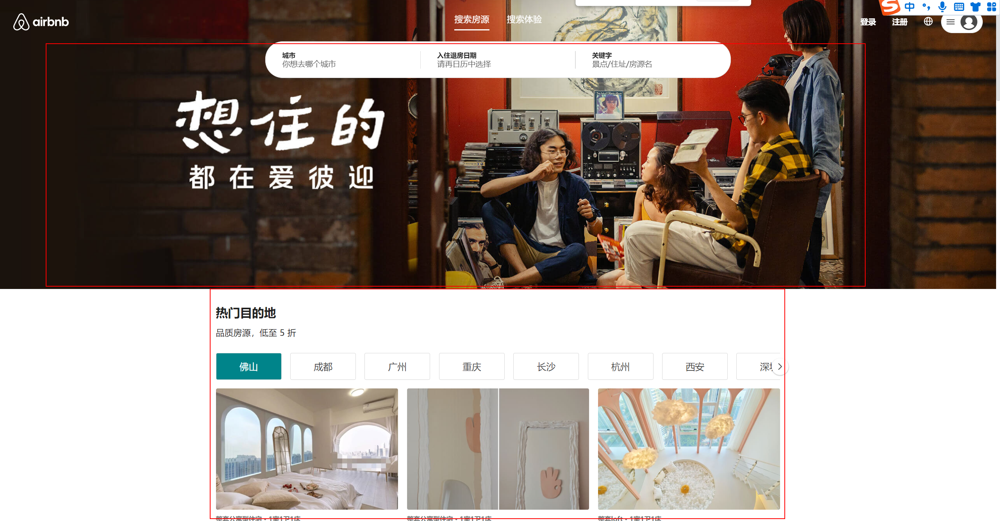

整体首页  分为2大区域： Banner区域 与  推荐区域

Banner区域:  作为图片直接封装即可

推荐区域： 整区域居中显示   需要一个布局容器包裹    内容部分可分模块依次编写

**home/index.jsx**  与 **home/style.js**

```jsx
const Home = memo(() => {
 return (
    <HomeWrapper>
      {/* Banner */}
      <HomeBanner />
      <div className='content'>
        内容
      </div>
    </HomeWrapper>
  )
})

Home.displayName = 'Home'

export default Home
```

``` js

export const HomeWrapper = styled.div`
  > .content {
    width: 1032px;
    margin: 0 auto;
  }
`
```


## 二、Banner页面

创建Banner组件 `home/components/HomeBanner`

该页面主要以展示为主  没有逻辑

``` jsx
const HomeBanner = memo(() => {
  return (
    <BannerWrapper></BannerWrapper>
  )
})

export default HomeBanner
```

**React使用资源内容需要 require导入**

``` js
export const BannerWrapper =  styled.div`
  height: 529px;
  background: url(${require('@/assets/img/cover_01.jpeg')}) center/cover;
`
```

**记得在Home页面中引入并使用**


## 三、加载首页数据

首页需要的数据有:  高性价比房、高分好评房、折扣房、推荐房/热门、你可能想去、Plus房源

将需要的数据封装在请求API中  后续通过Redux请求信息

**api/modules/home**

``` js
import request from '..';

// 获取高性价比房
export const getHomeGoodPriceData = () => request.get({ url: '/home/goodprice' })

// 获取高分好评房
export const getHomeHighScoreData = () => request.get({ url: '/home/highscore' })

// 获取折扣房
export const getHomeDiscountData  = () => request.get({ url: '/home/discount' })

// 获取推荐房/热门
export const getHomeHotData = () => request.get({ url: '/home/hotrecommenddest' })

// 获取你可能想去
export const getHomeLongforData = () => request.get({ url: '/home/longfor' })

// 获取Plus房源
export const getHomePlusData = () => request.get({ url: '/home/plus' })
```


Redux  Home切片中定义 Aciton请求内容

``` js
// 首页模块Reducer
import * as HomeAPI from '@/api/modules/home'
import { createSlice, createAsyncThunk } from '@reduxjs/toolkit'

// 获取首页房源信息
export const fetchHomeDataAction = createAsyncThunk('fetchData', async () => {
  const apiFn = [
    HomeAPI.getHomeGoodPriceData(),
    HomeAPI.getHomeHighScoreData(),
    HomeAPI.getHomeDiscountData(),
    HomeAPI.getHomeHotData(),
    HomeAPI.getHomeLongforData(),
    HomeAPI.getHomePlusData()
  ]
  // // 并发请求
  const result = await Promise.all(apiFn)
  return result
})

// 创建切片【模块】
const homeSlice = createSlice({
  name: 'home',
  initialState: {
    // 性价比房源数据
    goodPriceInfo: {},
    // 高分好评房源数据
    highScoreInfo: {},
    // 折扣房源数据
    discountInfo: {},
    // 热门/精彩房源
    hotInfo: {},
    // 你可能想去房源
    longforInfo: {},
    // Plus房源
    plusInfo: {}
  },
  // 处理异步的reducer
  extraReducers: (builder) => {
    builder.addCase(fetchHomeDataAction.fulfilled, (state, { payload }) => {
      const [goodPrice, highScore, discount, hot, longfor, plus] = payload
      state.goodPriceInfo = goodPrice
      state.highScoreInfo = highScore
      state.discountInfo = discount
      state.hotInfo = hot
      state.longforInfo = longfor
      state.plusInfo = plus
    })
  },
})

// 导出action
export const { addCount } = homeSlice.actions

// 导出reducer
export default homeSlice.reducer
```


首页派发Action   并解析请求的内容

``` jsx
const Home = memo(() => {
  // 解析store值
  const { goodPriceInfo, highScoreInfo, discountInfo, hotInfo, plusInfo, longforInfo } = useSelector(state => state.home, shallowEqual)
  
  // 页面加载派发action
  const dispatch = useDispatch()
  useEffect(() => {
    dispatch(fetchHomeDataAction())
  }, [dispatch])
    
})
```


## 四、Section组件

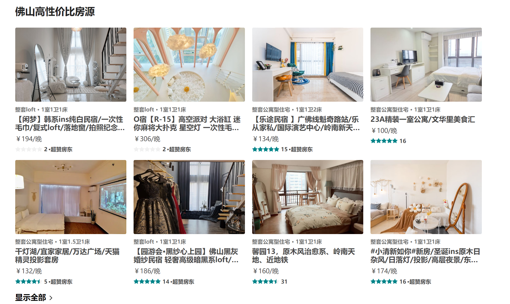

由于首页内容板块过多   建议先从最简单的入手：  高性价比板块

分析：  1.  板块内容布局大致相同【**考虑封装**】  2. 房源容器多处使用【**考虑封装**】 3. 各版本标题、副标题props控制 

### 4.1 Section结构

首页components目录下 新建`HomeSection`组件  

组件需要的功能点:  1. 数据   2.  头部内容【标题、副标题】 3.  中部内容【房源列表】 4. 底部内容【显示全部】

布局如下:

``` jsx
const HomeSectionV1 = memo((props) => {
  const { infoData } = props
  return (
    <SectionWrapper>
      <SectionHeader title={infoData.title} subtitle={infoData.subtitle}/>
      <SectionRooms roomList={infoData.list} itemWidth="25%"/>
      <SectionFooter />
    </SectionWrapper>
  )
})

HomeSectionV1.propTypes = {
  infoData: PropTypes.object
}

export default HomeSectionV1
```

样式如下:  **板块与板块之间30间隔**

```js
export const SectionWrapper = styled.div`
  margin-top: 30px;
`
```


### 4.2 Section头部

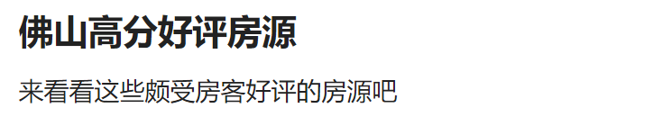

头部主要由 主标题 与 副标题构成   其中内容都是由父组件提供  故写成Props  【**副标题可有可无**】

**components/SectionHeader**

``` jsx
const SectionHeader = memo((props) => {
  const { title, subtitle } = props
  return (
    <HeaderWrapper>
      <h2 className="title">{title}</h2>
      {subtitle && <div className="subtitle">{subtitle}</div>}
    </HeaderWrapper>
  )
})

SectionHeader.propTypes = {
  title: PropTypes.string,
  subtitle: PropTypes.string
}

export default SectionHeader
```

 ``` js
 export const HeaderWrapper = styled.div`
   color: #222;
   .title {
     font-size: 22px;
     font-weight: 700;
     margin-bottom: 16px;
   }
   .subtitle {
     font-size: 16px;
     margin-bottom: 20px;
   }
 `
 ```


### 4.3 Section底部

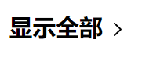

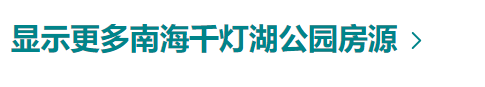

分析: 不同的底部显示的效果也不同   部分底部需要显示对应名字以及字体颜色的不同

解决: 定义props接收name    根据有无name显示不同字体颜色

`components/SectionFooter`

``` jsx

const SectionFooter = memo((props) => {
  const { name } = props
  const navigate = useNavigate()
  const showMessage = () => name ? `显示更多${name}房源` : '显示全部'

  function moreClickHandle() {
    navigate('/entire')
  }

  return (
    <FooterWrapper color={name ? '#00848A' : '#000'}>
      <div className='info' onClick={moreClickHandle}>
        <span className='text'>{showMessage()}</span>
        <IconMoreArrow />
      </div>
    </FooterWrapper>
  )
})

SectionFooter.propTypes = {
  name: PropTypes.string
}
```


### 4.4 Section列表

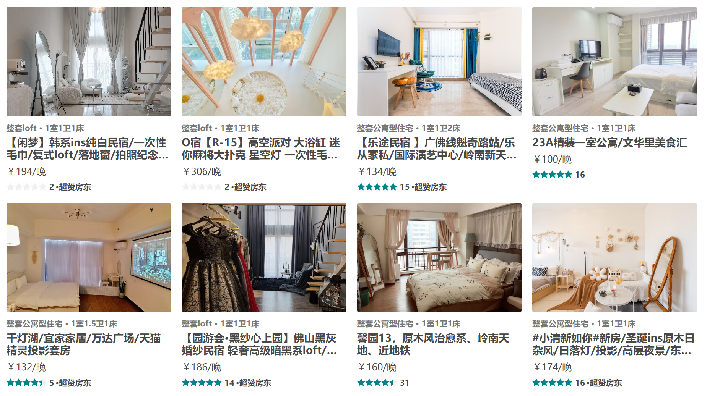

以高性价比板块 列表为例  **先编写一个DEMO  后续再修改**

section列表主要为房源信息排列  主要承载成容器的作用     房源信息多页面 多组件使用  可细分**房源组件**


Section列表的封装:  1. 定义list **props** 用于渲染房源   2. 最多渲染8条  

``` jsx
const SectionRooms = memo((props) => {
  const { roomList = [], itemWidth } = props
  return (
    <RoomsWrapper>
      {
        roomList.slice(0, 8)?.map(item => {
          return <RoomItem key={item.id} itemData={item} itemWidth={itemWidth} />
        })
      }
    </RoomsWrapper>
  )
})

SectionRooms.propTypes = {
  roomList: PropTypes.array,
  itemWidth: PropTypes.string
}
```


``` js
export const RoomsWrapper = styled.div`
  display: flex;
  flex-wrap: wrap;
  margin: 0 -8px;
`
```

**注意点:  margin为同时布局效果**


## 五、房源卡片组件

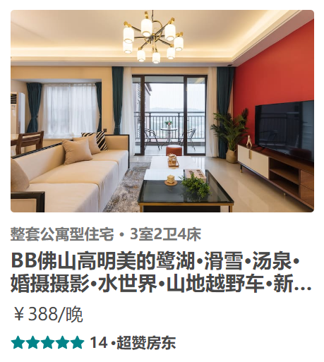

样式问题1:   多个卡片之间的间隔

解决方案:   利用容器间隔法 【外包容器、内嵌内容 通过容器与内容的padding  达到间隔问题】

优点： 不用担心间隙大小问题    可自由实现一列3 4 5 6 7 8排


样式问题2:  图片宽高不一  如何给图片定高

解决方案:  图片外层包裹容器   容器高度基于卡片宽度设置百分比    卡片宽容器则越高   图片基于容器定位


样式问题3:  标题文字颜色动态性   评分颜色动态性

解决方案:  利用props传递颜色


**components/RoomItem**  组件结构    

> 评分组件`Rate` 采用antd组件库
>
> 数据通过Props传递  itemData

``` jsx
const RoomItem = memo((props) => {
  const { itemData, itemWidth = '25%', handleClick } = props

  return (
    <RoomItemWrapper
      rateColor={itemData.star_rating_color}
      verifyColor={itemData.verify_info.text_color}
      itemWidth={itemWidth}
    >
      <div className="inner">
        <div className='cover'>
          
        </div>
        <div className="desc">{itemData.verify_info.messages.join(' · ')}</div>
        <div className="name">{itemData.name}</div>
        <div className="price">{itemData.price_format}/晚</div>
        <div className="bottom">
          <Rate allowHalf defaultValue={itemData.star_rating} disabled className="rate" />
          <span className='count'>{itemData.reviews_count}</span>
          {itemData.bottom_info && <span className="extra">·{itemData.bottom_info?.content}</span>}
        </div>
      </div>
    </RoomItemWrapper>
  )
})

RoomItem.propTypes = {
  itemData: PropTypes.object,
  itemWidth: PropTypes.string,
  handleClick: PropTypes.func
}
```

**UI样式**

``` js
export const RoomItemWrapper = styled.div`
  width: ${(props) => props.itemWidth};
  flex-shrink: 0;
  box-sizing: border-box;
  padding: 8px;

  .inner {
    width: 100%;
  }

  .cover {
    position: relative;
    box-sizing: border-box;
    padding: 66.66% 8px 0;
    border-radius: 3px;
    overflow: hidden;
    img {
      position: absolute;
      left: 0;
      top: 0;
      width: 100%;
      height: 100%;
      object-fit: cover;
    }
  }

  .desc {
    margin: 10px 0 5px;
    font-size: 12px;
    font-weight: 700;
    color: ${(props) => props.verifyColor};
  }

  .name {
    font-size: 16px;
    font-weight: 700;

    overflow: hidden;
    text-overflow: ellipsis;
    display: -webkit-box;
    -webkit-line-clamp: 2;
    -webkit-box-orient: vertical;
  }

  .price {
    margin: 8px 0;
  }

  .bottom {
    display: flex;
    align-items: center;
    font-size: 12px;
    font-weight: 600;
    color: var(--p-text);
    .rate {
      transform: translateY(-1.5px);
      font-size: 12px;
      color: ${(props) => props.rateColor};
      .ant-rate-star {
        margin-inline-end: 0px;
      }
    }
    .count {
      margin: 0 2px 0 4px;
    }
  }
`
```


接下来我们来看一下Home页面结构  `views/home`

``` jsx
const Home = memo(() => {
  const { goodPriceInfo, highScoreInfo, discountInfo, hotInfo, plusInfo, longforInfo } = useSelector(state => state.home, shallowEqual)
  const dispatch = useDispatch()

  useEffect(() => {
    dispatch(fetchHomeDataAction())
  }, [dispatch])

  return (
    <HomeWrapper>
      {/* Banner */}
      <HomeBanner />
      <div className='content'>
   
        {/* 性价比 */}
        {isEmptyO(goodPriceInfo) && <HomeSectionV1 infoData={goodPriceInfo} />}
        {/* 高分好评 */}
        {isEmptyO(highScoreInfo) && <HomeSectionV1 infoData={highScoreInfo} />}
       
      </div>
    </HomeWrapper>
  )
})
```

>**isEmptyO**  工具类函数  判断对象是否为空
>
>``` js
>// 判断对象是否为空
>export function isEmptyO(obj) {
>  return !!Object.keys(obj).length
>}
>```
>
>提前判断数据是否为空！！！  空数据则等待渲染


## 六、Section2组件

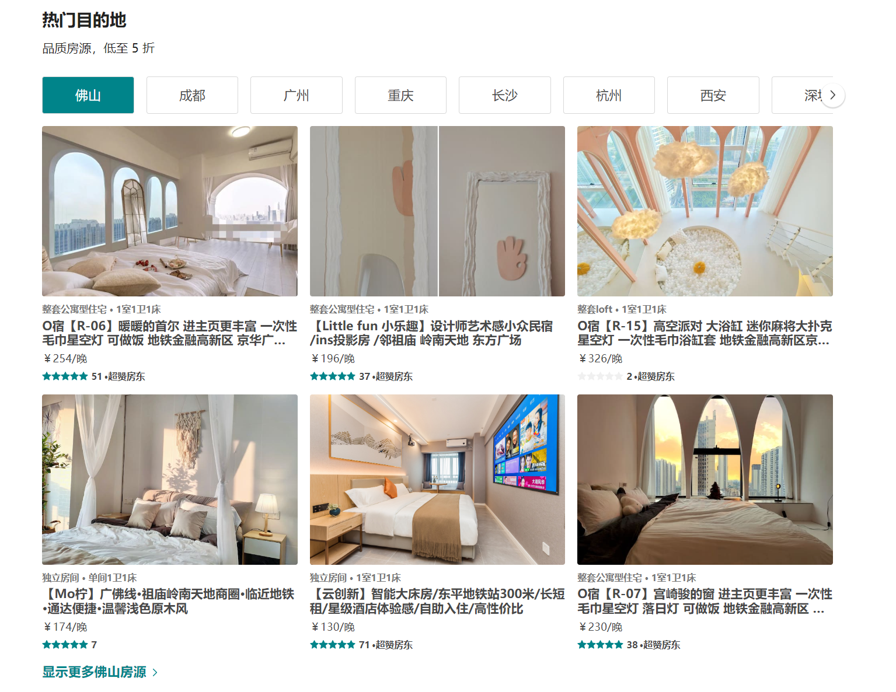

如图所示  部分板块结构略微有所不同   所以使用之前封装的section组件 难以实现

解决方案: **1. 定义新组件**   **2.  修改section组件 添加插槽**

不建议**插槽**写法      ->     内容变动太多   不好控制


定义`HomeSection2`组件 结构如下:

``` jsx
const HomeSectionV2 = memo((props) => {
  const { infoData } = props
  
  return (
    <SectionWrapper>
      {/* 头部 */}
      <SectionHeader title={infoData.title} subtitle={infoData.subtitle} />
      {/* 选项卡 */}
      <SectionTabs  />
      {/* 列表 */}
      <SectionRooms roomList={infoData.dest_list?.[name]} itemWidth="33.33333%" />
      {/* 底部 */}
      <SectionFooter name={name} />
    </SectionWrapper>
  )
})

HomeSectionV2.propTypes = {
  infoData: PropTypes.object
}

export default HomeSectionV2
```

> 结构划分:   头部  、 滑动选项卡、  房源列表、  底部

**UI样式**

``` js
export const SectionWrapper = styled.div`
  margin-top: 30px;
`
```


**修改房源卡片组件**： 设置动态宽度   ->   props传递宽度  【可实现  一列任意个】

``` js
export const RoomItemWrapper = styled.div`
  width: ${(props) => props.itemWidth};
  flex-shrink: 0;
`
```


## 七、选项卡

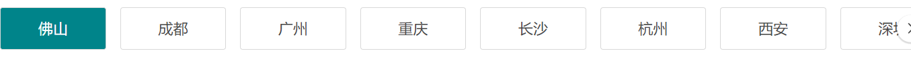

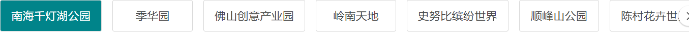

Section2组件中  具有一个选项卡联动效果:   点击选项卡   列表内容切换为选项卡对应字段

需求:  1. 点击选项卡  进行选项卡切换    2.   选项卡切换   返回对应字段

解决方案:

1.  选项卡绑定点击事件   通过current控制当前选中选项卡    样式与current匹配     点击切换current为当前选项卡index即可实现
2.  选项卡切换时    调用父组件方法 传值选中选项卡


**components/SectionTabs** 组件结构

``` jsx
const SectionTabs = memo((props) => {
  const { tabNames = [], tabClick } = props
  const [current, setCurrent] = useState(0)

  function itemClickHandle(index, item) {
    tabClick(item)
    setCurrent(index)
  }

  return (
    <TabsWrapper>
        {tabNames?.map((item, index) => {
          return (
            <div
              key={index}
              className={classNames('item', { active: current === index })}
              onClick={e => itemClickHandle(index, item)}
            >
              {item}
            </div>
          )
        })}
    </TabsWrapper>
  )
})

SectionTabs.propTypes = {
  tabNames: PropTypes.array,
  tabClick: PropTypes.func  
}


export default SectionTabs
```

>Props解释:
>
>1. tabNames   根据父组件传递的选项内容渲染
>2. tabClick       选项卡更改传值给父组件

**UI样式 ** 【暂不考虑内容超出问题】

``` js
export const TabsWrapper = styled.div`
  display: flex;
  .item {
    flex-shrink: 0;
    flex-basis: 120px;
    padding: 14px 16px;
    margin-right: 16px;
    border: 0.5px solid #d8d8d8;
    border-radius: 3px;
    font-size: 17px;
    text-align: center;
    white-space: nowrap;
    cursor: pointer;
    ${(props) => props.theme.mixins.boxShadow}
    box-sizing: border-box;

    &:last-child {
      margin-right: 0;
    }
    &.active {
      color: #fff;
      background-color: var(--p-color2);
    }
  }
`
```


**Section2组件**  需要考虑的问题:  1.  tabNames选项卡渲染内容   2.  name当前选中选项卡

``` jsx
const HomeSectionV2 = memo((props) => {
  const { infoData } = props
  // 当前选中选项
  const [name, setName] = useState()
  // 映射选项卡列表内容
  // 处理tabNames多次变化问题【优化】
  const tabNames = useMemo(() => {
    return infoData.dest_address?.map(item => item.name)
  }, [infoData])
  
  // 处理选项卡默认加载
  useEffect(() => {
    setName(tabNames && tabNames[0])
  }, [tabNames])
    
  // 处理选项卡点击切换【优化】
  const tableClickHandle = useCallback(function (item) {
    setName(item)
  }, [])
  
   return (
    <SectionWrapper>
      {/* 头部 */}
      <SectionHeader title={infoData.title} subtitle={infoData.subtitle} />
      {/* 选项卡 */}
      <SectionTabs tabNames={tabNames} tabClick={tableClickHandle} />
      {/* 列表 */}
      <SectionRooms roomList={infoData.dest_list?.[name]} itemWidth="33.33333%" />
      {/* 底部 */}
      <SectionFooter name={name} />
    </SectionWrapper>
  )
})
```


## 八、ScrollView滚动组件

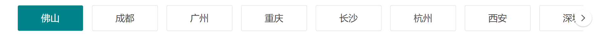


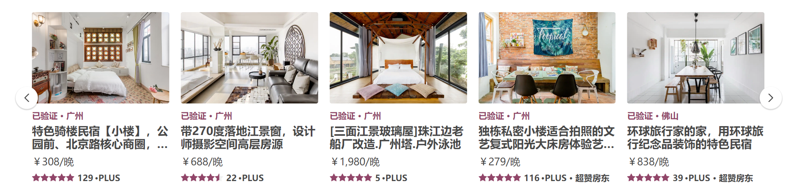

核心功能:  1. 无差别使用【任意内容皆可使用】    2.  提供内容滚动能力【按照内容滚动】

实现方法:

1. 内容采用插槽模式   对插槽进行滚动
2. 滚动使用JS操作容器移动   使用过渡来增加动画效果


难点:  **如何移动容器?**   **每次移动多少?**    **什么时候不移动?**

1. 如何移动容器:   通过 translateX位移容器 并添加过渡效果
2. 每次移动多少:   移动nextIndex下元素与容器左侧距离  【offsetLeft】
3. 什么时候不移动:  移动距离 大于 容器可滚动距离  【scrollWidth滚动宽度 -  clientWidth容器宽度 = 可滚动宽度】


新建ScrollView组件  `base_ui/ScrollView`

``` jsx
<ScrollWrapper>
  	{/* 切换按钮 */}
    <div className="control left" onClick={() => controlClickHandle(false)}>
      <IconArrowLeft />
    </div>
    <div className="control right" onClick={() => controlClickHandle(true)}>
      <IconArrowRight />
    </div>

  {/* 滚动容器 */}
  <div className="scroll">
    {/* 滚动内容 */}
    <div className="scroll-content" ref={scrollContentRef}>
      {props.children}
    </div>
  </div>
</ScrollWrapper>
```

``` js
export const ScrollWrapper = styled.div`
  padding: 8px 0;
  position: relative;

  .scroll {
    overflow: hidden;
    
    .scroll-content {
      display: flex;
      transition: transform .25s ease;
    }
  }
  
  .control {
    position: absolute;
    z-index: 9;
    display: flex;
    justify-content: center;
    align-items: center;
    width: 28px;
    height: 28px;
    background-color: #FFF;
    border: 2px solid #fff;
    border-radius: 50%;
    box-shadow: 0 1px 1px 1px rgba(0,0,0,.14);
    cursor: pointer;
    top: 50%;
    &.left {
      left: 0;
      transform: translate(-50%, -50%);
    }
    &.right {
      right: 0;
      transform: translate(50%, -50%);
    }
  }
`
```


**控制容器移动**:  例如左移

1. 通过index来标记当前移动位置  `const [index, setIndex] = useState(0)`

2. 通过ref来获取对应容器 `const scrollContentRef = useRef()`

3. 组件渲染完计算当前容器可移动距离 并保存

   ``` js
   // 组件渲染完 获取可滚动距离并判断是否显示右侧按钮
   const totalDistanceRef = useRef()
   useEffect(() => {
       const scrollWidth = scrollContentRef.current.scrollWidth
       const clientWidth = scrollContentRef.current.clientWidth
       const totalDistance = scrollWidth - clientWidth
       totalDistanceRef.current = totalDistance
       setShowRight(totalDistance > 0)
   }, [props.children])
   ```

4. 控制index变换  并计算需要移动的距离【nextIndex下元素与容器左侧距离】

   ``` js
   // 处理按钮点击【移动】 -> 每次移动距离(下一个元素距离左侧距离)
   function controlClickHandle(isRight) {
       const newIndex = isRight ? index + 1 : index - 1
       const newEl = scrollContentRef.current.children[newIndex]
       const newOffsetLeft = newEl.offsetLeft
       scrollContentRef.current.style.transform = `translate(-${newOffsetLeft}px)`
       setIndex(newIndex)
       // 是否继续显示右侧的按钮(可滚动距离【滚动长度 - 容器长度】 > 滚动距离)
       // 是否继续显示左侧的按钮(有滚动距离)
       setShowRight(totalDistanceRef.current > newOffsetLeft)
       setShowLeft(newOffsetLeft > 0)
   }
   ```


**使用ScrollView组件**  ->  `SectionTabs`组件  **需要移除容器display:flex样式 :crossed_fingers:**

``` jsx
<TabsWrapper>
  <ScrollView>
    {tabNames?.map((item, index) => {
      return (
        <div
          key={index}
          className={classNames('item', { active: current === index })}
          onClick={e => itemClickHandle(index, item)}
        >
          {item}
        </div>
      )
    })}
  </ScrollView>
</TabsWrapper>
```


## 九、Section3组件

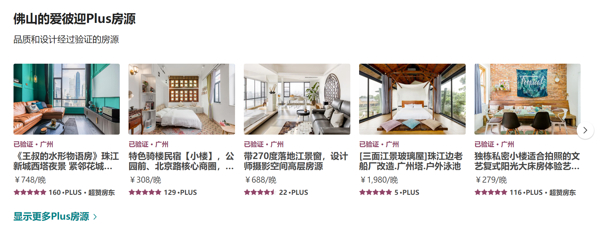

如图所示 Plus板块 中间内容是可滚动  section与section2组件都不满足  重新封装section3组件定义板块内容

**在Home页下新建`HomeSection3`组件 **  结构如下:

``` jsx
const HomeSectionV3 = memo((props) => {
  const { infoData } = props

  return (
    <SectionWrapper>
      {/* 头部 */}
      <SectionHeader title={infoData.title} subtitle={infoData.subtitle} />
      {/* 列表 */}
      <div className="room-list">
        <ScrollView>
          {infoData.list.map(item => <RoomItem key={item.id} itemWidth="20%" itemData={item} />)}
        </ScrollView>
      </div>
      {/* 底部 */}
      <SectionFooter name='Plus' />
    </SectionWrapper>
  )
})
```

``` js
export const SectionWrapper = styled.div`
  margin-top: 30px;
  .room-list {
    margin: 0 -8px;
  }
`
```


## 十、Longfor组件

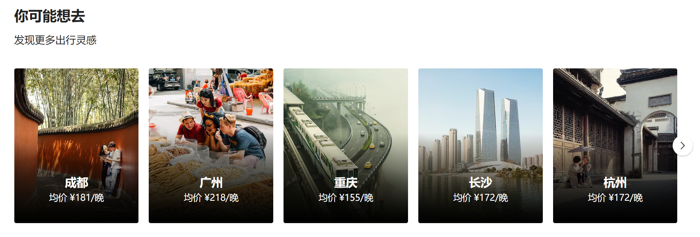

该版块内容需要重新定制编写组件

分析结构:  头部【section头部组件即可】 + 内容【需要重新编写】

**在Home页新建`HomeLongFor`组件**

``` jsx
const HomeLongfor = memo((props) => {
  const { infoData } = props
  return (
    <LongforWrapper>
      <SectionHeader title={infoData.title} subtitle={infoData.subtitle} />
      <div className="longfor-list">
        <ScrollView>
          {
            infoData.list.map(item => <LongforItem itemData={item} key={item.city} />)
          }
        </ScrollView>
      </div>
    </LongforWrapper>
  )
})
```

   ``` js
   export const LongforWrapper = styled.div`
     margin-top: 30px;
     .longfor-list {
       margin: 0 -8px;
     }
   `
   ```

中间内容可具体封装为`LongforItem`组件

注意点: 1. 组件之间间隔问题【采用容器间距法】 2.  底部黑色渐变遮罩【定位 + 渐变色 `background-image: linear-gradient(-180deg, rgba(0, 0, 0, 0) 3%, rgb(0, 0, 0) 100%);`】

``` jsx
const LongforItem = memo((props) => {
  const { itemData } = props
  return (
    <ItemWrapper>
      <div className="inner">
        <div className="item-info">
          
          <div className="bg-cover"></div>
          <div className="info">
            <div className="city">{itemData.city}</div>
            <div className="price">均价 {itemData.price}</div>
          </div>
        </div>
      </div>
    </ItemWrapper>
  )
})
```

``` js

export const ItemWrapper  = styled.div`
  width: 20%;
  flex-shrink: 0;
  .inner {
    padding: 8px;
    .item-info {
      position: relative;
      overflow: hidden;
      border-radius: 3px;
    }
  }

  .cover {
    width: 100%;
  }

  .bg-cover {
    position: absolute;
    left: 0;
    right: 0;
    bottom: 0;
    height: 60%;
    background-image: linear-gradient(-180deg, rgba(0, 0, 0, 0) 3%, rgb(0, 0, 0) 100%);
  }

  .info {
    position: absolute;
    left: 8px;
    right: 8px;
    bottom: 0;
    display: flex;
    flex-direction: column;
    justify-content: center;
    align-items: center;
    padding: 0 24px 32px;
    color: #fff;
    .city {
      font-size: 18px;
      font-weight: 600;
    }
    .price {
      font-size: 14px;
      margin-top: 5px;
    }
  }
`
```

## 十一、总结

1. 主页内容主要以展示组件居多   交互效果不多
2. 重点关注于组件的拆分  尽可能的拆分页面内容  组成组件拼凑  可方便后期的管理与维护
3. 页面需要共享的数据  统一由Redux进行管理   组件自己的状态由组件管理

**Home页面最终效果**

``` jsx
const Home = memo(() => {
  const { goodPriceInfo, highScoreInfo, discountInfo, hotInfo, plusInfo, longforInfo } = useSelector(state => state.home, shallowEqual)
  const dispatch = useDispatch()

  useEffect(() => {
    dispatch(changeHeaderConfig({ isFixed: true, topAlpha: true }))
    dispatch(fetchHomeDataAction())
  }, [dispatch])

  return (
    <HomeWrapper>
      {/* Banner */}
      <HomeBanner />
      <div className='content'>
        {/* 热门目的地 */}
        {isEmptyO(discountInfo) && <HomeSectionV2 infoData={discountInfo} />}
        {/* 探索 */}
        {isEmptyO(hotInfo) && <HomeSectionV2 infoData={hotInfo} />}
        {/* 你可能想去 */}
        {isEmptyO(longforInfo) && <HomeLongfor infoData={longforInfo} />}
        {/* 性价比 */}
        {isEmptyO(goodPriceInfo) && <HomeSectionV1 infoData={goodPriceInfo} />}
        {/* 高分好评 */}
        {isEmptyO(highScoreInfo) && <HomeSectionV1 infoData={highScoreInfo} />}
        {/* Plus房源 */}
        {isEmptyO(plusInfo) && <HomeSectionV3 infoData={plusInfo} />}
      </div>
    </HomeWrapper>
  )
})
```

