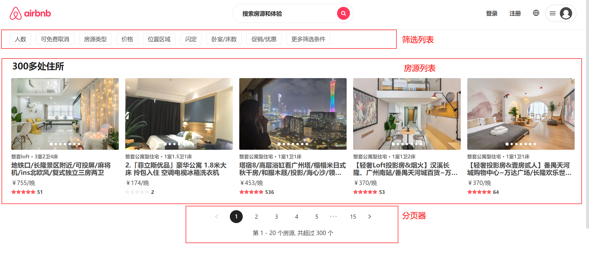
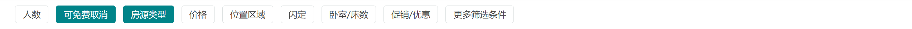
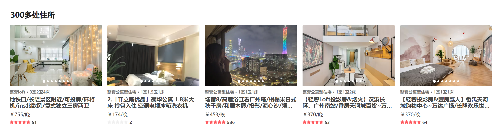
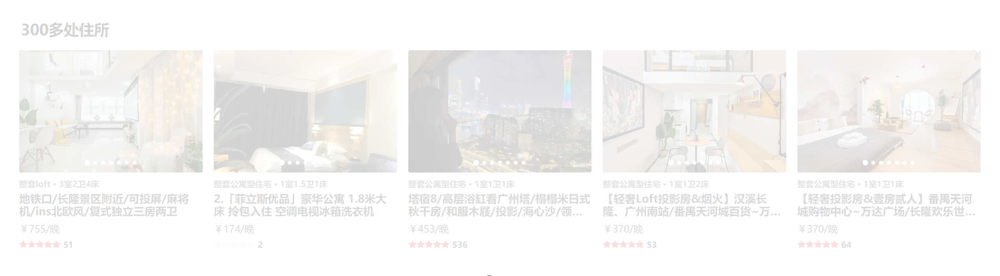
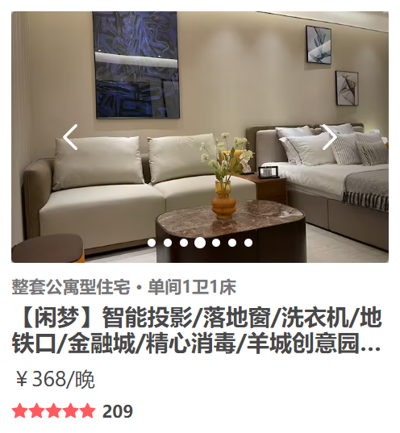
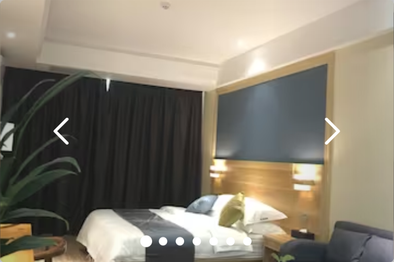

# 4- 全部页

## 一、布局分析



全部页布局可主分为三大板块:  筛选列表、  房源列表 、  分页器

**筛选列表**:  主要用于筛选不同类型 品类的房源    【本项目只做静态效果】

**房源列表**：根据后台提供数据   渲染对应房源信息

**分页器**:   通过分页控制房源列表的内容切换


**Entire组件**  【只作为容器 承载三大板块内容】

``` jsx
const Entire = memo(() => {
  const dispatch = useDispatch()
  useEffect(() => {
    dispatch(changeHeaderConfig({ isFixed: true, topAlpha: false }))
    dispatch(fetchEntireDataAction())
  }, [dispatch])

  return (
    <EntireWrapper>
      {/* 筛选列表 */}
      <EntireFilter />
      {/* 房源列表 */}
      <EntireRooms />
      {/* 分页器 */}
      <EntirePagination />
    </EntireWrapper>
  )
})
```


## 二、获取数据

1. 封装`api/entire.js`接口

   ``` js
   import request from '..'
   
   // 获取全部房源信息  offset偏移值  size每页条数
   export const getEntireRoomList = (offset = 0, size = 20) =>
     request.get({ url: '/entire/list', params: { offset, size } })
   
   ```

2. 在redux中获取内容  并存储

   新建`entire.js` reducer切片

   ``` js
   import { getEntireRoomList } from '@/api/modules/entire'
   import { createSlice, createAsyncThunk } from '@reduxjs/toolkit'
   
   export const fetchEntireDataAction = createAsyncThunk(
     'fetchEntireData',
     async (page = 0, { dispatch }) => {
       dispatch(changeLoading(true))
       const list = await getEntireRoomList(page * 20, 5)
       return list
     }
   )
   
   export const EntireSlice = createSlice({
     name: 'entire',
     initialState: {
       roomList: [],
       totalCount: 0,
       isLoading: true
     },
     reducers: {
       changeLoading(state, { payload }) {
         state.isLoading = payload
       }
     },
     extraReducers: (builder) => {
       builder.addCase(fetchEntireDataAction.fulfilled, (state, { payload }) => {
         state.isLoading = false
         state.roomList = payload.list
         state.totalCount = payload.totalCount
       })
     },
   })
   
   export const { changeLoading } = EntireSlice.actions
   
   export default EntireSlice.reducer
   
   ```

3. `entire`页面dispatchAction即可

   ``` jsx
   const dispatch = useDispatch()
   useEffect(() => {
       dispatch(changeHeaderConfig({ isFixed: true, topAlpha: false }))
       dispatch(fetchEntireDataAction())
   }, [dispatch])
   ```


## 三、筛选列表



主要功能： 无极筛选   所有元素都激活   点击激活  再次点击取消激活

实现方案:   通过数组保存筛选状态   点击无则添加 有则删除

**在entire页新建`EntrieFilter`组件**

``` jsx
const EntireFilter = memo((props) => {
  // 选中列表
  const [selectItems, setSelectItems] = useState([])

  function itemClickHandle(item) {
    const newItems = [...selectItems]
    // 判断是否存在
    if (newItems.includes(item)) { // 删除
      const index = newItems.indexOf(item)
      newItems.splice(index)
    } else { // 添加
      newItems.push(item)
    }
    setSelectItems(newItems)
  }

  return (
    <FilterWrapper>
      <div className="list">
        {
          filterData.map(item => (
            <div
              key={item}
              className={classNames('item', { active: selectItems.includes(item) })}
              onClick={() => itemClickHandle(item)}
            >
              {item}
            </div>
          ))
        }
      </div>
    </FilterWrapper>
  )
})
```

``` js
export const FilterWrapper = styled.div`
  position: fixed;
  top: 80px;
  left: 0;
  right: 0;
  display: flex;
  align-items: center;
  height: 48px;
  padding-left: 16px;
  box-sizing: border-box;
  border-bottom: 1px solid #f2f2f2;
  background-color: #fff;
  z-index: 9;

  .list {
    display: flex;

    .item {
      margin: 0 4px 0 8px;
      padding: 6px 12px;
      border: 1px solid #dce0e0;
      border-radius: 4px;
      color: #484848;
      cursor: pointer;

      &.active {
        background: #008489;
        border: 1px solid #008489;
        color: #fff;
      }
    }
  }
`
```


## 四、房源列表



> 房源列表功能比较多  我们先完成最基础版  渲染即可！！！

结构分析:  标题 + 列表【可使用`RoomItem`组件】

**在entire页新建`EntrieRooms`组件**

``` jsx

const EntireRooms = memo((props) => {
  const { roomList, totalCount, isLoading } = useSelector(state => state.entire, shallowEqual)

  return (
    <RoomsWrapper>
      <h2 className='title'>{totalCount}多处住所</h2>
      <div className="list">
        {
          roomList.map(item => (
            <RoomItem
              itemData={item}
              itemWidth="20%"
              key={item._id}
            />
          ))
        }
    </RoomsWrapper >
  )
})
```

``` js
import styled from 'styled-components'

export const RoomsWrapper = styled.div`
  position: relative;
  margin-top: 128px;
  padding: 30px 20px;

  .title {
    font-size: 22px;
    font-weight: 700;
    color: #222;
    margin: 0 0 10px 10px;
  }

  .list {
    display: flex;
    flex-wrap: wrap;
  }

`
```


## 五、分页器


结构分析:   分页器列表  +  分页详情

实现： `分页器`我们采用antd提供的分页器组件    并通过css调整为项目需要的样式结构

**在entire页新建`EntriePagination`组件**

``` jsx

const EntirePagination = memo((props) => {
  const [current, setCurrent] = useState(1)
  const { totalCount } = useSelector(state => ({
    totalCount: state.entire.totalCount
  }), shallowEqual)

  // 计算起、未
  const startCount = (current - 1) * 20 + 1
  const endCount = current * 20


  return (
    <PaginationWrapper>
      {!!totalCount && (
        <>
          <Pagination showSizeChanger={false} current={current} total={totalCount} onChange={pageChange} pageSize={20} />
          <div className="desc">
            第 {startCount} - {endCount} 个房源, 共超过 {totalCount} 个
          </div>
        </>
      )}
    </PaginationWrapper>
  )
})
```

``` js

export const PaginationWrapper = styled.div`
  display: flex;
  justify-content: center;
  flex-direction: column;
  align-items: center;

  .ant-pagination-item-link {
    font-size: 14px;
  }
  .ant-pagination-item {
    border-radius: 50%;
    margin: 0 9px;
    &:hover {
      text-decoration: underline;
    }
    &.ant-pagination-item-active {
      background-color: #222;
      border: 0;
      a {
        color: #fff;
      }
    }
  }

  .desc {
    margin-top: 16px;
  }
`
```


实现分页跳转:  1. 给分页器绑定onChange事件 并通过current控制页码  2.  页面跳转回到顶部

**绑定onChange事件**

``` jsx
 const [current, setCurrent] = useState(1)

<Pagination showSizeChanger={false} current={current} total={totalCount} onChange={pageChange} pageSize={20} />
```

 **页面跳转回到顶部** 

``` jsx
// 处理页码改变
const dispatch = useDispatch()
const pageChange = (page) => {
    // 回到顶部
    window.scrollTo(0, 0)
    dispatch(fetchEntireDataAction(page - 1))
    // 重新发送请求
    setCurrent(page)
}
```


## 六、数据加载遮罩层



如图所示   在加载房源数据时   由于网络延迟性可能会导致 页面停滞时间久  大大降低用户体验

解决方案： 加载数据时  显示遮罩层  提供一个加载的效果  优化体验

**EntireRoom组件  添加cover层**

``` jsx
{isLoading && <div className='cover'></div>}
```

``` jsx
> .cover {
    position: absolute;
    left: 0;
    right: 0;
    top: 0;
    bottom: 0;
    background-color: rgba(255, 255, 255, .8);
}
```

通过`isLoading`状态来判断是否加载完成   **isLoading需要在redux中定义！！！**


## 七、房源图片轮播



房源列表中 由于房源图片过多 所以如果要将所有图片显示  只能将图片放入一个走马灯中  用轮播的方式展示

实现方案:  1. 使用antd的走马灯组件   2.  封装指示器组件【antd指示器不符合需求】

**改写`RoomItem组件`**

1. 判断图片是否有多个  【需要切换的内容过多  定义成变量进行切换】

   ``` jsx
   {itemData.picture_urls ? SliderElement : PictureElement}
   ```

2. 单图结构

   ``` jsx
   // 单图
   const PictureElement = (
       <div className='cover'>
         
       </div>
   )
   ```

3. 多图结构  【**指示器组件需要单独封装**】

   ```jsx
   const sliderRef = useRef()
   
   /** 控制器事件处理 */
   function controlClickHandle(isNext, event) {
       // 切换走马灯
       isNext ? sliderRef.current.next() : sliderRef.current.prev()
       // 阻止事件冒泡
       event.stopPropagation()
   }
   
   
   // 多图
   const SliderElement = (
       <div className='slider'>
         {/* 控制器 */}
         <div className="control">
           <div className="btn left" onClick={(e) => controlClickHandle(false, e)}>
             <IconArrowLeft width="18" height="18" />
           </div>
           <div className="btn right" onClick={(e) => controlClickHandle(true, e)}>
             <IconArrowRight width="18" height="18" />
           </div>
         </div>
         {/* 指示器 */}
         {/* 走马灯 */}
         <Carousel dots={false} ref={sliderRef} beforeChange={(o, n) => setCurrent(n)}>
           {
             itemData?.picture_urls?.map(item => (
               <div className='cover' key={item}>
                 
               </div>
             ))
           }
         </Carousel>
       </div>
   )
   ```

   ``` js
   export const RoomItemWrapper = styled.div`
   .slider {
       position: relative;
       cursor: pointer;
   
       &:hover .control {
         display: flex;
       }
   
       .control {
         position: absolute;
         z-index: 1;
         left: 0;
         right: 0;
         top: 0;
         bottom: 0;
         color: #fff;
         display: none;
         justify-content: space-between;
   
         .btn {
           display: flex;
           justify-content: center;
           align-items: center;
           width: 83px;
           height: 100%;
           background: linear-gradient(
             to left,
             transparent 0%,
             rgba(0, 0, 0, 0.25) 100%
           );
   
           &.right {
             background: linear-gradient(
               to right,
               transparent 0%,
               rgba(0, 0, 0, 0.25) 100%
             );
           }
         }
       }
     }
   `
   ```


## 八、指示器组件



无限指示器功能需求: 

1. 可根据索引切换
2. 切换超过一半移动指定器

**新建`base_ui/Indicator组件`**

> 核心判断:  
>
> 1. 每次移动的距离:  （索引元素距离左侧大小 + 容器的一半 ） -  容器一半宽度
> 2. 一半之前不移动  ->    每次移动距离 <  0
> 3. 可移动距离为0  ->  到底了

``` jsx
const Indicator = memo((props) => {
  const { current = 0 } = props
  const contentRef = useRef()

  useEffect(() => {
    // 1. 获取current对应的item
    const itemEl = contentRef.current.children[current]
    const itemLeft = itemEl.offsetLeft
    const itemWidth = itemEl.clientWidth
    // 2. 获取content的宽度
    const contentWidth = contentRef.current.clientWidth
    const contentScroll = contentRef.current.scrollWidth
    // 3. 计算需要滚动的距离 【对应item距离左边距离 + 一半宽度】
    let distance = itemLeft + itemWidth * 0.5 - contentWidth * 0.5
    // 处理边界值【一半之前不移动】
    if (distance < 0) distance = 0
    // 处理边界值【到底了不移动】
    const totalDistance = contentScroll - contentWidth
    if (distance > totalDistance) distance = totalDistance
    // 4. 移动位置
    contentRef.current.style.transform = `translate(-${distance}px)`
  }, [current])
  
  return (
    <IndicatorWrapper>
      <div className="i-content" ref={contentRef}>
        {props.children}
      </div>
    </IndicatorWrapper>
  )
})
```

``` js
export const IndicatorWrapper = styled.div`
  overflow: hidden;
  .i-content {
    display: flex;
    position: relative;
    transition: transform 200ms ease;

    > * {
      flex-shrink: 0;
    }
  }
`
```


**更改`RoomItem`组件**

``` jsx
{/* 指示器 */}
<div className="indicator">
    <Indicator current={current}>
      {
        itemData?.picture_urls?.map((item, index) => (
          <div className='item' key={item}>
            <div className={classNames('dot', { active: index === current })}></div>
          </div>
        ))
      }
    </Indicator>
</div>
```

``` js
.indicator {
  width: 30%;
  margin: 0 auto;
  position: absolute;
  bottom: 10px;
  left: 0;
  right: 0;
  z-index: 9;

  .item {
    display: flex;
    align-items: center;
    justify-content: center;
    width: 14.29%;

    .dot {
      width: 6px;
      height: 6px;
      background-color: #fff;
      border-radius: 50%;
      margin: 0 ;

      &.active {
        width: 8px;
        height: 8px;
      }
    }
  }
}
```


## 九、总结

核心功能点:

1. 分页查询房源信息
2. 房源轮播图 以及 指示器组件的封装

3. 分页器的二次修改