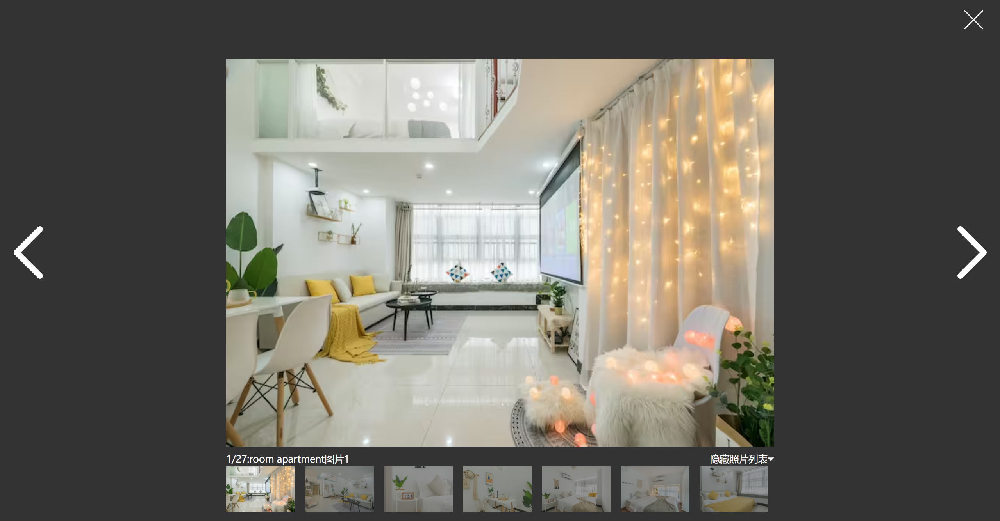

# 5- 详情页

## 1. 分析页面


详情页面 只做照片墙的渲染  以及  图片浏览器组件的封装

其他内容暂且不做


## 2. 加载数据

目前涉及到跨页面  传值则通过 redux存储房源详情内容 

``` js
import * as types from './constants'

// 初始数据
const detailState = {
  roomDetail: {
    picture_urls: [
      'https://z1.muscache.cn/im/pictures/205f9323-ff95-4881-9cdf-8640da95035b.jpg?aki_policy=large',
      'https://z1.muscache.cn/im/pictures/d34ab35b-14f7-4fa3-9b05-e4c68e982ced.jpg?aki_policy=large',
      'https://z1.muscache.cn/im/pictures/28102836-5f34-4385-907b-d0874aac1a89.jpg?aki_policy=large',
      'https://z1.muscache.cn/im/pictures/52823d6c-5067-4e5c-9c51-c14dfcdf72c0.jpg?aki_policy=large',
      'https://z1.muscache.cn/im/pictures/f15c8bbc-f1f6-4a69-b8f2-0b32ca987438.jpg?aki_policy=large',
      'https://z1.muscache.cn/im/pictures/f794c5be-d2a3-4734-8f68-f36b7728328d.jpg?aki_policy=large',
      'https://z1.muscache.cn/im/pictures/9912ab53-6ea2-4108-90c1-89d0662cfa7c.jpg?aki_policy=large',
      'https://z1.muscache.cn/im/pictures/4f3953cd-c1bb-4b92-8ed4-a12e06c532b5.jpg?aki_policy=large',
    ]
  },
}

const detailReducer = (state = detailState, action) => {
  switch (action.type) {
    case types.SET_ROOM_DETAIL:
      return { ...state, roomDetail: action.detail }
    default:
      return state
  }
}

export default detailReducer
```


**什么时候传值? ** 点击房源信息时

``` js
const navigate = useNavigate()
const dispatch = useDispatch()
function goDetail(itemData) {
    dispatch(setRoomDetail(itemData))
    navigate('/detail')
}
```


## 3. 详情页布局

详情页主分为:  照片墙  + 详情内容

**Detail页面**

``` jsx
const Detail = memo(() => {
  const dispatch = useDispatch()
  useEffect(() => {
    dispatch(changeHeaderConfig({ isFixed: false, topAlpha: false }))
  }, [dispatch])

  return (
    <DetailWrapper>
      <DetailPictures />
      <DetailInfos />
    </DetailWrapper>
  )
})
```


## 4. 照片墙组件


分析结构：  左  + 右（图片flex布局）

**新建 `DetailPictures`**

``` jsx

const DetailPictures = memo(() => {
  const [showBrowser, setShowBrowser] = useState(false)
  const { roomDetail } = useSelector(state => state.detail, shallowEqual)

  return (
    <PicturesWrapper>
      <div className="pictures">
        <div className="left">
          <div className="item" onClick={() => setShowBrowser(true)}>
            
            <div className="cover"></div>
          </div>
        </div>
        <div className="right">
          {
            roomDetail?.picture_urls?.slice(1, 5).map(item => (
              <div className="item" key={item} onClick={() => setShowBrowser(true)}>
                
                <div className="cover"></div>
              </div>
            ))
          }
        </div>
      </div>
      <div className="show-btn" onClick={() => setShowBrowser(true)}>显示照片</div>
      {showBrowser && <PictureBrowser pictureUrls={roomDetail.picture_urls} closeClick={() => setShowBrowser(false)} />}
    </PicturesWrapper>
  )
})
```

``` js

export const PicturesWrapper = styled.div`
  position: relative;

  > .pictures {
    display: flex;
    height: 440px;
    background-color: #000;
    &:hover {
      .cover {
        opacity: 1 !important;
      }
    }

    .left,
    .right {
      width: 50%;
      height: 100%;
      .item {
        position: relative;
        height: 100%;
        overflow: hidden;
        cursor: pointer;
        border: 1px solid #000;
        box-sizing: border-box;

        img {
          width: 100%;
          height: 100%;
          object-fit: cover;
          transition: transform 0.3s ease-in;
        }

        .cover {
          position: absolute;
          left: 0;
          right: 0;
          top: 0;
          bottom: 0;
          background-color: rgba(0, 0, 0, 0.3);
          opacity: 0;
          transition: opacity 200ms ease;
        }

        &:hover {
          img {
            transform: scale(1.08);
          }
          .cover {
            opacity: 0 !important;
          }
        }
      }
    }

    .right {
      display: flex;
      flex-wrap: wrap;

      .item {
        width: 50%;
        height: 50%;
      }
    }
  }

  .show-btn {
    position: absolute;
    z-index: 99;
    right: 15px;
    bottom: 15px;
    line-height: 22px;
    border-radius: 4px;
    padding: 6px 15px;
    background-color: #fff;
    cursor: pointer;
    font-weight: 700;
  }
`
```


## 5. 图片浏览器组件



布局分析： 上【关闭按钮】 +  中【切换按钮 + 图片】  + 下 【图片列表`指示器`】

**新建`PictureBrowser`组件**

``` jsx

const PictureBrowser = memo((props) => {
  const { pictureUrls, closeClick } = props
  const [current, setCurrent] = useState(0)
  const [showList, setShowList] = useState(true)

  // 当图片浏览器展示, 禁止浏览器滚动
  useEffect(() => {
    document.body.style.overflow = 'hidden'
    return () => {
      document.body.style.overflow = 'auto'
    }
  }, [])

  // 关闭
  function closeBtnClickHandle() {
    if (closeClick) closeClick()
  }

  // 图片切换
  function controlClickHandle(isNext = true) {
    let newIndex = isNext ? current + 1 : current - 1
    if (newIndex < 0) newIndex = pictureUrls.length - 1
    if (newIndex > pictureUrls.length - 1) newIndex = 0
    setCurrent(newIndex)
  }

  return (
    <BrowserWrapper showList={showList}>
      <div className="top">
        <div className="close-btn" onClick={closeBtnClickHandle}>
          <IconClose />
        </div>
      </div>
      <div className="slider">
        <div className="control">
          <div className="btn left" onClick={() => controlClickHandle(false)}>
            <IconArrowLeft width="77" height="77" />
          </div>
          <div className="btn right" onClick={() => controlClickHandle(true)}>
            <IconArrowRight width="77" height="77" />
          </div>
        </div>
        <div className="picture">
          
        </div>
      </div>
      <div className="preview">
        <div className="info">
          <div className="desc">
            <div className="count">
              <span>{current + 1}/{pictureUrls.length}:</span>
              <span>room apartment图片{current + 1}</span>
            </div>
            <div className="toggle" onClick={() => setShowList(!showList)}>
              <span>{showList ? '隐藏' : '显示'}照片列表</span>
              {showList ? <IconTriangleArrowBottom /> : <IconTriangleArrowTop />}
            </div>
          </div>
          <div className="list">
            <Indicator current={current}>
              {
                pictureUrls.map((item, index) => (
                  <div
                    key={item}
                    className={classNames('item', { active: index === current })}
                    onClick={() => setCurrent(index)}
                  >
                    
                  </div>
                ))
              }
            </Indicator>
          </div>
        </div>
      </div>
    </BrowserWrapper>
  )
})
```

``` js
import styled from 'styled-components'

export const BrowserWrapper = styled.div`
  position: fixed;
  z-index: 999;
  left: 0;
  right: 0;
  top: 0;
  bottom: 0;
  display: flex;
  flex-direction: column;
  background-color: #333;

  .top {
    position: relative;
    height: 86px;

    .close-btn {
      position: absolute;
      top: 15px;
      right: 25px;
      cursor: pointer;
    }
  }

  .slider {
    position: relative;
    display: flex;
    justify-content: center;
    flex: 1;
    .control {
      position: absolute;
      z-index: 1;
      left: 0;
      right: 0;
      top: 0;
      bottom: 0;
      display: flex;
      justify-content: space-between;
      color: #fff;

      .btn {
        display: flex;
        justify-content: center;
        align-items: center;
        width: 83px;
        height: 100%;
        cursor: pointer;
      }
    }

    .picture {
      max-width: 105vh;
      height: 100%;
      img {
        width: 100%;
        height: 100%;
        user-select: none;
      }
    }
  }

  .preview {
    display: flex;
    justify-content: center;
    height: 100px;
    margin-top: 10px;

    .info {
      max-width: 105vh;
      color: #fff;

      .desc {
        display: flex;
        justify-content: space-between;

        .toggle {
          cursor: pointer;
        }
      }

      .list {
        margin-top: 3px;
        height: ${props => props.showList ? '67px' : '0' };
        overflow: hidden;

        .item {
          margin-right: 15px;
          cursor: pointer;

          img {
            height: 67px;
            opacity: 0.5;
          }

          &.active {
            img {
              opacity: 1;
            }
          }
        }
      }
    }
  }
`

```


## 6. 信息组件

直接编写组件  作为占位


## 7. 细节处理

每次页面跳转后   设置滚动条还原

**hooks/useScrollTop**

``` js
import { useEffect } from 'react'
import { useLocation } from 'react-router-dom'

export default function useScrollTop() {
  // 实现页面跳转【监听页面跳转】滚动至顶部
  const location = useLocation()
  useEffect(() => {
    window.scrollTo(0, 0)
  }, [location.pathname])
}
```

**layout页**

``` jsx
const Layout = memo(() => {
  useScrollTop()

  return (
    <LayoutWrapper>
      <AppHeader />
      <Suspense fallback={<Spin size="large" className='layout-spin'/>}>
        <Outlet></Outlet>
      </Suspense>
      <AppFooter />
    </LayoutWrapper>
  )
})
```

