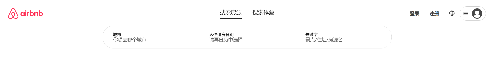
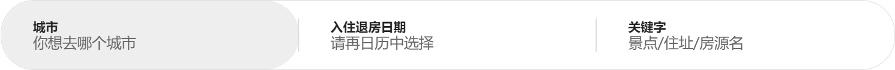
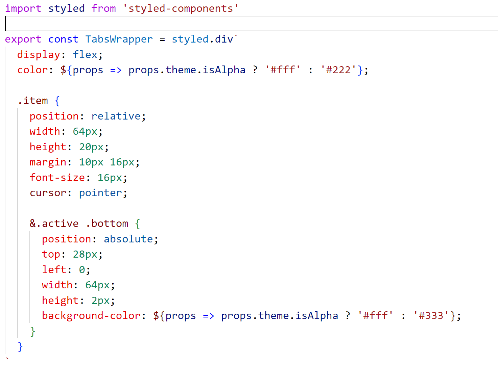
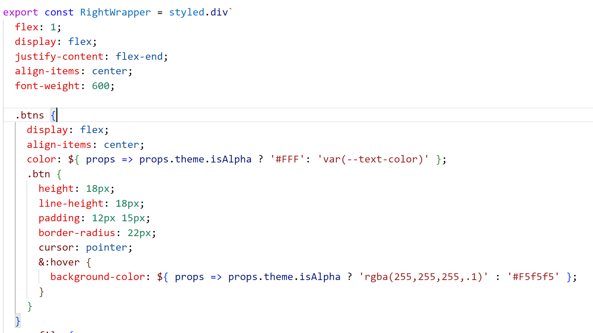

# 6- 头部动画

## 1. 结构分析


头部有2种状态： 1. 搜索栏状态  2.  搜索栏展开状态


编写步骤：  先编写布局   再实现动画   最后实现不同页面下头部效果


## 2.  搜索栏详情



搜索栏详情主体分为2大内容:  1. 搜索选项卡  2. 搜索筛选框

**搜索栏详情布局 `AppHeader/HeaderCenter`** 

``` jsx
const titles = SearchTitles.map(item => item.title)
const [tabIndex, setTabIndex] = useState(0)

<div className="search-detail">
  <SearchTabs titles={titles} tabClick={setTabIndex} />
  <div className="infos">
    <SearchSections searchInfos={SearchTitles[tabIndex].searchInfos} />
  </div>
</div>
```

``` js
`
.search-detail {
    position: relative;
    transform-origin: center top;
    will-change: transform, opacity;

    .infos {
      position: absolute;
      top: 60px;
      left: 50%;
      transform: translateX(-50%);
    }
  }
`
```


## 3. 搜索选项卡


**SearchTabs组件 **   通过传递的tabs选项 渲染内容   并将选择的选项传递给父组件

``` jsx

const SearchTabs = memo((props) => {
  const { titles, tabClick } = props
  const [current, setCurrent] = useState(0)

  function tabClickHandle(index) {
    if (tabClick) tabClick(index)
    setCurrent(index)
  }

  return (
    <TabsWrapper>
      {
        titles.map((item, index) => (
          <div
            className={classNames('item', { active: index === current })}
            key={item}
            onClick={() => tabClickHandle(index)}
          >
            <span className='text'>{item}</span>
            <span className='bottom'></span>
          </div>
        ))
      }
    </TabsWrapper>
  )
})
```

``` js
export const TabsWrapper = styled.div`
  display: flex;
  color: '#222';

  .item {
    position: relative;
    width: 64px;
    height: 20px;
    margin: 10px 16px;
    font-size: 16px;
    cursor: pointer;

    &.active .bottom {
      position: absolute;
      top: 28px;
      left: 0;
      width: 64px;
      height: 2px;
      background-color: '#333';
    }
  }
`
```


## 4. 搜索筛选框



**新建 SearchSections组件 **  根据父组件传递的筛选类型 进行渲染结构

``` jsx
const SearchSections = memo((props) => {
  const { searchInfos } = props

  return (
    <SectionsWrapper>
      {searchInfos.map((item, index) => (
        <div className="item" key={index}>
          <div className="info">
            <div className="title">{item.title}</div>
            <div className="desc">{item.desc}</div>
          </div>
          {index !== searchInfos.length - 1 && <div className="divider"></div>}
        </div>
      ))}
    </SectionsWrapper>
  )
})

```

``` js

export const SectionsWrapper = styled.div`
  display: flex;
  width: 850px;
  height: 66px;
  border-radius: 32px;
  border: 1px solid #ddd;
  background-color: #fff;

  .item {
    flex: 1;
    display: flex;
    align-items: center;
    border-radius: 32px;

    .info {
      flex: 1;
      display: flex;
      flex-direction: column;
      justify-content: center;
      padding: 0 30px;

      .title {
        font-size: 12px;
        font-weight: 800;
        color: #222;
      }

      .desc {
        font-size: 14px;
        color: #666;
      }
    }

    .divider {
      height: 32px;
      width: 1px;
      background-color: #ddd;
    }

    &:hover {
      background-color: #eee;
    }
  }
`
```

## 5. 联动效果


效果:   点击搜索栏   ->   显示搜索详情栏

**AppHeader修改项**

1. 为`AppHeader`组件 添加 `<div className="search-area"></div>` 容器作为搜索详情的载体
2. 为`AppHeader`组件 添加 `<div className="cover" />` 遮罩作为搜索详情的遮罩层
3. 通过`isSearch`状态控制组件显示隐藏

``` jsx
const [isSearch, setIsSearch] = useState(false)


<AppHeaderWrapper isSearch={isSearch}>
    <div className="content">
      <div className="top">
        <HeaderLeft />
        <HeaderCenter isSearch={isSearch} searchBarClick={() => setIsSearch(true)} />
        <HeaderRight />
      </div>
      <div className="search-area"></div>
    </div>
    {isSearch && <div className="cover" onClick={() => setIsSearch(false)}></div>}
</AppHeaderWrapper>

```

```scss
.content {
    position: relative;
    z-index: 19;
    background-color: rgba(255,255,255,1);
    border-bottom: 1px solid #eee;
    box-sizing: border-box;
    .top {
      display: flex;
      height: 80px;
      align-items: center;
    }
    .search-area {
      transition: height .25s ease;
      height: ${(props) => (props.isSearch ? '100px' : '0px')};
    }
}

.cover {
    position: fixed;
    left: 0;
    right: 0;
    top: 0;
    bottom: 0;
    z-index: 9;
    background-color: rgba(0, 0, 0, 0.3);
}
```


**HeaderCenter修改项**

1. 定义Props接收  搜索状态 以及  切换方法
2. 通过搜索状态控制  搜索栏 与 搜索详情

``` jsx
const HeaderCenter = memo((props) => {
  const { isSearch, searchBarClick } = props

  const titles = SearchTitles.map(item => item.title)
  const [tabIndex, setTabIndex] = useState(0)

  function searchBarClickHandle() {
    if (searchBarClick) searchBarClick()
  }

  return (
    <CenterWrapper> 
     {!isSearch ? 
     	(
         	<div className="search-bar" onClick={searchBarClickHandle}>
              <div className="text">搜索房源和体验</div>
              <div className="icon"><IconSearchBar /></div>
            </div>
         ) ：
         (
          	<div className="search-detail">
              <SearchTabs titles={titles} tabClick={setTabIndex} />
              <div className="infos">
                <SearchSections searchInfos={SearchTitles[tabIndex].searchInfos} />
              </div>
            </div>
         )
     }
    </CenterWrapper>
  )
})
```


## 6. 滚动效果


如图所示:  搜索框 与  搜索详情框  除开点击联动以外   还具有一个滚动切换效果


**分析行为?     什么时候显示搜索详情框?  搜索框点击时、  scrollY为0时**


实现:

1. 封装获取滚动距离hooks `useScrollPosition`

   ``` js
   import { useEffect, useState } from 'react'
   import { throttle } from 'lodash'
   
   export default function useScrollPosition() {
     // 状态来记录位置
     const [scrollX, setScrollX] = useState(0)
     const [scrollY, setScrollY] = useState(0)
   
     // 监听window滚动
     useEffect(() => {
       const handleScroll = throttle(function () {
         setScrollX(window.scrollX)
         setScrollY(window.scrollY)
       }, 100)
   
       window.addEventListener('scroll', handleScroll)
       return () => {
         window.removeEventListener('scroll', handleScroll)
       }
     }, [])
   
     // 返回
     return { scrollX, scrollY }
   }
   ```

2. 实现效果

   ``` jsx
   
   const AppHeader = memo(() => {
     const [isSearch, setIsSearch] = useState(false)
     const { isFixed } = useSelector(state => state.main.headerConfig)
     const { scrollY } = useScrollPosition()
   
     // 什么时候显示搜索?  searchBar点击时【isSearch为true】 或者  scrollY为0
     const isTop = scrollY === 0
   
     return (
       <AppHeaderWrapper className={classNames({ fixed: isFixed })} isSearch={isTop || isSearch}>
         <div className="content">
           <div className="top">
             <HeaderLeft />
             <HeaderCenter isSearch={isTop || isSearch} searchBarClick={() => setIsSearch(true)} />
             <HeaderRight />
           </div>
           <div className="search-area"></div>
         </div>
         {isSearch && <div className="cover" onClick={() => setIsSearch(false)}></div>}
       </AppHeaderWrapper>
     )
   })
   ```

   


**分析行为**:  滚动后 点击搜索框切换搜索详情框   再次滚动切换回搜索框

实现: 

1. 未切换搜索详情框前  保存滚动距离

   ``` js
   const prevY = useRef()
   
   if (!isSearch) prevY.current = scrollY
   ```

2. 弹出搜索详情框后 滚动距离大于30 隐藏搜索框

   ``` js
   if (isSearch && Math.abs(scrollY - prevY.current) > 30) setIsSearch(false)
   ```


**分析行为:**   头部透明度的控制  与   头部固定定位的控制

原因:  不同页面的透明度以及固定不一致   

解决方案:  将是否透明度 以及  是否固定 存放于redux 方便获取与修改

**新建store/main.js**

``` js
import { createSlice } from '@reduxjs/toolkit'

const mainSlice = createSlice({
  name: 'main',
  initialState: {
    headerConfig: {
      isFixed: false,
      topAlpha: false,
    },
  },
  reducers: {
    changeHeaderConfig(state, { payload }) {
      state.headerConfig = payload
    },
  },
})

export const { changeHeaderConfig } = mainSlice.actions

export default mainSlice.reducer
```


**主页配置:** 

``` jsx
useEffect(() => {
    dispatch(changeHeaderConfig({ isFixed: true, topAlpha: true }))
    dispatch(fetchHomeDataAction())
}, [dispatch])
```


**全部页配置:**

``` jsx
useEffect(() => {
    dispatch(changeHeaderConfig({ isFixed: true, topAlpha: false }))
    dispatch(fetchEntireDataAction())
}, [dispatch])
```


**详情页配置**

``` jsx
useEffect(() => {
	dispatch(changeHeaderConfig({ isFixed: false, topAlpha: false }))
}, [dispatch])
```


**头部配置**

`AppHeader` 控制是否固定   **通过动态class的形式控制**   

``` jsx
const { isFixed, topAlpha } = useSelector(state => state.main.headerConfig)

<AppHeaderWrapper className={classNames({ fixed: isFixed })} isSearch={isTop || isSearch}>
</AppHeaderWrapper>
```

``` scss
&.fixed {
    position: fixed;
    top: 0;
    left: 0;
    right: 0;
    z-index: 99;
}
```


`AppHeader`  通过主题`ThemeProvider`  向所有后代组件提供透明度值

思考:  什么场景下不透明?    不在顶部时

``` jsx
const isAlpha = topAlpha && scrollY === 0

<ThemeProvider theme={{ isAlpha }}>
      <AppHeaderWrapper className={classNames({ fixed: isFixed })} isSearch={isTop || isSearch}>
      </AppHeaderWrapper>
</ThemeProvider>
```

 调整透明度样式:

**AppHeader**

``` scss
.content {
    position: relative;
    z-index: 19;
    background-color: ${(props) =>
      props.theme.isAlpha ? 'rgba(255,255,255,0)' : 'rgba(255,255,255,1)'};

    border-bottom: 1px solid #eee;
    border-bottom-color: ${(props) =>
      props.theme.isAlpha ? 'rgba(233,233,233,0)' : 'rgba(233,233,233,1)'};
}
```

**HeaderLeft**

``` js
export const LeftWrapper = styled.div`
  flex: 1;
  display: flex;
  align-items: center;
  color: ${(props) => (props.theme.isAlpha ? '#FFF' : 'var(--p-color)')};
  .logo {
    margin-left: 24px;
    cursor: pointer;
  }
`
```

**HeaderCenter -> `SearchTabs`**



**HeaderRight**




## 7. 动画效果


分析动画过程:

**搜素详情**:   

入场:  透明度  `0 -> 1`  位置 `y -40 -> 0 `  缩放  `scale(0.4, 0.8) ->  1`    时间： `0.25s`

出场:  透明度  `1 -> 0 ` 位置 `y 0  -> -40`  缩放  `scale 1  ->  (0.4, 0.8)`  时间： `0.25s`


**搜索栏**:

入场:  透明度 `0 -> 1`  位置 y  `40 -> 0`  缩放  `scale (3, 1.4) ->  1 `   时间： `0.25s`

出场:  透明度  `1 -> 0`


代码实现:

``` jsx
<CSSTransition in={!isSearch} timeout={250} classNames="bar" unmountOnExit>
    <div className="search-bar" onClick={searchBarClickHandle}>
      <div className="text">搜索房源和体验</div>
      <div className="icon"><IconSearchBar /></div>
    </div>
</CSSTransition>
<CSSTransition in={isSearch} timeout={250} classNames="detail" unmountOnExit>
    <div className="search-detail">
      <SearchTabs titles={titles} tabClick={setTabIndex} />
      <div className="infos">
        <SearchSections searchInfos={SearchTitles[tabIndex].searchInfos} />
      </div>
    </div>
</CSSTransition>
```

``` scss
.detail-enter {
    transform: translateY(-40px) scale(0.4, 0.8);
    opacity: 0;
}
.detail-enter-active {
    transform: translateY(0px) scale(1);
    opacity: 1;
    transition: all 0.25s ease;
}
.detail-exit {
    opacity: 1;
    transform: translateY(0) scale(1);
}
.detail-exit-active {
    transform: translateY(-40px) scale(0.4, 0.8);
    opacity: 0;
    transition: all 0.25s ease;
}

.bar-enter {
    transform: translateY(40px) scale(3, 1.4);
    opacity: 0;
}
.bar-enter-active {
    transform: translateY(0px) scale(1);
    opacity: 1;
    transition: all 0.25s ease;
}
.bar-exit {
    opacity: 0;
}
```


## 8. 总结

项目至此已经结束    更多内容可后续自行完成

