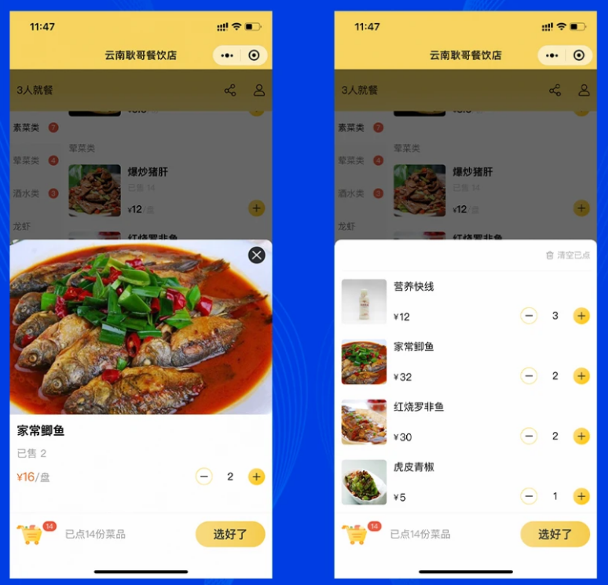
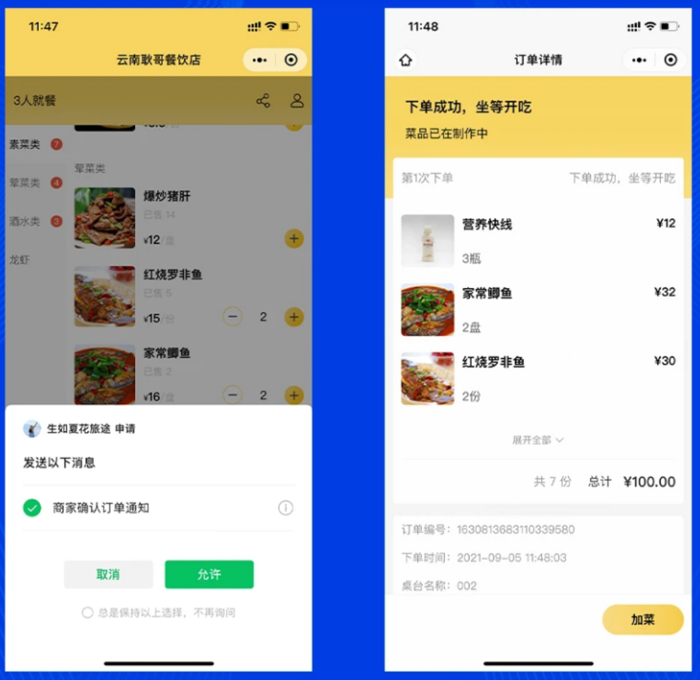

# 一、前言
> 通过基础篇  已掌握uniapp的基础语法以及开发流程
>
> 那么该篇幅为进阶篇  主要讲解小程序服务端的编写   以及  PC端数据联动、小程序数据联动
>
> **教学目标：**
>
> 1. 能够使用koa2开发服务端   提供WebAPI
> 2. 能够完成 全栈式项目 【点餐后端、点餐小程序端、点餐PC端】

## 你将获得

+ 掌握全栈开发
+ 学习小程序高级开发

## 课程知识储备

由于进阶篇需要完成全栈式项目 故需要的技能如下：

1. TS基础语法知识
2. ES6语法知识
3. Vue框架知识
4. 小程序知识
5. MySQL数据库

## 项目介绍

该课程集用户端、接口端、商家端后台管理于一体，全面打造一个实战，且可商用的小程序，完全可投入使用。

## 服务端

1. koa2构建web服务
2. jwt鉴权模式
3. MySQL数据库增删改查
4. TS语法编写
5. 字段参数校验、错误处理、返回数据处理
6. 订阅信息、生成二维码、oss对象存储

## 商家后台管理

1. 数据可视化展示
2. 发布删除修改商品
3. 订单相关操作
4. 微信订阅消息推送
5. 语音播报订单号
6. Vue3构建项目

## 微信小程序端

1. 点餐界面菜单左右联动
2. 扫码进入主页面
3. 订阅推送消息

## 项目展示

