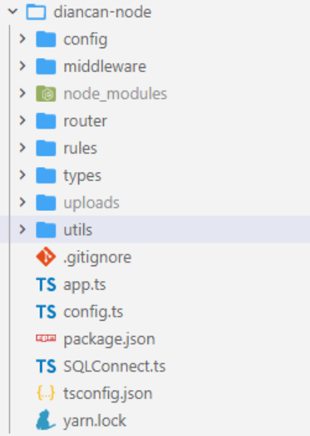

# 二、搭建服务器端

> 该章节主要 讲解 如何使用 ts + koa2 搭建服务器项目 以及如何去编写全局异常中间件、返回格式中间件、数据校验中间件

## 2.1 搭建并启动 ts + koa2服务器端

### 初始化项目

新建`diancan-node`文件夹   初始化 npm包 `npm init -y`

项目需要使用的包模块： 

+ `koa`  `koa-body` `koa-router`  `koa2-cors` 
+ `nodemon` 
+ `async-validator`

### 构建项目目录



**app.ts**

``` ts
import koa from 'koa'
import koaBody from 'koa-body'
import cors from 'koa2-cors'

const app = new koa()

// 跨域处理
app.use(cors())
// 解析post请求  urlencoded |  multipart  |  json 格式
app.use(koaBody())

// 启动服务器
app.listen(5000, () => {
  console.log('服务器运行中...')
})
```

**package.json**  修改启动命令

``` json
{
  "name": "diancan-node",
  "version": "1.0.0",
  "description": "",
  "main": "index.ts",
  "scripts": {
    "dev": "nodemon app.ts"
  },
  "keywords": [],
  "author": "",
  "license": "ISC"
}
```

**git管理清单**

``` txt
.DS_Store
node_modules/
dist/
uploads/
npm-debug.log*
yarn-debug.log*
yarn-error.log*
package-lock.json
tests/**/coverage/

# Editor directories and files
.idea
.vscode
*.suo
*.ntvs*
*.njsproj
*.sln
```

**tsconfig.json**

可通过 `tsc --init` 一键生成

``` ts
{
  "compilerOptions": {
    "target": "es2016",
    /* Modules */
    "module": "commonjs",
    "typeRoots": ["types"],
    "esModuleInterop": true,
    "forceConsistentCasingInFileNames": true,  
    "strict": false,                                  
    "skipLibCheck": true                             
  }
}
```

### 运行项目

执行 **yarn dev**  或者 **npm run dev**    项目端口号为5000


## 2.2 设置全局异常中间件

思路： 捕获异常 `try...catch`  捕获全局 `所有中间件之前执行`

**config/error.ts**

``` ts
// 错误结构类
class ErrorResult extends Error {
  msg: string
  code: number
  constructor(msg: string, code: number) {
    super()
    this.msg = msg
    this.code = code
  }
}

export default ErrorResult
```


**middleware/abnormal.ts**

``` ts
import multer from 'multer'
import { Context, Next } from 'koa'
import ErrorResult from '../config/error'

// 自定义的全局异常处理中间件
const abnormal = (option = {}) => {
  return async (ctx: Context, next: Next) => {
    try {
      // 正常放行  当后续中间件发生错误时 会自动进入catch部分
      ctx.error = function(msg: string, code: number) {
        throw new ErrorResult(msg, code)
      }
      await next()
    } catch (error) {
      console.log(error)
      // 发生错误  判断错误的类型【已知错误 | 未知错误】
      if (error instanceof ErrorResult) {
        // 已知错误
        ctx.body = { msg: error.msg, code: error.code }
        ctx.status = error.code
      } else {
        // 未知错误
        ctx.body = { msg: '服务器内部错误' }
        ctx.status = 500
      }
    }
  }
}


export default abnormal
```

 

在 app.ts 中注册  **一定要在路由中间件前**

``` ts
import abnormal from './middleware/abnormal'

const app = new koa()

// 跨域处理
app.use(cors())
// 解析post请求  urlencoded |  multipart  |  json 格式
app.use(koaBody())
// 全局异常处理【中间件】
app.use(abnormal())
```


## 2.3 响应格式中间件

为了便于调用 将函数添加到ctx全局上下文对象中

**middleware/router-response.ts**

``` ts
import { Context, Next } from 'koa'

// 处理响应中间件
const routerResponse = (option = {}) => {
  return async function (ctx: Context, next: Next) {
    // 成功响应
    ctx.success = function (data = null, code = 200, msg = 'SUCCESS') {
      ctx.body = { data, code, msg }
    }
    // 异常响应
    ctx.fail = function (msg = 'FAIL', code = 500) {
      ctx.body = { code, msg }
    }
    await next()
  }
}

export default routerResponse
```

在 app.ts 中注册  **一定要在路由中间件前**

``` ts
import routerResponse from './middleware/router-response'

const app = new koa()
// 跨域处理
app.use(cors())
// 解析post请求  urlencoded |  multipart  |  json 格式
app.use(koaBody())
// 全局异常处理【中间件】
app.use(abnormal())
// 全局响应结果处理【中间件】
app.use(routerResponse())
```

## 2.4 设置ts类型

由于我们为 ctx上下文对象 添加了  error、success、fail 三个属性  所以需要扩展Ctx对象类型

**types/index.ts**

``` ts
import 'koa'
import 'koa-router'

declare module 'koa' {
  interface DefaultContext {
    success: (data?: any, code?: number, msg?: string) => void
    error: (msg?: string, code?: number) => void
    fail: (msg?: string, code?: number) => void
  }
}

declare module 'koa-router' {
  interface IRouterParamContext {
    success: (data?: any, code?: number, msg?: string) => void
    error: (msg?: string, code?: number) => void
    fail: (msg?: string, code?: number) => void
  }
}
```

**app.ts**

``` ts
import './types'
```


## 2.5 前端参数校验中间件

作为后端校验参数字段  是必不可少的内容   在这里我们使用 `async-validator` 模块进行对象校验

可参考文章:  **https://blog.csdn.net/dreamingbaobei3/article/details/122727229**

**middleware/params-validator.ts**

``` ts
import { Context, Next } from 'koa'
import Schema, { Rules } from 'async-validator'

// 验证请求参数中间件
const ParamsValidator = (rules: Rules) => {
  return async (ctx: Context, next: Next) => {
    try {
      // 生成验证规则
      const validator = new Schema(rules)
      // 根据当前请求类型解析参数值
      const data = ['GET', 'DELETE'].includes(ctx.method)
        ? { ...ctx.query }
        : ctx.request.body
      // 验证参数值
      await validator.validate(data)
      // 验证通过
      await next()
    } catch (error) {
      console.log(error)
      // 验证失败
      ctx.error(error.errors ? error.errors[0].message : error.msg, 500)
    }
  }
}

export default ParamsValidator

```
