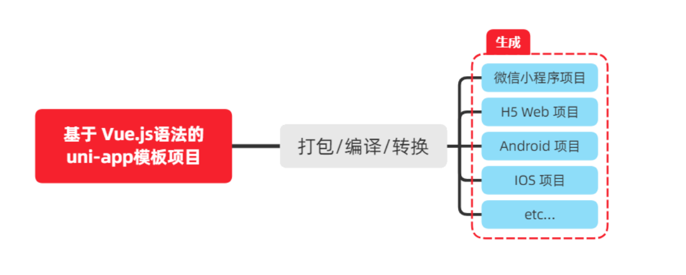

# 1. 起步app简介

## 1.1 uni-app简介

**uni-app 是一个使用 Vue.js 开发所有前端应用的框架**。开发者编写一套代码，可发布到 iOS、Android、H5、以及各种小程序（微信/支付宝/百度/头条/QQ/钉钉/淘宝）、快应用等多个平台。

> 详细的 uni-app 官方文档，请翻阅 https://uniapp.dcloud.net.cn/

##  1.2 开发工具

uni-app 官方推荐使用 **HBuilderX** 来开发 uni-app 类型的项目。主要好处：

- 模板丰富
- 完善的智能提示
- 一键运行

> 当然，你依然可以根据自己的喜好，选择使用 VS Code、Sublime、~~记事本~~... 等自己喜欢的编辑器！

### 1.2.1 下载 HBuilderX

1. 访问 HBuilderX 的官网首页 https://www.dcloud.io/hbuilderx.html
2. 点击首页的 `DOWNLOAD` 按钮
3. 选择下载 `正式版` -> `App 开发版`

### 1.2.2 安装 HBuilderX

1. 将下载的 `zip包` 进行解压缩
2. 将解压之后的文件夹，存放到**纯英文**的目录中（且不能包含括号等特殊字符）
3. 双击 `HBuilderX.exe` 即可启动 HBuilderX

### 1.2.3 安装 scss/sass 编译

为了方便编写样式（例如：`<style lang="scss"></style>`），建议安装 `scss/sass 编译` 插件。插件下载地址：

> https://ext.dcloud.net.cn/plugin?name=compile-node-sass

进入插件下载页面之后，点击右上角的 `使用 HBuilderX 导入插件` 按钮进行自动安装，截图如下：


### 1.2.4 快捷键方案切换

操作步骤：工具 -> 预设快捷键方案切换 -> VS Code


### 1.2.5 修改编辑器的基本设置

操作步骤：工具 -> 设置 -> 打开 Settings.json 按需进行配置


**源码视图**下可用的参考配置

```json
{
  "editor.colorScheme": "Default",
  "editor.fontSize": 12,
  "editor.fontFamily": "Consolas",
  "editor.fontFmyCHS": "微软雅黑 Light",
  "editor.insertSpaces": true,
  "editor.lineHeight": "1.5",
  "editor.minimap.enabled": false,
  "editor.mouseWheelZoom": true,
  "editor.onlyHighlightWord": false,
  "editor.tabSize": 2,
  "editor.wordWrap": true,
  "explorer.iconTheme": "vs-seti",
  "editor.codeassist.px2rem.enabel": false,
  "editor.codeassist.px2upx.enabel": false
}
```

> Tips：可以使用 **Ctrl + 鼠标滚轮** 缩放编辑器

## 1.3 新建 uni-app 项目

1. 文件 -> 新建 -> 项目

   

2. 填写项目基本信息

   

3. 项目创建成功

   

## 1.4 目录结构

一个 uni-app 项目，默认包含如下目录及文件：

```txt
┌─components            uni-app组件目录
│  └─comp-a.vue         可复用的a组件
├─pages                 业务页面文件存放的目录
│  ├─index
│  │  └─index.vue       index页面
│  └─list
│     └─list.vue        list页面
├─static                存放应用引用静态资源（如图片、视频等）的目录，注意：静态资源只能存放于此
├─main.js               Vue初始化入口文件
├─App.vue               应用配置，用来配置小程序的全局样式、生命周期函数等
├─manifest.json         配置应用名称、appid、logo、版本等打包信息
└─pages.json            配置页面路径、页面窗口样式、tabBar、navigationBar 等页面类信息
```

## 1.5 把项目运行到微信开发者工具

1. 填写自己的微信小程序的 AppID：

   

2. 在 HBuilderX 中，配置“微信开发者工具”的**安装路径**：
    

3. 在微信开发者工具中，通过 `设置 -> 安全设置` 面板，开启“微信开发者工具”的**服务端口**：

![img](data:image/png;base64,iVBORw0KGgoAAAANSUhEUgAAA5cAAALnCAMAAAAqHkOiAAADAFBMVEUAAADi/8hu26IAAISlVQAGm00cxW2ZdHSt6srYvn4AgoR/wNQyOk1+fn7/AACqq3tzc3Pm2b2+vph9gY3ExMTz0qiysrLf0qiof8HMza5SAADb3MFbYXFzmZ+uz82Yc67x6u69rZiioqL//8b/46WYc5gQtv9/qqiM2f9ERERSgoTGplIjIyPp6el4fILU49jB3tAAVaV50aLmza7///8HwF+Dxv8Qrv/KwP//8dLn46W829FxdHvSqn/z//Gr6f+gX01jwJDgo25SAFLv5uzpzP/SqsHSqqg8PDwyOm6cnJz+/vTG///iwH+YrcwHtFr/x4Q2qW2Yvtvq/v7i8dLm5ubj//8SEhJduP+Zmb2Nj5VmZmai2bulggAAAFJaOk37++///+PBf39K0IrB4/+rtv/G8dpzrczBf6hWWmSEAAD/49J/f8H/48EygsiMrv/MrXO9mZgwN0c0wnddrv+mm3cHvV7b5ub+7vp/qtJSpsYyX6t+gsgHwWDBf8Hm5ttSAITBgk1zc67S8f+o0vOrq6vS0tLG46W7u7uU37fnx4Rra2vl/vOuc3NUVVfB4/O47dJ/f6iSlJjBqtKLi4uE4LCT07LM5uaEAFIMplbRqacNDQ29ma7y8vLT8eXMvr1zrbdb1pXB/+QAgsba2tqc5r9zc5h+Ok0yOo4rynfm5szk3uItLS3Nvph/qsFMTExagsjAfqcGo1Gtda2QwKfBqqij4v+urZj+2/292eZzmb3V6+DOz9HiwMEdHR3Ly8vRz9GuzeYJs1rPp306xn3/wo5+fqUQwP/i/+LM5tGof39Spueu48i9mXPB0tLz8dLj8eq+v6xayo5dzP9ARVEKwWLnplLGggDz////wqszMzOuc5jO/v6w3MTiwKjbvpiA3ayDrZf+/s1B0IUJu14GrFbBqn9ao+R/wOJ9p89GSlYcsmSUlJS+4Pva9edi1JiC1aqrzP9zrcIwN0iEhISg1royy3vB79fM2b1pbXT/4auJ4bTc5NxkzZeoqtJbW1vxxqHBAAAAAWJLR0Q0qbHp/QAAAAlwSFlzAAASdAAAEnQB3mYfeAAAIABJREFUeNrt3Q98nHd92HEXUiddo9YussjCoJmAUraIFHRx4oJp04WROmgO6mRDwropEXboImpg2MmY8RJLmjInIWGGlHnHyGKnxTVkS2iIwxZNLPxpwNQpccIImSiNi5Z5ho2WLQSW/X7Pn7vnpJN0J9mKJb3fL5BkW6c7XZ7PfX/Pcyc9y84ETjXL3AWgS0CXoEtAl6BLYJ67fO+j73rmNa955l2Pvte9AqdGl+99+vKRcikoj1x+izLhlOjyDR0hyXM6DneEODuecb/A89/lDy4vdfT09HSc05G8K13+g+yf3/2F+CbO0dJvhI++W6r6gjuPJetvFDR50aEX5R+9aGiGLp8plXs6Ojo+d/jacnh38bWlfGL+5n1fyOL8btLlF8LfXH/mB37q9+OHsGS7rPthQ1506YsmfDBVl0+3lfaGHs958ievD+86znvZTcNPZ//+B//u189cXe3SvIS5dZn3OF2WaZcfHorj8vA5533/oe+fV+74/vIbL/5w9VO+2/vreZeJOC1Bl7PsMi1y2izTLke2dRw+3NHT0fOO971u27XnfPR9N148kvzr6lLp+ncnWcadzB/9+1LRb/ivgy5n0WVscvos0y739iSHezre8adPnlM+55xY6N58//L6SRcxL1kkimNmPrsMYU6fZTYvky4v7vnxtmt7Xv/kk9su7vjxSKXL37wvu+HX1+xg/ugf+s+KeXkyu/zwf+zY2xNdXP6V1131k1/5w/LIh6vzMh76CevY7/x+cS/z3bpElyd3HftoW2ko6XJbz3lPvuPJ8/5zqe3Rwjr2u6HBD3w52cs0L+HMeTru84Nnyh3betKJef+19/9hR/mZH1S6XH39mau/889K6X6meQlnztPzJGe+9/Ly3nQlu+3H4YPS5fkrZP/gLaWwfg1vs8M/5iWcOU+vKwhhtvSELvdGh8sdb6i8cD0uX0OL14cyv2BeQh7jvLwOL+xilss9HfHHScpDu58u/jzJBzZ8J31aZHXpv95X8/zlj/zXgZMj6/IHt+x9w9O3vOE1r1nxrkfdKXCKdPno0/FIz3v95CWcOl0CugR0CboEdAm6BHQJS7DLHpqzd67chcxAl7OocmhulIkuT3iWQ0MjIyOtsxUuG8t0R6LLE5nlz81VaFOY6PKEdjk05y7bhmOY7kp0eQJXsXPusj2EaWCiyxM5LkdCWeuOReuad+xYvHR7m4GJLk94l8d2786zbG9UFma8dPvgsC7R5cnoMklysCkxznjpdYMWsujyhO5etsaywrQMTbY1bbA96TIsZHVJ4112dJSbkJwrcyldttplyPLP3vqxJrz1M62trcNtg2mXwyN7m7ju2tvMkuuyqa003VKX1GVDmGmX69YN/tnHPvb5pnwmvhqhLVvHNtVlzW1Gl7qcOLjSLsO+5eBbm8zy8w8NDQ2NDCeX1iXNdFlu2tK6bEfHUN5lW8zyqaee2tqop54Ki+CR9NJtrU12Wbah6lKX03Q5Uuiy8SgTukSXc7hs6+7drY12ef5EDz10fl2xy3wVrEvm1mVP66y38Z6WGj1N9dHa0pZ/2NYyNJ9d7t21ceOePRs37to7XZeDdbtcfse+w8ePH953x/LZddnSoksa6LL1wbsvme023rLnkoI9Lc1ctnXPrgfb0w/bH9y1p3VWXfbMpsv2jbuObSyXNx7btbF9pi5jldurPrmpdOsLPhnev+DW0qZPbp/g/PN7Zuzyued0SQNdtuwuH1hW1VRbLTVFX9LcZXeV12Xb6BW7y7uaumzH3dmo3bMrDNu7O5rqsn1PW/mKvyyX//KKctue9ua6vHXfkfzDI/tundzlXl1yYrpsP9BySeHlKkNNdrmndffd5XTaNddl+4Prdi9Lr/PAc+sebGpeDl6SrkBbl4X3ey8ZbOayeze2lTsOhGDim7aNe5vq8ow74tuP/J/49o4zdMnJ278cOtYz63XsJeXWcs9QuXUW87LcfsWBZdkC+MEr2pu63ltWZO8fjG9X3NLMZXeFETuyJxm2I+mfdMniOh7b8mDxsM+DLU3uI7Ytm3IBPO1lW1+dTdeNu2r+2ND1bgwrgsED8aMDYc4ObdQlp3qXLQeem7fjPnPockV2K5NlbNzWVzTRdExy3avjh69eF+Nsba7LHwb7NsW3uuRkdnmsMvB2nVtuaZ+v4z6z73Lom4PFZWwYf98cavh628+94oorLolvrjj3kvimvZkuN934w/yMvT+8cVNTXbY8lzj33PR9iy51OW2Xu6oT78HW5xZSlxt3zaLLA7t3777lm+HN7m/eEt4caKrLW59dHjy7KXl7qy6Zl3Vs+927y6d+l/k6Nl/GzuM69ttnVPcvz/i2dSyn5nGf56fL7EBPvoydx+M+Vx2vdnn8Kl1y8rpsb2l9XrpsX1F9nmTFbJ4nyZex8/g8yfZN+/Iu903avdQlJ67L9kvaD8zhdQWz7nJorq8ryJex8/m6gu0vuOmH27f/MP7/phfokpPX5e6W8rnPx+vwjlVfh7fiWPm53U2/Du/ubBk7n6/D27792U1/Ht/9+aZnt+uSk9fl0IEDu56P160P1b5ufajJfdP477P8eZI5vG49TsxNZyxffsamydNSl5wix33m9HNeQ7vbqj8Near+nNfkLrd/8oxS6YxPbp9ll37Oi5Pe5aL+ueipugxl1q2ysZ/z8nPR6HIuv0dk6i6nokt0eQp2eUSXzK5Lv6dypotWu3xrs10+VO1ysNXvqaTxLntmP3qWxGVDl3lZbZ9ptsu/mkOXttOl3WVPxywnzxK5bF5W+2Bb62fe91TjXR556K96ql22tzV3HgSb6VLvkmkVu2z+ZOzVednmVO7o8mR12fTFdYkuT26XswirWLUs0eUJC/NEdWlcosuT0+U8Xxpdokt0qUvQpS7RpS51yYnpcqy7Z+XpKxJ3Hax8GNxwewNfdkt3eLP/iYP5n/ffnFx283SX6dycXW/6FUaTP6WX6HxgW0/xHydZ+YvxVo1lt23/vbf3jKW3drRnS/Kuc8arT65kS3e80TsOxe/zF+p8v9OUtaXmtm2562CDXYZvsTO7ax/Y1lm5m1dk3zK6LNp/cwijczTbwla+fVtWR1rADNIi07cxkBv++N7bK+U12mXWcswpbPNjK+56ZOrNdcto0lIWX/xK6dcJdYfL7jg0Gm/72LRXHz4pjSR+vzveczD5+IFt++9tsMv9N3cXvtYDnXXCnKrL6l1TvYc6danLuiMopPiSm+PE6Wm6y3Q6Veblyl8MXYYvMV2XOw4NrtjcWZwb8drSjTYUetfBeBPGupMbMvm2/r00q2TLTr5IPu0an5ed+fXFD5IuG56XW6pTbkV38u2HtytP726gy2Qhsrl6681LZtq/zAdW0+vYbPSkXYaQOx94ycxdvueRzfHfw3hLCgmTbizfQJPZt+VlN0+1ve74N7ePvfT9lXlZO+Lyefk3D047L3cciv/a+dLTk6tobl6ma+782laent1Fk9ayU8/L/OHGvGTaLsMD92jsKmw1cRttbl6mYXWHrruTDW+se/+MXe6/969vzrbxvMt0ow2XC/PohuRfp5iX4VHjrtcfGq3uGm8ZLewb53vLrzw43W0eW7F5LB2w6aNEs11mX35L95Z8VK9Y8YlDtXFN2WW8ukqX8VGoUDq6rN1lK87LZrrc/8Tr7709bGrh/aEwOsKXGZ25y84HOmu7HHxpPqPvOhj+ZstM+5fv+Ww2Xn/8noNx2G5O93ALK8PpFrIrX/nZzZXjR8nCtLnjPsnueO1hs0aP+4S1b+UgVecnDlnHMkOXhXnZzDq2MyxFb/i/b98WL98ZPj38P3QZspvpuM/KaoljaUOVeZmkPeXx2ORWfna0s7szDNSXJEvRTxXGZdjf2zLDze4czUNufl6OFdOvDuiGuuyMDxYrT08ijA9J5iVNzMukqMaP+8RtdbSykY8lUY2t6G7geOz+m5OAOru3jOaHU8K1doYh+Pq3f2qqh4V4Qz/xRN5ltnOaZbYlG5PJNzPd9ad7n9mzHdnCctJO3lTzMv3E7DD0zRManWkdu/KVj+Rdjk04goQup5uXycN/M13GyLIu9z/xSFzNPvHZ7pkvEq4vK2Pi85fJAB3rnmYd/KlKxqGMbBUaymj0eGz2fEVyUw+G77nyxMvozF12Jg8XOw51z2Yd+4knDnbmXW7p3nFoND607DhkYuqy/jHVpMuwwxO2uaSSJrpMPjXrcmxzsrltHuue/iBj7DIuedM9tXRRlx2K6Xzg3/7xoZcdqjeDsgeREN1YNi8/teKGn6/Oy4afv0z/NbYVvsUdyXfd+LxMh+TorPYvN+fXE5+Ejf/r6bzr/Su6vSBIl/WWhoOnVzezNMaGu9xxqLCsSy6w/+bNcVOddiEbM0xew3D65mQjjc835PMyOVjaPdW8XHl6fAwZK65jKwvC0ebmZfxanf/70Ira1xk11GV3Z2GR3WSX2W0ND0vxedwHXnL6ZpumLusfu6nuJ93wC93pVvrjQzO9mC3dRtONMu0yeRIhNt45YU04ucstaQbx1TLx6Gv+ZMddB8c2x/XllmmOU4bbOzYaL7pic0/1sEnz8zJ50mW05mhO8QrrlhVXvGmRce+4cIhs4j5i/dcVjFbnZbjd8REsPx6ELmnEnH7jwF6vW0eXJ7HLdbpEl6dklyOz6HKkULU7E12e4C7b09802USa8ZOHdIkuT2qXwyNDQ0mZDQufPzKsS3R5kro8li5kR2KajQuf39qWXFqX6PIkdHksHrsZbm3WcNtg0mW7LtHlCe9ybsxLdHmiuxw5EV0Oj+gSXZ5aXbbrEl2e4C5b29rXHYvWNS+9XPusTgaGLpmqy7CDOdzW3p511t6MymXahp02CF2e6IE53DY4FyFL45IZuyzRuORs7slzkbM1FJrsKJfdlUxDl82H2dGzdy56OmSJLk94mKHMOSnLEl2ejDLnxl2ILkGXgC5Bl4AuQZeALgFdgi4BXYIuAV2CLgFdAroEXQK6BF0CupyV8sJlI9Xl4q2yY6FSpi4XbZZz/d2Szx+/1VKXizbLn1u4/BZoXS7WLjsWcJetIzFMG6ouF+EqdgF32RbCNDB1uRjHZU/YvgeTc2oNLiTt7fF2t7UOGZi6XIxd7g3bd3tyirv0hFqnvmqX7W3DQ3t1qcvF22V7THJ4oYhxxts9ODyiS10u3i7b45knW0cWitbW4TZd6nKxdxmzjCefXCiGhkaGdanLxd/lcHaa5gXwIp/s1NS61OUi73IwHthMXz2zIMRXKA0lt1uXulzkXfZ0LJAXgidl9uhSl4u/y+GF9cqZ0OVeXepySXQ5f8Py+EeuWn7k/Em2bt16ZPlVHzneyMhMu2zTpS4XcZfp9j1PG/jxO86v22TFHcdn7rJDl7pcIl3Oz1XuO7J9spouzz+y7xS83ehyEXf5bJ0qt8cav/fVw6XS4a9+L368/Vldosv52773TZHl9w7nn3E4lrl9ny7R5bTb9yvOXl3842V35h+88C1N71seqZ/ljcVPujEeADquS3SZbd8v/51ly5a98C2PLUv99n3h73pPq+3v5b8TMn3F37kv6TL+P7lQxbSxfq9ulutvrP2sG9eHAapLdFnpcnVM7bHXbkgG5T+PjT1ebS7ptPRYSK+2y69Uv+Jj03V5vP4hn59M/LyfbN16/nFdost6XSYL1TA70z+VLluWrmBf/nv3zbLLZ+uPy8MTP+9wGJjP6hJd1uvy8fDu8WWrS4+/MJ2bX8lXuste+6tnV5etjXd5VWPjMhmYV+kSXdbuX752wyvOTppLj+08tuzOx+rvODY3L5fXHZdfnfyJX12/dbku0WW9eVmNLU7GNL7e0+5MFrE1B4Ia7fJIY8vYZCF7RJfosrbL/EDP6lJlBzOO0thfaPayF/6Ls6sHg1Y33mXd3cuj9T7z6NatukSXE+bl344phrn4eD4n01m5bNmdhcO12dic47ycosundIkuJ3T5L5NDsflyNh6BzYUa88NCdza7jq23f7n+aL117NH19i/R5cTjPj8VAk16u6z4moH4/GVINwRZfVLzK3M7HhvmZb3jPkcdj0WXk4/7xP9VEiu+zqD3tH962lfirHz8zt7TvhL+N7fnL0OXF03+xIuObv2ILtHlxC57T/tbZ+e55S+QTZ80efyvhU+aXZfH6x6PvWfy6wruWb/V633QZbZ9Zy/jifPxsvxlPuGjrLvLqsd7ZtdlndfHhi4nD8yLjq6/o6RLdJlu39lL65LXFdySPEsShuVvZwd94lOX6d8se+0/qOmy4det1/l5kjgwP1r7WR+9Z/1TH9cluky376S8pMtfDYvYV5wd80w7iy//SZLLXgc0y3lZ5+cv48CsDfOj9xxd7+cv0WW+fb/89+57bNmyO+NLCZJZ+diy1VNcMHuOJPnEZrqsc+gnCfOi6s9FXxSy/HZJl+jy+fz9PucnYf70RU/G3yPy5EU/fc/Rz99Y0iW6nNft+/j3Jv++gvVHQ5mJe44e/dPPlXSJLud7+z7+7FXLj0z4bXjrQ5pHj37sfzz0us+dsrcbXS7mLuvflHjekUbPxKBLXS6ZLhfQeRB0qcsl0OU8nwfhBHTpPAi6XCJdOm8Qujy1unSePXR5SnbpvLTo8pTq0nnc0eUp2WVbCHNo70IxNDQyrEtdLvIuFypd6lKXukSXumygy7bhIV3qcjF22TPU2jbYHg0uJOktTp/esaXqcrF1GQbmSGtbW7a1ty0MlVvburBePoguGx+YIczhhal1Yb1KCV02MTB74tMOC9FQfC2EcanLRRpmKHNhSl6hZDvV5eIMs9yxUJVlqcvFXOZCZSPVJaDL58N3Pvit+O4f/Zf/Gd+tOb0l999/q1T6meIfQJfzpn+8dOm/3nnp2r5SV19pzVn5aaNXXfeNUqlrIP3Dmv/3jQmXunRtqHW81J9Ue82G0qqWlniBGPYXd/Zemfx1nw0KXc5SjHLKLvN5ed3ELnv/w87Kx6He/pBm13iI/IuVv+6fdBnQZWPWPByqG13bkg24aeflqtuqLfZ+cEPlS4TLxE8M72PdlYFqXKLLOaRZabE0sctaxS4LFwpN9l69MymxsN41LtHlrIWi+q97cb5c7St2+ca1LQXXbJg0Z9Py4kXyLvvHu+Jep3GJLuemK8QUO3rzzjrzcvq6upIwVw2Uql2GpfClawdK9Y4UgS4btmp81UB/5ejOhC6nryutMQadf5QsXpM3qwZsTehy1vqv+5m+/uve+OadXQP9k7rMg20p7FkWuozHfpJ0k7kaLpv8IXaZjV/Q5aysuXdw55RdVj4p+evicZ9/HD6MT4yEeZvUnT5PEtewyTq2eCwJdNm03itbWqtdPtxS7ynL9OBqscv+luwAT1e6B7oq/WN8uUFcwSb7rKDLWY7Lh1uu2ZBlF8qaPC9XTbmMBV2CLgFdAroEXQK6BF0CugRdAroEdAm6BHQJugR0CboEdAnoEnQJ6BJ0CegSdLmY9BfODdSX/VrKylll01/anJ5tL55s9povX1n53bLpeUhS2fkSktMhFL9Gy0ApO0dtduqhrsK1Zb9idtU1U/4K6HDZwvlR1jxc+cOaszZ0VW9l/yx+j2Z6xob0qvtrz48UT+dZ/TXzhX+87hvT3lk1X77yK6+Tu6b3yr78N/OOZ3do8e5bNc1v233TBd/KP/pS8u6dv6bLpaLwa2OzrSU5s0F62qDsVJchujVnfTkpL251l66tCXggflr4lHgChMpmVtz2KleSVJ7+xtpCs/VOLr2qpa/3yvFqpF+7d2f+YV/xcSXUld6a2wrnPoonKku/8ofWZlV1FU5L1l88vWdtraWu8ewkgfGbqRaWnzlwijurxqVrs/7S9MPlQ5/x0+JX6r36ker5Jar3wRQPLm/6pd+qdHlh+Dh0WfkrXS6ZLguhJA/x12zIfrNzocuwcfVe+aqkkkvXpoWFKGfR5dWVTbFrUpddyS9uDzdooDIts/lWGJz5103Oh1JzTrLe/JZWB3m85nw6xxuQjbDCL5bP04vvQ3Qzdjn1o0rv1R+vBNfX+6++sepV1S5rHg4q90Hhzkjdf0HR6vjm6/df8K13/lo2OHW5ROdlXIL1fvDvx38LW2i6jk2m0G3Jad/jLEurSQbT7Vfmj/q1XVb+1EyXYf719WdfL7mO/mSaJEWGB4Ca0xI11WX6OdlZsgeyRWRl2oabFT4O69X0lKAfevOEdWzD87L22/pvO8PdWOkynoywq9LzhHm5qmZqXvj1tNAvWceal9V5Gbu8+ucH0hVdYV5Wd/8qW1Hx9NCNdzn9OraYaQjm726ojOeu8fx2fvH9ybvRRrvMHwrCDYhnGMy6zM8VmJ8ncK7zMnxj6ScnXcZHgb7KOjbco31Tz8vaLu9PF6wX/nIS5C+97dp/kg5P61jzckN/skuUdZkd9+nPjuMkk+a2887asGq8q/KwP6HLwiGVmiMsYX139dTHa1ZVdgnDNp0sXNNVbByc+blT0mkUl6Y18/LhwviZtI4trFTTM5LV7fLTfxG/xKf/aLb7l8kXqY7Z/oFS5bhP/0BXX2XnfNK8nCAZjte+LWZ4/9vCOrYmV10u6f3LuC2nO49xXj4yXjlbV+VSYbtONtHsCNEM87Kv3jp2cpcD8XEhplRZ4uYZdLUUu+z9o4fDMG1oXhZ2Jvsr86xul+OlynGf6daxU0/7/sK8TO6vwnGfrr6G9i8rBb4zGZcX/q8vlX73W7o0L7N5Gf8ydpnuX3487N2t7SsVTsjXFydRV9+qytMfU3RZnC3pZrvmrJvWTjUsarvsKlxb/3h+GutkA+/62lkvjucJbGwdO/EIT9d1L57cZX/reMzxmpviQayB2c7Lyi2M0/G282q67Kp81zMcj73wS6V3fj3dxwz7l9axS7PLVcVlZtyUKk+SJMdbk/3LsFuWldaV7XmGy/1smJjjvR+8aW3fqmm6rO7gpZttf9pTqVTn/NIT52U53W9LSih2GSo9a0PXh5rv8sXJSnMg/m3xuE88ihVPbR/XCLHLrr6puqy9s3ZO7PJPHq55orZ2XqbfU7xZ08/LEGa2eH1T4TCsebnk5mXN31a7jOdoPyvt8tK1+VMNyfskhv5XxT3Mmbvsy04ynZ/odvzSQpddLcVXGGT7l6Nr000+jJXxUlf2CcUu/9OGpo7HVg/MhC+X7mMOVB8VkpsVVgfpc59xXqb/NMW8rD30WnPzQ5ej1cPM4at9rX6XvVf2hetLXj+R7PqumhD4my542wVZj7pcyl0mO2/9yYN8vn+ZHb6MZ3kPXXZ9+i/i3/VemW6m6UXXPHzbI9Uui6/3KZwQPj69mR5PTbfx5M+VeRPH3kC9eVm9ZQOFB4zq3lvSZb3XFUzd5Zp7d5aKjx0TVp+r0iOysdf8AaR+l8U7q/bmZ69Byo7HjpdKhdf7FNaxH187nq2Gw+WTo8A1Xf5uMiwvvCB5zU/o8p0XWMcukSIfLi7GPh4fuK9Ny2m57k/SeZls82FT+tDaluveeGWMY83DP7v2tvxIykAyDuLTDnk8tfOy8GTIQCWCdME4Xpp6XhaWytWExgtdduWPGRPnZRP6iy8rWJUfv8kPXyUvyksP+Y7H72JgujvrGxPG/XjhkaPwWDJpHVv5TzAw6ZjPBZWX4IVAf9m8BHQJ6BJ0CegSdAnoEnQJ6BLQJegS0CXoEtAl6BLQJaBL0CWgS9AloEvQJaBL0KUuQZeALkGXgC5Bl4AuQZeALgFdgi4BXYIuAV2CLgFdAroEXQK6BF0CugRdAroEdAm6BHQJugR0CboEdAm6BHQJ6BJ0CegSdAnoEnQJ6BLQJegS0CXoEtAl6BLQJaBL0CWgS9AloEvQJaBL0CWgS0CXoEtAl6BLQJegS0CXgC5Bl4AuQZeALkGXgC4BXYIuAV2CLgFdgi4BXQK6BF0CugRdAroEXQK6BF0CugR0CboEdAm6BHQJugR0CegSdAnoEnQJ6BJ0CegS0CXoEtAl6BLQJegS0CXoEtAloEvQJaBL0CWgS9AloEtAl6BLQJegS0CXoEtAl4AuQZeALkGXgC5Bl4AuQZe6BF0CugRdAroEXQK6BF0CugR0CboEdAm6BHQJugR0CegSdAnoEnQJ6BJ0CegS0CXoEtAl6BLQJegS0CXoEtAloEvQJaBL0CWgS9AloEtAl6BLQJegS0CXoEtAl4AuQZeALkGXgC5Bl4AuQZeALgFdgi4BXYIuAV2CLgFdAroEXQK6BF0CugRdAroEdAm6BHQJugR0CboEdAnoEnQJ6BJ0CegSdAnoEnQJ6BLQJegS0CXoEtAl6BLQJaBL0CWgS9AloEvQJaBLQJegS0CXoEtAl6BLQJegS0CXgC5Bl4AuQZeALkGXgC4BXYIuAV2CLgFdgi4BXQK6BF0CugRdAroEXQK6BF3qEnQJ6BJ0CegSdAnoEnQJ6BLQJegS0CXoEtAl6BLQJaBL0CWgS9AloEvQJaBLQJegS0CXoEtAl6BLQJegS0CXgC5Bl4AuQZeALkGXgC4BXYIuAV2CLgFdgi4BXQK6BF0CugRdAroEXQK6BF0CugR0CboEdAm6BHQJugR0CegSdAnoEnQJ6BJ0CegS0CXoEtAl6BLQJegS0CWgS9AloEvQJaBL0CWgS9AloEtAl6BLQJegS0CXoEtAl4AuQZeALkGXgC5Bl4AuAV2CLgFdgi4BXYIuAV2CLgFdAroEXQK6BF0CugRdAroEdAm6BHQJugR0CboEdAnoEnQJ6BJ0CegSdAnoEnSpS9AloEvQJaBL0CWgS9AloEtAl6BLQJegS0CXoEtAl4AuQZeALkGXgC5Bl4AuAV2CLgFdgi4BXYIuAV2CLgFdAroEXQK6BF0CugRdAroEdAm6BHQJugR0CboEdAnoEnQJ6BJ0CegSdAnoEnQJ6BLQJegS0CXoEtAl6BLQJaBL0CWgS9AloEvQJaBLQJegS0ARq1m+AAAAR0lEQVSXoEtAl6BLQJeALkGXgC5Bl4AuQZeALkGXgC4BXYIuAV2CLgFdgi4BXQK6BF0CugRdAroEXQK6BHQJugQa7hI41fx/WRjCECAVVqgAAAAASUVORK5CYII=)

4.  在 HBuilderX 中，点击菜单栏中的 `运行 -> 运行到小程序模拟器 -> 微信开发者工具`，将当前 uni-app 项目编译之后，自动运行到微信开发者工具中，从而方便查看项目效果与调试：


## 1.6 使用 Git 管理项目

### 1.6.1 本地管理

1. 在项目根目录中新建 `.gitignore` 忽略文件，并配置如下：

```txt
# 忽略 node_modules 目录
/node_modules
/unpackage/dist
```

> 注意：由于我们忽略了 unpackage 目录中**仅有的** dist 目录，因此默认情况下， unpackage 目录不会被 Git 追踪

> 此时，为了让 Git 能够正常追踪 unpackage 目录，按照惯例，我们可以在 unpackage 目录下创建一个叫做 `.gitkeep` 的文件进行占位

2. 打开终端，切换到项目根目录中，运行如下的命令，初始化本地 Git 仓库：

```bash
git init
```

3. 将所有文件都加入到暂存区：

```bash
git add .
```

4. 本地提交更新：

```bash
git commit -m "init project"
```


