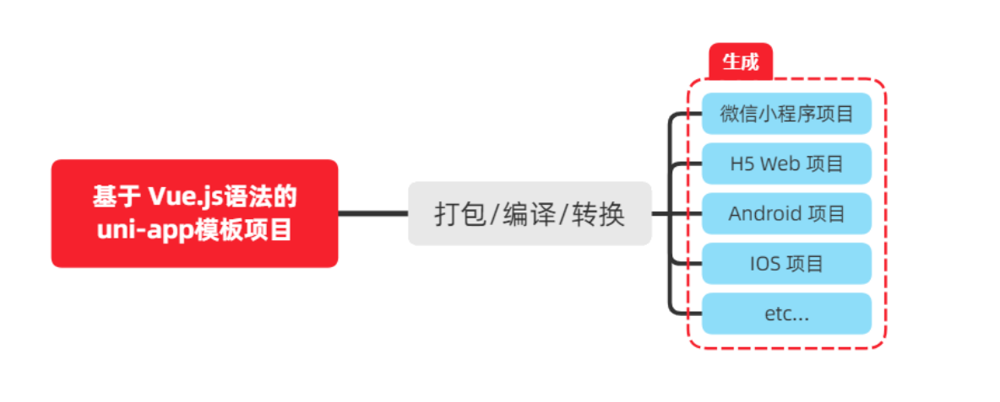

# 基础篇

## **前言**

> 教学目标:
>
> 基于 uniapp 开发的微信小程序商城项目

### tabBar相关页面

具体查看演示


## 1. 起步

### 1.1 uni-app简介

**uni-app 是一个使用 Vue.js 开发所有前端应用的框架**。开发者编写一套代码，可发布到 iOS、Android、H5、以及各种小程序（微信/支付宝/百度/头条/QQ/钉钉/淘宝）、快应用等多个平台。

> 详细的 uni-app 官方文档，请翻阅 https://uniapp.dcloud.net.cn/

###  1.2 开发工具

uni-app 官方推荐使用 **HBuilderX** 来开发 uni-app 类型的项目。主要好处：

- 模板丰富
- 完善的智能提示
- 一键运行

> 当然，你依然可以根据自己的喜好，选择使用 VS Code、Sublime、~~记事本~~... 等自己喜欢的编辑器！

##### 1.2.1 下载 HBuilderX

1. 访问 HBuilderX 的官网首页 https://www.dcloud.io/hbuilderx.html
2. 点击首页的 `DOWNLOAD` 按钮
3. 选择下载 `正式版` -> `App 开发版`

##### 1.2.2 安装 HBuilderX

1. 将下载的 `zip包` 进行解压缩
2. 将解压之后的文件夹，存放到**纯英文**的目录中（且不能包含括号等特殊字符）
3. 双击 `HBuilderX.exe` 即可启动 HBuilderX

##### 1.2.3 安装 scss/sass 编译

为了方便编写样式（例如：`<style lang="scss"></style>`），建议安装 `scss/sass 编译` 插件。插件下载地址：

> https://ext.dcloud.net.cn/plugin?name=compile-node-sass

进入插件下载页面之后，点击右上角的 `使用 HBuilderX 导入插件` 按钮进行自动安装，截图如下：


##### 1.2.4 快捷键方案切换

操作步骤：工具 -> 预设快捷键方案切换 -> VS Code


##### 1.2.5 修改编辑器的基本设置

操作步骤：工具 -> 设置 -> 打开 Settings.json 按需进行配置


**源码视图**下可用的参考配置

```json
{
  "editor.colorScheme": "Default",
  "editor.fontSize": 12,
  "editor.fontFamily": "Consolas",
  "editor.fontFmyCHS": "微软雅黑 Light",
  "editor.insertSpaces": true,
  "editor.lineHeight": "1.5",
  "editor.minimap.enabled": false,
  "editor.mouseWheelZoom": true,
  "editor.onlyHighlightWord": false,
  "editor.tabSize": 2,
  "editor.wordWrap": true,
  "explorer.iconTheme": "vs-seti",
  "editor.codeassist.px2rem.enabel": false,
  "editor.codeassist.px2upx.enabel": false
}
```

> Tips：可以使用 **Ctrl + 鼠标滚轮** 缩放编辑器

### 1.3 新建 uni-app 项目

1. 文件 -> 新建 -> 项目

   

2. 填写项目基本信息

   

3. 项目创建成功

   

### 1.4 目录结构

一个 uni-app 项目，默认包含如下目录及文件：

```text
┌─components            uni-app组件目录
│  └─comp-a.vue         可复用的a组件
├─pages                 业务页面文件存放的目录
│  ├─index
│  │  └─index.vue       index页面
│  └─list
│     └─list.vue        list页面
├─static                存放应用引用静态资源（如图片、视频等）的目录，注意：静态资源只能存放于此
├─main.js               Vue初始化入口文件
├─App.vue               应用配置，用来配置小程序的全局样式、生命周期函数等
├─manifest.json         配置应用名称、appid、logo、版本等打包信息
└─pages.json            配置页面路径、页面窗口样式、tabBar、navigationBar 等页面类信息
```

### 1.5 把项目运行到微信开发者工具

1. 填写自己的微信小程序的 AppID：

   

2. 在 HBuilderX 中，配置“微信开发者工具”的**安装路径**：
    

3. 在微信开发者工具中，通过 `设置 -> 安全设置` 面板，开启“微信开发者工具”的**服务端口**：

![img](data:image/png;base64,iVBORw0KGgoAAAANSUhEUgAAA5cAAALnCAMAAAAqHkOiAAADAFBMVEUAAADi/8hu26IAAISlVQAGm00cxW2ZdHSt6srYvn4AgoR/wNQyOk1+fn7/AACqq3tzc3Pm2b2+vph9gY3ExMTz0qiysrLf0qiof8HMza5SAADb3MFbYXFzmZ+uz82Yc67x6u69rZiioqL//8b/46WYc5gQtv9/qqiM2f9ERERSgoTGplIjIyPp6el4fILU49jB3tAAVaV50aLmza7///8HwF+Dxv8Qrv/KwP//8dLn46W829FxdHvSqn/z//Gr6f+gX01jwJDgo25SAFLv5uzpzP/SqsHSqqg8PDwyOm6cnJz+/vTG///iwH+YrcwHtFr/x4Q2qW2Yvtvq/v7i8dLm5ubj//8SEhJduP+Zmb2Nj5VmZmai2bulggAAAFJaOk37++///+PBf39K0IrB4/+rtv/G8dpzrczBf6hWWmSEAAD/49J/f8H/48EygsiMrv/MrXO9mZgwN0c0wnddrv+mm3cHvV7b5ub+7vp/qtJSpsYyX6t+gsgHwWDBf8Hm5ttSAITBgk1zc67S8f+o0vOrq6vS0tLG46W7u7uU37fnx4Rra2vl/vOuc3NUVVfB4/O47dJ/f6iSlJjBqtKLi4uE4LCT07LM5uaEAFIMplbRqacNDQ29ma7y8vLT8eXMvr1zrbdb1pXB/+QAgsba2tqc5r9zc5h+Ok0yOo4rynfm5szk3uItLS3Nvph/qsFMTExagsjAfqcGo1Gtda2QwKfBqqij4v+urZj+2/292eZzmb3V6+DOz9HiwMEdHR3Ly8vRz9GuzeYJs1rPp306xn3/wo5+fqUQwP/i/+LM5tGof39Spueu48i9mXPB0tLz8dLj8eq+v6xayo5dzP9ARVEKwWLnplLGggDz////wqszMzOuc5jO/v6w3MTiwKjbvpiA3ayDrZf+/s1B0IUJu14GrFbBqn9ao+R/wOJ9p89GSlYcsmSUlJS+4Pva9edi1JiC1aqrzP9zrcIwN0iEhISg1royy3vB79fM2b1pbXT/4auJ4bTc5NxkzZeoqtJbW1vxxqHBAAAAAWJLR0Q0qbHp/QAAAAlwSFlzAAASdAAAEnQB3mYfeAAAIABJREFUeNrt3Q98nHd92HEXUiddo9YussjCoJmAUraIFHRx4oJp04WROmgO6mRDwropEXboImpg2MmY8RJLmjInIWGGlHnHyGKnxTVkS2iIwxZNLPxpwNQpccIImSiNi5Z5ho2WLQSW/X7Pn7vnpJN0J9mKJb3fL5BkW6c7XZ7PfX/Pcyc9y84ETjXL3AWgS0CXoEtAl6BLYJ67fO+j73rmNa955l2Pvte9AqdGl+99+vKRcikoj1x+izLhlOjyDR0hyXM6DneEODuecb/A89/lDy4vdfT09HSc05G8K13+g+yf3/2F+CbO0dJvhI++W6r6gjuPJetvFDR50aEX5R+9aGiGLp8plXs6Ojo+d/jacnh38bWlfGL+5n1fyOL8btLlF8LfXH/mB37q9+OHsGS7rPthQ1506YsmfDBVl0+3lfaGHs958ievD+86znvZTcNPZ//+B//u189cXe3SvIS5dZn3OF2WaZcfHorj8vA5533/oe+fV+74/vIbL/5w9VO+2/vreZeJOC1Bl7PsMi1y2izTLke2dRw+3NHT0fOO971u27XnfPR9N148kvzr6lLp+ncnWcadzB/9+1LRb/ivgy5n0WVscvos0y739iSHezre8adPnlM+55xY6N58//L6SRcxL1kkimNmPrsMYU6fZTYvky4v7vnxtmt7Xv/kk9su7vjxSKXL37wvu+HX1+xg/ugf+s+KeXkyu/zwf+zY2xNdXP6V1131k1/5w/LIh6vzMh76CevY7/x+cS/z3bpElyd3HftoW2ko6XJbz3lPvuPJ8/5zqe3Rwjr2u6HBD3w52cs0L+HMeTru84Nnyh3betKJef+19/9hR/mZH1S6XH39mau/889K6X6meQlnztPzJGe+9/Ly3nQlu+3H4YPS5fkrZP/gLaWwfg1vs8M/5iWcOU+vKwhhtvSELvdGh8sdb6i8cD0uX0OL14cyv2BeQh7jvLwOL+xilss9HfHHScpDu58u/jzJBzZ8J31aZHXpv95X8/zlj/zXgZMj6/IHt+x9w9O3vOE1r1nxrkfdKXCKdPno0/FIz3v95CWcOl0CugR0CboEdAm6BHQJS7DLHpqzd67chcxAl7OocmhulIkuT3iWQ0MjIyOtsxUuG8t0R6LLE5nlz81VaFOY6PKEdjk05y7bhmOY7kp0eQJXsXPusj2EaWCiyxM5LkdCWeuOReuad+xYvHR7m4GJLk94l8d2786zbG9UFma8dPvgsC7R5cnoMklysCkxznjpdYMWsujyhO5etsaywrQMTbY1bbA96TIsZHVJ4112dJSbkJwrcyldttplyPLP3vqxJrz1M62trcNtg2mXwyN7m7ju2tvMkuuyqa003VKX1GVDmGmX69YN/tnHPvb5pnwmvhqhLVvHNtVlzW1Gl7qcOLjSLsO+5eBbm8zy8w8NDQ2NDCeX1iXNdFlu2tK6bEfHUN5lW8zyqaee2tqop54Ki+CR9NJtrU12Wbah6lKX03Q5Uuiy8SgTukSXc7hs6+7drY12ef5EDz10fl2xy3wVrEvm1mVP66y38Z6WGj1N9dHa0pZ/2NYyNJ9d7t21ceOePRs37to7XZeDdbtcfse+w8ePH953x/LZddnSoksa6LL1wbsvme023rLnkoI9Lc1ctnXPrgfb0w/bH9y1p3VWXfbMpsv2jbuObSyXNx7btbF9pi5jldurPrmpdOsLPhnev+DW0qZPbp/g/PN7Zuzyued0SQNdtuwuH1hW1VRbLTVFX9LcZXeV12Xb6BW7y7uaumzH3dmo3bMrDNu7O5rqsn1PW/mKvyyX//KKctue9ua6vHXfkfzDI/tundzlXl1yYrpsP9BySeHlKkNNdrmndffd5XTaNddl+4Prdi9Lr/PAc+sebGpeDl6SrkBbl4X3ey8ZbOayeze2lTsOhGDim7aNe5vq8ow74tuP/J/49o4zdMnJ278cOtYz63XsJeXWcs9QuXUW87LcfsWBZdkC+MEr2pu63ltWZO8fjG9X3NLMZXeFETuyJxm2I+mfdMniOh7b8mDxsM+DLU3uI7Ytm3IBPO1lW1+dTdeNu2r+2ND1bgwrgsED8aMDYc4ObdQlp3qXLQeem7fjPnPockV2K5NlbNzWVzTRdExy3avjh69eF+Nsba7LHwb7NsW3uuRkdnmsMvB2nVtuaZ+v4z6z73Lom4PFZWwYf98cavh628+94oorLolvrjj3kvimvZkuN934w/yMvT+8cVNTXbY8lzj33PR9iy51OW2Xu6oT78HW5xZSlxt3zaLLA7t3777lm+HN7m/eEt4caKrLW59dHjy7KXl7qy6Zl3Vs+927y6d+l/k6Nl/GzuM69ttnVPcvz/i2dSyn5nGf56fL7EBPvoydx+M+Vx2vdnn8Kl1y8rpsb2l9XrpsX1F9nmTFbJ4nyZex8/g8yfZN+/Iu903avdQlJ67L9kvaD8zhdQWz7nJorq8ryJex8/m6gu0vuOmH27f/MP7/phfokpPX5e6W8rnPx+vwjlVfh7fiWPm53U2/Du/ubBk7n6/D27792U1/Ht/9+aZnt+uSk9fl0IEDu56P160P1b5ufajJfdP477P8eZI5vG49TsxNZyxffsamydNSl5wix33m9HNeQ7vbqj8Near+nNfkLrd/8oxS6YxPbp9ll37Oi5Pe5aL+ueipugxl1q2ysZ/z8nPR6HIuv0dk6i6nokt0eQp2eUSXzK5Lv6dypotWu3xrs10+VO1ysNXvqaTxLntmP3qWxGVDl3lZbZ9ptsu/mkOXttOl3WVPxywnzxK5bF5W+2Bb62fe91TjXR556K96ql22tzV3HgSb6VLvkmkVu2z+ZOzVednmVO7o8mR12fTFdYkuT26XswirWLUs0eUJC/NEdWlcosuT0+U8Xxpdokt0qUvQpS7RpS51yYnpcqy7Z+XpKxJ3Hax8GNxwewNfdkt3eLP/iYP5n/ffnFx283SX6dycXW/6FUaTP6WX6HxgW0/xHydZ+YvxVo1lt23/vbf3jKW3drRnS/Kuc8arT65kS3e80TsOxe/zF+p8v9OUtaXmtm2562CDXYZvsTO7ax/Y1lm5m1dk3zK6LNp/cwijczTbwla+fVtWR1rADNIi07cxkBv++N7bK+U12mXWcswpbPNjK+56ZOrNdcto0lIWX/xK6dcJdYfL7jg0Gm/72LRXHz4pjSR+vzveczD5+IFt++9tsMv9N3cXvtYDnXXCnKrL6l1TvYc6danLuiMopPiSm+PE6Wm6y3Q6Veblyl8MXYYvMV2XOw4NrtjcWZwb8drSjTYUetfBeBPGupMbMvm2/r00q2TLTr5IPu0an5ed+fXFD5IuG56XW6pTbkV38u2HtytP726gy2Qhsrl6681LZtq/zAdW0+vYbPSkXYaQOx94ycxdvueRzfHfw3hLCgmTbizfQJPZt+VlN0+1ve74N7ePvfT9lXlZO+Lyefk3D047L3cciv/a+dLTk6tobl6ma+782laent1Fk9ayU8/L/OHGvGTaLsMD92jsKmw1cRttbl6mYXWHrruTDW+se/+MXe6/969vzrbxvMt0ow2XC/PohuRfp5iX4VHjrtcfGq3uGm8ZLewb53vLrzw43W0eW7F5LB2w6aNEs11mX35L95Z8VK9Y8YlDtXFN2WW8ukqX8VGoUDq6rN1lK87LZrrc/8Tr7709bGrh/aEwOsKXGZ25y84HOmu7HHxpPqPvOhj+ZstM+5fv+Ww2Xn/8noNx2G5O93ALK8PpFrIrX/nZzZXjR8nCtLnjPsnueO1hs0aP+4S1b+UgVecnDlnHMkOXhXnZzDq2MyxFb/i/b98WL98ZPj38P3QZspvpuM/KaoljaUOVeZmkPeXx2ORWfna0s7szDNSXJEvRTxXGZdjf2zLDze4czUNufl6OFdOvDuiGuuyMDxYrT08ijA9J5iVNzMukqMaP+8RtdbSykY8lUY2t6G7geOz+m5OAOru3jOaHU8K1doYh+Pq3f2qqh4V4Qz/xRN5ltnOaZbYlG5PJNzPd9ad7n9mzHdnCctJO3lTzMv3E7DD0zRManWkdu/KVj+Rdjk04goQup5uXycN/M13GyLIu9z/xSFzNPvHZ7pkvEq4vK2Pi85fJAB3rnmYd/KlKxqGMbBUaymj0eGz2fEVyUw+G77nyxMvozF12Jg8XOw51z2Yd+4knDnbmXW7p3nFoND607DhkYuqy/jHVpMuwwxO2uaSSJrpMPjXrcmxzsrltHuue/iBj7DIuedM9tXRRlx2K6Xzg3/7xoZcdqjeDsgeREN1YNi8/teKGn6/Oy4afv0z/NbYVvsUdyXfd+LxMh+TorPYvN+fXE5+Ejf/r6bzr/Su6vSBIl/WWhoOnVzezNMaGu9xxqLCsSy6w/+bNcVOddiEbM0xew3D65mQjjc835PMyOVjaPdW8XHl6fAwZK65jKwvC0ebmZfxanf/70Ira1xk11GV3Z2GR3WSX2W0ND0vxedwHXnL6ZpumLusfu6nuJ93wC93pVvrjQzO9mC3dRtONMu0yeRIhNt45YU04ucstaQbx1TLx6Gv+ZMddB8c2x/XllmmOU4bbOzYaL7pic0/1sEnz8zJ50mW05mhO8QrrlhVXvGmRce+4cIhs4j5i/dcVjFbnZbjd8REsPx6ELmnEnH7jwF6vW0eXJ7HLdbpEl6dklyOz6HKkULU7E12e4C7b09802USa8ZOHdIkuT2qXwyNDQ0mZDQufPzKsS3R5kro8li5kR2KajQuf39qWXFqX6PIkdHksHrsZbm3WcNtg0mW7LtHlCe9ybsxLdHmiuxw5EV0Oj+gSXZ5aXbbrEl2e4C5b29rXHYvWNS+9XPusTgaGLpmqy7CDOdzW3p511t6MymXahp02CF2e6IE53DY4FyFL45IZuyzRuORs7slzkbM1FJrsKJfdlUxDl82H2dGzdy56OmSJLk94mKHMOSnLEl2ejDLnxl2ILkGXgC5Bl4AuQZeALgFdgi4BXYIuAV2CLgFdAroEXQK6BF0CupyV8sJlI9Xl4q2yY6FSpi4XbZZz/d2Szx+/1VKXizbLn1u4/BZoXS7WLjsWcJetIzFMG6ouF+EqdgF32RbCNDB1uRjHZU/YvgeTc2oNLiTt7fF2t7UOGZi6XIxd7g3bd3tyirv0hFqnvmqX7W3DQ3t1qcvF22V7THJ4oYhxxts9ODyiS10u3i7b45knW0cWitbW4TZd6nKxdxmzjCefXCiGhkaGdanLxd/lcHaa5gXwIp/s1NS61OUi73IwHthMXz2zIMRXKA0lt1uXulzkXfZ0LJAXgidl9uhSl4u/y+GF9cqZ0OVeXepySXQ5f8Py+EeuWn7k/Em2bt16ZPlVHzneyMhMu2zTpS4XcZfp9j1PG/jxO86v22TFHcdn7rJDl7pcIl3Oz1XuO7J9spouzz+y7xS83ehyEXf5bJ0qt8cav/fVw6XS4a9+L368/Vldosv52773TZHl9w7nn3E4lrl9ny7R5bTb9yvOXl3842V35h+88C1N71seqZ/ljcVPujEeADquS3SZbd8v/51ly5a98C2PLUv99n3h73pPq+3v5b8TMn3F37kv6TL+P7lQxbSxfq9ulutvrP2sG9eHAapLdFnpcnVM7bHXbkgG5T+PjT1ebS7ptPRYSK+2y69Uv+Jj03V5vP4hn59M/LyfbN16/nFdost6XSYL1TA70z+VLluWrmBf/nv3zbLLZ+uPy8MTP+9wGJjP6hJd1uvy8fDu8WWrS4+/MJ2bX8lXuste+6tnV5etjXd5VWPjMhmYV+kSXdbuX752wyvOTppLj+08tuzOx+rvODY3L5fXHZdfnfyJX12/dbku0WW9eVmNLU7GNL7e0+5MFrE1B4Ia7fJIY8vYZCF7RJfosrbL/EDP6lJlBzOO0thfaPayF/6Ls6sHg1Y33mXd3cuj9T7z6NatukSXE+bl344phrn4eD4n01m5bNmdhcO12dic47ycosundIkuJ3T5L5NDsflyNh6BzYUa88NCdza7jq23f7n+aL117NH19i/R5cTjPj8VAk16u6z4moH4/GVINwRZfVLzK3M7HhvmZb3jPkcdj0WXk4/7xP9VEiu+zqD3tH962lfirHz8zt7TvhL+N7fnL0OXF03+xIuObv2ILtHlxC57T/tbZ+e55S+QTZ80efyvhU+aXZfH6x6PvWfy6wruWb/V633QZbZ9Zy/jifPxsvxlPuGjrLvLqsd7ZtdlndfHhi4nD8yLjq6/o6RLdJlu39lL65LXFdySPEsShuVvZwd94lOX6d8se+0/qOmy4det1/l5kjgwP1r7WR+9Z/1TH9cluky376S8pMtfDYvYV5wd80w7iy//SZLLXgc0y3lZ5+cv48CsDfOj9xxd7+cv0WW+fb/89+57bNmyO+NLCZJZ+diy1VNcMHuOJPnEZrqsc+gnCfOi6s9FXxSy/HZJl+jy+fz9PucnYf70RU/G3yPy5EU/fc/Rz99Y0iW6nNft+/j3Jv++gvVHQ5mJe44e/dPPlXSJLud7+z7+7FXLj0z4bXjrQ5pHj37sfzz0us+dsrcbXS7mLuvflHjekUbPxKBLXS6ZLhfQeRB0qcsl0OU8nwfhBHTpPAi6XCJdOm8Qujy1unSePXR5SnbpvLTo8pTq0nnc0eUp2WVbCHNo70IxNDQyrEtdLvIuFypd6lKXukSXumygy7bhIV3qcjF22TPU2jbYHg0uJOktTp/esaXqcrF1GQbmSGtbW7a1ty0MlVvburBePoguGx+YIczhhal1Yb1KCV02MTB74tMOC9FQfC2EcanLRRpmKHNhSl6hZDvV5eIMs9yxUJVlqcvFXOZCZSPVJaDL58N3Pvit+O4f/Zf/Gd+tOb0l999/q1T6meIfQJfzpn+8dOm/3nnp2r5SV19pzVn5aaNXXfeNUqlrIP3Dmv/3jQmXunRtqHW81J9Ue82G0qqWlniBGPYXd/Zemfx1nw0KXc5SjHLKLvN5ed3ELnv/w87Kx6He/pBm13iI/IuVv+6fdBnQZWPWPByqG13bkg24aeflqtuqLfZ+cEPlS4TLxE8M72PdlYFqXKLLOaRZabE0sctaxS4LFwpN9l69MymxsN41LtHlrIWi+q97cb5c7St2+ca1LQXXbJg0Z9Py4kXyLvvHu+Jep3GJLuemK8QUO3rzzjrzcvq6upIwVw2Uql2GpfClawdK9Y4UgS4btmp81UB/5ejOhC6nryutMQadf5QsXpM3qwZsTehy1vqv+5m+/uve+OadXQP9k7rMg20p7FkWuozHfpJ0k7kaLpv8IXaZjV/Q5aysuXdw55RdVj4p+evicZ9/HD6MT4yEeZvUnT5PEtewyTq2eCwJdNm03itbWqtdPtxS7ynL9OBqscv+luwAT1e6B7oq/WN8uUFcwSb7rKDLWY7Lh1uu2ZBlF8qaPC9XTbmMBV2CLgFdAroEXQK6BF0CugRdAroEdAm6BHQJugR0CboEdAnoEnQJ6BJ0CegSdLmY9BfODdSX/VrKylll01/anJ5tL55s9povX1n53bLpeUhS2fkSktMhFL9Gy0ApO0dtduqhrsK1Zb9idtU1U/4K6HDZwvlR1jxc+cOaszZ0VW9l/yx+j2Z6xob0qvtrz48UT+dZ/TXzhX+87hvT3lk1X77yK6+Tu6b3yr78N/OOZ3do8e5bNc1v233TBd/KP/pS8u6dv6bLpaLwa2OzrSU5s0F62qDsVJchujVnfTkpL251l66tCXggflr4lHgChMpmVtz2KleSVJ7+xtpCs/VOLr2qpa/3yvFqpF+7d2f+YV/xcSXUld6a2wrnPoonKku/8ofWZlV1FU5L1l88vWdtraWu8ewkgfGbqRaWnzlwijurxqVrs/7S9MPlQ5/x0+JX6r36ker5Jar3wRQPLm/6pd+qdHlh+Dh0WfkrXS6ZLguhJA/x12zIfrNzocuwcfVe+aqkkkvXpoWFKGfR5dWVTbFrUpddyS9uDzdooDIts/lWGJz5103Oh1JzTrLe/JZWB3m85nw6xxuQjbDCL5bP04vvQ3Qzdjn1o0rv1R+vBNfX+6++sepV1S5rHg4q90Hhzkjdf0HR6vjm6/df8K13/lo2OHW5ROdlXIL1fvDvx38LW2i6jk2m0G3Jad/jLEurSQbT7Vfmj/q1XVb+1EyXYf719WdfL7mO/mSaJEWGB4Ca0xI11WX6OdlZsgeyRWRl2oabFT4O69X0lKAfevOEdWzD87L22/pvO8PdWOkynoywq9LzhHm5qmZqXvj1tNAvWceal9V5Gbu8+ucH0hVdYV5Wd/8qW1Hx9NCNdzn9OraYaQjm726ojOeu8fx2fvH9ybvRRrvMHwrCDYhnGMy6zM8VmJ8ncK7zMnxj6ScnXcZHgb7KOjbco31Tz8vaLu9PF6wX/nIS5C+97dp/kg5P61jzckN/skuUdZkd9+nPjuMkk+a2887asGq8q/KwP6HLwiGVmiMsYX139dTHa1ZVdgnDNp0sXNNVbByc+blT0mkUl6Y18/LhwviZtI4trFTTM5LV7fLTfxG/xKf/aLb7l8kXqY7Z/oFS5bhP/0BXX2XnfNK8nCAZjte+LWZ4/9vCOrYmV10u6f3LuC2nO49xXj4yXjlbV+VSYbtONtHsCNEM87Kv3jp2cpcD8XEhplRZ4uYZdLUUu+z9o4fDMG1oXhZ2Jvsr86xul+OlynGf6daxU0/7/sK8TO6vwnGfrr6G9i8rBb4zGZcX/q8vlX73W7o0L7N5Gf8ydpnuX3487N2t7SsVTsjXFydRV9+qytMfU3RZnC3pZrvmrJvWTjUsarvsKlxb/3h+GutkA+/62lkvjucJbGwdO/EIT9d1L57cZX/reMzxmpviQayB2c7Lyi2M0/G282q67Kp81zMcj73wS6V3fj3dxwz7l9axS7PLVcVlZtyUKk+SJMdbk/3LsFuWldaV7XmGy/1smJjjvR+8aW3fqmm6rO7gpZttf9pTqVTn/NIT52U53W9LSih2GSo9a0PXh5rv8sXJSnMg/m3xuE88ihVPbR/XCLHLrr6puqy9s3ZO7PJPHq55orZ2XqbfU7xZ08/LEGa2eH1T4TCsebnk5mXN31a7jOdoPyvt8tK1+VMNyfskhv5XxT3Mmbvsy04ynZ/odvzSQpddLcVXGGT7l6Nr000+jJXxUlf2CcUu/9OGpo7HVg/MhC+X7mMOVB8VkpsVVgfpc59xXqb/NMW8rD30WnPzQ5ej1cPM4at9rX6XvVf2hetLXj+R7PqumhD4my542wVZj7pcyl0mO2/9yYN8vn+ZHb6MZ3kPXXZ9+i/i3/VemW6m6UXXPHzbI9Uui6/3KZwQPj69mR5PTbfx5M+VeRPH3kC9eVm9ZQOFB4zq3lvSZb3XFUzd5Zp7d5aKjx0TVp+r0iOysdf8AaR+l8U7q/bmZ69Byo7HjpdKhdf7FNaxH187nq2Gw+WTo8A1Xf5uMiwvvCB5zU/o8p0XWMcukSIfLi7GPh4fuK9Ny2m57k/SeZls82FT+tDaluveeGWMY83DP7v2tvxIykAyDuLTDnk8tfOy8GTIQCWCdME4Xpp6XhaWytWExgtdduWPGRPnZRP6iy8rWJUfv8kPXyUvyksP+Y7H72JgujvrGxPG/XjhkaPwWDJpHVv5TzAw6ZjPBZWX4IVAf9m8BHQJ6BJ0CegSdAnoEnQJ6BLQJegS0CXoEtAl6BLQJaBL0CWgS9AloEvQJaBL0KUuQZeALkGXgC5Bl4AuQZeALgFdgi4BXYIuAV2CLgFdAroEXQK6BF0CugRdAroEdAm6BHQJugR0CboEdAm6BHQJ6BJ0CegSdAnoEnQJ6BLQJegS0CXoEtAl6BLQJaBL0CWgS9AloEvQJaBL0CWgS0CXoEtAl6BLQJegS0CXgC5Bl4AuQZeALkGXgC4BXYIuAV2CLgFdgi4BXQK6BF0CugRdAroEXQK6BF0CugR0CboEdAm6BHQJugR0CegSdAnoEnQJ6BJ0CegS0CXoEtAl6BLQJegS0CXoEtAloEvQJaBL0CWgS9AloEtAl6BLQJegS0CXoEtAl4AuQZeALkGXgC5Bl4AuQZe6BF0CugRdAroEXQK6BF0CugR0CboEdAm6BHQJugR0CegSdAnoEnQJ6BJ0CegS0CXoEtAl6BLQJegS0CXoEtAloEvQJaBL0CWgS9AloEtAl6BLQJegS0CXoEtAl4AuQZeALkGXgC5Bl4AuQZeALgFdgi4BXYIuAV2CLgFdAroEXQK6BF0CugRdAroEdAm6BHQJugR0CboEdAnoEnQJ6BJ0CegSdAnoEnQJ6BLQJegS0CXoEtAl6BLQJaBL0CWgS9AloEvQJaBLQJegS0CXoEtAl6BLQJegS0CXgC5Bl4AuQZeALkGXgC4BXYIuAV2CLgFdgi4BXQK6BF0CugRdAroEXQK6BF3qEnQJ6BJ0CegSdAnoEnQJ6BLQJegS0CXoEtAl6BLQJaBL0CWgS9AloEvQJaBLQJegS0CXoEtAl6BLQJegS0CXgC5Bl4AuQZeALkGXgC4BXYIuAV2CLgFdgi4BXQK6BF0CugRdAroEXQK6BF0CugR0CboEdAm6BHQJugR0CegSdAnoEnQJ6BJ0CegS0CXoEtAl6BLQJegS0CWgS9AloEvQJaBL0CWgS9AloEtAl6BLQJegS0CXoEtAl4AuQZeALkGXgC5Bl4AuAV2CLgFdgi4BXYIuAV2CLgFdAroEXQK6BF0CugRdAroEdAm6BHQJugR0CboEdAnoEnQJ6BJ0CegSdAnoEnSpS9AloEvQJaBL0CWgS9AloEtAl6BLQJegS0CXoEtAl4AuQZeALkGXgC5Bl4AuAV2CLgFdgi4BXYIuAV2CLgFdAroEXQK6BF0CugRdAroEdAm6BHQJugR0CboEdAnoEnQJ6BJ0CegSdAnoEnQJ6BLQJegS0CXoEtAl6BLQJaBL0CWgS9AloEvQJaBLQJegS0ARq1m+AAAAR0lEQVSXoEtAl6BLQJeALkGXgC5Bl4AuQZeALkGXgC4BXYIuAV2CLgFdgi4BXQK6BF0CugRdAroEXQK6BHQJugQa7hI41fx/WRjCECAVVqgAAAAASUVORK5CYII=)

4.  在 HBuilderX 中，点击菜单栏中的 `运行 -> 运行到小程序模拟器 -> 微信开发者工具`，将当前 uni-app 项目编译之后，自动运行到微信开发者工具中，从而方便查看项目效果与调试：


### 1.6 使用 Git 管理项目

##### 1.6.1 本地管理

1. 在项目根目录中新建 `.gitignore` 忽略文件，并配置如下：

```text
## 忽略 node_modules 目录
/node_modules
/unpackage/dist
```

> 注意：由于我们忽略了 unpackage 目录中**仅有的** dist 目录，因此默认情况下， unpackage 目录不会被 Git 追踪

> 此时，为了让 Git 能够正常追踪 unpackage 目录，按照惯例，我们可以在 unpackage 目录下创建一个叫做 `.gitkeep` 的文件进行占位

2. 打开终端，切换到项目根目录中，运行如下的命令，初始化本地 Git 仓库：

```bash
git init
```

3. 将所有文件都加入到暂存区：

```bash
git add .
```

4. 本地提交更新：

```bash
git commit -m "init project"
```


## 2. tabBar

### 2.1 创建 tabBar 页面

在 `pages` 目录中，创建首页(home)、分类(cate)、购物车(cart)、我的(my) 这 4 个 tabBar 页面。在 HBuilderX 中，可以通过如下的两个步骤，快速新建页面：

1. 在 `pages` 目录上鼠标右键，选择**新建页面**
2. 在弹出的窗口中，填写**页面的名称**、**勾选 scss 模板**之后，点击创建按钮。截图如下：


### 2.2 配置 tabBar 效果

1. 将 `资料` 目录下的 `static 文件夹` 拷贝一份，替换掉项目根目录中的 `static 文件夹`
2. 修改项目根目录中的 `pages.json` 配置文件，新增 `tabBar` 的配置节点如下：

``` json
{
    "tabBar": {
		"selectedColor": "##1baeae",
		"color": "##666",
		"list": [{
				"iconPath": "static/tab_icons/home.png",
				"selectedIconPath": "static/tab_icons/home_active.png",
				"text": "首页",
				"pagePath": "pages/home/home"
			},
			{
				"iconPath": "static/tab_icons/cate.png",
				"selectedIconPath": "static/tab_icons/cate_active.png",
				"text": "分类",
				"pagePath": "pages/cate/cate"
			},
			{
				"iconPath": "static/tab_icons/cart.png",
				"selectedIconPath": "static/tab_icons/cart_active.png",
				"text": "购物车",
				"pagePath": "pages/cart/cart"
			},
			{
				"iconPath": "static/tab_icons/my.png",
				"selectedIconPath": "static/tab_icons/my_active.png",
				"text": "我的",
				"pagePath": "pages/my/my"
			}
		]
	}
}
```

### 2.3 删除默认的 index 首页

1. 在 HBuilderX 中，把 `pages` 目录下的 `index首页文件夹` 删除掉
2. 同时，把 `page.json` 中记录的 `index 首页` 路径删除掉
3. 为了防止小程序运行失败，在微信开发者工具中，手动删除 `pages` 目录下的 `index 首页文件夹`
4. 同时，把 `components` 目录下的 `uni-link 组件文件夹` 删除掉

### 2.4 修改导航条的样式效果

1. 打开 `pages.json` 这个全局的配置文件

2. 修改 `globalStyle` 节点如下：

   ```json
   {
     "globalStyle": {
   		"navigationBarTextStyle": "black",
   		"navigationBarTitleText": "newBee商城",
   		"navigationBarBackgroundColor": "##FFFFFF",
   		"backgroundColor": "##F5F5F5"
   	}
   }
   ```


## 3. 首页

### 3.1 配置网络请求

由于平台的限制，小程序项目中**不支持 axios**，而且原生的 `wx.request()` API 功能较为简单，**不支持拦截器**等全局定制的功能。因此，建议在 uni-app 项目中自己封装网络数据请求

**utils/request.js**

``` js
class Request {
	constructor(options = {}) {
		// 请求的根路径
		this.baseUrl = options.baseUrl || ''
		// 请求的 url 地址
		this.url = options.url || ''
		// 请求方式
		this.method = 'GET'
		// 请求的参数对象
		this.data = null
		// header 请求头
		this.header = options.header || {}
		this.beforeRequest = null
		this.afterRequest = null
	}

	get(url, data = {}) {
		this.method = 'GET'
		this.url = this.baseUrl + url
		this.data = data
		return this._()
	}

	post(url, data = {}) {
		this.method = 'POST'
		this.url = this.baseUrl + url
		this.data = data
		return this._()
	}

	put(url, data = {}) {
		this.method = 'PUT'
		this.url = this.baseUrl + url
		this.data = data
		return this._()
	}

	delete(url, data = {}) {
		this.method = 'DELETE'
		this.url = this.baseUrl + url
		this.data = data
		return this._()
	}

	_() {
		// 清空 header 对象
		this.header = {}
		// 请求之前做一些事
		this.beforeRequest && typeof this.beforeRequest === 'function' && this.beforeRequest(this)
		// 发起请求
		return new Promise((resolve, reject) => {
			let weixin = wx
			// 适配 uniapp
			if ('undefined' !== typeof uni) {
				weixin = uni
			}
			weixin.request({
				url: this.url,
				method: this.method,
				data: this.data,
				header: this.header,
				success: (res) => {
					if (typeof res.data !== 'object') {
					  uni.showToast({ title: '服务端异常' , icon: 'none' })
					  return reject(res)
					}
					const { resultCode, data, message } = res.data
					// 判断请求结果
					if (resultCode !== 200) {
						if (message) uni.showToast({ title: message , icon: 'none' })
						return reject(data)
					}
					resolve(res.data)
				},
				fail: (err) => {
					reject(err)
				},
				complete: (res) => {
					// 请求完成以后做一些事情
					this.afterRequest && typeof this.afterRequest === 'function' && this
						.afterRequest(res)
				}
			})
		})
	}
}

export const $http = new Request()
```

最终，在项目新建 `api`目录进行封装使用 ，通过如下的方式进行配置：

**api/index.js**

``` js
import { $http } from '@/utils/request'

// 配置请求根地址
$http.baseUrl = 'http://zhi.zeng.pub/new-bee/api/v1/'

// 配置请求拦截器
$http.afterRequest = function(options) {
	
}

export default $http
```

**api/modules/home.js**

``` js
import http from '../index.js'

// 获取首页数据
export function getHome() {
  return http.get('/index-infos');
}
```

### 3.2 轮播图区域

##### 3.2.1 轮播图UI布局及样式

``` vue
<!-- 轮播图 -->
<view class="banner">
    <swiper class="my-swiper" autoplay indicator-active-color="##1baeae" indicator-dots interval="3000">
        <swiper-item v-for="(item, index) in swiperList" :key="index"><image :src="item.carouselUrl"></image></swiper-item>
    </swiper>
</view>
```

``` scss
// 轮播
.banner {
	.my-swiper {
		height: 340rpx;
		image {
			width: 100%;
			height: 100%;
		}
	}
}
```

##### 3.2.2 轮播图数据

``` vue
<script setup>
import { onMounted, reactive, toRefs } from 'vue'
import { getHome } from '@/api/modules/home.js'
import { categoryData } from '@/utils/file_data.js'
	
const state = reactive({
	categoryList: categoryData, // 分类数据
	swiperList: [], // 轮播图数据
	hots: [], // 热门
	newGoods: [], // 新品
	recommends: [], // 推荐
	loading: true // 是否加载中
})

onMounted(async () => {
	// 1. 显示加载
	uni.showLoading({ title: '加载中...', mask: true })
	// 2. 加载数据
	const { data } = await getHome()
	console.log(data)
	state.swiperList = data.carousels
	state.newGoods = data.newGoodses
	state.hots = data.hotGoodses
	state.recommends = data.recommendGoodses
	state.loading = false
	// 3. 隐藏加载
	uni.hideLoading()
})

// 跳转商品详情页
const goToDetail = item => {
	uni.navigateTo({ url: '/subpkg/goods_detail/goods_detail' })
}

const tips = () => {
	uni.$Toast('敬请期待')
}

const { categoryList, swiperList, hots, newGoods, recommends, loading } = toRefs(state)
</script>
```

##### 3.2.3 配置小程序分包

> **分包可以减少小程序首次启动时的加载时间**

为此，我们在项目中，把 tabBar 相关的 4 个页面放到主包中，其它页面（例如：商品详情页、商品列表页）放到分包中。在 uni-app 项目中，配置分包的步骤如下：

1. 在项目根目录中，创建分包的根目录，命名为 `subpkg`

2. 在 `pages.json` 中，和 `pages` 节点平级的位置声明 `subPackages` 节点，用来定义分包相关的结构：

   ``` json
   {
     "pages": [
       {
         "path": "pages/home/home",
         "style": {}
       },
       {
         "path": "pages/cate/cate",
         "style": {}
       },
       {
         "path": "pages/cart/cart",
         "style": {}
       },
       {
         "path": "pages/my/my",
         "style": {}
       }
     ],
     "subPackages": [
       {
         "root": "subpkg",
         "pages": []
       }
     ]
   }
   ```

3. 在 `subpkg` 目录上鼠标右键，点击 `新建页面` 选项，并填写页面的相关信息

   


##### 3.2.4 点击轮播图跳转到商品详情页面

代码略


##### 3.2.5 封装 uni.$Toast() 方法

当数据请求失败之后，经常需要调用 `uni.showToast({ /* 配置对象 */ })` 方法来提示用户。此时，可以在全局封装一个 `uni.$Toast()` 方法，来简化 `uni.showToast()` 方法的调用。具体的改造步骤如下：

1. 在 `main.js` 中，为 `uni` 对象挂载自定义的 `$showMsg()` 方法：

   ```js
   // 封装的展示消息提示的方法
   uni.$Toast = function (title = '数据加载失败！', duration = 1500) {
     uni.showToast({
       title,
       duration,
       icon: 'none',
     })
   }
   ```

2. 今后，在需要提示消息的时候，直接调用 `uni.$showMsg()` 方法即可：

   ```js
   async getSwiperList() {
      const { data: res } = await uni.$http.get('/api/public/v1/home/swiperdata')
      if (res.meta.status !== 200) return uni.$Toast()
      this.swiperList = res.message
   }
   ```

### 3.3 分类区域

##### 3.3.1 分类UI布局及样式

``` vue
<!-- 分类 -->
<view class="category-list">
    <view v-for="(item, index) in categoryList" :key="index" @click="tips">
        <image :src="item.imgUrl" mode=""></image>
        <text>{{ item.name }}</text>
    </view>
</view>
```

**分类数据**

``` js
// 分类数据
export const categoryData = [{
		name: 'NB超市',
		imgUrl: 'https://s.yezgea02.com/1604041127880/%E8%B6%85%E5%B8%82%402x.png',
		categoryId: 100001
	},
	{
		name: 'NB服饰',
		imgUrl: 'https://s.yezgea02.com/1604041127880/%E6%9C%8D%E9%A5%B0%402x.png',
		categoryId: 100003
	},
	{
		name: '全球购',
		imgUrl: 'https://s.yezgea02.com/1604041127880/%E5%85%A8%E7%90%83%E8%B4%AD%402x.png',
		categoryId: 100002
	},
	{
		name: 'NB生鲜',
		imgUrl: 'https://s.yezgea02.com/1604041127880/%E7%94%9F%E9%B2%9C%402x.png',
		categoryId: 100004
	},
	{
		name: 'NB到家',
		imgUrl: 'https://s.yezgea02.com/1604041127880/%E5%88%B0%E5%AE%B6%402x.png',
		categoryId: 100005
	},
	{
		name: '充值缴费',
		imgUrl: 'https://s.yezgea02.com/1604041127880/%E5%85%85%E5%80%BC%402x.png',
		categoryId: 100006
	},
	{
		name: '9.9元拼',
		imgUrl: 'https://s.yezgea02.com/1604041127880/9.9%402x.png',
		categoryId: 100007
	},
	{
		name: '领劵',
		imgUrl: 'https://s.yezgea02.com/1604041127880/%E9%A2%86%E5%88%B8%402x.png',
		categoryId: 100008
	},
	{
		name: '省钱',
		imgUrl: 'https://s.yezgea02.com/1604041127880/%E7%9C%81%E9%92%B1%402x.png',
		categoryId: 100009
	},
	{
		name: '全部',
		imgUrl: 'https://s.yezgea02.com/1604041127880/%E5%85%A8%E9%83%A8%402x.png',
		categoryId: 100010
	}
]
```

**样式**

``` scss
// 分类列表
.category-list {
	display: flex;
	flex-shrink: 0;
	flex-wrap: wrap;
	padding-bottom: 26rpx;
	view {
		display: flex;
		flex-direction: column;
		width: 20%;
		text-align: center;
		image {
			width: 64rpx;
			height: 64rpx;
			margin: 18rpx auto;
		}
	}
}
```

##### 3.3.2 逻辑实现

``` vue
<script setup>
const tips = () => {
	uni.$Toast('敬请期待')
}
</script>
```

### 3.4 新品上线【楼层】区域

##### 3.4.1 新品上线UI布局及样式

**UI布局**

``` vue
<!-- 新品上线 -->
<view class="good">
    <view class="good-header">新品上线</view>
    <!-- 骨架屏 -->
    <vant-skeleton :row="3" :loading="loading">
        <view class="good-box">
            <view class="good-item" v-for="item in newGoods" :key="item.goodsId" @click="goToDetail">
                <image :src="item.goodsCoverImg"></image>
                <view class="good-desc">
                    <view class="title">{{ item.goodsName }}</view>
                    <view class="price">¥ {{ item.sellingPrice }}</view>
                </view>
            </view>
        </view>
    </vant-skeleton>
</view>
```

**样式**

``` scss
// 商品
.good {
	.good-header {
		background: ##f9f9f9;
		height: 100rpx;
		line-height: 100rpx;
		text-align: center;
		color: $uni-primary;
		font-size: 32rpx;
		font-weight: 500;
	}
	.good-box {
		display: flex;
		justify-content: flex-start;
		flex-wrap: wrap;
		.good-item {
			box-sizing: border-box;
			width: 50%;
			border-bottom: 2rpx solid ##e9e9e9;
			padding: 20rpx;
			image {
				display: block;
				width: 240rpx;
				height: 240rpx;
				margin: 0 auto;
			}
			.good-desc {
				text-align: center;
				font-size: 28rpx;
				padding: 20rpx 0;
				.title {
					color: ##222333;
				}
				.price {
					color: $uni-primary;
				}
			}
			&:nth-child(2n + 1) {
				border-right: 2rpx solid ##e9e9e9;
			}
		}
	}
}
```


##### 3.4.2 获取数据

通过loading状态控制骨架屏

``` js
onMounted(async () => {
	// 1. 显示加载
	uni.showLoading({ title: '加载中...', mask: true })
	// 2. 加载数据
	const { data } = await getHome()
	console.log(data)
	state.swiperList = data.carousels
	state.newGoods = data.newGoodses
	state.hots = data.hotGoodses
	state.recommends = data.recommendGoodses
	state.loading = false
	// 3. 隐藏加载
	uni.hideLoading()
})
```


## 4. 分类

### 4.1 实现分类页面基础结构

1. 定义页面结构如下：

``` vue
<template>
	<view>
		<!-- 头部搜索框 -->
		<view class="category-header van-hairline--bottom">
			<navigator class="header-search" url="/subpkg/goods_list/goods_list">
				<icon class="search-icon" type="search" size="13" color="##656771"></icon>
				<text class="search-title">全场50元起步</text>
			</navigator>
		</view>

		<!-- 分类内容 -->
		<view class="search-wrap">
			<!-- 左侧分类菜单 -->
			<scroll-view class="nav-side-wrapper" scroll-y>
				<view class="nav-side">
					<view v-for="item in 10" :key="item">分类1</view>
				</view>
			</scroll-view>
			<!-- 右侧分类内容 -->
			<scroll-view class="search-content" scroll-y>
					<view class="swiper-slide">
						<view class="category-list" v-for="item in 3" :key="item">
							<view class="category-title">标题1</view>
							<view class="product-item" v-for="item in 10" :key="item">
								<image src="//s.weituibao.com/1583591077131/%E5%88%86%E7%B1%BB.png" class="product-img"></image>
								<view class="product-title">分类名</view>
							</view>
						</view>
					</view>
				</block>
			</scroll-view>
		</view>
	</view>
</template>
```

2. 美化页面结构

``` scss
// 搜索头部
.category-header {
	background-color: ##fff;
	padding: 14rpx 30rpx;
	color: ##656771;
	.header-search {
		display: flex;
		height: 46rpx;
		padding: 10rpx 0;
		background: ##f7f7f7;
		border-radius: 40rpx;
		align-items: center;
		justify-content: center;
		font-size: 28rpx;
		.search-icon {
			margin-right: 10rpx;
			color: ##656771;
			margin-top: 6rpx;
		}
	}
}

// 分类列表
.search-wrap {
	display: flex;
	justify-content: space-between;
	background-color: ##f8f8f8;
	height: calc(100vh - 94rpx);
	overflow: hidden;
	.nav-side-wrapper {
		width: 30%;
		height: 100%;
		.nav-side {
			width: 100%;
			box-sizing: border-box;
			background-color: ##f8f8f8;
			.item {
				width: 100%;
				height: 112rpx;
				text-align: center;
				line-height: 112rpx;
				font-size: 28rpx;
				overflow: hidden;
				white-space: nowrap;
				text-overflow: ellipsis;
                // 分类激活样式
				&.active {
					color: $uni-primary;
					background-color: ##fff;
				}
			}
		}
	}
	.search-content {
		width: 70%;
		height: 100%;
		padding: 0 20rpx;
		background-color: ##fff;
		.swiper-slide {
			width: 100%;
			.category-list {
				display: flex;
				flex-wrap: wrap;
				flex-shrink: 0;
				width: 100%;
				.category-title {
					width: 100%;
					font-size: 30rpx;
					font-weight: 500;
					padding: 40rpx 0;
				}
				.product-item {
					width: 33.3333%;
					margin-bottom: 20rpx;
					text-align: center;
					font-size: 30rpx;
					.product-img {
						width: 60rpx;
						height: 60rpx;
					}
				}
			}
		}
	}
}
```


### 4.2 获取分类数据

1. 定义数据节点

   ``` js
   const state = reactive({
   	categoryData: [],
   	currentIndex: 0
   })
   ```

2. 封装数据接口

   ``` js
   import http from '../index.js'
   
   // 获取分类数据
   export function getCategory() {
     return http.get('/categories');
   }
   ```

3. 调用获取分类接口

   ``` js
   onMounted(async () => {
   	// 1. 显示加载
   	uni.showLoading({ title: '加载中...', mask: true })
   	// 2. 加载数据
   	const { data } = await getCategory()
   	// 3. 设置数据
   	uni.hideLoading()
   	state.categoryData = data
   	state.currentIndex = data[0].categoryId
   })
   ```


### 4.3 动态渲染左侧的一级分类列表

1. 循环渲染列表结构：

   ``` vue
   <!-- 左侧分类菜单 -->
   <scroll-view class="nav-side-wrapper" scroll-y>
       <view class="nav-side">
           <view v-for="item in categoryData" :class="['item', { active: currentIndex === item.categoryId }]" :key="item.categoryId" >
               {{ item.categoryName }}
           </view>
       </view>
   </scroll-view>
   ```

2. 在 data 中定义默认选中项的索引

   ``` js
   const state = reactive({
   	categoryData: [],
   	currentIndex: 0
   })
   ```

3. 循环渲染结构时，为选中项动态添加 `.active` 类名：

   ``` txt
   :class="['item', { active: currentIndex === item.categoryId }]"
   ```

4. 为一级分类的 Item 项绑定点击事件处理函数 `selectMenu`：

   ``` txt
   @click="selectMenu(item.categoryId)"
   ```

5. 定义 `selectMenu` 事件处理函数，动态修改选中项的索引：

   ``` js
   // 选择分类
   const selectMenu = index => {
   	state.currentIndex = index
   }
   ```

### 4.4 动态渲染右侧的二级分类列表

1. 循环渲染右侧二级分类列表的 UI 结构: 

   ``` vue
   <!-- 右侧分类内容 -->
   <scroll-view class="search-content" scroll-y>
       <block v-for="(category, index) in categoryData"  :key="category.categoryId">
           <view class="swiper-slide" v-if="category.categoryId === currentIndex">
               <view class="category-list" v-for="(products, index2) in category.secondLevelCategoryVOS" :key="products.categoryId">
                   <view class="category-title">{{ products.categoryName }}</view>
                   ...
               </view>
           </view>
       </block>
   </scroll-view>
   ```

### 4.5 动态渲染右侧的三级分类列表

1. 在二级分类的 `<view>` 组件中，循环渲染三级分类的列表结构：

   ``` vue
   <view class="product-item" v-for="(product, index3) in products.thirdLevelCategoryVOS" :key="product.categoryId" @click="selectProduct(product)">
       <image src="//s.weituibao.com/1583591077131/%E5%88%86%E7%B1%BB.png" class="product-img"></image>
       <view class="product-title">{{ product.categoryName }}</view>
   </view>
   ```


### 4.6 切换一级分类后重置滚动条的位置


### 4.7 点击三级分类跳转到商品列表页面

1. 为三级分类的 Item 项绑定点击事件处理函数如下：

``` txt
<view class="product-item" v-for="(product, index3) in products.thirdLevelCategoryVOS" :key="product.categoryId" @click="selectProduct(product)">
```

2. 定义事件处理函数如下：

``` js
// 根据分类选择商品
const selectProduct = item => {
	console.log('item', item.categoryId)
	uni.navigateTo({
		url: `/subpkg/goods_list/goods_list?categoryId=${item.categoryId}`
	})
}
```


## 5.  登录与注册

### 5.1 实现我的页面基础结构

1. 定义页面结构

   ``` vue
   <template>
   	<view>
   		<!-- 个人信息 -->
   		<van-skeleton title avatar :row="3" :loading="loading" class="van-skeleton">
   			<view class="user-info">
   				<view class="info">
   					<block v-if="user.nickName">
   						<image :src="state.avatar"></image>
   						<view class="user-desc">
   							<text>昵称: {{ user.nickName }}</text>
   							<text>登录名: {{ user.loginName }}</text>
   							<text class="name">个性签名: {{ user.introduceSign }}</text>
   						</view>
   					</block>
   					<block v-else>
   						<image src="../../static/0.jpg"></image>
   						<view class="user-login" @click="goLogin">登录 / 注册</view>
   					</block>
   				</view>
   			</view>
   		</van-skeleton>
   
   		<!-- 操作列表 -->
   		<view class="user-list">
   			<view class="item van-hairline--bottom">
   				<text>我的订单</text>
   				<van-icon name="arrow" />
   			</view>
   			<view class="item van-hairline--bottom">
   				<text>账号管理</text>
   				<van-icon name="arrow" />
   			</view>
   			<view class="item van-hairline--bottom">
   				<text>地址管理</text>
   				<van-icon name="arrow" />
   			</view>
   			<view class="item van-hairline--bottom">
   				<text>关于我们</text>
   				<van-icon name="arrow" />
   			</view>
   		</view>
   	</view>
   </template>
   ```

   > 1. 用户信息使用骨架屏做加载效果
   > 2. 根据登录状态判断  是否显示登录/注册按钮

2. 实现页面样式

   ``` scss
   .van-skeleton {
   	margin-top: 20rpx;
   }
   // 用户信息
   .user-info {
   	width: 94%;
   	margin: 20rpx;
   	height: 230rpx;
   	background: linear-gradient(90deg, $uni-primary, ##51c7c7);
   	box-shadow: 0 4rpx 10rpx ##269090;
   	border-radius: 12rpx;
   	.info {
   		position: relative;
   		display: flex;
   		width: 100%;
   		height: 100%;
   		padding: 50rpx 40rpx;
   		box-sizing: border-box;
   		align-items: center;
   		image {
   			width: 120rpx;
   			height: 120rpx;
   			border-radius: 50%;
   			margin-top: 8rpx;
   		}
   		.user-desc {
   			display: flex;
   			flex-direction: column;
   			margin-left: 40rpx;
   			line-height: 40rpx;
   			font-size: 28rpx;
   			color: ##fff;
   			text {
   				padding: 4rpx 0;
   			}
   		}
   		.user-login {
   			color: ##fff;
   			font-size: 32rpx;
   			margin-left: 30rpx;
   			padding: 14rpx;
   		}
   	}
   }
   
   // 操作列表
   .user-list {
   	padding: 0 40rpx;
   	margin-top: 40rpx;
   	.item {
   		height: 80rpx;
   		line-height: 80rpx;
   		display: flex;
   		justify-content: space-between;
   		font-size: 28rpx;
   	}
   }
   ```

### 5.2 我的页面逻辑

##### 5.2.1 点击登录/注册 

给 登录/注册绑定点击事件     用户点击之后请求授权用户信息【用于头像展示】

```js
const state = reactive({
	avatar: '',
	user: {},
	loading: true
})

const goLogin = async () => {
	try {
		const { userInfo } = await wx.getUserProfile({ desc: '用户登录信息' })
		uni.navigateTo({ url: '/subpkg/login/login' })
		// 将用户信息存储到本地中
		uni.setStorageSync('USERINFO', userInfo)
		state.avatar = userInfo.avatarUrl
	} catch (e) {
		//TODO handle the exception
		console.log('用户拒绝了')
		uni.$Toast('请先同意授权')
	}
}
```


##### 5.2.2 页面加载完成获取信息

在 页面加载完成后 需要获取授权信息  并进行显示

**由于vue3 组合式API写法   使用onLoad方法 需要导入**

`import { onLoad, onShow } from '@dcloudio/uni-app'`

``` js
onLoad(async () => {
	// 读取头像信息
	const { avatarUrl } = uni.getStorageSync('USERINFO')
	state.avatar = avatarUrl
})
```


### 5.3 实现登录页面基础结构

1. 创建 `login`页面分包  `/subpkg/login/login`

2. 页面结构

   ``` vue
   <template>
   	<view class="login">
   		<image class="logo" src="../../static/0.jpg"></image>
   		<!-- 登录内容 -->
   		<view class="login-body login" v-if="type === 'login'">
   			<form @submit="onSubmit">
   				<van-cell-group>
   					<!-- 手机号 -->
   					<van-field data-name="username" :value="username" required type="number" clearable @change="handleValue" label="手机号" placeholder="请输入手机号" />
   
   					<!-- 密码 -->
   					<van-field data-name="password" :value="password" required type="password" clearable @change="handleValue" label="密码" placeholder="请输入密码" />
   				</van-cell-group>
   				<view style="margin: 32rpx;">
   					<view class="link-register" @click="toggle('register')">立即注册</view>
   					<van-button round block color="##1baeae" form-type="submit">登录</van-button>
   				</view>
   			</form>
   		</view>
   		<!-- 注册内容 -->
   		<view class="login-body resister" v-else>
   			<form @submit="onSubmit">
   				<van-cell-group>
   					<!-- 手机号 -->
   					<van-field data-name="username" :value="username" required type="number" clearable @change="handleValue" label="手机号" placeholder="请输入手机号" />
   			
   					<!-- 密码 -->
   					<van-field data-name="password" :value="password" required type="password" clearable @change="handleValue" label="密码" placeholder="请输入密码" />
   				</van-cell-group>
   				<view style="margin: 32rpx;">
   					<view class="link-register" @click="toggle('login')">立即登录</view>
   					<van-button round block color="##1baeae" form-type="submit">注册</van-button>
   				</view>
   			</form>
   		</view>
   	</view>
   </template>
   ```

   > 1. 登录与注册逻辑一致 通过点击 **去登录/去注册**实现登录注册的切换
   > 2. 采用vant的输入框 **vant输入框不支持v-model 只能自己实现双向绑定**

3. 完成UI样式

   ``` scss
   .logo {
   	width: 240rpx;
   	height: 240rpx;
   	display: block;
   	margin: 160rpx auto 40rpx;
   }
   .login-body {
   	padding: 0 40rpx;
   }
   .login,
   .register {
   	.link-register,
   	.link-login {
   		font-size: 28rpx;
   		margin-bottom: 40rpx;
   		color: ##1989fa;
   		display: inline-block;
   	}
   }
   ```


### 5.4 用户登录与用户注册

1. 通过 **type**值 判断用户操作类型是否为 登录/注册

   ``` js
   import { reactive, toRefs } from 'vue'
   import { login } from "@/api/modules/user"
   import md5 from 'js-md5'
   const state = reactive({ username: '', password: '', type: 'login' })
   
   // 提交表单
   const onSubmit = async () => {
   	// 验证输入框有效性
   	if (!username.value) return uni.$Toast('手机号不能为空！')
   	if (!password.value) return uni.$Toast('密码不能为空！')
   	// 判断操作类型
   	if (state.type === 'login') {
   		// 进行登录
   		const { data } = await login({ loginName: username.value, passwordMd5: md5(password.value)  })
   		// 存储token
   		uni.setStorageSync('TOKEN', data)
   		// 跳转到我的页面
   		if (getCurrentPages().length > 1) {
   			uni.navigateBack()
   		} else {
   			uni.switchTab({ url: '/pages/my/my' })
   		}
   	} else {
   		// 进行注册
   		await register({ loginName: username.value, password: password.value })
   		uni.$Toast('注册成功')
   		username.value = ''
   		password.value = ''
   		state.type = 'login'
   	}
   }
   ```

   > 1. 该方法绑定在form表单的提交事件中  故button按钮需要指定 form-type="submit"
   > 2. 使用了md5加密包  需要额外下载 `npm i js-md5`

2. 注册完成后  自动切换 `type`类型为登录     后续操作转为登录操作


### 5.5 设置请求拦截器添加Token

由于接口限制需要在请求头中携带token    接下来只需要在`api/index.js`中自行添加 beforeRequest方法即可

写法如下:

``` js
import { $http } from '@/utils/request'

// 配置请求根地址
$http.baseUrl = 'http://zhi.zeng.pub/new-bee/api/v1/'

// 配置请求拦截器
$http.beforeRequest = function(options) {
	// 获取token 并设置token
	options.header.token = wx.getStorageSync('TOKEN') || ''
}

export default $http
```


### 5.6 获取用户信息

1. 定义获取用户信息接口

2. 在我的页面显示时获取  **若有用户信息则不获取 无头像授权信息也不获取**

   ``` js
   onShow(async () => {
   	state.loading = false
   	// 根据有无头像信息 选择是否重新加载用户信息
   	if (state.avatar && !user.nickName) {
   		// 读取用户信息
   		const { data } = await getUserInfo()
   		state.user = data
   	}
   })
   ```


## 6. 搜索

### 6.1 实现搜索页面基础结构

**基础结构**

``` vue
<!-- 头部搜索栏 -->
<view class="header">
    <view class="header-search">
        <icon type="search" size="13"></icon>
        <input type="text" class="search-title" v-model="query.keyword" />
    </view>
    <view class="search-btn" @click="getSearch">搜索</view>
</view>
<!-- tabs栏 -->
<van-tabs type="card" color="##1baeae" @click="changeTab" >
    <van-tab title="推荐" name=""></van-tab>
    <van-tab title="新品" name="new"></van-tab>
    <van-tab title="价格" name="price"></van-tab>
</van-tabs>

<!-- 内容列表 -->
<view class="content">
    <!-- 空状态 -->
    <view v-else class="search-tip">
        <image class="empty"  src="https://s.yezgea02.com/1604041313083/kesrtd.png" alt="搜索"></image>
        <view class="finished-text">搜索想要的商品</view>
    </view>
</view>
```

**UI布局样式**

``` scss
.header {
	display: flex;
	justify-content: space-between;
	height: 100rpx;
	line-height: 100rpx;
	padding: 0 30rpx;
	font-size: 30rpx;
	color: ##656771;
	.header-search {
		display: flex;
		flex: 1;
		height: 40rpx;
		line-height: 40rpx;
		margin: 20rpx 0;
		padding: 10rpx 0;
		color: ##232326;
		background: ##f7f7f7;
		border-radius: 40rpx;
		icon {
			padding: 4rpx 18rpx 0 20rpx;
			font-size: 32rpx;
		}
		.search-title {
			font-size: 24rpx;
			color: ##666;
			background: ##f7f7f7;
			width: 80%;
		}
	}
	.search-btn {
		height: 56rpx;
		margin: 16rpx 0;
		line-height: 56rpx;
		padding: 0 20rpx;
		color: ##f7f7f7;
		background-color: $uni-primary;
		border-radius: 10rpx;
		margin-top: 20rpx;
		margin-left: 30rpx;
	}
}

.content {
	height: calc(100vh - 160rpx);
	overflow: hidden;
	.search-tip {
		padding-top: 100rpx;
		.empty {
		  display: block;
		  width: 300rpx;
		  height: 300rpx;
		  margin: 0rpx auto 40rpx;
		}
		.finished-text {
			color: ##969799;
			font-size: 28rpx;
			line-height: 28rpx;
			text-align: center;
		}
	}
}
```


### 6.2 根据关键词搜索

1. **查询列表**

   + 绑定关键词输入框双向    点击按钮搜索

     ``` js
     // 搜索商品
     const getSearch = () => {
     	init()
     }
     ```

   + 加载数据 (关键词空不能搜索)

     ``` js
     // 加载数据
     const init = async () => {
     	const { keyword, page, categoryId, orderBy } = state.query
     	console.log(keyword, categoryId);
     	// 0. 判断参数的有效性  关键词 或 类别ID
     	if (!keyword && !categoryId) return state.refreshing = false
     	state.loading = true
     	// 1. 发起请求 keyword不能为空  keyword: '', goodsCategoryId: '', orderBy: '', pageNumber: 1
     	const { data: { totalPage, list } } = await search({ keyword, goodsCategoryId: categoryId, orderBy , pageNumber: page })
     	state.list = state.list.concat(list)
     	state.loading = false
     	// 2. 判断是否还能加载
     	if (page >= totalPage) state.hasMore = false
     	state.refreshing = false
     }
     ```

2. 实现列表布局结构

   ``` vue
   <!-- 内容列表 -->
   		<view class="content">
   			<scroll-view scroll-y class="product-list" refresher-enabled :refresher-triggered="refreshing" @refresherrefresh="onRefresh"  @scrolltolower="loadMore">
   				<template v-if="list.length">
   					<view class="product-item" v-for="item in list" :key="item" @click="productDetail(item)">
   						<!-- 左侧内容 -->
   						<image :src="item.goodsCoverImg"></image>
   						<!-- 中间内容 -->
   						<view class="product-info">
   							<view class="name">{{ item.goodsName }}</view>
   							<view class="subtitle">{{ item.goodsIntro }}</view>
   							<text class="price">￥ {{item.sellingPrice}}</text>
   						</view>
   					</view>
   					<!-- 加载状态提示 -->
   					<view class="loading-tip">{{ state.hasMore ? '加载中...' : '没有更多了' }}</view>
   				</template>
   				<view v-else class="search-tip">
   					<image class="empty"  src="https://s.yezgea02.com/1604041313083/kesrtd.png" alt="搜索"></image>
   					<view class="finished-text">搜索想要的商品</view>
   				</view>
   			</scroll-view>
   		</view>
   ```

3. 补充UI布局

   ``` scss
   .content {
   	height: calc(100vh - 160rpx);
   	overflow: hidden;
   	.product-list {
   		height: 100%;
   	}
   	
   	.product-item {
   		width: 100%;
   		display: flex;
   		justify-content: space-between;
   		height: 240rpx;
   		padding: 20rpx 0;
   		border-bottom: 2rpx solid ##dcdcdc;
   		image {
   			width: 280rpx;
   			height: 240rpx;
   			padding: 0 20rpx;
   			box-sizing: border-box;
   		}
   		.product-info {
   			width: 56%;
   			height: 240rpx;
   			padding: 10rpx;
   			text-align: left;
   			box-sizing: border-box;
   			.name {
   				width: 100%;
   				max-height: 80rpx;
   				line-height: 40rpx;
   				font-size: 30rpx;
   				color: ##333;
   				overflow: hidden;
   				text-overflow: ellipsis;
   				white-space: nowrap;
   			}
   			.subtitle {
   				width: 100%;
   				max-height: 40rpx;
   				padding: 20rpx 0;
   				line-height: 50rpx;
   				font-size: 26rpx;
   				color: ##999;
   				overflow: hidden;
   			}
   			.price {
   				color: $uni-primary;
   				font-size: 32rpx;
   			}
   		}
   	}
   	
   	.loading-tip {
   		color: ##969799;
   		font-size: 24rpx;
   		line-height: 24rpx;
   		text-align: center;
   		padding: 30rpx 0;
   	}
   	
   	.search-tip {
   		padding-top: 100rpx;
   		.empty {
   		  display: block;
   		  width: 300rpx;
   		  height: 300rpx;
   		  margin: 0rpx auto 40rpx;
   		}
   		.finished-text {
   			color: ##969799;
   			font-size: 28rpx;
   			line-height: 28rpx;
   			text-align: center;
   		}
   	}
   }
   ```


### 6.3 分类ID搜索

1. 分类页面点击跳转搜索 

   ``` js
   // 根据分类选择商品
   const selectProduct = item => {
   	console.log('item', item.categoryId)
   	uni.navigateTo({
   		url: `/subpkg/goods_list/goods_list?categoryId=${item.categoryId}`
   	})
   }
   ```

2. onLoad函数中取参数 加载搜索

   ``` js
   onLoad((options) => {
   	// 保存categoryID
   	state.query.categoryId = options.categoryId || ''
   	init()
   })
   ```


### 6.4 下拉刷新与上拉加载

1. `scroll-view`绑定事件

   ``` vue
   <scroll-view scroll-y class="product-list" refresher-enabled :refresher-triggered="refreshing" @refresherrefresh="onRefresh"  @scrolltolower="loadMore">
   </scroll-view>
   ```

2. 实现事件函数

   ``` js
   // 加载更多
   const loadMore = () => {
   	// 1. 判断是否正在加载
   	if (state.loading) return
   	// 2. 判断是否还能加载
   	if (!state.hasMore) return
   	state.query.page += 1
   	init()
   }
   
   // 刷新加载
   const onRefresh = () => {
   	state.refreshing = true
   	state.list = []
   	state.hasMore = true
   	state.query.page = 1
   	init()
   }
   ```


### 6.5 排序搜索

1. tabs绑定事件

2. 处理事件函数

   ``` js
   // 切换tab类型【排序】
   const changeTab = (e) => {
     console.log('name', e)
     state.query.orderBy = e.detail.name
     onRefresh()
   }
   ```


### 6.6 历史搜索

1. 基础UI布局  使用van-tag排版
2. 关键词搜索 添加为历史记录
3. 后置添加 最多10条
4. 点击历史 进行关键词搜索
5. 一键删除

## 7. 商品详情

### 7.1 商品信息区域-轮播图与商品信息

##### 7.1.1 查询当前商品信息数据

1. 设置搜索结果点击导航至商品详情并携带商品ID goodsId

   ``` js
   // 跳转商品详情
   const productDetail = (item) => {
     uni.navigateTo({
     	url: `/subpkg/goods_detail/goods_detail?goodsId=${item.goodsId}`
     })
   }
   ```

2. 封装接口调用

   ``` js
   // 加载完成
   onLoad(async options => {
   	if (!options.goodsId) return uni.$Toast('商品信息错误')
   	// 保存goodsId
   	state.goodsId = options.goodsId
   	// 查询商品信息
   	const { data } = await getDetail(state.goodsId)
   	data.goodsCarouselList[0] = data.goodsCoverImg
   	// 解决图片底部 空白间隙 的问题
   	// 解决 .webp 格式图片在 ios 设备上无法正常显示的问题：
   	data.goodsDetailContent = data.goodsDetailContent.replace(/( {
   	// 正则匹配不含style="" 或 style='' 的img标签
   	var reg1 = new RegExp('(i?)(\]+\>)', 'gmi')
   
   	// 给不含style="" 或 style='' 的img标签加上style=""
   	htmldoc = htmldoc.replace(reg1, '$2 style=""$3')
   
   	// 正则匹配含有style的img标签
   	var reg2 = new RegExp('(i?)(\]+\>)', 'gmi')
   	// 在img标签的style里面增加css样式(这里增加的样式：display:block;max-width:100%;height:auto;border:5px solid red;)
   	htmldoc = htmldoc.replace(reg2, `$2${style}$3`)
   	return htmldoc
   }
   
   ```

   

4. **将封面图设置为轮播图**

##### 7.1.2 完成布局结构

``` vue
<!-- 商品信息区域 -->
<view class="detail-content">
    <!-- 轮播图区域 -->
    <view class="goods-swiper">
        <swiper class="my-swiper" indicator-active-color="##1baeae" :indicator-dots="false">
            <swiper-item v-for="(item, i) in detail.goodsCarouselList" :key="item"><image :src="item" @click="preview(i)"></image></swiper-item>
        </swiper>
    </view>

    <!-- 商品信息 -->
    <view class="goods-info">
        <view class="title">{{ detail.goodsName }}</view>
        <view class="desc">{{ detail.goodsIntro }}</view>
        <view class="desc">免邮费 顺丰快递</view>
        <view class="price">
            ¥{{ detail.sellingPrice }}
            <text class="o_price">￥{{ detail.originalPrice }}</text>
        </view>
    </view>

    <!-- 商品介绍 -->
    <view class="goods-intro">
        <view class="tabs">
            <view>概述</view>
            <view>参数</view>
            <view>安装服务</view>
            <view>常见问题</view>
        </view>
        <!-- 渲染html内容结构 -->
        <rich-text class="content" :nodes="detail.goodsDetailContent"></rich-text>
    </view>
</view>
```

##### 7.1.3  完成UI样式

``` scss
// 商品信息区域
	.detail-content {
		padding-bottom: 100rpx;
		// 轮播图
		.goods-swiper {
			height: 750rpx;
			.my-swiper,
			image {
				width: 100%;
				height: 100%;
			}
		}
		// 信息
		.goods-info {
			margin-top: 14rpx;
			padding: 0 20rpx;
			.title {
				font-size: 36rpx;
				text-align: left;
				color: ##333;
			}
			.desc {
				font-size: 28rpx;
				text-align: left;
				color: ##999;
				padding: 10rpx 0;
			}
			.price {
				color: ##f63515;
				font-size: 44rpx;
				.o_price {
					color: ##999;
					font-size: 30rpx;
					margin-left: 12rpx;
					text-decoration: line-through;
				}
			}
		}
		.goods-intro {
			width: 100%;
			padding-bottom: 100rpx;
			.tabs {
				@include fj();
				width: 100%;
				margin: 20rpx 0;
				view {
					flex: 1;
					padding: 10rpx 0;
					text-align: center;
					font-size: 30rpx;
					border-right: 2rpx solid ##999;
					box-sizing: border-box;
					&:last-child {
						border-right: none;
					}
				}
			}
			.content {
				padding: 0 40rpx;
			}
		}
	}
```

###  7.2 商品操作区域

##### 7.2.1 完成UI布局结构

``` vue
<!-- 商品操作区域 -->
<van-goods-action>
    <van-goods-action-icon icon="chat-o" text="客服" open-type="contact" />
    <van-goods-action-icon icon="cart-o" text="购物车" :info="cartStore.count || ''" @click="goTo" />
    <van-goods-action-button text="加入购物车" color="linear-gradient(to right,##6bd8d8, ##1baeae)" @click="handleAddCart" />
    <van-goods-action-button text="立即购买" color="linear-gradient(to right,##0dc3c3, ##098888)"  @click="payGoods"/>
</van-goods-action>
```


##### 7.2.2 完成基础JS逻辑

1. 图片预览

``` js
// 图片预览功能
const preview = i => {
	// 调用 uni.previewImage() 方法预览图片
	uni.previewImage({
		// 预览时，默认显示图片的索引
		current: i,
		// 所有图片 url 地址的数组
		urls: state.detail.goodsCarouselList
	})
}
```

2. 跳转购物车

``` js
// 跳转购物车
const goTo = () => {
	uni.switchTab({ url: '/pages/cart/cart' })
}
```

3. 加入购物车

``` js
// 加入购物车
const handleAddCart = async () => {
	await addCart({ goodsCount: 1,  goodsId: state.goodsId })
	uni.$Toast('添加成功')
	// 更新购物车列表
	cartStore.updateCart()
}
```

4. 立即结算

``` js
// 立即结算
const payGoods = async () => {
	// 1. 添加到购物车  
	await addCart({ goodsCount: 1,  goodsId: state.goodsId })
	// 2. 根据购物车Id生成订单（接口问题）
	cartStore.updateCart()
	// 3. 进入购物车下单
	uni.switchTab({ url: '/pages/cart/cart' })
}
```


## 8. 购物车

### 8.1 购物车基础结构

##### 8.1.1 **购物车列表结构**

``` vue
<!-- 购物车列表 -->
		<view class="cart-body">
			<!-- 复选框组 -->
			<van-checkbox-group :value="checkCart" @change="groupChange">
				<!-- 滑动单元格 -->
				<van-swipe-cell :right-width="toPx(100)" v-for="item in cart" :key="item.cartItemId">
					<!-- 内容区域 -->
					<view class="good-item">
						<!-- 复选框 -->
						<van-checkbox :name="item.cartItemId" />
						<!-- 商品图片 -->
						<view class="good-img"><image :src="item.goodsCoverImg" mode=""></image></view>
						<!-- 商品信息 -->
						<view class="good-desc">
							<view class="good-title">
								<text>{{ item.goodsName }}</text>
								<text>x{{ item.goodsCount }}</text>
							</view>
							<view class="good-btn">
								<view class="price">¥{{ item.sellingPrice }}</view>
								<van-stepper :value="item.goodsCount" integer :min="1" :max="5" :data-id="item.cartItemId" @change="onChange" />
							</view>
						</view>
					</view>
					<!-- 右侧区域 -->
					<template ##right>
						<van-button square icon="delete" type="danger" class="delete-button" @click="cartStore.removeCart(item.cartItemId)" />
					</template>
				</van-swipe-cell>
			</van-checkbox-group>
		</view>
```

+ 使用复选框组控制复选框是否选中

+ 滑动单元格 右侧宽度计算

  ``` js
  // rpx转px
  export const toPx = (rpx = 0) => {
  	return Math.floor((uni.getWindowInfo().screenWidth / 750) * rpx)
  }
  
  // px转rpx
  export const toRpx = (px = 0) => {
  	return Math.floor(750 * (px / uni.getWindowInfo().screenWidth))
  }
  ```

##### 8.1.2 购物车列表样式

``` scss
// 商品列表
.cart-body {
    margin: 32rpx 0 0 0;
    padding-bottom: 100rpx;
    padding-left: 20rpx;
    .good-item {
        display: flex;
        van-checkbox {
            display: flex;
            align-items: center;
        }
        .good-img {
            image {
                @include wd(200rpx);
            }
        }
        .good-desc {
            flex: 1;
            display: flex;
            flex-direction: column;
            justify-content: space-between;
            padding: 40rpx;
            .good-title {
                @include fj();
            }
            .good-btn {
                @include fj();
                .price {
                    font-size: 32rpx;
                    color: red;
                    line-height: 56rpx;
                }
            }
        }
    }
    .van-icon-delete {
        font-size: 40rpx;
        margin-top: 8rpx;
    }
    .delete-button button {
        width: 100rpx;
        height: 100%;
    }
}
```

##### 8.1.3 购物车空状态

``` vue
<!-- 购物车空状态 -->
<view class="empty" v-if="!cart.length">
    <image class="empty-cart" src="https://s.yezgea02.com/1604028375097/empty-car.png" mode="widthFix"></image>
    <view class="title">购物车空空如也</view>
    <van-button round color="##1baeae" type="primary" @click="goTo" block>前往选购</van-button>
</view>
```

##### 8.1.4 购物车空状态样式

``` scss
// 空状态
.empty {
  width: 50%;
  margin: 0 auto;
  text-align: center;
  margin-top: 300rpx;
  .empty-cart {
    width: 300rpx;
    margin-bottom: 40rpx;
  }
  .title {
    font-size: 32rpx;
    margin-bottom: 40rpx;
  }
}
```

##### 8.1.5 购物车操作栏

``` vue
<!-- 购物车操作栏 -->
		<van-submit-bar v-if="cart.length" :price="total * 100" button-text="结算" @submit="onSubmit"><van-checkbox :value="checkAll" @change="allCheck">全选</van-checkbox></van-submit-bar>
```

##### 8.1.6 购物车操作栏样式

``` scss
// 提交栏
.van-submit-bar {
    border-top: 2rpx solid ##ebedf0;
    .van-checkbox {
        margin-left: 20rpx;
    }
    .van-submit-bar__text {
        margin-right: 20rpx;
    }
    .van-submit-bar__button {
        .van-button {
            background: $uni-primary;
            border-color: $uni-primary;
        }
    }
}
	
// 单选框
.van-checkbox__icon--checked {
    background-color: $uni-primary;
    border-color: $uni-primary;
}
```


### 8.2 获取购物车列表

1. 在pinia中处理购物车数据

   **shop.js**

   ``` js
   export const CartStore = defineStore('CartStore', {
   	// 定义数据
   	state: () => ({
   		// 购物车列表
   		cart: [],
   		// 选中列表
   		checkCart: [],
   		// 选中地址id
   		addressId: '',
   	}),
   	// 函数
   	actions: {
   		// 获取购物车列表【更新】
   		async updateCart() {
   			// 1. 加载数据
   			const { data } = await getCart()
   			// 2. 存储数据
   			this.cart = data
   			// 3. 设置默认全选
   			this.checkCart = data.map(item => item.cartItemId + '')
   			// 4. 判断当前是否为tabBar页面 【修改tabBar角标】
   			const pages = getCurrentPages()
   			if (tabBarPage.includes(pages[pages.length - 1].route)) {
   				uni.setTabBarBadge({
   					index: 2,
   					text: this.count + ''
   				})
   			}
   		},
   		// 修改购物车数量【修改】
   		async changeCart(id, value) {
   			// 1. 发起请求修改数据
   			await modifyCart({
   				cartItemId: id,
   				goodsCount: value
   			})
   			// 2. 修改本地数据
   			const index = this.cart.findIndex(item => item.cartItemId === id)
   			this.cart[index].goodsCount = value
   		},
   		// 删除购物车商品【删除】
   		async removeCart(id) {
   			// 1. 发起请求
   			await deleteCartItem(id)
   			// 2. 重新加载数据
   			this.updateCart()
   		}
   	},
   	// 计算属性
   	getters: {
   		// 购物车数量
   		count: state => state.cart.length,
   		// 是否全选
   		checkAll: state => state.cart.length === state.checkCart.length,
   		// 商品合计
   		total: state => (state.cart
   			.filter(item => state.checkCart.includes(item.cartItemId + ''))
   			.reduce((sum, item) => sum + item.goodsCount * item.sellingPrice, 0)),
   		// 选择商品ids
   		cartItemIds: state => state.checkCart.join(',')
   	},
   	persist: {
   		// 开启持久化
   	    enabled: true,
   	},
   })
   ```

2. 获取数据

   ``` js
   // 页面显示时
   onShow(() => {
   	init()
   })
   
   // 页面下拉时
   onPullDownRefresh(() => {
   	init()
   })
   
   const init = async () => {
   	// 判断是否登录【未登录就不加载】
   	if (!userStore.token) return
   	// 1. 显示加载
   	uni.showLoading({ title: '加载中...', mask: true })
   	// 2. 加载数据
   	await cartStore.updateCart()
   	// 3. 关闭加载
   	uni.hideLoading()
   	uni.stopPullDownRefresh()
   }
   ```

   

### 8.3 添加至购物车

##### 8.3.1 商品详情页添加操作

1. 加入购物车

``` js
// 加入购物车
const handleAddCart = async () => {
	await addCart({ goodsCount: 1,  goodsId: state.goodsId })
	uni.$Toast('添加成功')
	// 更新购物车列表
	cartStore.updateCart()
}
```

2. 立即结算

``` js
// 立即结算
const payGoods = async () => {
	// 1. 添加到购物车  
	await addCart({ goodsCount: 1,  goodsId: state.goodsId })
	// 2. 根据购物车Id生成订单（接口问题）
	cartStore.updateCart()
	// 3. 进入购物车下单
	uni.switchTab({ url: '/pages/cart/cart' })
}
```

### 8.4 全选/反选购物车

1. 复选框绑定修改事件

   `<van-checkbox-group :value="checkCart" @change="groupChange">`

   `<van-checkbox :value="checkAll" @change="allCheck">全选</van-checkbox>`

2. 逻辑定义

   ``` js
   // * 商品选择
   const groupChange = e => {
   	cartStore.checkCart = e.detail
   }
   ```

   ``` js
   // * 全选商品
   const allCheck = ({ detail }) => {
   	cartStore.checkCart = detail ? cartStore.cart.map(item => item.cartItemId + '') : []
   }
   ```

### 8.4 修改购物车数量

1. 数量操作

   `<van-stepper :value="item.goodsCount" integer :min="1" :max="5" :data-id="item.cartItemId" @change="onChange" />`

2. 逻辑操作

   ``` js
   // * 商品数量改变 [value当前数量 id携带的参数]
   const onChange = async e => {
   	const value = e.detail
   	const { id } = e.target.dataset
   	// 1. 限制最多5个
   	if (value > 5) return uni.$Toast('超出单个商品的最大购买数量')
   	// 2. 限制最小1个
   	if (value < 1) return uni.$Toast('商品不得小于0')
   	// 3. 提示修改
   	uni.showLoading({ title: '修改中...', mask: true })
   	// 4. 发起请求修改数据
   	await cartStore.changeCart(id, value)
   	// 5. 关闭提示
   	uni.hideLoading()
   }
   ```

   **shop.js**

   ``` js
   // 修改购物车数量【修改】
   async changeCart(id, value) {
       // 1. 发起请求修改数据
       await modifyCart({
           cartItemId: id,
           goodsCount: value
       })
       // 2. 修改本地数据
       const index = this.cart.findIndex(item => item.cartItemId === id)
       this.cart[index].goodsCount = value
   }
   ```

   **shop.js**

   ``` js
   // 计算属性
   getters: {
       // 购物车数量
       count: state => state.cart.length,
       // 是否全选
       checkAll: state => state.cart.length === state.checkCart.length,
       // 商品合计
       total: state => (state.cart
           .filter(item => state.checkCart.includes(item.cartItemId + ''))
           .reduce((sum, item) => sum + item.goodsCount * item.sellingPrice, 0)),
       // 选择商品ids
       cartItemIds: state => state.checkCart.join(',')
   },
   ```

   

### 8.5 删除购物车

1. 右滑删除 绑定删除按钮事件

   ``` vue
   <!-- 右侧区域 -->
   <template ##right>
       <van-button square icon="delete" type="danger" class="delete-button" @click="cartStore.removeCart(item.cartItemId)" />
   </template>
   ```

2. 删除逻辑

   ``` js
   // 删除购物车商品【删除】
   async removeCart(id) {
       // 1. 发起请求
       await deleteCartItem(id)
       // 2. 重新加载数据
       this.updateCart()
   }
   ```

### 8.6 购物车tabBar角标

1. 只在tabBar页面更新角标

   ``` js
   // 4. 判断当前是否为tabBar页面 【修改tabBar角标】
   const pages = getCurrentPages()
   if (tabBarPage.includes(pages[pages.length - 1].route)) {
       uni.setTabBarBadge({
           index: 2,
           text: this.count + ''
       })
   }
   ```

2. 定义为tabBar的页面

   ``` js
   const tabBarPage = ['pages/cart/cart', 'pages/my/my', 'pages/cate/cate', 'pages/home/home']
   ```

3. 其他页面显示时   刷新角标


### 8.7 结算购物车

1. 绑定事件

   ``` vue
   <van-submit-bar v-if="cart.length" :price="total * 100" button-text="结算" @submit="onSubmit"><van-checkbox :value="checkAll" @change="allCheck">全选</van-checkbox></van-submit-bar>
   ```

2. 逻辑处理

   ``` js
   // * 提交订单
   const onSubmit = e => {
   	// 1. 校验是否有选择商品
   	if (cartStore.checkCart.length === 0) return uni.$Toast('请选择商品进行结算')
   	// 2. 将选择商品ID组成字符串拼接
   	const ids =  cartStore.checkCart.join(',')
   	cartStore.addressId = ''
   	uni.navigateTo({ url: '/subpkg/createOrder/createOrder' })
   }
   ```


## 9. 结算

### 9.1 结算页

##### 9.1.1 静态页面构建

**地址区域**

``` vue
<!-- 地址区域 -->
<view class="address-wrap" @click="goAddress">
    <!-- 正常信息 -->
    <template v-if="address.userName">
        <!-- 姓名/手机号信息 -->
        <view class="name">
            <text>{{ address.userName }}</text>
            <text>{{ address.userPhone }}</text>
        </view>
        <!-- 地址信息 -->
        <view class="address">{{ addressInfo }}</view>
    </template>

    <!-- 空信息 -->
    <view class="empty" v-else>
        <van-icon class="warning" name="warning" />
        <text>请选择收货地址</text>
    </view>
    <!-- 右箭头图标 -->
    <van-icon class="arrow" name="arrow" />
</view>
```

**商品清单区域**

``` vue
<!-- 商品清单区域 -->
<view class="goods-wrap">
    <view class="goods-item" v-for="item in cartList" :key="item.cartItemId">
        <view class="goods-img"><image :src="item.goodsCoverImg" mode=""></image></view>
        <view class="goods-desc">
            <view class="goods-title">
                <text>{{ item.goodsName }}</text>
                <text>x{{ item.goodsCount }}</text>
            </view>
            <view class="goods-btn">
                <view class="price">￥{{ item.sellingPrice }}</view>
            </view>
        </view>
    </view>
</view>
```

**支付区域**

``` vue
<!-- 支付区域 -->
<view class="pay-wrap">
    <view class="price">
        <text>商品金额</text>
        <text>￥{{ totol }}</text>
    </view>
    <van-button @click="handleCreateOrder" class="pay-btn" color="##1baeae" type="primary" block>生成订单</van-button>
</view>
```

##### 9.1.2 UI样式

``` scss

page {
	background-color: ##f9f9f9;
}
.address-wrap {
	margin-bottom: 40rpx;
	background-color: ##fff;
	position: relative;
	font-size: 28rpx;
	padding: 30rpx;
	color: ##222333;
	.empty {
		margin: 40rpx 0;
		font-size: 30rpx;
		.warning {
			margin-right: 20rpx;
		}
	}
	.name,
	.address {
		margin: 20rpx 0;
		text {
			margin-right: 6rpx;
		}
	}
	.arrow {
		position: absolute;
		right: 20rpx;
		top: 50%;
		transform: translateY(-50%);
		font-size: 40rpx;
	}
	&::before {
		content: '';
		position: absolute;
		right: 0;
		bottom: 0;
		left: 0;
		height: 4rpx;
		background-image: repeating-linear-gradient(-45deg, ##ff6c6c 0, ##ff6c6c 20%, transparent 0, transparent 25%, ##1989fa 0, ##1989fa 45%, transparent 0, transparent 50%);
		background-size: 160rpx;
	}
}

.goods-wrap {
	padding-bottom: 230rpx;
	.goods-item {
		padding: 20rpx;
		background-color: ##fff;
		display: flex;
		.goods-img {
			image {
				@include wd(200rpx);
			}
		}
		.goods-desc {
			@include fj();
			flex-direction: column;
			flex: 1;
			padding: 40rpx;
			.goods-title {
				@include fj();
			}
			.goods-btn {
				@include fj();
				.price {
					font-size: 32rpx;
					color: red;
					line-height: 56rpx;
				}
			}
		}
	}
}

.pay-wrap {
	position: fixed;
	bottom: 0;
	left: 0;
	right: 0;
	width: 100%;
	background: ##fff;
	padding: 20rpx 0;
	border-top: 2rpx solid ##e9e9e9;
	box-sizing: border-box;
	.price {
		@include fj();
		padding: 0 5%;
		margin: 20rpx 0;
		font-size: 28rpx;
		text:nth-child(2) {
			color: red;
			font-size: 36rpx;
		}
	}
	.pay-btn .van-button {
		width: 90%;
		margin: 0 auto;
	}
}

.pay-view {
	width: 90%;
	margin: 0 auto;
	padding-top: 100rpx;
	.van-button {
		margin-bottom: 20rpx;
	}
}
```

##### 9.1.3  生成对应订单信息

+ 获取  store中选中商品信息     需要获取选中商品

  ``` js
  const { data: list } = await getByCartItemIds({ cartItemIds: cartStore.cartItemIds })
  ```

+ 页面显示时加载数据

  ``` js
  onShow(() => {
  	// 初始化数据
  	init()
  })
  ```

+ 完整init函数

  ```js
  // 初始化数据
  const init = async () => {
  	try {
  		// 1. 加载数据
  		uni.showLoading({ title: '加载中...', mask: true })
  		// 2. 查询数据 【订单信息 / 地址信息】
  		const { data: list } = await getByCartItemIds({ cartItemIds: cartStore.cartItemIds })
  		const { data: address } = cartStore.addressId ? await getAddressDetail(cartStore.addressId) : await getDefaultAddress()
  		state.cartList = list
  		state.address = address || {}
  		uni.hideLoading()
  		console.log(address)
  	} catch (e) {
  		// 3. 处理错误
  		state.address = {}
  	}
  }
  ```

+ 计算商品价格

  ``` js
  // 总价格
  const totol = computed(() => state.cartList.reduce((sum, item) => sum + item.goodsCount * item.sellingPrice, 0))
  ```

  

### 9.2 地址页

**页面逻辑：**  用户可自行选择 地址  默认加载用户默认地址   若用户选择地址则加载选择地址信息

##### 9.2.1 地址列表

**页面静态结构**

``` vue
<view class="address-box">
    <!-- 地址列表区域 -->
    <view class="address-list">
        <view class="address-item" v-for="item in addressList" :key="item.addressId">
            <view class="content" @click="select(item.addressId)">
                <view class="name">{{ item.userName }} {{ item.userPhone }} <van-tag v-if="item.defaultFlag" type="danger" round>默认</van-tag></view>
                <view class="address">{{ item.provinceName }} {{ item.cityName }} {{ item.regionName }} {{ item.detailAddress }}</view>
            </view>
            <van-icon name="edit" class="address-edit" @click="onEdit(item.addressId)"/>
        </view>
    </view>

    <!-- 新增地址区域 -->
    <view class="address-bottom" @click="onAdd"><van-button block round color="##1baeae">新增地址</van-button></view>
</view>
```

**页面UI样式**

``` scss
.address-list {
	box-sizing: border-box;
	height: 100%;
	padding: 24rpx 24rpx 160rpx;
	.address-item:not(:last-child) {
		margin-bottom: 24rpx;
	}
	.address-item {
	    padding: 24rpx;
	    background-color: ##fff;
	    border-radius: 16rpx;
		position: relative;
		display: flex;
		box-sizing: border-box;
		width: 100%;
		overflow: hidden;
		color: ##232323;
		background-color: ##FFF;
		font-size: 28rpx;
		line-height: 48rpx;
		.content {
			flex: 1;
			padding-right: 88rpx;
			.name {
				display: flex;
				align-items: center;
				margin-bottom: 16rpx;
				font-size: 32rpx;
				line-height: 44rpx;
				.van-tag {
					margin-left: 16rpx;
					padding-top: 0;
					padding-bottom: 0;
					flex: 0;
					line-height: 34rpx !important;
					transform: translateY(-2rpx);
				
				}
			}
			.address {
				color: ##323233;
				font-size: 26rpx;
				line-height: 36rpx;
			}
		}
		.address-edit {
			position: absolute;
			top: 50%;
			right: 32rpx;
			color: ##969799;
			font-size: 40rpx;
			transform: translateY(-50%);
		}
	}
}
.address-bottom {
	position: fixed;
	bottom: 0;
	left: 0;
	z-index: 999;
	box-sizing: border-box;
	width: 100%;
	padding: 0 32rpx;
	background-color: ##fff;
	.van-button {
		margin: 10rpx 0;
	}
}
```

**页面逻辑**

1. 页面显示时加载我的地址列表 

   ``` js
   // 页面显示
   onShow(async () => {
   	// 加载我的地址列表
   	const { data } = await getAddressList()
   	state.addressList = data
   })
   ```

2. 设置新增/编辑地址跳转

   ``` js
   // * 新增地址
   const onAdd = () => {
   	uni.navigateTo({ url: '/subpkg/address-edit/address-edit?type=add' })
   }
   
   // * 修改地址
   const onEdit = (id) => {
   	uni.navigateTo({ url: `/subpkg/address-edit/address-edit?type=edit&addressId=${id}` })
   }
   ```

3. 设置选中地址

   ``` js
   // * 选择地址
   const select = (id) => {
   	// 来源为mine我的 则不进行跳转
   	if (state.from === 'mine') return
   	cartStore.addressId = id
   	uni.navigateBack({ url: `/subpkg/createOrder/createOrder` })
   }
   ```

   > 将选中的地址保存到Store中 供结算页使用


##### 9.2.2 地址编辑

**页面结构**

```  vue
<view class="address-edit">
		<view class="content">
			<!-- 输入框组 -->
			<van-cell-group>
				<van-field data-name="userName" :value="formInput.userName" @change="handleValue" label="姓名" placeholder="收货人姓名" clearable />

				<van-field data-name="userPhone" :value="formInput.userPhone" @change="handleValue" type="number" label="电话" placeholder="收货人手机号" clearable />

				<van-cell title="地区">
					<picker mode="region" :value="region" @change="changeRegion">
						<view v-if="!region.length" class="city">选择省 / 市 / 区</view>
						<view v-else class="city2">{{ region.join('/') }}</view>
					</picker>
				</van-cell>

				<van-field
					data-name="detailAddress"
					:value="formInput.detailAddress"
					@change="handleValue"
					type="textarea"
					label="详细地址"
					placeholder="街道门排, 楼层房间号等信息"
					clearable
				/>

				<van-cell class="default" title="设为默认收货地址"><switch :checked="formInput.defaultFlag" @change="changeDefault" /></van-cell>
			</van-cell-group>

			<van-button :loading="loading" color="##1baeae" round block @click="onSave">保存</van-button>

			<van-button v-if="state.type === 'edit'" round block @click="onDelete">删除</van-button>
		</view>
	</view>
```

> + 输入框使用vant输入框 进行UI布局
> + 地址 省市区选择  使用原生Picker组件


**页面UI样式**

``` scss
.content {
	padding: 24rpx;
	.van-cell__title {
		max-width: 180rpx !important;
		color: ##646566;
		margin-right: 24rpx;
	}
	.default .van-cell__title {
		max-width: 100% !important;
	}
	.city {
		color: ##ccc;
		text-align: left;
	}
	.city2 {
		color: ##000;
		text-align: left;
	}
	switch {
		transform: scale(0.8);
	}
	.van-button {
		margin-top: 36rpx;
	}
}
```


**页面逻辑**

**完成基础版本的双向绑定**

+ 输入框双向绑定

  ``` js
  // 输入框双向绑定 **
  const handleValue = e => {
  	const { name } = e.target.dataset
  	const value = e.detail
  	 state.formInput[name] = value
  }
  ```

+ 省市区

  ``` js
  // 选择省市区
  const changeRegion = e => {
  	const value = e.detail.value
  	state.region = value
  	state.formInput.provinceName = value[0]
  	state.formInput.cityName = value[1]
  	state.formInput.regionName = value[2]
  }
  ```

+ 选择默认

  ``` js
  // 选择默认
  const changeDefault = e => {
  	const isCheck = e.detail.value
  	state.formInput.defaultFlag = isCheck ? 1 : 0
  }
  ```


**页面初始化加载地址信息 **

``` js
// 页面加载
onLoad(async (message) => {
	// 1. 获取参数
	const { type, addressId } = message
	uni.setNavigationBarTitle({ title: type === 'add' ? '新增地址' : '修改地址' })
	state.type = type
	// 2. 初始化地址
	if (type !== 'add') {
		const { data } = await getAddressDetail(addressId)
		state.formInput = data
		state.region = [data.provinceName, data.cityName, data.regionName]
	}
})
```


**保存地址**

``` js
// * 保存地址
const onSave = async () => {
	// 判断值的有效性
	const { userName, userPhone, detailAddress } = state.formInput
	if (!userName.trim().length) return uni.$Toast('姓名不能为空')
	if (!/1[3456789]\d{9}/.test(userPhone)) return uni.$Toast('请填写正确的手机号')
	if (!state.region.length) return uni.$Toast('请选择省市区')
	if (detailAddress.length < 6) return uni.$Toast('详情地址最少6个字符')
	state.loading = true
	try{
		await state.type === 'add' ? addAddress(state.formInput) : EditAddress(state.formInput)
		uni.$Toast('保存成功')
		setTimeout(() => {
			uni.navigateBack()
		}, 500)
		state.loading = false
	}catch(e){
		state.loading = false
	}
}
```


**删除地址**

``` js
// * 删除地址
const onDelete = async () => {
	await DeleteAddress(state.formInput.addressId)
	uni.$Toast('删除成功')
	setTimeout(() => {
	uni.navigateBack()
	}, 500)
}
```


### 9.3 结算支付

**结算弹窗层**

``` vue
<!-- 弹出层 支付框 -->
<van-popup :show="showPay" closeable position="bottom" custom-style="height: 30%" @close="closePay">
    <view class="pay-view">
        <!-- 微信 2 其他 1 -->
        <van-button color="##4fc08d" block @click="handlePayOrder(2)">微信支付</van-button>
        <van-button color="##1989fa" block @click="handlePayOrder(1)">其他支付</van-button>
    </view>
</van-popup>
```

**UI样式**

``` scss
.pay-view {
	width: 90%;
	margin: 0 auto;
	padding-top: 100rpx;
	.van-button {
		margin-bottom: 20rpx;
	}
}
```

**结算逻辑**

`无论是否支付  点击生成订单后  都将跳转订单页`

``` js

// 生成订单
const handleCreateOrder = async () => {
	// 校验是否有地址
	if (!state.address.addressId) return uni.$Toast('请先选择收货地址')
	
	// 1. 准备参数
	const params = {
		addressId: state.address.addressId,
		cartItemIds: state.cartList.map(item => item.cartItemId)
	}
	// 2. 发起请求
	const { data } = await createOrder(params)
	console.log(data)
	state.orderNo = data
	state.showPay = true
}

// 支付订单
const handlePayOrder = async (type) => {
	await payOrder({ orderNo: state.orderNo, payType: type })
	uni.$Toast('支付成功')
	setTimeout(() => {
		uni.redirectTo({ url: '/subpkg/order/order' })
	}, 500)
}

// 关闭支付
const closePay = () => {
	uni.$Toast('你关闭了支付')
	state.showPay = false
	uni.redirectTo({ url: '/subpkg/order/order' })
}
```


## 10. 订单

### 10.1 订单列表

> 该页面主要功能：  查询订单信息、根据不同状态查询订单信息、下拉刷新、上拉加载

**页面静态结构: **

+ tabs栏目

``` vue
<!-- tabs栏目 -->
<van-tabs @change="onChangeTab" color="##1baeae" title-active-color="##1baeae" class="order-tab" :active="status">
    <van-tab title="全部" name=""></van-tab>
    <van-tab title="待付款" name="0"></van-tab>
    <van-tab title="待确认" name="1"></van-tab>
    <van-tab title="待发货" name="2"></van-tab>
    <van-tab title="待收货" name="3"></van-tab>
    <van-tab title="已完成" name="4"></van-tab>
</van-tabs>
```

+ 内容列表

``` vue
<!-- 内容区域 -->
<view class="content order-list">
    <view class="order-item" v-for="item in list" :key="item.orderId" @click="goTo(item.orderNo)">
        <view class="order-item-header">
            <text>订单时间: {{ item.createTime }}</text>
            <text>{{ item.orderStatusString }}</text>
        </view>
        <van-card
            v-for="item2 in item.newBeeMallOrderItemVOS"
            :key="item2.goodsId"
            :num="item2.goodsCount"
            :price="item2.sellingPrice"
            desc="全场包邮"
            :title="item2.goodsName"
            :thumb="item2.goodsCoverImg"
        />
    </view>
</view>
```

**页面UI样式**

``` scss
page {
	background-color: ##f5f5f5;
}
.order-tab {
	position: fixed;
	top: 0;
	left: 0;
	z-index: 1000;
	width: 100%;
	border-bottom: 2rpx solid ##e9e9e9;
}

.content {
	margin-top: 88rpx;
	background-color: ##f5f5f5;
	padding: 2rpx 0;
	.order-item {
		margin: 20rpx;
		background-color: ##fff;
		.order-item-header {
			padding: 20rpx 40rpx 10rpx 40rpx;
			@include fj();
			color: ##2c3e50;
			text:last-child {
				color: red;
			}
		}
		.van-card {
			background-color: ##fff;
			margin-top: 0;
		}
	}
}
```

**页面JS逻辑**

+ 加载数据

  ``` js
  // * 获取数据
  const loadData = async () => {
  	state.loading = true
  	// 1. 发起请求
  	const { data } = await getOrderList({ pageNumber: state.page, status: state.status })
  	// 2. 保存数据
  	state.list = state.list.concat(data.list)
  	state.loading = false
  	// 3. 判断是否还有数据
  	if (state.page >= data.totalPage) {
  		state.hasMore = false
  	}
  	uni.stopPullDownRefresh()
  }
  ```

+ 下拉刷新加载

  ``` js
  // * 刷新数据
  const refresh = () => {
  	state.list = []
  	state.page = 1
  	state.hasMore = true
  	loadData()
  }
  
  // 页面下拉刷新
  onPullDownRefresh(() => {
  	refresh()
  })
  ```

+ 上拉加载

  ``` js
  // 页面触底
  onReachBottom(() => {
  	if (state.loading) return
  	if (!state.hasMore) return
  	state.page += 1
  	loadData()
  })
  ```

+ 切换tab加载

  ``` js
  // * 更改tabs【切换订单状态】
  const onChangeTab = e => {
  	const { name } = e.detail
  	state.status = name || ''
  	refresh()
  }
  ```

+ 监听订单详情页状态改变

  ``` js
  onLoad(() => {
  	refresh()
  	uni.$on('Refrsh', () => {
  		refresh()
  	})
  })
  
  onUnload(() => {
  	uni.$off('Refrsh')
  })
  ```


### 10.2 订单详情

**页面静态结构**

+ 订单状态信息

  ``` vue
  <!-- 订单状态信息 -->
  <view class="order-status">
      <view class="status-item">
          <text>订单状态: </text>
          <text>{{ detail.orderStatusString }}</text>
      </view>
      <view class="status-item">
          <text>订单编号: </text>
          <text>{{ detail.orderNo }}</text>
      </view>
      <view class="status-item">
          <text>下单时间: </text>
          <text>{{ detail.createTime }}</text>
      </view>
      <!-- 已发货 -->
      <van-button  @click="handleConfirmOrder(detail.orderNo)" v-if="detail.orderStatus === 3" color="##1baeae" block >确认收货</van-button>
      <!-- 未支付 -->
      <van-button @click="showPayFn" v-if="detail.orderStatus === 0" color="##1baeae" block >去支付</van-button>
      <!-- 非取消  非完成 -->
      <van-button @click="handleCancelOrder(detail.orderNo)" v-if="detail.orderStatus >= 0 && detail.orderStatus !== 4" block>取消订单</van-button>
  </view>
  ```

+ 订单金额信息

  ``` vue
  <view class="order-price">
      <view class="price-item">
          <text>商品金额: </text>
          <text>￥ {{ detail.totalPrice }}</text>
      </view>
      <view class="price-item">
          <text>配送方式: </text>
          <text>顺丰快递</text>
      </view>
  </view>
  ```

+ 订单商品信息

  ``` vue
  <view class="order-goods">
      <van-card
        v-for="item in detail.newBeeMallOrderItemVOS"
        :key="item.goodsId"
        :num="item.goodsCount"
        :price="item.sellingPrice"
        desc="全场包邮"
        :title="item.goodsName"
        :thumb="item.goodsCoverImg"
      />
  </view>
  ```


**页面UI样式**

``` scss
page {
	background: ##f7f7f7;
}
.order-status {
	background-color: ##FFF;
	padding: 40rpx;
	font-size: 30rpx;
	border-top: 2rpx solid ##ebedf0;
	.status-item {
		margin-bottom: 20rpx;
		text:first-child {
			color: ##999;
		}
	}
	.van-button {
		margin-bottom: 20rpx;
	}
}

.order-price {
	background-color: ##fff;
	margin: 40rpx 0;
	padding: 40rpx;
	font-size: 30rpx;
	.price-item {
		margin-bottom: 20rpx;
		text:first-child {
			color: ##999;
		}
	}
}


.van-card {
	background-color: ##fff;
	margin-top: 0;
	.van-card__price {
		color: ##323233;
		font-weight: 500;
	}
}

.pay-view {
	width: 90%;
	margin: 0 auto;
	padding-top: 100rpx;
	.van-button {
		margin-bottom: 20rpx;
	}
}
```


**页面JS逻辑**

+ 加载订单数据

  ``` js
  // 初始化
  const init = async () => {
  	// 1. 显示加载
  	uni.showLoading({ title: '加载中...', mask: true })
  	// 2. 发起请求
  	const { data } = await getOrderDetail(state.orderNo)
  	state.detail = data
  	uni.hideLoading()
  	console.log(data);
  }
  
  // 页面加载
  onLoad((message) => {
  	// 1. 获取订单号
  	const { id } = message
  	state.orderNo = id
  	// 2. 初始化数据
  	init()
  })
  ```

+ 确认收货

  ``` js
  // * 确认收货（完成订单）
  const handleConfirmOrder = (id) => {
      uni.showModal({
      	title: '提示',
      	content: '是否确认收货?',
      	success: async ({ confirm }) => {
      		if (!confirm) return
      		await confirmOrder(id)
      		uni.$Toast('确认成功')
  			uni.$emit('Refrsh')
      		init()
      	}
      })
  }
  ```

+ 支付订单

  ``` js
  // 显示支付弹窗
  const showPayFn = () => {
  	state.showPay = true
  }
  
  // 关闭支付弹窗
  const hidePayFn = () => {
  	state.showPay = false
  }
  
  // 支付订单
  const handlePayOrder = async (type) => {
  	uni.showLoading({ mask: true })
  	await payOrder({ orderNo: state.orderNo, payType: type })
  	uni.$Toast('支付成功')
  	uni.$emit('Refrsh')
  	state.showPay = false
  	uni.hideLoading()
  	init()
  }
  ```

+ 取消订单

  ``` js
  // * 取消订单
  const handleCancelOrder = (id) => {
  	uni.showModal({
  		title: '提示',
  		content: '确认取消订单?',
  		success: async ({ confirm }) => {
  			if (!confirm) return
  			await cancelOrder(id)
  			uni.$Toast('取消成功')
  			uni.$emit('Refrsh')
  			init()
  		}
  	})
  }
  ```


## 11. 其他页面

### 11.1 账号管理

**静态页面结构**

``` vue
<view class="setting-box">
    <view class="input-item">
        <!-- 输入框组 -->
        <van-cell-group>
            <van-field data-name="nickName" :value="nickName" @change="handleValue" label="昵称" />
            <van-field data-name="introduceSign" :value="introduceSign" @change="handleValue" label="个性签名" />
            <van-field data-name="password" :value="password" @change="handleValue" type="password" label="修改密码" />
        </van-cell-group>
    </view>

    <van-button round class="save-btn" color="##1baeae" type="primary" @click="save" block>保存</van-button>
</view>
```

**UI样式**

``` scss
.van-button {
	width: 80% !important;
	margin: 20px auto;
}
```

**JS逻辑**

``` js
// 输入框双向绑定 **
const handleValue = e => {
	const { name } = e.target.dataset
	const value = e.detail
	state[name] = value
}

const save = async () => {
	const params = {
		introduceSign: state.introduceSign,
		nickName: state.nickName
	}
	if (state.password) {
		params.passwordMd5 = md5(state.password)
	} 
	await EditUserInfo(params)
	await userStore.updateUserinfo()
	uni.$Toast('保存成功')
}

// 页面加载
onLoad(message => {
	state.nickName = userStore.userinfo.nickName
	state.introduceSign = userStore.userinfo.introduceSign
})
```

### 11.2 地址管理

我的页面跳转时   取消地址选择功能

+ 跳转传值

  ``` js
  // 跳转
  const goTo = (path) => {
  	if (!userStore.userinfo.nickName) return uni.$Toast('请先登录')
  	uni.navigateTo({ url: path })
  }
  ```

+ 判断值

  ``` js
  // 页面加载
  onLoad((message) => {
  	// 1. 获取来源
  	const { from = '' }= message
  	state.from = from
  })
  
  // * 选择地址
  const select = (id) => {
  	// 来源为mine我的 则不进行跳转
  	if (state.from === 'mine') return
  	cartStore.addressId = id
  	uni.navigateBack({ url: `/subpkg/createOrder/createOrder` })
  }
  ```


## 12. 发布

通过微信公众平台提交审核
