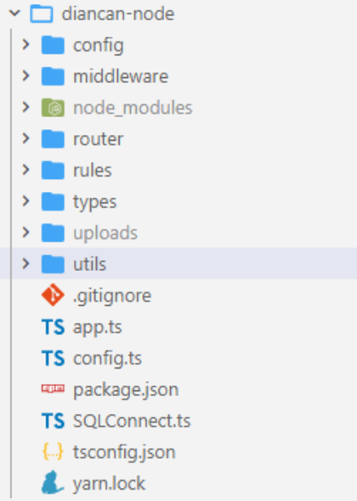

# 进阶篇

## 一、前言

> 通过基础篇  已掌握uniapp的基础语法以及开发流程
>
> 那么该篇幅为进阶篇  主要讲解小程序服务端的编写   以及  PC端数据联动、小程序数据联动
>
> **教学目标：**
>
> 1. 能够使用koa2开发服务端   提供WebAPI
> 2. 能够完成 全栈式项目 【点餐后端、点餐小程序端、点餐PC端】

### 1.1 你将获得

+ 掌握全栈开发
+ 学习小程序高级开发

### 1.2 课程知识储备

由于进阶篇需要完成全栈式项目 故需要的技能如下：

1. TS基础语法知识
2. ES6语法知识
3. Vue框架知识
4. 小程序知识
5. MySQL数据库


### 1.3 项目介绍

该课程集用户端、接口端、商家端后台管理于一体，全面打造一个实战，且可商用的小程序，完全可投入使用。

#### 服务端

1. koa2构建web服务
2. jwt鉴权模式
3. MySQL数据库增删改查
4. TS语法编写
5. 字段参数校验、错误处理、返回数据处理
6. 订阅信息、生成二维码、oss对象存储

#### 商家后台管理

1. 数据可视化展示
2. 发布删除修改商品
3. 订单相关操作
4. 微信订阅消息推送
5. 语音播报订单号
6. Vue3构建项目

#### 微信小程序端

1. 点餐界面菜单左右联动
2. 扫码进入主页面
3. 订阅推送消息

### 1.4 项目展示


## 二、 搭建服务器端

> 该章节主要 讲解 如何使用 ts + koa2 搭建服务器项目 以及如何去编写全局异常中间件、返回格式中间件、数据校验中间件

### 2.1  搭建并启动 ts + koa2服务器端

#### 2.1.1 初始化项目

新建`diancan-node`文件夹   初始化 npm包 `npm init -y`

项目需要使用的包模块： 

+ `koa`  `koa-body` `koa-router`  `koa2-cors` 
+ `nodemon` 
+ `async-validator`

#### 2.1.2 构建项目目录



**app.ts**

``` ts
import koa from 'koa'
import koaBody from 'koa-body'
import cors from 'koa2-cors'

const app = new koa()

// 跨域处理
app.use(cors())
// 解析post请求  urlencoded |  multipart  |  json 格式
app.use(koaBody())

// 启动服务器
app.listen(5000, () => {
  console.log('服务器运行中...')
})
```

**package.json**  修改启动命令

``` json
{
  "name": "diancan-node",
  "version": "1.0.0",
  "description": "",
  "main": "index.ts",
  "scripts": {
    "dev": "nodemon app.ts"
  },
  "keywords": [],
  "author": "",
  "license": "ISC"
}
```

**git管理清单**

``` txt
.DS_Store
node_modules/
dist/
uploads/
npm-debug.log*
yarn-debug.log*
yarn-error.log*
package-lock.json
tests/**/coverage/

# Editor directories and files
.idea
.vscode
*.suo
*.ntvs*
*.njsproj
*.sln
```

**tsconfig.json**

可通过 `tsc --init` 一键生成

``` ts
{
  "compilerOptions": {
    "target": "es2016",
    /* Modules */
    "module": "commonjs",
    "typeRoots": ["types"],
    "esModuleInterop": true,
    "forceConsistentCasingInFileNames": true,  
    "strict": false,                                  
    "skipLibCheck": true                             
  }
}
```

#### 2.1.3 运行项目

执行 **yarn dev**  或者 **npm run dev**    项目端口号为5000


### 2.2 设置全局异常中间件

思路： 捕获异常 `try...catch`  捕获全局 `所有中间件之前执行`

**config/error.ts**

``` ts
// 错误结构类
class ErrorResult extends Error {
  msg: string
  code: number
  constructor(msg: string, code: number) {
    super()
    this.msg = msg
    this.code = code
  }
}

export default ErrorResult
```


**middleware/abnormal.ts**

``` ts
import multer from 'multer'
import { Context, Next } from 'koa'
import ErrorResult from '../config/error'

// 自定义的全局异常处理中间件
const abnormal = (option = {}) => {
  return async (ctx: Context, next: Next) => {
    try {
      // 正常放行  当后续中间件发生错误时 会自动进入catch部分
      ctx.error = function(msg: string, code: number) {
        throw new ErrorResult(msg, code)
      }
      await next()
    } catch (error) {
      console.log(error)
      // 发生错误  判断错误的类型【已知错误 | 未知错误】
      if (error instanceof ErrorResult) {
        // 已知错误
        ctx.body = { msg: error.msg, code: error.code }
        ctx.status = error.code
      } else {
        // 未知错误
        ctx.body = { msg: '服务器内部错误' }
        ctx.status = 500
      }
    }
  }
}


export default abnormal
```

 

在 app.ts 中注册  **一定要在路由中间件前**

``` ts
import abnormal from './middleware/abnormal'

const app = new koa()

// 跨域处理
app.use(cors())
// 解析post请求  urlencoded |  multipart  |  json 格式
app.use(koaBody())
// 全局异常处理【中间件】
app.use(abnormal())
```


### 2.3 响应格式中间件

为了便于调用 将函数添加到ctx全局上下文对象中

**middleware/router-response.ts**

``` ts
import { Context, Next } from 'koa'

// 处理响应中间件
const routerResponse = (option = {}) => {
  return async function (ctx: Context, next: Next) {
    // 成功响应
    ctx.success = function (data = null, code = 200, msg = 'SUCCESS') {
      ctx.body = { data, code, msg }
    }
    // 异常响应
    ctx.fail = function (msg = 'FAIL', code = 500) {
      ctx.body = { code, msg }
    }
    await next()
  }
}

export default routerResponse
```

在 app.ts 中注册  **一定要在路由中间件前**

``` ts
import routerResponse from './middleware/router-response'

const app = new koa()
// 跨域处理
app.use(cors())
// 解析post请求  urlencoded |  multipart  |  json 格式
app.use(koaBody())
// 全局异常处理【中间件】
app.use(abnormal())
// 全局响应结果处理【中间件】
app.use(routerResponse())
```

### 2.4  设置ts类型

由于我们为 ctx上下文对象 添加了  error、success、fail 三个属性  所以需要扩展Ctx对象类型

**types/index.ts**

``` ts
import 'koa'
import 'koa-router'

declare module 'koa' {
  interface DefaultContext {
    success: (data?: any, code?: number, msg?: string) => void
    error: (msg?: string, code?: number) => void
    fail: (msg?: string, code?: number) => void
  }
}

declare module 'koa-router' {
  interface IRouterParamContext {
    success: (data?: any, code?: number, msg?: string) => void
    error: (msg?: string, code?: number) => void
    fail: (msg?: string, code?: number) => void
  }
}
```

**app.ts**

``` ts
import './types'
```


### 2.5 前端参数校验中间件

作为后端校验参数字段  是必不可少的内容   在这里我们使用 `async-validator` 模块进行对象校验

可参考文章:  **https://blog.csdn.net/dreamingbaobei3/article/details/122727229**

**middleware/params-validator.ts**

``` ts
import { Context, Next } from 'koa'
import Schema, { Rules } from 'async-validator'

// 验证请求参数中间件
const ParamsValidator = (rules: Rules) => {
  return async (ctx: Context, next: Next) => {
    try {
      // 生成验证规则
      const validator = new Schema(rules)
      // 根据当前请求类型解析参数值
      const data = ['GET', 'DELETE'].includes(ctx.method)
        ? { ...ctx.query }
        : ctx.request.body
      // 验证参数值
      await validator.validate(data)
      // 验证通过
      await next()
    } catch (error) {
      console.log(error)
      // 验证失败
      ctx.error(error.errors ? error.errors[0].message : error.msg, 500)
    }
  }
}

export default ParamsValidator

```


## 三、FLQ的使用

### 3.1  FLQ介绍

官方网站: https://flycran.gitee.io/flq/

Node与数据库交互的应用层解决方案      ->     通俗说 用于快速查询MySQL库

###  3.2 安装与配置

1. 安装:  使用`yarn`或者`npm`安装`FLQ`    `yarn add flq`

2. 连接数据库:   新建`SQLConnect.ts`

   ``` ts
   import { Flq } from 'flq'
   
   // 建立连接池
   const flq = new Flq({
     pool: true, // 使用连接池
     user: 'root', // 登录用户
     password: '123123', // 登录密码
     database: 'diancan' // 数据库名
   })
   
   export default flq;
   ```

3. 发起查询  `from`配置表名   `find`发起查询

   ``` ts
   const db = flq.from('student')
   db.find().then((e) => console.log(e))
   ```

**核心：** 使用`form` 方法配置表明   其他方法操作

### 3.3 查询

#### 3.3.1 基础查询

`find()` 方法

#### 3.3.2 只查询一个

`first()`方法

#### 3.3.3 查询部分字段

`field()`方法

例如:  `flq.from('student').field('name', { gender: '女' }).find()`

#### 3.3.4 条件查询

`where()`方法

例如: `flq.from('student').where({ id: 1 }).find()`

#### 3.4 增加

使用`flq.add`方法插入数据

`flq.from('student').value({ name: '小红' }).add()`

#### 3.5 删除

使用`flq.del`方法删除数据

 `flq.from('student').where({ id: 1 }).del()`

#### 3.6 修改

使用`flq.update`方法修改数据

`flq.form('student').where({ id: 1 }).set({ name: '小红' }).update()`


## 四、后台管理端【注册 / 登录】接口
### 4.1 实现注册逻辑 :taxi:

+ 注册需要的字段:  `phone` `password`

+ 接口地址:  `/api/auth/register`

+ 接口类型:  `POST`
+ 逻辑 :
  1. 校验参数是否合法
  2. 查询当前手机号 是否已经注册
  3. 未注册 ->  新增商家（账号、密码、uid：商家唯一标识【当前时间戳】）
  4. 响应结果

### 4.2 实现登录逻辑 :ghost:

+ 登录需要的字段: `phone` `password`
+ 接口地址: `/api/auth/register`
+ 接口类型: `POST`

+ 逻辑:
  1.  校验参数有效性 （起码不能为空）
  2. 校验用户名与密码 【是否存在、正确】
  3. 生成Token 响应结果 【后续介绍】 :cry:

### 4.3 JWT 原理、结构、和使用

JWT（JSON Web Tokens） 是一种方便地实现服务器与客户端安全通讯的规范，是目前最流行的跨域认证解决方案。

#### 4.3.1 JWT原理

使用 JWT，服务器认证用户之后，会生成包含一个 JSON 对象信息的 token 返回给用户，如：

```json
{
  "name": "moyufed",
  "role": "admin"
}
```

然后客户端请求服务的时候，都要带上该 token 以供服务器做验证。服务器还会为这个 JSON 添加签名以防止用户篡改数据。通过使用 JWT，服务端不再保存 session 数据，更加容易实现扩展。

#### 4.3.2 JWT 结构

JWT 是一行使用 “.” 分割成三个部分的字符串，这被分隔的三个部分分别是：Header（头部）、Payload（负载）、Signature（签名），访问 [https://jwt.io/](https://links.jianshu.com/go?to=https%3A%2F%2Fjwt.io%2F)  ，可以通过修改算法查看签名的计算公式以及结算结果。

第一部分（Header）实际上是一个 JSON 对象，是描述 JWT 的元数据，其中 `alg` 表示的是签名的算法，默认 HS256，`typ` 表示 token 的类型是 JWT，比如：

```json
{
  "alg": "HS256",
  "typ": "JWT"
}
```

第二部分（Payload）就是前面提到的 JSON 数据，是希望通过服务器发送给客户端的用户信息，可在这个 JSON 里面定义需要发送的字段，比如：

```json
{
  "sub": "1234567890",
  "name": "John Doe",
  "iat": 1516239022
}
```

第三部分（Signature）用来对 header 和 payload 两部分的数据进行签名，从而防止数据篡改，这个 signature 需要制定一个密钥（Secret），然后通过 header 里面制定的算法来产生签名。产生签名的算法也可以在 [https://jwt.io/](https://links.jianshu.com/go?to=https%3A%2F%2Fjwt.io%2F) 看到，比如：

```js
HMACSHA256(
  base64UrlEncode(header) + "." +
  base64UrlEncode(payload),
  your-256-bit-secret
)
```

最终通过把上面三个部分组合成 Header.Payload.Signature 的形式返回给用户。

#### 4.3.3 JWT 使用

客户端收到服务器返回的 token，可以储存在 cookie 或者 localStorage 里，在之后的请求需要上这个 token，通过以下方式携带 token：

+ 通过 cookie 自动发送，但是这样不能跨域。
+ 放在 HTTP 请求的头信息 Authorization 字段里面：`Authorization: Bearer <token>`。
+ 将 token 放在 POST 请求的数据体里面。

### 4.4 Koa-jwt 的使用

执行 `yarn add` 安装 koa-jwt 中间件：

``` bash
yarn add koa-jwt
```

导入 `koa-jwt` 并配置好密钥

``` ts
import jwt from 'koa-jwt'

const secret = 'moyufed-test'; // 定义一个密钥secret，这里只是做演示，建议放在项目配置里面

// 这里调用引入的jwt方法，最终会得到一个中间件，将中间件匹配到 / 路径
router.use(jwt({
    secret,
    debug: true // 开启debug可以看到准确的错误信息
}));
```

通过浏览器访问, 由于浏览器请求里面没有携带任何 token 信息，服务返回了认证错误 `Token not found` 。

#### 4.4.1 判断JWT错误

JWT验证错误时会自动抛出 401的错误信息  

``` js
// 中间件 自定义了 401 响应，将用户验证失败的相关信息返回给浏览器
app.use(function(ctx, next){
  return next().catch((err) => {
    if (401 == err.status) {
      ctx.status = 401;
      ctx.body = 'Protected resource, use Authorization header to get access\n';
    } else {
      throw err;
    }
  });
});
```

#### 4.4.2 生成Token

由于 koa-jwt 从 koa-v2 分支开始不再导出 `jsonwebtoken`  的 `sign` 、  `verify` 和 `decode` 方法，若要单独生成 token 、验证 token 等，需另从 `jsonwebtoken`  中将其引入：

1. 下载 `jsonwebtoken`   ->  `yarn add jsonwebtoken`

2. 生成token

   ``` ts
   import jsonwebtoken from 'jsonwebtoken'
   // result为加密的内容   secretKey为加密秘钥   expiresIn 设置token时长
   const token = jsonwebtoken.sign(result, secretKey, { expiresIn: '1d' })
   ```

#### 4.4.3 验证Token

Koa-jwt 有三种途径获取 token：

1. 通过自定义 getToken 方法获取
2. 通过配置里的 cookie key值获取
3. 通过请求头里面的 Authorization 获取，Authorization 的格式一般是 `'Bearer <token>'`

在这里主要介绍 **如何从请求头中获取**

由于JWT中间件会默认从请求头中获取 所以如果需要拦截指定路径下的Token可以如下配置:

``` ts
// Koa-jwt 使用 `unless` 表达式忽略滤路径
app.use(jwt({ secret: 'shared-secret' }).unless({ path: [/^\/public/] }));
```

####  4.4.4 完整实现代码

1. 将secretKey秘钥存放在`config.ts`文件中

   ``` ts
   // token秘钥
   export const secretKey = 'DIAN_CAN_SECRET_KEY'
   ```

2. `app.ts` 定义jwt校验方式

   ``` ts
   import jwt from 'koa-jwt'
   import { secretKey } from './config'
   
   // JWT认证中间件 【/api/auth】不需要验证
   app.use(jwt({ secret: secretKey, debug: true }).unless({ path: [/^\/api\/auth/, /^\/api2/] }))
   
   ... 路由文件
   ```

3. 登录逻辑中生成token

   ``` ts
   import jsonwebtoken from 'jsonwebtoken'
   
   // 后台- 商家登录
   // 3. 生成Token 响应结果
   const token = jsonwebtoken.sign(result, secretKey, { expiresIn: '1d' })
   ```

::: danger 警告

前端保存token 后续请求携带在请求头中  格式为 `Bearer <token>`

:::

### 4.5 对接后台管理登录

1. 打开`diancan-pc` 下载依赖包  `yarn install`
2. 项目组成:  PC端项目由 `vue2 ` + `vue-router` + `vuex` + `elementui` 搭建
3. 启动项目: `yarn serve`

#### 4.5.1 封装API请求

**/src/utils/request.js**

``` js
import Axios from 'axios'
import { Message } from 'element-ui'
import { getToken } from './auth'
import store from '@/store'
import router from '@/router'

// 封装的思路:  简化地址的填写【设置默认地址】  简化导入步骤【添加到Vue原型对象中】  简化返回的结果

// 通过create方法创建新的axios对象  并传入默认配置   那么创建的axios对象就会按照配置去发起请求
const service = Axios.create({
  baseURL: 'http://localhost:5001/api', // 请求默认地址
  timeout: 5000 // 请求超时时间
})

// 添加请求拦截器
service.interceptors.request.use((config) => {
  // 在请求头中添加token
  config.headers.authorization = 'Bearer ' + getToken()
  // 返回请求对象
  return config
})

// 添加响应拦截器
service.interceptors.response.use(
  // 响应成功
  (res) => {
    const data = res.data
    // ---- 判断请求是否成功  不为200既是错误 ----
    if (data.code !== 200) {
      Message.error(data.msg || '出现了错误')
      // token有问题 清理登录信息
      if (data.code === 401) {
        store.dispatch('user/logout')
        router.push('/login')
      }
      return Promise.reject(data.msg) // 将错误的响应结果返回
    }
    return data // 将响应的data值返回
  },
  // 响应失败
  (error) => Promise.reject(error)
)

export default service
```

#### 4.5.2 修改登录/注册逻辑

登录 / 注册 发送对应API请求 进行基础登录

**api/auth.js**

``` js
// 认证模块API 【登录 / 注册】
import request from '@/utils/request'

// * 商家登录
export const loginApi = data => request.post('/auth/login', data)

// * 商家注册
export const registerApi = data => request.post('/auth/register', data)

// * 文件上传
export const uploadApi = data => request.post('/merchant/upload', data)
```

**login.vue**

``` js
// 注册
async register() {
    this.loading = true
    try {
        await registerApi(this.formInput)
        this.$message.success('注册成功')
        this.regi = '注册'
        this.loading = false
    } catch (error) {
        this.loading = false
    }
}

// 登录
async login() {
    this.loading = true
    try {
        await this.$store.dispatch('user/login', this.formInput)
        this.$message.success('登录成功')
        this.loading = false
        this.$router.push('/dashboard')
    } catch (error) {
        this.loading = false
    }
}
```

::: tip 提示

**登录成功后   若当前商家尚未配置信息 需要进入商家信息页面添加配置**

:::

## 五、后台管理端【商家信息】接口
商家信息的构成:  `商家名` 、 `商家地址` 、`商家Logo`

**每个新注册的商家都需要设置商家信息**

需要的接口:  `商家信息上传`, `获取商家信息`, `更新商家信息`

### 5.1 七牛云对象存储

> **什么是对象存储?**  基于对象存储技术的存储方式
>
> **有什么作用？** 降低中心服务器压力、减少服务器请求、降低服务器存储空间
>
> **如何理解?**   将需要大量供用户访问的资源信息存储到其他服务器中  从而降低主服务器的资源占用

####  5.1.1 如何使用对象存储?

1. 注册七牛云账号  https://portal.qiniu.com/   【**新人需要实名认证**】
2. 在对象存储中新建空间 【空间需要公开】
3. 在文件上传中上传资源内容  【上传后即可通过链接访问】


### 5.2 使用SDK操作对象存储

#### 5.2.1 安装SDK

推荐使用`yarn`来安装：

``` bash
yarn install qiniu
```

#### 5.2.2 获取AK与SK

Node.js SDK 的所有功能，都需要合法的授权。授权凭证的签算需要七牛账号下的一对有效的`Access Key`和`Secret Key`

查看地址: https://portal.qiniu.com/user/key 

将AK与SK保存在 `config.ts`文件中 方便后续使用: 

``` ts
// 七牛云OSS存储
export const qiniu_accessKey  = 'dpmzaIhnPAoDOuE8jRcePWGyTtnwftu6eI9rGpA-' // ak
export const qiniu_secretKey  = '-HTnTmFP0mHulE1lmYJXtEVgrslVq-4gGIog2qIz' // sk
export const qiniu_bucket = 'zengapi' // 存储空间名
export const qiniu_url = 'http://rld84hmgj.hn-bkt.clouddn.com/'    // 访问域名
```

#### 5.2.3 获取上传凭证

**test.ts**

``` ts
import qiniu from 'qiniu'

const putPolicy = new qiniu.rs.PutPolicy({ scope: '存储空间名' })
const mac = new qiniu.auth.digest.Mac('AK', 'SK')
const uploadToken = putPolicy.uploadToken(mac)
```

#### 5.2.4 构建上传函数

``` ts
// 代码略...

const config = new qiniu.conf.Config()
// 华东	qiniu.zone.Zone_z0
// 华北	qiniu.zone.Zone_z1
// 华南	qiniu.zone.Zone_z2
// 北美	qiniu.zone.Zone_na0
// @ts-ignore 设置空间对应机房
config.zone = qiniu.zone.Zone_z2
const formUploader = new qiniu.form_up.FormUploader(config)
const putExtra = new qiniu.form_up.PutExtra()
// 文件上传
formUploader.putFile(上传凭证, 上传文件名, 上传文件路径, putExtra, function(respErr,
  respBody, respInfo) {
  if (respErr) {
    throw respErr;
  }
  if (respInfo.statusCode == 200) {
    console.log(respBody);
  } else {
    console.log(respInfo.statusCode);
    console.log(respBody);
  }
});

```

### 5.3 Koa文件上传

在koa中我们使用 `multer` 模块上传文件

#### 5.3.1 安装模块

``` bash
yarn add @koa/multer multer
```

#### 5.3.2 快速上手

``` ts
import multer from '@koa/multer'

// 配置上传文件1.所在的目录和2.更改文件名
const storage = multer.diskStorage({ //磁盘存储引擎方法
	destination:(req, file, cb)=> { //存储前端传来的文件
	    cb(null, 'uploads')
	},
	filename:(req, file, cb)=> {
	   // 防止文件重名更改前缀
	   let fileFormat = (file.originalname).split(".")
	   let num = `${Date.now()}-${Math.floor(Math.random() * 10000000)}${"."}${fileFormat[fileFormat.length - 1]}`
	   cb(null, num)
	 }
})

const upload = multer({ storage, limits: { fileSize: 5 * 1024 * 1024 } })

const router = new Router()

// 单图上传 字段必须为file
router.post('/upload', upload.single('file'), async (ctx) => {
    console.log(ctx.file)
})

// 多图上传 字段必须为photos组成的数组 最多12个
router.post('/upload', upload.array('photos', 12), async (ctx) => {
    console.log(ctx.files)
})
```

#### 5.3.3 封装为中间件

**/middleware/upload.ts**

``` ts
import multer from '@koa/multer'

// 配置上传文件1.所在的目录和2.更改文件名
const storage = multer.diskStorage({ //磁盘存储引擎方法
	destination:(req, file, cb)=> { //存储前端传来的文件
	    cb(null, 'uploads')
	},
	filename:(req, file, cb)=> {
	   // 防止文件重名更改前缀
	   let fileFormat = (file.originalname).split(".")
	   let num = `${Date.now()}-${Math.floor(Math.random() * 10000000)}${"."}${fileFormat[fileFormat.length - 1]}`
	   cb(null, num)
	 }
})

const upload = multer({ storage, limits: { fileSize: 5 * 1024 * 1024 } })

export default upload
```

**/router/admin/shop-info.ts**

``` ts
// * 商家信息管理 API接口
import Router from 'koa-router'
import upload from '../../middleware/upload'
const router = new Router({ prefix: '/merchant' })

// 后台- 图片上传
router.post('/upload', upload.single('file'), async (ctx) => {
 console.log(ctx.file)
})
```


### 5.4 上传图片到对象存储

#### 5.4.1 封装qn函数库

由于qnSDK操作代码过于复杂  封装之后便于后期多次使用

**config/qn.ts**

``` ts
import { File } from '@koa/multer'
import qiniu from 'qiniu'
import { qiniu_accessKey, qiniu_bucket, qiniu_secretKey, qiniu_url } from '../config'

// 七牛模块
class Qn {
  constructor() {}

  // 构建上传策略函数(获取上传token)
  upToken(bucket: string) {
    const putPolicy = new qiniu.rs.PutPolicy({ scope: bucket })
    const mac = new qiniu.auth.digest.Mac(qiniu_accessKey, qiniu_secretKey)
    const uploadToken = putPolicy.uploadToken(mac)
    return uploadToken
  }

  // 上传图片
  upImg(file: File) {
      // 上传到七牛后保存的文件名
      const key = file.filename
      // 生成上传 Token
      const token = this.upToken(qiniu_bucket)
      //要上传文件的本地路径
      const filePath = file.path

      //构造上传函数
      // 文件上传（以下四行代码都是七牛上传文件的配置设置）
      const config = new qiniu.conf.Config()
      // @ts-ignore 设置空间对应机房
      config.zone = qiniu.zone.Zone_z2
      const formUploader = new qiniu.form_up.FormUploader(config)
      const putExtra = new qiniu.form_up.PutExtra()
      return new Promise((resolve, reject) => {
        formUploader.putFile(token, key, filePath, putExtra,
          function (respErr, respBody, respInfo) {
            if (respErr) {
              reject(respErr)
            }
            if (respInfo.statusCode == 200) {
              resolve(qiniu_url + respBody.key)
            } else {
              // console.log(respInfo, respBody)
              reject({ code: 500, msg: '上传失败', error: respBody.error })
            }
          }
        )
      })
  }
}

export default new Qn();
```

#### 5.4.2 在路由中使用

``` ts
// 后台- 图片上传
router.post('/upload', upload.single('file'), async (ctx) => {
  try {
    const res = await qn.upImg(ctx.file)
    ctx.success(res)
  } catch (error) {
    ctx.fail('上传失败', 202)
  }
})
```


### 5.5 实现商家信息上传逻辑 :ideograph_advantage:

+ 需要的字段:  `nickname ` `address`  `logo`

+ 接口地址:  `/admin/shopInfo`

+ 接口类型:  `POST`
+ 逻辑 :
  1. 校验参数有效性 **不能为空**
  2. 根据当前uid新增信息
  3. 响应数据

### 5.6 实现获取商家信息逻辑 :gem:

+ 需要的字段:  无

+ 接口地址:  `/admin/shopInfo`

+ 接口类型:  `GET`
+ 逻辑 :
  1. 根据当前uid获取信息
  2. 响应数据 【去除id、密码】


### 5.7 实现更新商家信息 :yellow_heart:

+ 需要的字段:  无

+ 接口地址:  `nickname ` `address`  `logo`

+ 接口类型:  `PUT`
+ 逻辑 :
  1. 校验参数有效性 **不能为空**
  2. 查询当前用户是否有商家信息
  3. 根据当前uid新增信息
  4. 响应数据

## 六、后台管理端【商家信息】页面逻辑

### 6.1 用户登录逻辑

**核心逻辑:** 登录成功后存储Token、 获取用户信息、 有用户信息  ?   跳转首页  ：  跳转上传商家信息页

``` vue
<script>
export default {
 	methods: {
        // 登录
		async login() {
			this.loading = true
			try {
				const { data } = await loginApi(userInfo)
                // 保存token
                setToken(data)
                // 获取用户信息
                const { data: info } = await getShopInfoApi()
                this.$message.success('登录成功')
				this.loading = false
                // 判断是否有用户信息
                if (!info) {
					next('/modify-info')
				} else {
					next('/dashboard')
				}
			} catch (error) {
				this.loading = false
			}
		}
    }   
}
</script>
```


### 6.2 上传商家信息页

**src/views/settings/modify-info.vue**

**核心逻辑:**  `收集商家信息`, `图片上传`, `提交商家信息`

+ 收集商家信息

``` vue
<template>
	<!-- 店铺名称 -->
    <div class="image-view-title">
        <div class="image-list">店铺名称</div>
        <el-input v-model="formInput.name" placeholder="请输入店铺名称"></el-input>
    </div>
    <!-- 店铺地址 -->
    <div class="image-view-title">
        <div class="image-list">店铺地址</div>
        <el-input v-model="formInput.address" type="text" placeholder="请输入店铺地址"></el-input>
    </div>
    <!-- 店铺logo -->
    <div class="image-view-title">
        <div class="image-list">店铺logo</div>
        <el-input v-model="formInput.logo" placeholder="请输入Logo"></el-input>
    </div>

    <!-- 提交 -->
    <div class="image-button">
        <el-button type="success" size="medium" @click="submitForm" :loading="loading">提交</el-button>
    </div>
</template>

<script>
export default {
	data() {
		return {
			formInput: {
				name: '',
				address: '',
				logo: ''
			},
      loading: false
		}
	},
}
</script>
```

+ 上传图片

``` vue
<template>
	<el-upload
        class="avatar-uploader"
        :action="actions"
        :headers="{ authorization: 'Bearer ' + token }"
        :show-file-list="false"
        :on-success="handleAvatarSuccess"
        :before-upload="beforeAvatarUpload"
    >
        
        <i v-else class="el-icon-plus avatar-uploader-icon"></i>
    </el-upload>
</template>

<script>
export default {
    methods: {
		handleAvatarSuccess(res, file) {
      		this.formInput.logo = res.data
		},
		beforeAvatarUpload(file) {
			const isJPG = file.type === 'image/jpeg' || file.type === 'image/png'
			const isLt2M = file.size / 1024 / 1024 < 2

			if (!isJPG) {
				this.$message.error('上传头像图片只能是 JPG、PNG 格式!')
			}
			if (!isLt2M) {
				this.$message.error('上传头像图片大小不能超过 2MB!')
			}
			return isJPG && isLt2M
		}
    }
}
</script>
```

+ 提交商家信息

``` js
async submitForm() {
  this.loading = true
  const requestApi = addShopInfoApi
  try {
    await requestApi(this.formInput)
    this.$message.success('操作成功')
    this.loading = false
    // 新增则跳转首页  修改则返回信息页
    this.$router.push(this.shopInfo ? '/settings' : '/')
  } catch (error) {
    this.loading = false
  }
}
```


### 6.3 路由验证文件

核心逻辑:  未登录用户禁止进入主页， 未设置商家信息禁止进入主页， 进入后拉取商家信息

**修改登录逻辑  将登录逻辑改写到vuex中**

****

**store/index.js**

``` js
import Vue from 'vue'
import Vuex from 'vuex'
import user from './modules/user'

Vue.use(Vuex)

export default new Vuex.Store({
	modules: { user },
  	getters: {
    	shopName: state => state.user.shopInfo?.name,
    	token: state => state.user.token
  	}
})
```

**store/module/user.js**

`修改登录逻辑`， `获取商家信息方法`, `用户退出登录方法`

``` js
// 用户模块（商家）
import { loginApi } from "@/api/auth"
import { getShopInfoApi } from "@/api/merchant-info"
import { getToken, removeToken, setToken } from "@/utils/auth"

const defaultState = () => ({
  token: getToken(),
  shopInfo: null
})

const mutations = {
  SET_TOKEN (state, token) {
    state.token = token
  },
  SET_INFO (state, info) {
    state.shopInfo = info
  }
}

const actions = {
  // 登录
  async login({ commit, dispatch }, userInfo) {
    const { data } = await loginApi(userInfo)
    setToken(data)
    commit('SET_TOKEN', data)
  },
  // 获取商家信息
  async getShopInfo ({ commit }) {
    const { data } = await getShopInfoApi()
    commit('SET_INFO', data)
    return data
  },
  // 退出登录
  logout({ commit }) {
    removeToken()
    commit('SET_TOKEN', '')
    commit('SET_INFO', '')
  }
}

const getters = {}

export default {
	namespaced: true,
	state: defaultState(),
	mutations,
	actions,
	getters
}
```

**views/login.vue**

``` js
// 登录
async login() {
    this.loading = true
    try {
        await this.$store.dispatch('user/login', this.formInput)
        this.$message.success('登录成功')
        this.loading = false
        this.$router.push('/dashboard')
    } catch (error) {
        this.loading = false
    }
}
```

****

**permission.js **  核心代码

``` js
// 路由前置守卫
router.beforeEach(async (to, from, next) => {
	console.log('路由进入前')
	// 开启加载进度条
	NProgress.start()

	// 设置页面标题
	document.title = getPageTitle(to.meta.title)

	// 判断用户是否登录?  ->  登录 放行  -> 未登录 跳转登录页面
	// 1. 取出token值【登录凭证】
	const token = store.getters.token
	// 2. 判断是否有token
	if (token) {
		// 3. 验证是否有商家信息【商家信息页 不需要验证】
		if (store.getters.shopName || to.path === '/modify-info') {
			// 4. 有商家信息
			next()
		} else {
			try {
				// 5. 无商家信息  重新拉取商家信息
				const info = await store.dispatch('user/getShopInfo')
				// 6. 拉取后还是无商家信息【跳转商家信息页】
				if (!info) {
					next('/modify-info')
				} else {
					next()
				}
			} catch (error) {
				// 5. 拉取信息失败
				store.dispatch('user/logout')
				next('/login')
			}
		}
	} else {
		// 3. 无token  判断当前页面是否为登录【直接放行 / 跳转登录】
		if (to.path === '/login') {
          next()
        } else {
          next('/login')
        }
	}
  	// 关闭加载进度条
	NProgress.done()
})
```

### 6.4 商家信息页

> 商家信息页 主要为展示页面  展示商家信息

核心逻辑: `通过vuex拉取信息`  `跳转修改商家信息页`


### 6.5 修改商家信息页

需要的逻辑: `返回上一页`  `渲染商家信息`  `提交商家信息修改`

+ 返回上一页:  判断是否有**商家信息**  有则显示返回上一页

``` vue
<p @click="$router.push('/settings')" v-if="shopInfo">返回上一页</p>
```

+ 渲染商家信息:  从vuex拉取商家信息   有则渲染到`formInput`中

``` js
computed: {
    ...mapState('user', ['shopInfo', 'token']),
    title() {
        return this.shopInfo ? '修改店铺信息' : '设置店铺信息'
    }
},
mounted() {
    // 判断是否为信息
    if (this.shopInfo.name) {
      this.formInput = { ...this.shopInfo }
    }
}
```

+ 提交商家信息修改:  判断`shopInfo`是否有值 ？  修改  :   设置

## 七、后台管理端【菜品管理】接口
> 菜品管理:   `菜品单位`,  `菜品信息`, `菜品类目`

### 7.1 创建菜品管理表

各表名:  `dishes_unit` 菜品单位   `dishes_category` 菜品类目 `dishes_data` 菜品信息    

#### 7.1.1 菜品单位

+ 表名: `dishes_unit`

+ 表字段： 

  | 字段名 | 字段类型 | 备注                           |
  | ------ | -------- | ------------------------------ |
  | id     | int      | 菜品单位id     **主键**   自增 |
  | label  | varchar  | 单位名                         |
  | value  | varchar  | 单位值                         |
  | uid    | varchar  | 商家ID                         |

#### 7.1.2 菜品类目

+ 表名: `dishes_category` 

+ 表字段： 

  | 字段名 | 字段类型 | 备注                           |
  | ------ | -------- | ------------------------------ |
  | id     | int      | 菜品类目id     **主键**   自增 |
  | label  | varchar  | 类目名                         |
  | value  | varchar  | 类目值                         |
  | uid    | varchar  | 商家ID                         |
  | rank   | int      | 排序值                         |

#### 7.1.3 菜品信息

+ 表名: `dishes_data` 

+ 表字段： 

  | 字段名      | 字段类型 | 备注                                 |
  | ----------- | -------- | ------------------------------------ |
  | id          | int      | 菜品信息id     **主键**   自增       |
  | cid         | int      | 菜品类目ID                           |
  | category    | varchar  | 菜品类目名                           |
  | image       | varchar  | 菜品图片                             |
  | name        | varchar  | 菜品名                               |
  | monthlysale | int      | 月销量                               |
  | unitprice   | float    | 菜品单价                             |
  | unit        | varchar  | 菜品单位                             |
  | time        | varchar  | 上架时间                             |
  | onsale      | tinyint  | 菜品状态  0下架  1上架   **默认为1** |
  | uid         | varchart | 商家ID                               |
  | rank        | int      | 排序值                               |

### 7.2 菜品单位接口

核心API: `添加菜品单位`  `获取菜品单位`

#### 7.2.1 添加菜品单位

+ 请求地址:  `/dish/unit`
+ 请求方法：`POST`
+ 请求参数:   `label`: 单位名 , `value`:  单位值
+ 逻辑:  1. **不能添加重复单位**  2. **校验不能为空**

``` ts
// * 添加菜品单位
router.post('/unit', ParamsValidator(dishesUnitRule) ,async (ctx) => {
  // 根据当前登录 用户ID拉取用户信息
  const { uid } = ctx.state.user
  const { label, value } = ctx.request.body
  const db = flq.from('dishes_unit')
  try {
    // 查询数据库是否已存在该类目
    const unitInfo = await db.where({ label, uid }).first()
    if (unitInfo) return ctx.fail('该单位已存在', 202)
    // 添加单位
    await db.value({ label, value, uid }).add()
    ctx.success()
  } catch (error) {
    ctx.error('添加失败')
  }
})
```


#### 7.2.2 获取菜品单位

+ 请求地址:  `/dish/unit`
+ 请求方法：`GET`
+ 请求参数:   `label`：单位名
+ 逻辑:  1.  **可根据单位名模糊查询**   2. **返回菜品单位列表**

``` ts
// * 获取菜品单位
router.get('/unit', async (ctx) => {
  const { uid } = ctx.state.user
  const { label } = ctx.query as any
  try {
    const data = await flq.from('dishes_unit').where({ uid }).find()
    ctx.success(data)
  } catch (error) {
    ctx.error('获取错误')
  }
})
```


### 7.3 菜品类目接口

核心API:  `添加菜品类目`    `获取菜品类目`   `删除菜品类目`   `修改菜品类目`

解释: **菜品类目是每个菜品对应的所属父级   每个菜品在添加时都需要由类目下级去添加**

#### 7.3.1 添加菜品类目

+ 请求地址:  `/dish/category`
+ 请求方法：`POST`
+ 请求参数:   `label`- 类目名  `value` - 类目值   `rank` - 排序值
+ 逻辑:  1. **排序值**用于类目显示顺序  2. **类目唯一**  3. 校验参数有效性

``` ts
// 后台 - 添加菜品类目
router.post('/category',Validator(dishesCateRule), async (ctx) => {
  // 根据当前登录 用户ID拉取用户信息
  const { uid } = ctx.state.user
  const { label, value, rank } = ctx.request.body
  const db = flq.from('dishes_category')
  try {
    // 查询数据库是否已存在该类目
    const cateInfo = await db.where({ label, uid }).first()
    if (cateInfo) return ctx.fail('类目已存在', 202)
    // 添加类名
    await db.value({ label, value, rank , uid }).add()
    ctx.success()
  } catch (error) {
    ctx.error('添加失败')
  }
})
```


#### 7.3.2 获取菜品类目

+ 请求地址:  `/dish/category`
+ 请求方法：`GET`
+ 请求参数:   `page`- 页码  `pageSize` - 每页条数   `rank` - 排序值
+ 逻辑:  1. **排序值**用于类目显示顺序  2. **类目唯一**  3. 校验参数有效性

``` ts
// 后台 - 获取菜品类目
router.get('/category', async (ctx) => {
  // 根据当前登录 用户ID拉取用户信息
  const { uid } = ctx.state.user
  const { page = 1, pageSize = 10 } = ctx.query
  const db = flq.from('dishes_category')
  try {
    // 查询数据库是否已存在该类目
    const cateList = await db.where({ uid }).limit({ page: page as number, size: pageSize as number }).order({ rank: 1 }).find()
    const total = await db.where({ uid }).count()
    const result = { list: cateList, page: Number(page), pageSize: Number(pageSize), total: total }
    ctx.success(result)
  } catch (error) {
    ctx.error('获取失败')
  }
})
```


#### 7.3.3 删除菜品类目

+ 请求地址:  `/dish/category`
+ 请求方法：`delete`
+ 请求参数:   `id` - 类目ID
+ 逻辑:  1. 校验id是否正确【只能删除自己的类目】 2. **若当前类目 有已添加菜品禁止删除**

``` ts
// 后台 - 删除菜品类目
router.delete('/category', Validator(dishesCate2Rule) ,async (ctx) => {
  const { id } = ctx.query
  const { uid } = ctx.state.user
  const db = flq.from('dishes_category')
  try {
    // 判断当前id是否属于自己
    const data = await db.where({ id: id as string, uid }).first()
    if (!data) return ctx.fail('操作失败', 202)
    // 判断当前类目是否有对应菜品
    
    // 删除对应类目
    const { affectedRows } = await db.where({ id: id as string, uid }).remove()
    if (!affectedRows) return  ctx.fail('id有误', 202)
    ctx.success()
  } catch (error) {
    ctx.error('删除失败')
  }
})
```


#### 7.3.4 修改菜品类目

+ 请求地址:  `/dish/category`
+ 请求方法：`put`
+ 请求参数:   `id` - 类目ID  `label`- 类目名 `value` - 类目值  `rank` - 排序值
+ 逻辑:  1. **校验参数有效性**  2. **类目名**不能修改重复 3. **类目名** 有修改 对应菜品数据更新 

**代码略 :happy:**

``` ts
// 后台 - 修改菜品类目
router.put('/category', Validator(dishesCate3Rule) ,async (ctx) => {
  // 1. 解析参数
  const { id, label, rank } = ctx.data
  const { uid } = ctx.state.user
  // 2. 检查类目label是否重复
  const db = flq.from('dishes_category')
  const result = await db.where({ uid, label }).first()
  if (result && result.id != id) return ctx.fail('类目名已重复', 202)
  // 3. 修改类目
  const { affectedRows } = await db.where({ id, uid }).set({ label, value: label, rank }).update()
  if (!affectedRows) return ctx.fail('id有误', 202 )
  // 4. 判断label是否有修改 -> 更新对应菜品
  if (!result) {
    await flq.from('dishes_data').where({ cid: id, uid }).set({ category: label }).update()
  }
  ctx.success()
})
```


### 7.4 菜品信息接口

**核心API：** `添加菜品` `获取菜品数据` `上下架菜品` `编辑菜品 ` `获取菜品详情信息`

#### 7.4.1 添加菜品

+ 请求地址:  `/dish/data`

+ 请求方法：`POST`

+ 请求参数: 

   `cid` 类目iD `category` 类目名 `image` 菜品图 `name` 菜品名

   `unitprice` 单价 `unit` 单位  `rank` 排序值

+ 逻辑:  1. **校验参数有效性**  2. **使用DayJS生成时间**

``` ts
// * 添加菜品
router.post('/data', ParamsValidator(dishesDataRule), async (ctx) => {
  const { cid, category, image, name, unitprice, unit, rank } = ctx.request.body
  const { uid } = ctx.state.user
  const time = dayjs().format('YYYY-MM-DD hh:mm:ss')
  try {
    // 新增
    await flq.from('dishes_data').value({ cid, category, image, name, unitprice, unit, time, onsale: 1, uid }).add()
    ctx.success()
  } catch (error) {
    console.log(error)
    ctx.error('添加失败')
  }
})
```


#### 7.4.2 获取菜品数据

+ 请求地址:  `/dish/data`
+ 请求方法：`GET`
+ 请求参数:  `page` 页码 `pageSize` 每页条数  `state` 菜品状态  `name` 菜品名
+ 逻辑:  1. **校验参数有效性**  2. **分页** + **排序**  3. 菜品状态查询  4. 菜品名模糊查询

``` ts
// * 获取菜品数据 【页码、每页条数、菜品状态、菜品名、类目id】
router.get('/data' ,async (ctx) => {
  const { page = 1, pageSize = 10, state = 1, name = '', cid } = ctx.query as Record<string, any>
  const { uid } = ctx.state.user
  const db = flq.from('dishes_data').where({ uid, cid , onsale: state, name: { com: 'LIKE', val: `%${name}%` } }).limit({ page, size: pageSize }).order({ rank: 1 }).foundRows()
  try {
    // 查询菜品数据
    const data = await db.find()
    const result = { list: data, page: page - 0, pageSize, total: db.total }
    ctx.success(result)
  } catch (error) {
    ctx.error('获取失败')
  }
})
```


#### 7.4.3 上下架菜品

+ 请求地址:  `/dish/data/status`
+ 请求方法：`PUT`
+ 请求参数:  `id` 菜品id   `state` 菜品状态
+ 逻辑:  1. **校验参数有效性**  2. **只能修改自己的菜品**

**代码略 :happy:**


#### 7.4.4 编辑菜品

+ 请求地址:  `/dish/data`

+ 请求方法：`PUT`

+ 请求参数:  

  `id`  菜品ID  `cid` 类目iD `category` 类目名 

  `image` 菜品图 `name` 菜品名  `unitprice` 单价 `unit` 单位  `rank` 排序值

+ 逻辑:  1. **校验参数有效性**  2. **只能修改自己的菜品**  

**代码略 ** :happy:


#### 7.4.5 获取菜品详情信息

+ 请求地址:  `/dish/data/:id`
+ 请求方法：`GET`
+ 请求参数:  `:id` 菜品id
+ 逻辑:  1. 根据菜品id查询详细信息

``` ts
// * 获取菜品详情信息 动态路由
router.get('/data/:id', async (ctx) => {
  const { id } = ctx.params
  const { uid } = ctx.state.user
  try {
    // 检查ID是否正确
    const dish = await flq.from('dishes_data').where({ uid, id }).first()
    if (!dish) return ctx.fail('id有误')
    ctx.success(dish)
  } catch (error) {
    ctx.error('查询失败')    
  }
})
```


## 八、 后台管理端【菜品管理】页面

### 8.1 菜品类目管理

菜品类目管理模块  主要针对于菜品类目的查询、添加、修改等相关操作

#### 8.1.1 渲染菜品类目列表

**最基础的表格渲染** + **分页效果**


#### 8.1.2 添加菜品类目

**UI结构**:

``` html
<!-- 添加/修改 类目Dialog -->
<el-dialog width="30%" title="菜品类目" :visible.sync="dialogVisible" :before-close="dialogClose">
  <el-form ref="formRef" :model="formInput" label-width="80px" label-position="left">
    <el-form-item label="类目名">
      <el-input v-model="formInput.label" />
    </el-form-item>
    <el-form-item label="排序值">
      <el-input type="number" v-model="formInput.rank" />
    </el-form-item>
  </el-form>
  <div slot="footer">
    <el-button @click="dialogClose">取 消</el-button>
    <el-button type="primary" @click="submitForm">确 定</el-button>
  </div>
</el-dialog>
```

**JS逻辑**

``` js
dialogOpen(row) {
  if (row) {
    this.formInput = { ...row }
  }
  this.dialogVisible = true
},
dialogClose() {
  this.formInput = {}
  this.dialogVisible = false
},
// 提交dialog内容【新增 / 修改】
async submitForm() {
  const { label, id } = this.formInput
  // 判断操作类型
  const requestApi = id ? setCategoryApi : addCategoryApi
  await requestApi({ ...this.formInput, value: label })
  this.$message.success('操作成功')
  this.getTableData()
  this.dialogClose()
}
```

#### 8.1.3 修改菜品类目

**同上**


#### 8.1.4  删除菜品类目

``` js
// 删除类目信息
async delCategory(id) {
    await delCategoryApi({ id })
    this.$message.success('删除成功')
    this.getTableData()
},
```

### 8.2 菜品管理

菜品管理模块  主要针对于菜品信息的查询、添加、修改、上下架管理

#### 8.2.1 菜品查询

**核心功能:**  列表渲染、分页显示、菜品名搜索、菜品状态筛选

代码略

#### 8.2.2 菜品添加

**核心功能**:  收集表单数据、 菜品单位加载与添加、菜品图片上传

+ 收集表单数据:   `对应字段v-model绑定即可`

+  菜品单位加载与添加:    

  1. 菜品单位需默认加载   供用户选择
  2. 用户也可以通过自定义单位   实现添加单位 

  ::: tip 提示

   点击自定义单位   显示添加单位操作项

  :::
  
+ 菜品图片上传：  **使用封装的图片上传组件**

**提交数据：**  准备数据   ->  发起请求   ->  跳转页面

``` js
// 提交数据
async submitForm() {
  // 准备表单需要的数据
  const cid = this.categoryList.find(item => item.value === this.formInput.category).id
  const data = { ...this.formInput, cid }
  // 发起请求
  try {
    const requestApi = this.id ? setDishApi : addDishApi
    await requestApi(data)
    this.$message('操作成功')
    this.$router.push('/dish')
  } catch (error) {
    console.log('失败')
  }
}
```


#### 8.2.3 菜品修改

实现思路:  跳转页面携带菜品ID    ->   根据菜品ID加载数据  ->   提交数据进行修改

+ 保存ID: `this.id = this.$route.query.id`

+ 获取数据: 

  ``` js
  // 获取菜品信息【编辑】
  async getDish() {
    if (!this.id) return
    // 获取页面参数信息
    const { data } = await getDishInfoApi(this.id)
    this.formInput = data
  }
  ```


#### 8.2.4 菜品上下架

**上下架按钮需要配置显示条件**   `onsale为1`显示下架  `onsale为0`显示上架

``` js
// 上下架菜品
async changeStates(id, state) {
  await dishStatusApi({ id, state })
  this.$message.success('操作成功')
  this.getTableData()
}
```


## 九、小程序端【登录 / 菜品】接口
待更新 :sob:

